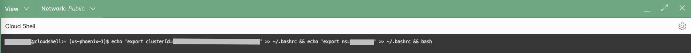
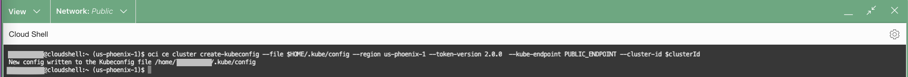
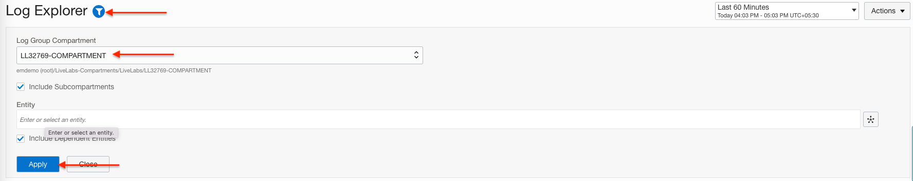
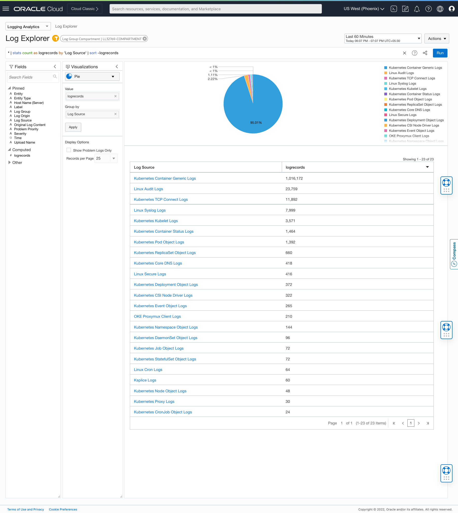

# OKE Monitoring with Logging Analytics

## Introduction

This lab will walk you through the steps to configure an open source log collector Fluentd and Oracle Management Agent to collect various logs, objects and metrics from OKE cluster using package manager Helm.

In this lab we will be using the following tools
* oci cli :  Command line tool that enables a user to manage their OCI resources by invoking service APIs.
* helm : Package manager for Kubernetes
* kubectl : Kubernetes command line tool

And below are the ingestion mechanisms that would be used 
* fluentd : An open source data collector
* management-agent : Oracle provided data collector and Prometheus scraper.

Watch the video below for a quick walk-through of the lab.
[Ingestion Flow Setup](videohub:1_oosivrv7)

### Objectives

In this lab, you will install a helm chart that deploys various Kubernetes manifests and configuration files that in turn will

* Set up Fluentd to collect Kubernetes & Linux System logs, application/container logs and Kubernetes Objects logs.
* Set up Management Agent to collect Kubernetes metrics and report them to OCI Monitoring. 

Estimated Time: 30 minutes

## Task 1: Gathering Required Information

Gather the following information that will be used in this and subsequent labs.

1. Click on the **View Login Info** link on the top left of this workshop page, for launching the Reservation Information panel. 
    

2. From this Reservation Information panel copy the below **Terraform Values** into a **notepad**.

    - **Kubernetes Cluster Name:** The name of the Kubernetes(OKE) cluster.

    - **Kubernetes Cluster OCID:** The OCID of the Kubernetes(OKE) cluster. 

    - **Kubernetes Namespace:** Kubernetes Namespace in which the Kubernetes manifests and configuration files to be deployed.

    - **Lab 2 values.yaml:** The command to generate the **values.yaml** for telemetry collection to work.

    - **Lab 3 values.yaml:** The command to generate the **values.yaml** to collect the logs for some of the **mushop application containers**.

## Task 2: Launching Cloud Shell
  
1. From OCI console click the **Cloud Shell**    button. 

  

2. A Cloud Shell Instance will be launched. 
  

3. Set up the environment variables for **Kubernetes Cluster OCID** and **Kubernetes Namespace** using the following command in the cloud shell.

    ```
    <copy>
      echo 'export clusterId=<Kubernetes Cluster OCID>' >> ~/.bashrc && echo 'export ns=<Kubernetes Namespace>' >> ~/.bashrc && bash
    </copy>  
    ```
    
    

## Task 3: Setting up Kube Config in Cloud Shell


1. Kubeconfig is a yaml file used to configure access to the Kubernetes cluster when using the kubectl command. This step would create the required configuration. 
  
   To set up kubeconfig for the OKE Cluster execute the following command in the cloud shell.

    ```
     <copy>
       oci ce cluster create-kubeconfig --file $HOME/.kube/config --region us-phoenix-1 --token-version 2.0.0  --kube-endpoint PUBLIC_ENDPOINT --cluster-id $clusterId
     </copy>
    ```   
    
    
  

## Task 4: Verify OKE Cluster's Access 
1. Run the following command in the cloud shell to verify that you can access the OKE Cluster.

     ```
       <copy>
          kubectl get nodes
       </copy>
     ```
   
     ```
       $ kubectl get nodes
       NAME          STATUS   ROLES   AGE   VERSION
       10.0.10.xxx   Ready    node    91d   v1.21.5
       10.0.10.xxx   Ready    node    77d   v1.21.5
       10.0.10.xxx   Ready    node    77d   v1.21.5
     ```
  > **Note:** Node IPs may differ for your cluster.


## Task 5: Download Helm Chart
1. In the home directory of the cloud shell, create a directory **oke-livelab** and navigate into it. 
    ```
      <copy>
          mkdir ~/oke-livelab && cd $_
      </copy>
    ```


2. Download the helm chart using the following command.

     > **Note**: The following helm chart is recommended only for this workshop. Refer [github] (https://github.com/oracle-quickstart/oci-kubernetes-monitoring/releases) for all other use cases. 

    ```
      <copy>
          wget https://objectstorage.us-phoenix-1.oraclecloud.com/p/YQy-JQa0RPGxI-pGKmnmA_PJArpo8ZjMdYXCJQM7yXXf6bSCyzI7X_YYmfTDxGbw/n/axfo51x8x2ap/b/oci-kubernetes-monitoring/o/helm-chart/v2.0.0.alpha.1.tgz

      </copy>      
    ```  
 
    ```
    Length: 10750 (10K) [application/octet-stream]
    Saving to: ‘v2.0.0.alpha.1.tgz’
    100%[============================================================>] 10,750      --.-K/s   in 0.001s  
    2022-09-22 05:01:55 (121 MB/s) - ‘v2.0.0.alpha.1.tgz’ saved [11505/11505]
    ```
 
3. Unpack the downloaded tar file by using the below command.
    
    ```
      <copy>
        tar zxvf v2.0.0.alpha.1.tgz
      </copy>
    ``` 


      ```
        helm-chart/
        helm-chart/Chart.yaml
        helm-chart/values.schema.json
        helm-chart/templates/
        helm-chart/values.yaml
        helm-chart/templates/clusterrole-objects.yaml
        helm-chart/templates/NOTES.txt
        helm-chart/templates/clusterrolebinding-logs.yaml
        helm-chart/templates/configmap-objects.yaml
        helm-chart/templates/install_key-mgmtagent.yaml
        helm-chart/templates/clusterrolebinding-objects.yaml
        helm-chart/templates/configmap-logs.yaml
        helm-chart/templates/headless-service.yaml
        helm-chart/templates/clusterrole-logs.yaml
        helm-chart/templates/serviceAccount.yaml
        helm-chart/templates/fluentd-daemonset.yaml
        helm-chart/templates/configmap-mgmtagent.yaml
        helm-chart/templates/_helpers.tpl
        helm-chart/templates/oci-config-secrets.yaml
        helm-chart/templates/fluentd-deployment.yaml
        helm-chart/templates/mgmtagent-statefulset.yaml
      ``` 


## Task 6: Create Custom values.yaml 

1. In the **oke-livelab** directory created in the task #5 , create a directory **external-values**, using the following command.
      ```
        <copy>
          mkdir ~/oke-livelab/external-values && cd $_
        </copy>
      ```

2. Download the custom values.yaml using the command specified in the field **Lab 2 values.yaml** of [Task 1](#Task1:GatheringRequiredInformation).
    
      >**Note:** Following are the sample command and output. **Do Not Copy these.**
    
    
      ```
         wget -O values.yaml https://objectstorage.us-phoenix-1.oraclecloud.com/p/E5qHCoc2BdKdhIxBrjp49ANUN2ZQaC5iXdsmC5TQ3oEwe4MDQ9kZbagqJ27Ph1Q5/n/aupo86x8x2bk/b/resrXXXXX/o/lab2_values.yaml
      ```  
      
      ```
          --2022-10-03 06:36:20--  https://objectstorage.us-phoenix-1.oraclecloud.com/p/E5qHCoc2BdKdhIxBrjp49ANUN2ZQaC5iXdsmC5TQ3oEwe4MDQ9kZbagqJ27Ph1Q5/n/aupo86x8x2bk/b/resrXXXXX/o/lab2_values.yaml
          Resolving objectstorage.us-phoenix-1.oraclecloud.com (objectstorage.us-phoenix-1.oraclecloud.com)... 134.70.12.1, 134.70.16.1, 134.70.8.1
          Connecting to objectstorage.us-phoenix-1.oraclecloud.com (objectstorage.us-phoenix-1.oraclecloud.com)|134.70.12.1|:443... connected.
          HTTP request sent, awaiting response... 200 OK
          Length: 1643 (1.6K) [application/octet-stream]
          Saving to: ‘values.yaml’

          100%[==============================================>] 1,643       --.-K/s   in 0s      

          2022-10-03 06:36:20 (206 MB/s) - ‘values.yaml’ saved [1643/1643]
      ```

3. You can view the downloaded **values.yaml** using the following command.
      ```
          <copy>
              cat ~/oke-livelab/external-values/values.yaml
          </copy>
      ```
      ```
        ######
        ##  Note:
        ##      - The container images referred in this values.yaml ("image:url" and "mgmtagent:imageurl" sections) are recommended only for using with the workshop.
        ##  - Refer to https://github.com/oracle-quickstart/oci-kubernetes-monitoring#docker-image for all other use cases.
        ######
        "createServiceAccount": false
        "fluentd":
          "baseDir": "/var/log/resrXXXXX"
          "genericContainerLogs":
            "encoding": "UTF-8"
          "tailPlugin":
            "readFromHead": false
        "image":
          "imagePullPolicy": "Always"
          "url": "iad.ocir.io/ax1wgjs6b2vc/oci_la_fluentd:ol8-1.1"
        "kubernetesClusterID": "ocid1.cluster.oc1.phx.aaaaaaaag...."
        "kubernetesClusterName": "resrXXXXX"
        "mgmtagent":
          "imageUrl": "iad.ocir.io/ax1wgjs6b2vc/mgmtagent_oke_monitoring/mgmt_agent:latest"
          "installKey": "TWFuYWdlbWVudEFnZW50...PSAzMjY5MF9BZ2VudA=="
        "namespace": "resrXXXXX"
        "ociCompartmentID": "ocid1.compartment.oc1..aaaaaaaak...."
        "ociLALogGroupID": "ocid1.loganalyticsloggroup.oc1.phx.amaaaaaaq...."
        "ociLANamespace": "acxo58f8p2os"
        "serviceAccount": "resrXXXXX"
      ```
    >**Note**: To understand these variables refer to **values.yaml** that comes with the helm-chart (next step).

 4. (Optional) The above created **values.yaml** contains the minimalistic values that need to be changed for telemetry collection to work. The full **values.yaml** could be found using the below command.


      ```
        <copy>
          cat ~/oke-livelab/helm-chart/values.yaml
        </copy>
      ```


## Task 7: (Optional) Verifying Helm Configuration
1. The following command helps performing a dry run of helm install to validate the exact manifests and configurations that are going to be deployed.

      ```
        <copy>
          helm template --values ~/oke-livelab/external-values/values.yaml ~/oke-livelab/helm-chart/
        </copy>
      ```    
 
## Task 8: Install Helm Chart
1. Install the helm chart using the following command.
      ```
        <copy>
         helm install ll-oke-monitoring --values ~/oke-livelab/external-values/values.yaml ~/oke-livelab/helm-chart/ -n=$ns
        </copy>
      ```
      
      ```
        NAME: ll-oke-monitoring
        LAST DEPLOYED: Thu Sep 29 10:20:18 2022
        NAMESPACE: resrXXXXX
        STATUS: deployed
        REVISION: 1
        TEST SUITE: None
      ```


## Task 9:(Optional) Verify the Installation

1. Upon the successful installation of helm chart, following resources are created.

   i. **DaemonSet**

    - The DaemonSet deployed as part of this installation is responsible for logs collection.


      ```
        <copy>
          kubectl get daemonset -n=$ns
        </copy>
      ```
      ```
 NAME                       DESIRED   CURRENT   READY   UP-TO-DATE   AVAILABLE   NODE SELECTOR   AGE
 oci-la-fluentd-daemonset   4         4         4       4            4           <none>         5m35s           
      ```
     
      ```
            <copy>
                kubectl get pods -l app=oci-la-fluentd-logs -n=$ns
            </copy>
      ```
     
      ```
      NAME                                         READY   STATUS    RESTARTS   AGE
      oci-la-fluentd-daemonset-c2pfc               1/1     Running   0          4m22s
      oci-la-fluentd-daemonset-rnq6x               1/1     Running   0          4m22s
      oci-la-fluentd-daemonset-wmpf9               1/1     Running   0          4m22s
      oci-la-fluentd-daemonset-zztlx               1/1     Running   0          4m22s
      ```
  
  ii. **Deployment** 


    - The Deployment created as part of this installation is responsible for objects collection.

      ```
        <copy>
          kubectl get deployment -n=$ns
        </copy>
      ```

       ```
       NAME                        READY   UP-TO-DATE   AVAILABLE   AGE
       oci-la-fluentd-deployment   1/1     1            1           5m38s
       ```


       ```
          <copy>
              kubectl get pods -l app=oci-la-fluentd-objects -n=$ns
          </copy>
       ```
      
      ```
      NAME                                         READY   STATUS    RESTARTS   AGE
      oci-la-fluentd-deployment-69bd489c65-2v26s   1/1     Running   0          4m28s
      ```

  iii. **StatefulSet**
   
    - The StatefulSet deployed as part of this installation is responsible for metrics collection.
      ```
      <copy>
        kubectl get statefulset -n=$ns
      </copy>
      ```
      ```
        NAME                  READY   AGE
        mgmtagent             1/1     5m40s
      ```

      ```
      <copy>
        kubectl get pods -l app=mgmtagent -n=$ns
      </copy>
      ```
      ```
        NAME             READY   STATUS    RESTARTS   AGE
        mgmtagent-0      1/1     Running   0          5m35s
      ```
   
   iv. **Config Map** 


    - The config maps created as part of this installation contains the fluentd configuration for logs & objects collection and management agent configuration for metrics collection.

      ```
        <copy>
            kubectl get configmaps -n=$ns
        </copy>
      ```
      ```
        NAME                               DATA   AGE
        kube-root-ca.crt                   1      5m
        mgmtagent-monitoring-config        1      5m
        oci-la-fluentd-logs-configmap      2      5m
        oci-la-fluentd-objects-configmap   2      5m
      ```


## Task 10: Verify Fluentd is Running 


1. To verify fluentd is up and running
    - Run the following command and capture one of the pods name from the output.

        ```
                <copy>
                    kubectl get pods -l app=oci-la-fluentd-logs -n=$ns
                </copy>
          ```
     
          ```
          NAME                                         READY   STATUS    RESTARTS   AGE
          oci-la-fluentd-daemonset-c2pfc               1/1     Running   0          4m22s
          oci-la-fluentd-daemonset-rnq6x               1/1     Running   0          4m22s
          oci-la-fluentd-daemonset-wmpf9               1/1     Running   0          4m22s
          oci-la-fluentd-daemonset-zztlx               1/1     Running   0          4m22s
          ```
  
    - Run the following command after replacing the place holder with the pod name captured in the previous step.
      
          ```
          <copy>
              kubectl logs <daemonset-pod-name> -n=$ns |grep 'fluentd worker'
          </copy>
     ```
      - If you see the similar messages like below, fluentd is up and running.
      ```
          2022-08-18 10:34:31 +0000 [info]: #0 starting fluentd worker pid=14 ppid=7 worker=0
          2022-08-18 10:35:06 +0000 [info]: #0 fluentd worker is now running worker=0
      ```
     

## Task 11: (Optional) Verify Management Agent is Running and Emitting Metrics

1. To verify Management Agent is running and emitting metrics
   - Execute the following command.
     ```
        <copy>
            kubectl exec -n=$ns --stdin --tty mgmtagent-0 -- tail -100 /opt/oracle/mgmt_agent/agent_inst/log/mgmt_agent_client.log | grep MetricUploadInvocation | grep rsp
        </copy>
     ```
   - If you see similar messages like below, Management Agent is running and emitting metrics successfully.
     ```
       2022-09-27 17:46:43,437 [SendQueue.1 (SenderManager_sender)-53] INFO  - MetricUploadInvocation <--rsp[M57ATQHS06FBBOEAJ90WC8LY7OV6SI1U/69DD54B2066ADFEE93C1AEE3BAE0CEA7/3B89C3889FED51FE368864923091DA91]<-- POST https://telemetry-ingestion.us-ashburn-1.oraclecloud.com/20180401/metrics: [200]
       2022-09-27 17:47:13,411 [SendQueue.0 (SenderManager_sender)-48] INFO  - MetricUploadInvocation <--rsp[2DJNS5OTBTS9EIQM1VOUWBV9UP5WH9DQ/AAF9B4C68B80E4A99C33225D1D3008ED/DA63A1D36879F64D5E4A64D1400BB149]<-- POST https://telemetry-ingestion.us-ashburn-1.oraclecloud.com/20180401/metrics: [200]
       2022-09-27 17:47:13,414 [SendQueue.2 (SenderManager_sender)-54] INFO  - MetricUploadInvocation <--rsp[D9XXM3T9E3C7UMKAPJFSVOVSAYKQEF2X/BDBCCFDA23C3DA53FBEAD8C211825C15/C2FD7821CD4D23A237B99411165422EA]<-- POST https://telemetry-ingestion.us-ashburn-1.oraclecloud.com/20180401/metrics: [200]
       2022-09-27 17:47:43,490 [SendQueue.1 (SenderManager_sender)-53] INFO  - MetricUploadInvocation <--rsp[PVES5F4AOM4DCB7GL439MUE6MRJORTH3/1102558CAAF3643427CDD258937628CD/DF114CF84D38F9471F4855B4FAE67218]<-- POST https://telemetry-ingestion.us-ashburn-1.oraclecloud.com/20180401/metrics: [200]
     ```
    
      > **Note**: If there is no output, rerun the command after a minute.

## Task 12: Validate the Logs in Log Explorer
   
1. From Navigation Menu  > **Observability & Management** > **Logging Analytics** > **Log Explorer**.

2. In the following steps we will select the **Compartment** to view the various logs.
    > **Note:** Compartment can be found via **View Login Info > Compartment**.

    - Click on the **Scope** filter, copy-paste your **Compartment** into **Log Group Compartment** dropdown textbox and click **Apply** button.
    

    - Click on **Close** button

2. By default, the Log Explorer will show the Pie-Chart Visualization of all the various logs that are being collected from the OKE cluster   
   
   The Linux System logs, Kubernetes System and Objects logs are collected and processed using a set of Oracle-Defined Log Sources.

   All the other container logs in the cluster are processed using another Oracle-Defined Log Source, **Kubernetes Container Generic Logs**. 
 
    
    

3. You can view logs of a specific source by drilling down into that Log Source.
         


**Congratulations!** In this lab, you have successfuly completed the following tasks:
- Set up Fluentd to collect Kubernetes & Linux System logs, Application/Container logs and Kubernetes Objects logs.
- Set up Management Agent to ingest Kubernetes metrics.
- Viewed the collected logs in the Logging Analytics Log Explorer.

  You may now proceed to the [next lab](#next).

## Acknowledgements
* **Author** - Vikram Reddy , OCI Logging Analytics
* **Contributors** -  Vikram Reddy, Santhosh Kumar Vuda , OCI Logging Analytics, Madhavan Arnisethangaraj, OCI Management Agent
* **Last Updated By/Date** - Vikram Reddy, Sep, 2022
