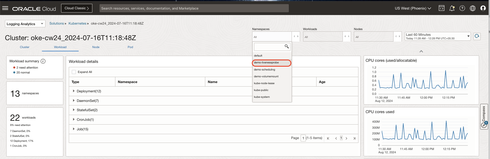
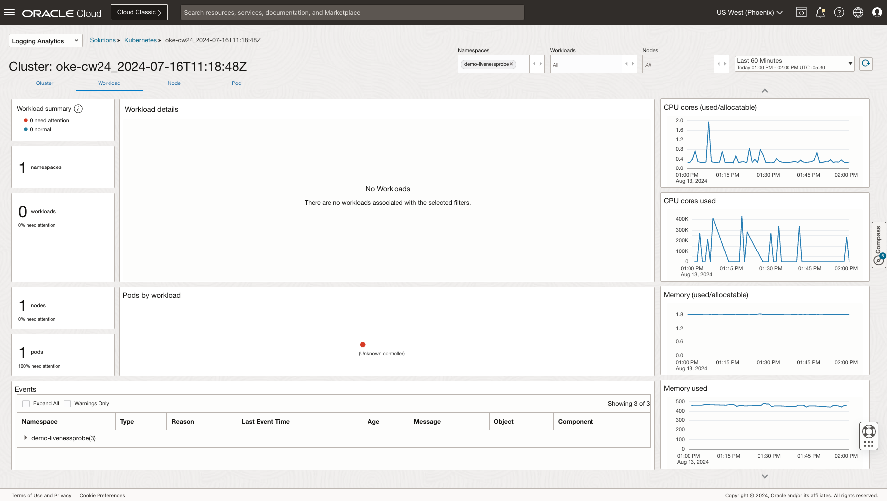
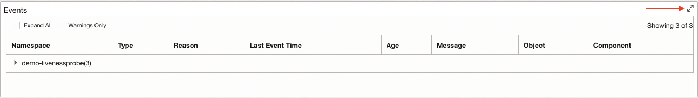
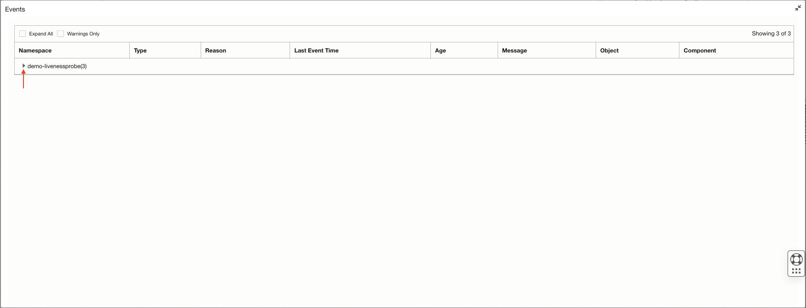
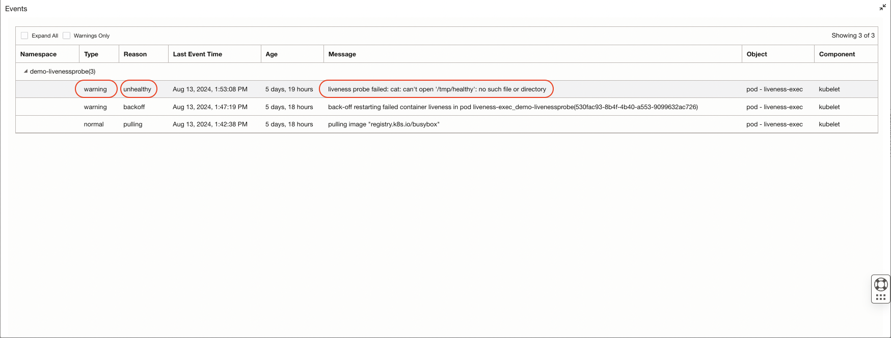
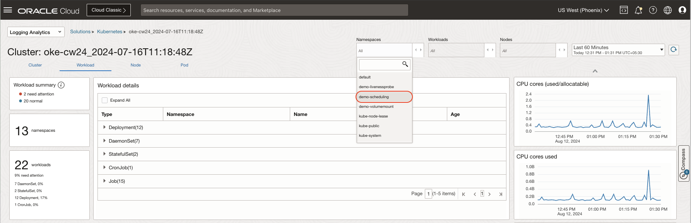
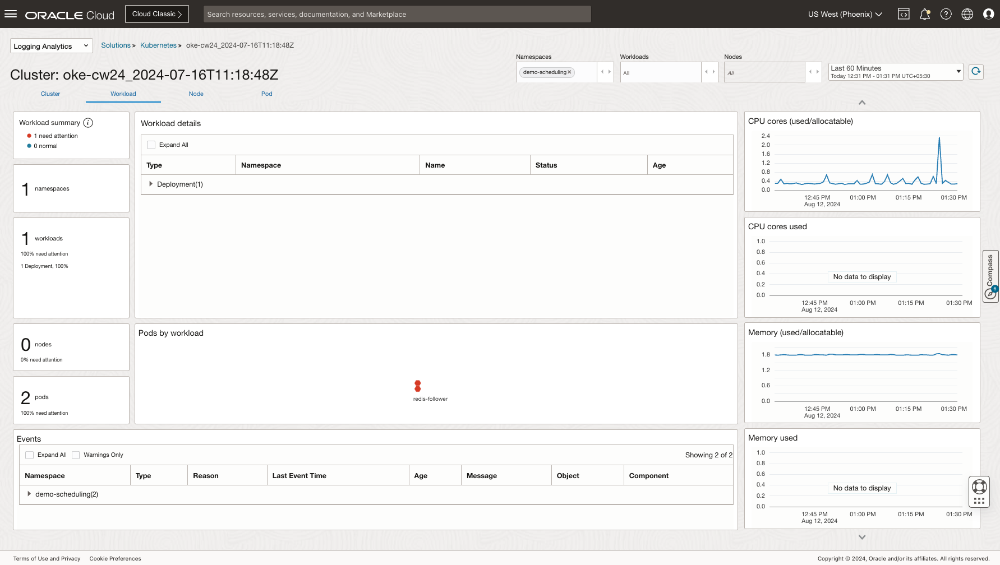
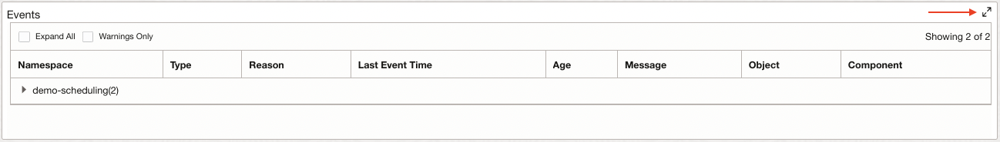
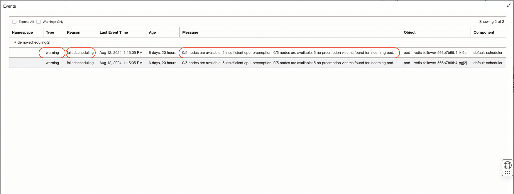

# Interactive Analytics and Troubleshooting

## Introduction

In this lab, you will use different features of Logging Analytics features to troubleshoot the issues/problems in Kubernetes Cluster (To Be Updated)

Estimated Time: 15 minutes

### Objectives

In this lab, you will see step-by-step instructions to:

  - Troubleshoot Kubernetes Workload specific issues.
  - Troubleshoot Kuberntetes Scheduling issues in workload.

## Task 1: Understanding and troubleshooting application specific issue in workload.
   In this task we will review the pod(s) which has logged events due to the failure in the liveness probe.
   A liveness probe in Kubernetes is a diagnostic tool that checks if a container is running and functioning correctly. If a container fails its liveness probe repeatedly, the kubelet restarts the container. You can read more on different types of probe [here] (https://kubernetes.io/docs/concepts/configuration/liveness-readiness-startup-probes/).

   To simulate these events, we have configured a liveness probe that performs a simple **cat** command on a directory which is not present in the container. Thus resulting in the warning events.

1. In the **Workload** tab, click on the **Namespaces** filter and select the namespace **demo-livenessprobe**.
   
2. The **Workload** tab will be updated with the details of the workloads present in the namespace **demo-livenessprobe**.
    
3. The **Pods by Workload** section will display red polygon(s) corresponding to the number of pods in a failed state.
    
4. Scroll down to the events section. You will now see the events specific to the namespace **demo-livenessprobe**.
    
5. Click on the expand icon in the events section.
     
6. An **Events** pop-up window will be displayed. Click on the expand icon next to the **demo-livenessprobe** namespace.
     
7. The detailed information of the events will displayed. The information includes,
    - **Type** of the event e.g Warning, Normal, Failed etc.
    - **Reason** due to which the event is logged. For our use case the container has failed liveness probe and Kubernetes treats it with reason as **unhealty**.
    - **Message** of the event which provides the important insight on what caused the liveness probe event failure. For our use case the message states that liveness probe failed as it could not open the directory.

    

## Task 2: Understanding and troubleshooting scheduling specific issue in workload.
   In this task we will review the pod(s) which has logged events due to the problem in scheduling.
   Kubernetes scheduler selects an optimal node to run newly created or unscheduled pods.
   You can read more on Kubernetes scheduler [here] (https://kubernetes.io/docs/concepts/scheduling-eviction/kube-scheduler/).

   To simulate these events, we have configured an arbitarily high number for the cpu in the **requests** resources, which is beyond the overall capacity of the cluster.
   Thus resulting in the warning events.

1. In the **Workload** tab, click on the **Namespaces** filter and select the namespace **demo-scheduling**.
   
2. The **Workload** tab will be updated with the details of the workloads present in the namespace **demo-scheduling**.
   
3. The **Workload detail** section will show one workload of the type **Deployment**. Click on the expand icon of the workload.
    
4. The details of the **Workload** such as **Namespace**, **Name**, **Status** & **Age** will be displayed.
   
5. The **Pods by Workload** section will display red polygon(s) corresponding to the number of pods in a failed state. 
   
6. Scroll down to the events section. You will now see the events specific to the namespace **demo-scheduling**.
    
7. Click on the expand icon in the events section.
    
8. An **Events** pop-up window will be displayed. Click on the expand icon next to the **demo-scheduling** namespace.
     
9. The detailed information of the events will displayed. The information includes,
    - **Type** of the event e.g Warning, Normal, Failed etc.
    - **Reason** due to which the event is logged. For our use case the container has failed to schedule to due to insufficient resources and Kubernetes treats it with reason as **failedscheduling**.
    - **Message** of the event which provides the important insight on what prevented the Kuberentes Scheduler from scheduling the pod. For our use case the message states that Kubernetes has failed to schedule a pod due to insufficient cpu.
    

## Task 3: Exercise
In the **Workload** tab, click on the **Namespaces** filter and select the namespace **demo-volumemount** & understand the issue.

**Congratulations!** In this lab, you have successfuly completed the following tasks:
  - Troubleshooted Kubernetes Workload specific issues.
  - Troubleshooted Kuberntetes Scheduling issues in workload.

  You may now proceed to the [next lab](#next).

## Acknowledgements
* **Author** - Vikram Reddy, OCI Logging Analytics
* **Contributors** -  Vikram Reddy, Heena Rahangdale , OCI Logging Analytics
* **Last Updated By/Date** - Vikram Reddy, Aug, 2024