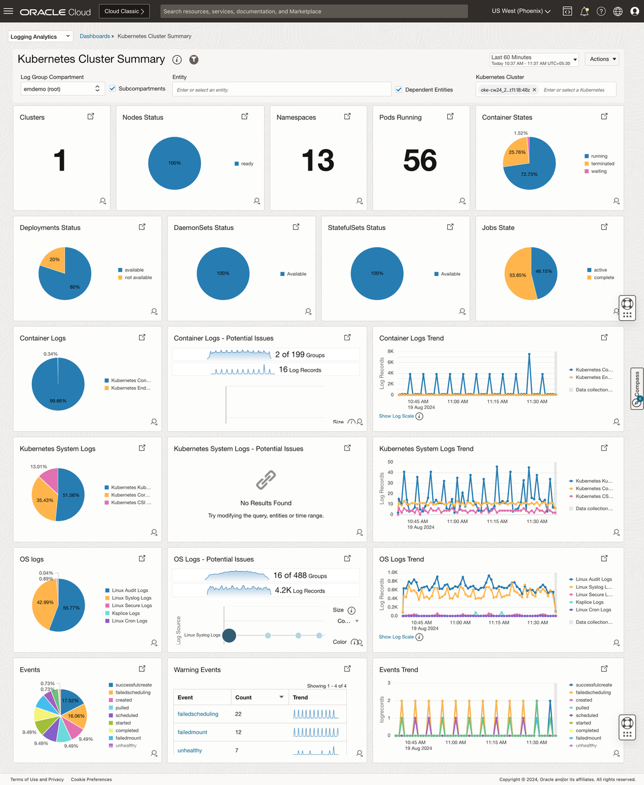
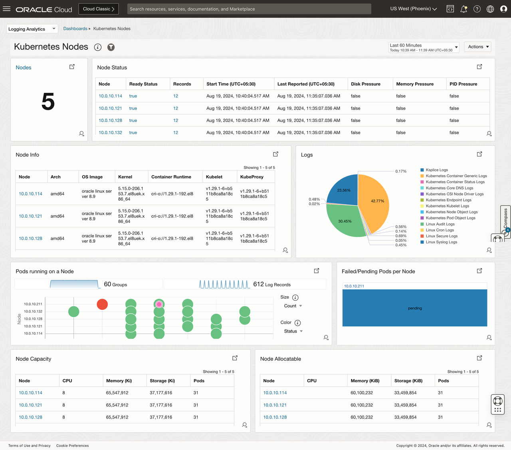
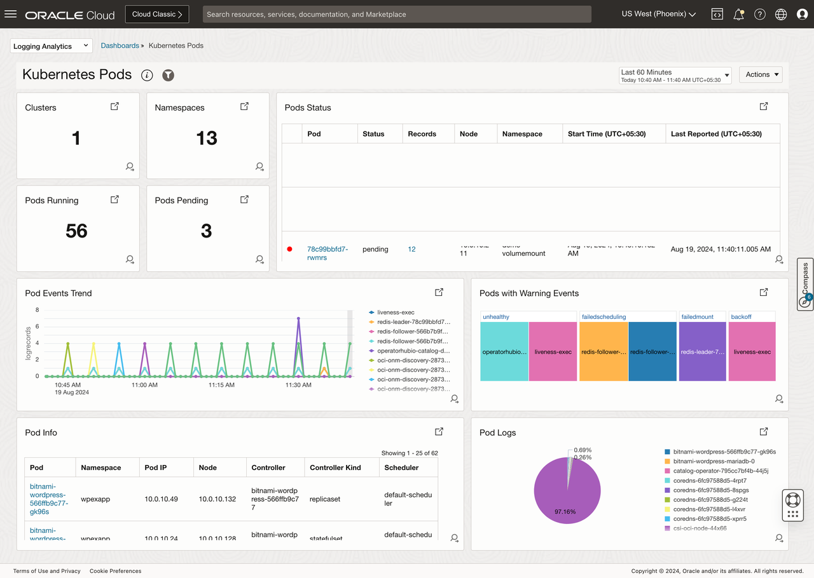

# Introduction

## About this Workshop
Kubernetes provides a highly robust and extremely customizable platform for managing, automatically deploying and scaling containerized workloads. Building a monitoring and troubleshooting system for this entire environment is a very challenging task. Oracle Cloud Infrastructure (OCI) Logging Analytics bridges this monitoring gap by providing a one-click end-to-end Kubernetes monitoring solution for the underlying infrastructure, Kubernetes platform and cloud-native applications.

This live lab will cover setting up end-to-end monitoring solution for a sample Kubernetes cluster (OKE cluster) which has [MuShop] (https://oracle-quickstart.github.io/oci-cloudnative/) (a cloud-native reference application of several Oracle Cloud services) deployed. It also takes you through various visualizations and perform analytics over the collected data from different perspectives.

Estimated Workshop Time: 01 hours 30 minutes

### Objectives

In this workshop, you will learn how to:

* Set up Fluentd to collect Kubernetes & Linux System logs, application/container logs and Kubernetes Objects logs.
* Set up Management Agent to collect Kubernetes metrics and reporting them to OCI Monitoring.
* Create a setup to monitor logs of Custom Applications/Services deployed on OKE.
* Modify configuration to collect and process some MuShop container logs using their specific Log Sources.
* Verify the log data of those MuShop logs in the Log Explorer.
* Visualize the data collected from the OKE Cluster through Dashboards like below.
     - ### Kubernetes Cluster Summary

        
     - ### Kubernetes Nodes

        
     - ### Kubernetes Pods

        
     - ### Kubernetes Workloads
     
              

### Prerequisites

This lab assumes you have:

* Oracle.com SSO account
* Understanding of Logging Analytics concepts
* Understanding of Kubernetes/OKE concepts and helm
* Familiarity with OCI cloud shell and OCI Console

## Learn More

* [Monitor Kubernetes and OKE clusters with OCI Logging Analytics](https://docs.oracle.com/en/solutions/kubernetes-oke-logging-analytics/index.html)
* [MuShop] (https://oracle-quickstart.github.io/oci-cloudnative/)

## Acknowledgements
* **Author** - Vikram Reddy , OCI Logging Analytics
* **Contributors** -  Vikram Reddy, Santhosh Kumar Vuda , OCI Logging Analytics
* **Last Updated By/Date** - Vikram Reddy, Sept, 2022
