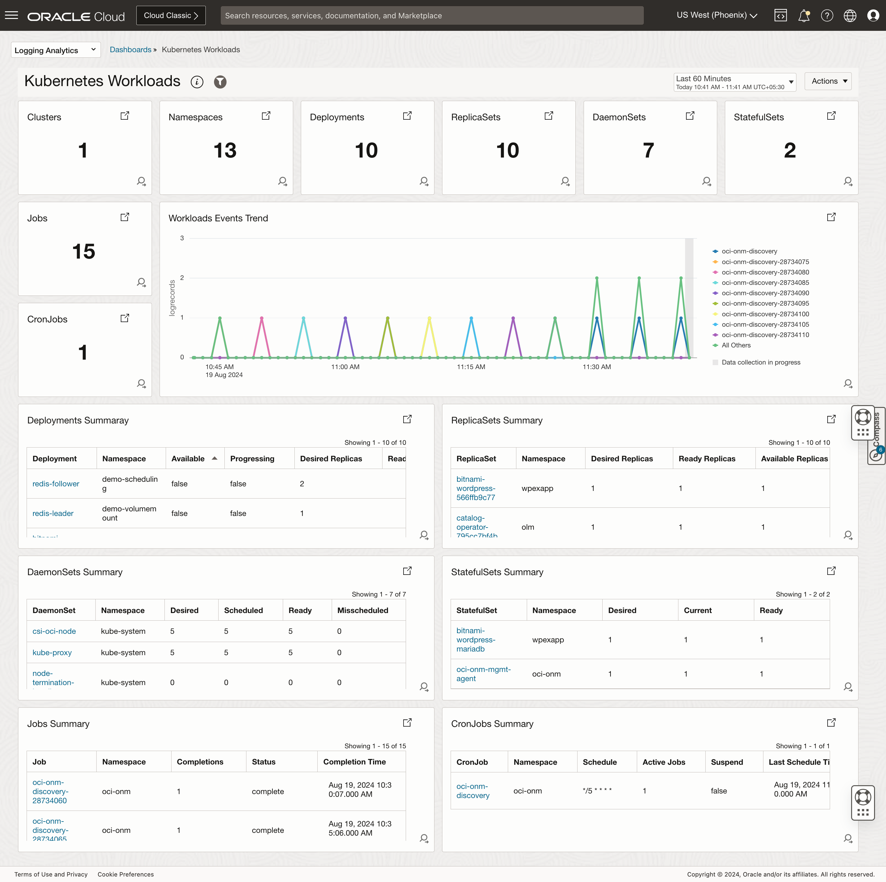

# Logging Analytics Overview
## Introduction
#TODO - Update
Kubernetes provides a highly robust and extremely customizable platform for managing, automatically deploying and scaling containerized workloads. Building a monitoring and troubleshooting system for this entire environment is a very challenging task. Oracle Cloud Infrastructure (OCI) Logging Analytics bridges this monitoring gap by providing a one-click end-to-end Kubernetes monitoring solution for the underlying infrastructure, Kubernetes platform and cloud-native applications.

This live lab will cover setting up end-to-end monitoring solution for a sample Kubernetes cluster (OKE cluster) which has workloads with different issues deployed. It also takes you through various visualizations and perform analytics over the collected data from different perspectives.

Estimated Workshop Time: 01 hours 30 minutes

Watch the video below for a quick walk-through of the lab.
[Exploring Oracle Cloud Infrastructure Logging Analytics](videohub:1_dt55vn2d) 

### Objectives
#TODO - Update
In this workshop, you will learn how to:

* Connect to the existing Kubernetes to collect logs such as Kubernetes & Linux System logs, application/container logs and Kubernetes Objects logs & monitoring data .
* Understand the Kubernetes Cluster topology.
* Understand the data model of telemetry collected by Kubernetes Monitoring Solution.
* Visualize the data collected from the OKE Cluster through Dashboards like below.
     - ### Kubernetes Cluster Summary

        
     - ### Kubernetes Nodes

        
     - ### Kubernetes Pods

        
     - ### Kubernetes Workloads

                    

### Prerequisites

This lab assumes you have:

* Oracle.com SSO account
* Understanding of Logging Analytics concepts
* Understanding of Kubernetes/OKE concepts and helm
* Familiarity with OCI cloud shell and OCI Console

## Learn More

* [Monitor Kubernetes and OKE clusters with OCI Logging Analytics](https://docs.oracle.com/en/solutions/kubernetes-oke-logging-analytics/index.html)

* [Kubernetes Solution] (https://docs.oracle.com/en-us/iaas/logging-analytics/doc/kubernetes-solution.html)

## Acknowledgements
* **Author** - Vikram Reddy , OCI Logging Analytics
* **Contributors** -  Vikram Reddy, Heena Rahangdale , OCI Logging Analytics
* **Last Updated By/Date** - Vikram Reddy, Aug, 2024
