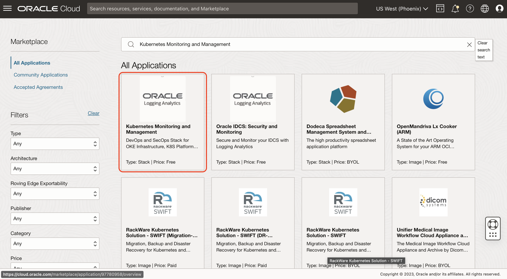

# Kubernetes Solution Installation Using Resource Manager

## Introduction

```
  TO BE UPDATED
```

Watch the video below for a quick walk-through of the lab.


### Objectives

```
  TO BE UPDATED
```


Estimated Time: 15 minutes

## Task 1: Navigate to Marketplace

To navigate to Marketplace, follow one of the following two methods.

1. From Navigation Menu  > **Marketplace** > **All Applications**.


2. You can also copy-paste the following link in your browser's address bar to navigate to the Marketplace.
    ```
         <copy>
            https://cloud.oracle.com/marketplace/home?region=us-phoenix-1
         </copy>   
    ```

## Task 2: Open Kubernetes Monitoring and Management application
    
1. In the search bar, enter the text **Kubernetes Monitoring and Management**.


2. Click on the **Kubernetes Monitoring and Management** application to land on the application page.


## Task 3: TO BE UPDATED

  

## Task 4: TO BE UPDATED


**Congratulations!** In this lab, you have successfuly completed the following tasks:
- TO BE UPDATED

  You may now proceed to the [next lab](#next).

## Acknowledgements
* **Author** - Vikram Reddy , OCI Logging Analytics
* **Contributors** -  Vikram Reddy, Santhosh Kumar Vuda , OCI Logging Analytics, Madhavan Arnisethangaraj, OCI Management Agent
* **Last Updated By/Date** - Vikram Reddy, Sep, 2022
