# Kubernetes Monitoring Solution Deployment

## Introduction

In this lab, you'll deploy Kubernetes Monitoring Solution from OCI Marketplace to enable monitoring of an existing OKE Cluster.


### Objectives

In this lab, you will see step-by-step instructions to:

  - Use OCI Marketplace to configure and deploy the Kubernetes Monitoring solution.
  - Verify successful deployment. 
  - Review Application Information. 

Estimated Time: 15 minutes

## Task 1: Navigate to Kubernetes Monitoring and Management application

To navigate to Kubernetes Monitoring and Management application, follow one of the following two methods.

1. To manually navigate to the application:

    - From Navigation Menu  > **Marketplace** > **All Applications**.
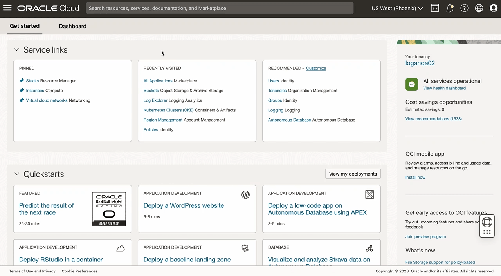

    - In the search bar, enter the text **Kubernetes Monitoring and Management**.

    - Click on the **Kubernetes Monitoring and Management** application to land on the application page.
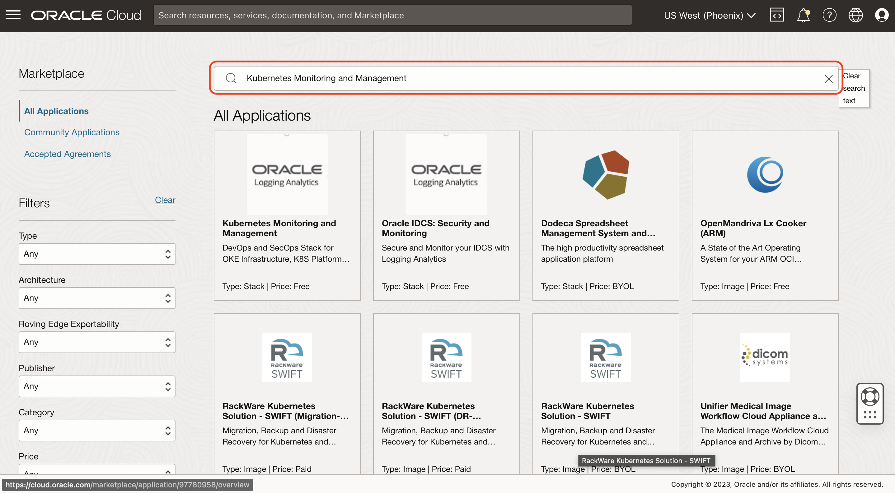

2. Direct link to app:
    ```
         <copy>
            https://cloud.oracle.com/marketplace/application/136942717/overview?region=us-phoenix-1
         </copy>   
    ```
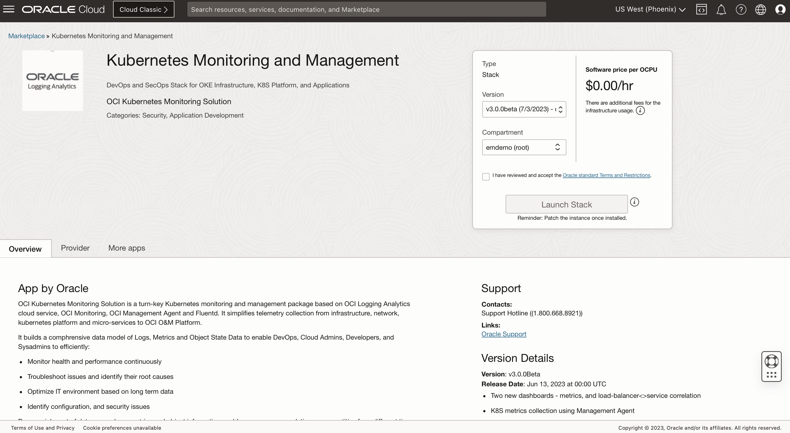


## Task 2: Launch Kubernetes Monitoring and Management application

1. Select the **LiveLabs-v.3.0.0 (7/3/2023)** version from the version dropdown.

2. Select the user Compartment from the dropdown. For your user the Compartment name will be **LLresrvationid-COMPARTMENT**.

3. Check the **Terms and Restrictions** checkbox.

4. Click on **Launch Stack** button to launch the application.
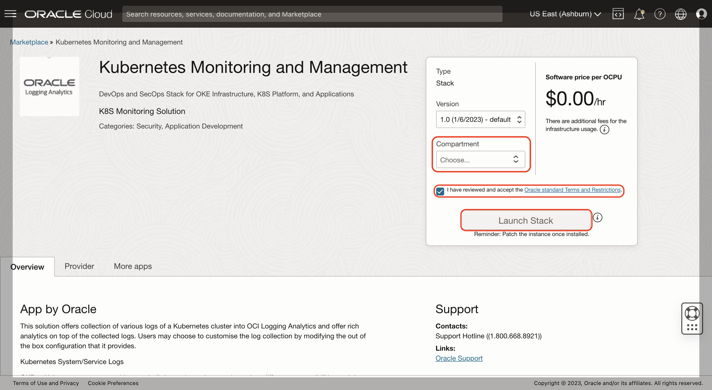

## Task 3: Configure Stack

1. On **Create Stack** page, you will see the **Stack information**.

  Click on **Next** button to proceed to the Configure variables section.
  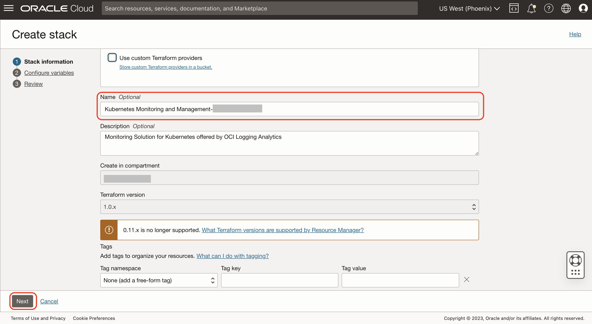
  

2. In **Configure variables** section, you have to set the following variables for the stack:

    - **OKE Cluster Compartment:** Select the **oke-lab-9501** cluster compartment from the dropdown.

    - **OKE Cluster:** Select the **oke-cw23-II** OKE cluster from the dropdown.

    - **OCI Logging Analytics Compartment:** Select the **LLresrvationid-COMPARTMENT** compartment from the dropdown.

    - **OCI Logging Analytics Log Group:** Select **Kubernetesreservationid** log group from the dropdown.

  Click on **Next** button to proceed to the Review section.
  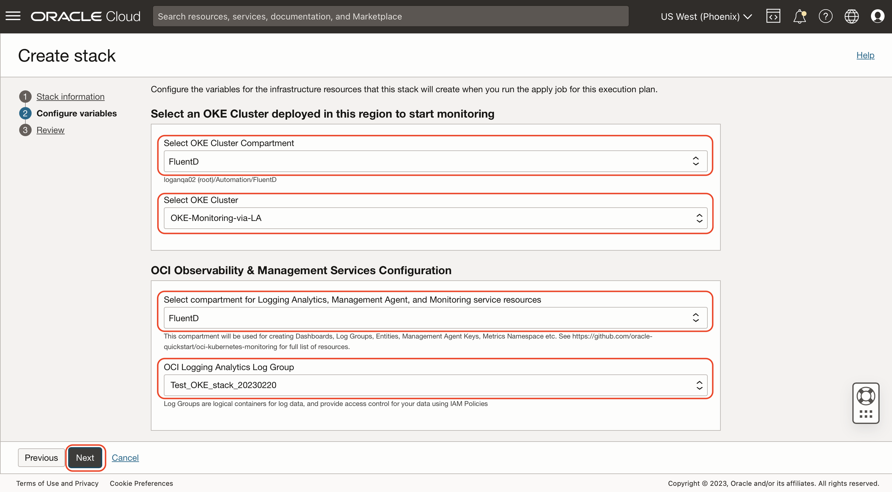

3. In **Review** section, you can verify the stack configurations which you have selected in the previous two sections.

  - Click on the **Show** button to view the stack configurations. Check the following stack configurations you selected in the previous steps:
      - OKE Cluster Compartment
      - OKE Cluster
      - OCI Logging Analytics Compartment
      - OCI Logging Analytics Log Group

  - If you want to make changes, click on **Previous** button to go back and edit the stack configurations.

  - Click on the **Create** button to create the stack. It will take around 90 seconds for the stack to get created.
    
    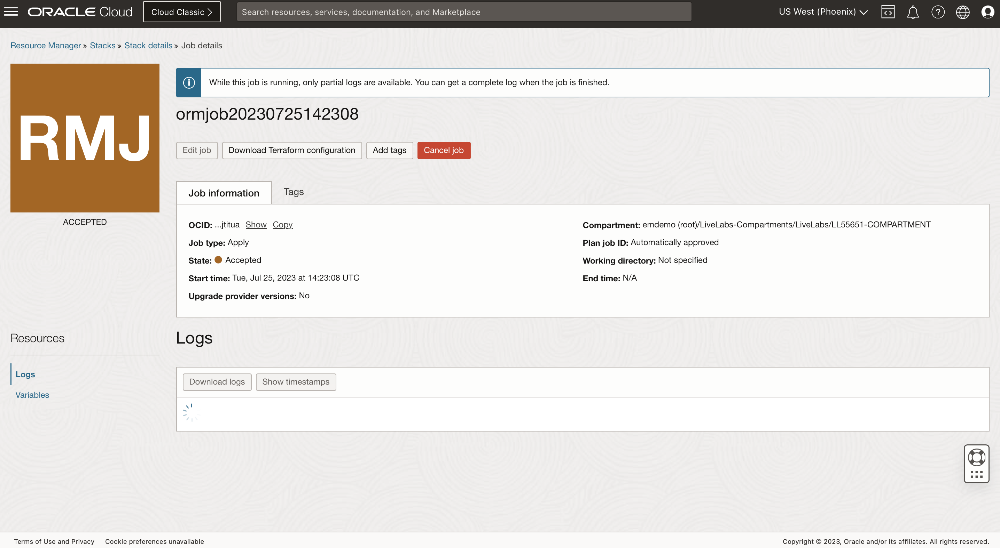
  

## Task 4: Navigate to installed dashboards from Application Information tab

1. After the stack creation is successful, it will take few seconds for the **Application information** tab to appear.
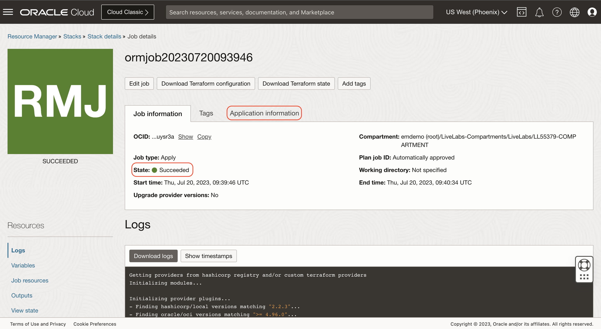

2. Click on the **Application information** tab to view the application information.

3. Click on the **View Dashboard** button to view the dashboards.
  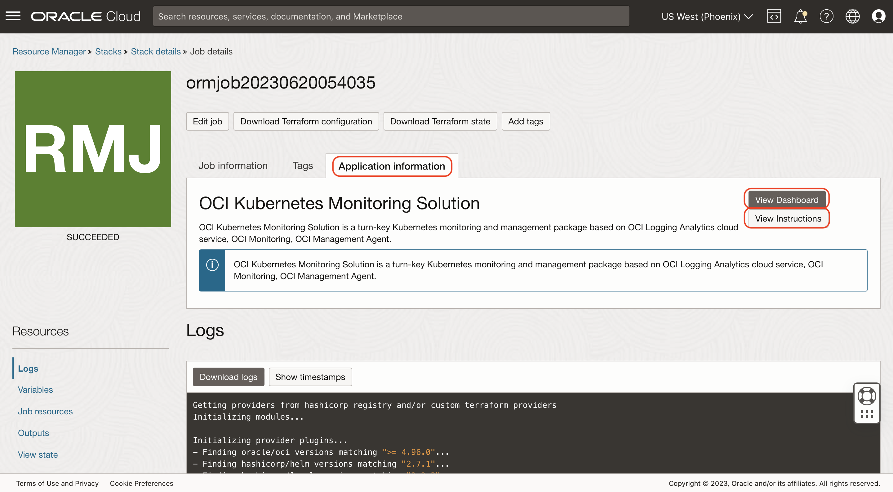


## Task 5: Exploring Kubernetes Dashboards

1. After clicking on the **View Dashboards** button, a new tab will open displaying all the dasboards.

2. Click on the **Kubernetes Cluster Summary** dashboard. It will take few seconds for the dashboard widgets to load.
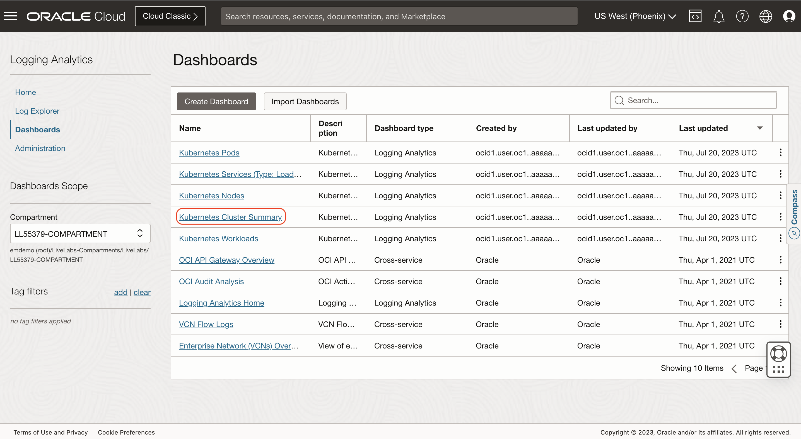

3. Click on the **Scope Filter** panel.
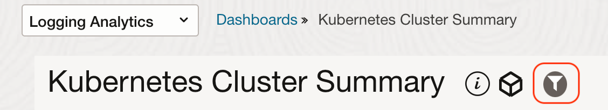

4. Select your user compartment i.e. **LLresrvationid-COMPARTMENT** in the **Log Group Compartment** field and **oke-cw23-II** cluster in the **Kubernetes Cluster** field.
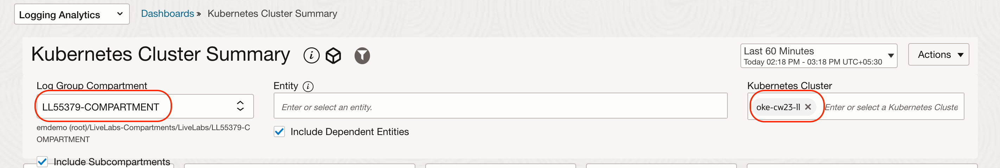

5. You should be able to see the all the widgets displaying the data specific to your OKE Cluster.
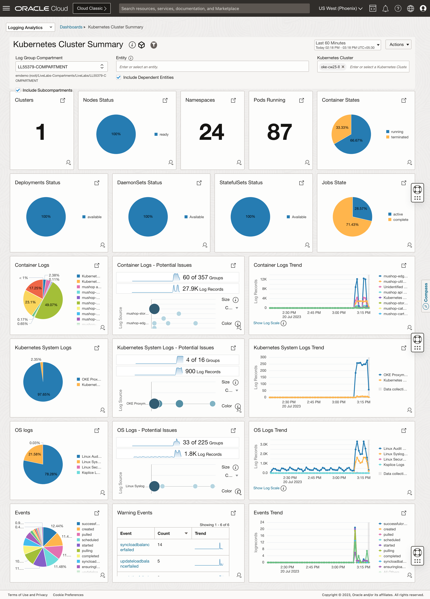

6. Navigate to the **Container Logs** widget.


7. Click on the View Query Icon to view the query used to populate the data in widget.

  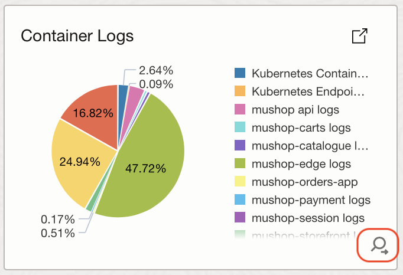
  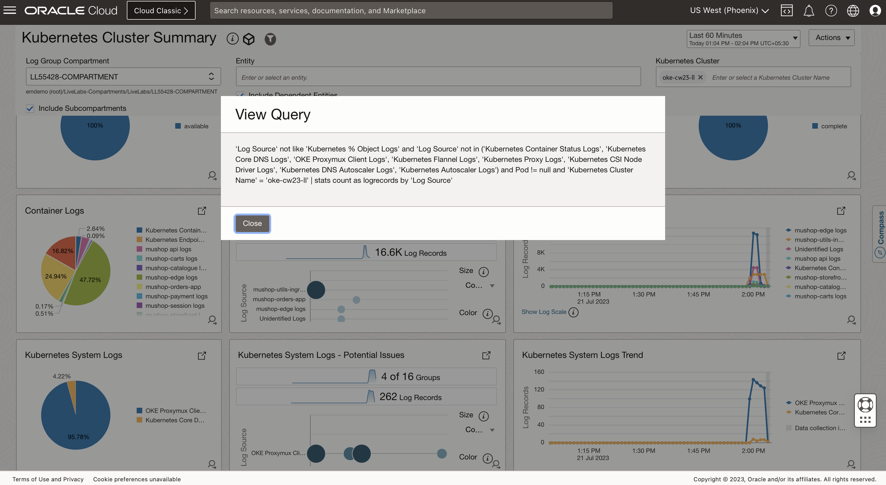

  After viewing the query, click on **Close** button.

8. Click on the Punch Out Icon on the Container Logs widget.
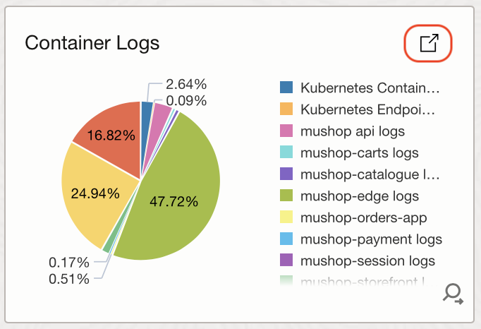 

9. This will take you to the **Pie Chart view** of Log Explorer in context of Kubernetes Cluster Name.
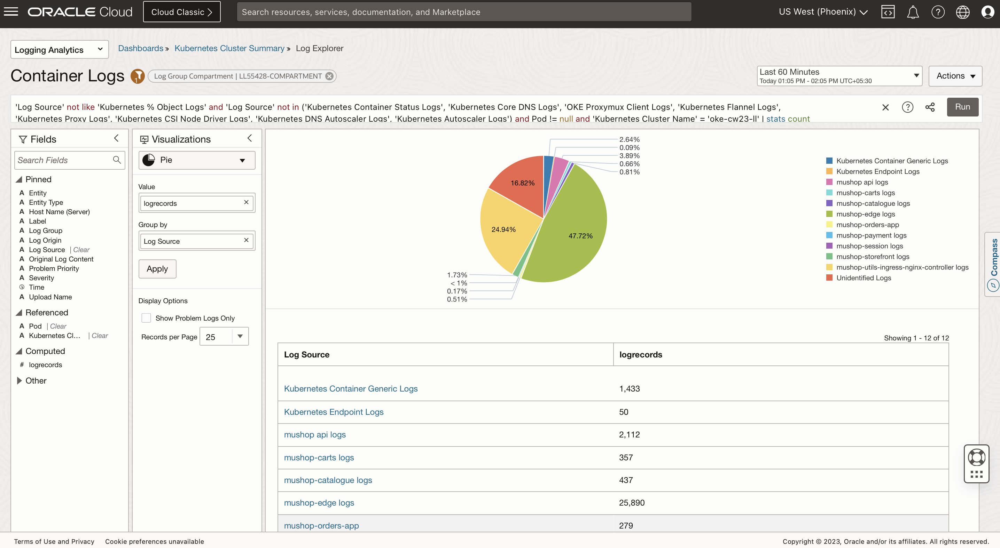

10. To navigate back to the Kubernetes Cluster Summary page, click on the **Kubernetes Cluster Summary** as highlighted in the image below.
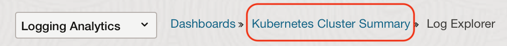

11. Similarly you can explore other widgets in the Kubernetes Cluster Summary and other dashboards.


**Congratulations!** In this lab, you have successfuly completed the following tasks:
- Used OCI Marketplace to configure and deploy the Kubernetes Monitoring solution.
- Verified successful deployment.
- Reviewed Application Information.

  You may now proceed to the [next lab](#next).

## Acknowledgements
* **Author** - Samarthya Sahu , OCI Logging Analytics
* **Contributors** -  Vikram Reddy, Santhosh Kumar Vuda , OCI Logging Analytics
* **Last Updated By/Date** - Samarthya Sahu, Jun, 2023