# Building dashboards in Logging Analytics with the data ingested by Management Agents

## Introduction

This lab will walk you through the steps to build dashboards in Logging Analytics with the data ingested by Management Agent

Estimated Time: 30 minutes

### About <Product/Technology> 
In this lab we will be using the following tools:
* Logging Analytics Dashboards - tool that enables user to work with Metrics ingested by OCI Monitoring through Management Agents. 

### Objectives
In this lab, you will:
* Create a dashboard in Logging Analytics
* Management Agent sends a number of Kubernetes Cluster and Node metrics but for the purpose of this lab, you will be building a dashboard with only 6 metrics.

### Prerequisites

* Basic understanding of OCI Monitoring and Logging Analytics

## Task 1: Create a Logging Analytics dashboard 
  
1. On Oracle Cloud Home Page click the Menu and then browse to **Observability and Management** and then click on **Dashboards** under Logging Analytics section

  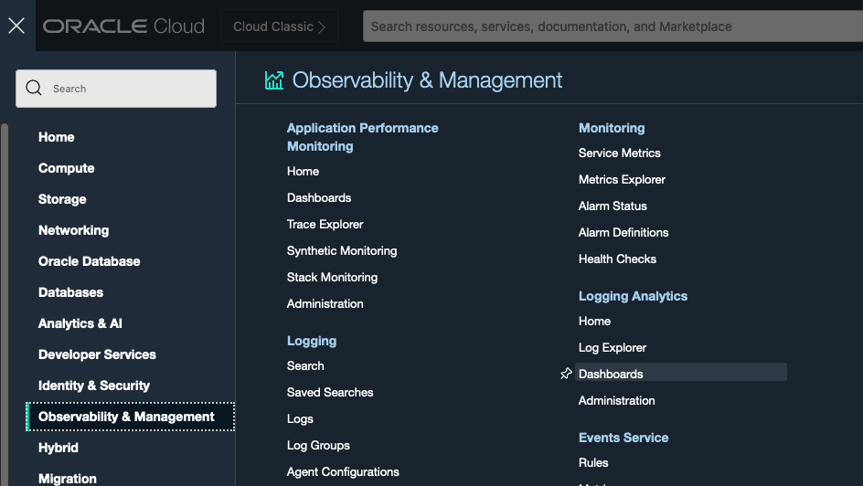

2. Select the compartment and then click on the **Create Dashboard** button. 

  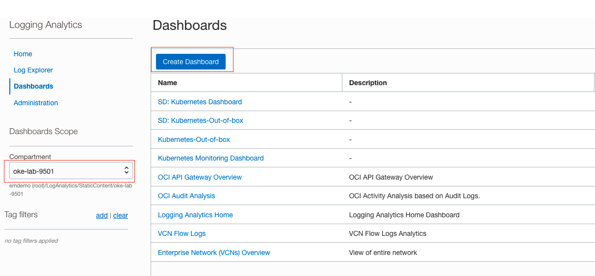
  
3. Edit the name of the dashboard by clicking on the pencil icon on the top left corner and then click on the Widgets tab on the right

  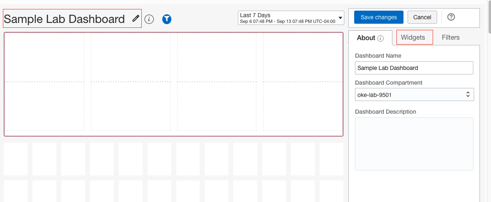
 

## Task 2: Create a Metric widget for CPU and Memory Utilization

1. Click on the **Create Metric Widget**

  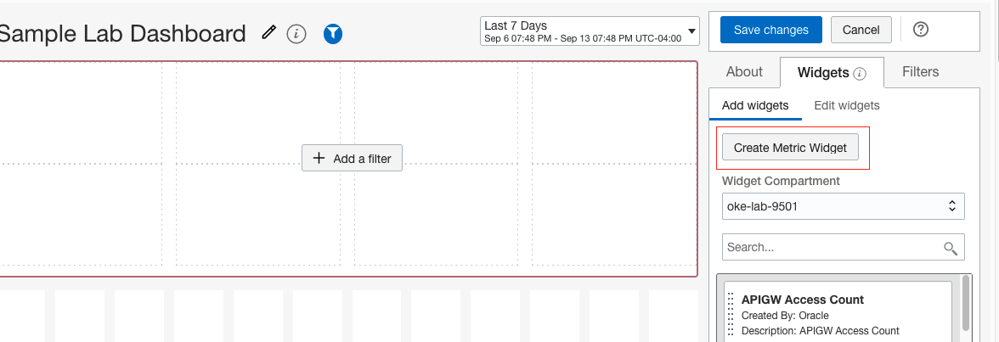

2. Add the compartment filter which is a default option and then click on the **Save Changes** button

  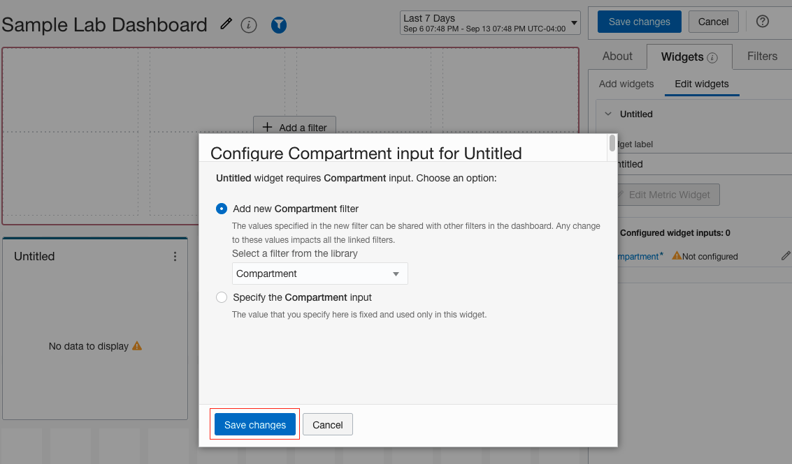
  
3. Add Source Data for **nodeCpuUsage** and **nodeMemoryUsage** metrics
   
   Click on the **+** next to **Source data** and then select **mgmtagent_kubernetes_metrics** namespace and **nodeCpuUsage** as indicated in the following screenshot.  Click the **Add** button after you are done.
  
  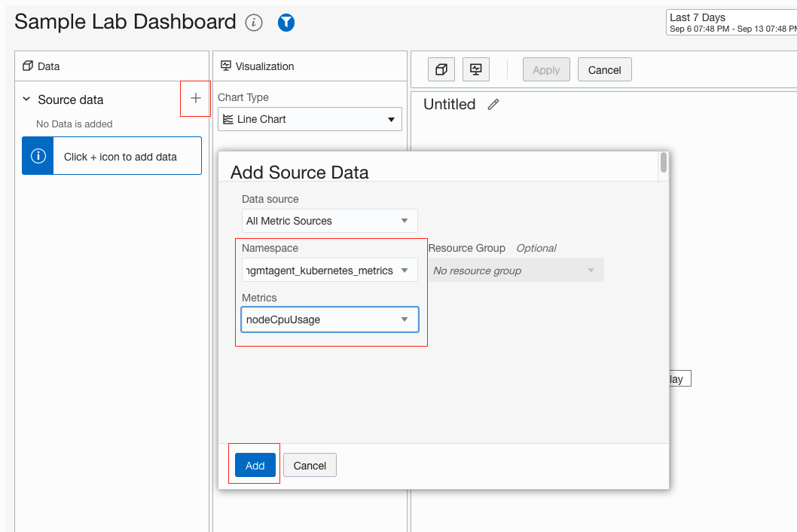
  
   Repeat the same steps to add another Source data for **nodeMemoryUsage**
   After adding both the Source Data elements then the screen should look as follows:
   
  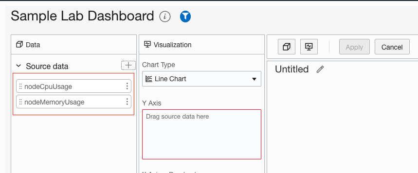
  
4. Add the dimensions for the Source data elements for **nodeCpuUsage**
   
   Click on the 3 dots next to **nodeCpuUsage** and click on **Edit** option.
  
  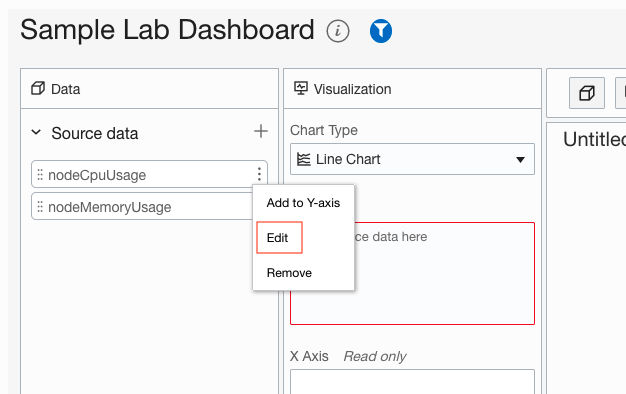
  
   Click on the **Add Dimension** button
   
  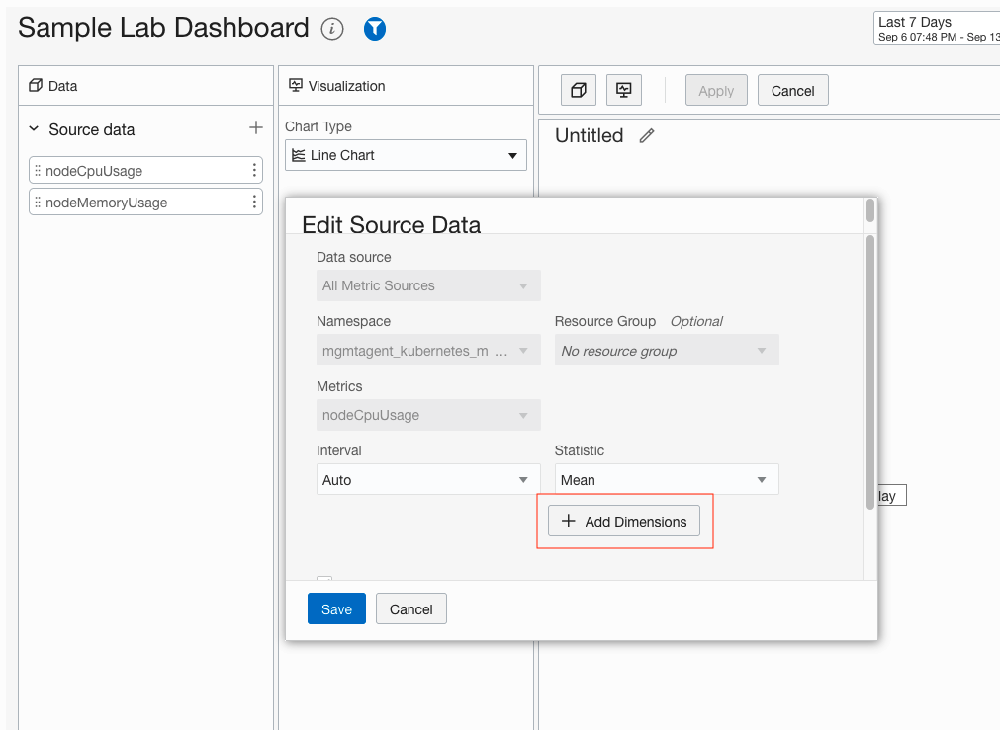 
  
   Add the dimensions for **clusterName** and **nodeName** as shown below

  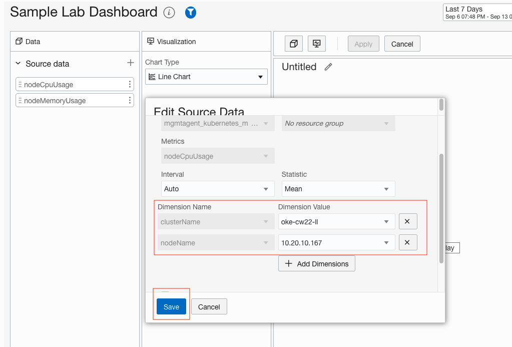 
  
  > **Note:** choose the cluster name provided to you when you signed up for the LiveLab session.

5. Add the dimensions for the Source data elements for **nodeMemoryUsage**
   
   Follow the same steps as Number 4 above for **nodeCpuUsage**
   
6. Finalize the Widget

   Drag the 2 Source data elements into the **Y Axis**, add a **Y Axis Title** and edit the title at the top to reflect the name for the widget (**CPU and Memory Utilization**)
   
   Click **Apply** to create the widget
   
  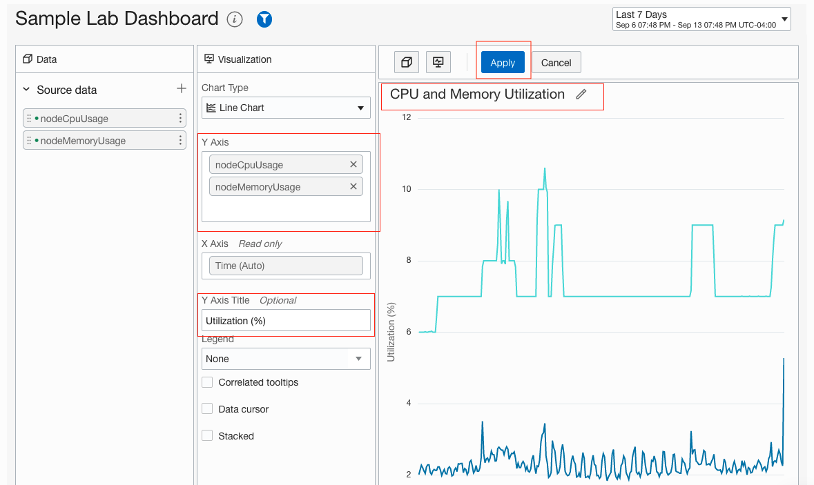 
  
7. Save the dashboard

  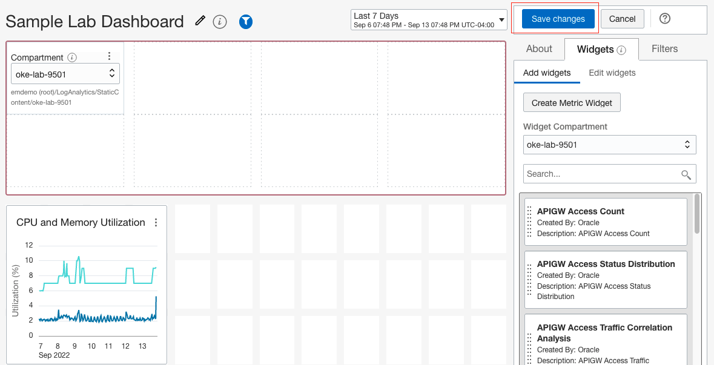 
  
   
## Task 3: Create a Metric widget for Network Transmit and Receive
  
  Repeat the same steps as **Task 2**
  
  Use the following Source data elements:
     
     container_network_receive_bytes_total
     container_network_transmit_bytes_total

  Use the following dimensions:
     
     namespace
     
  > **Note:**  Pick the value for namespace that was provided to you when you signed up for the LiveLabs session
  
  
## Task 4: (Optional) Create a Metric widget for Threads and Processes
 
  Repeat the same steps as **Task 2**
  
  Use the following Source data elements:
     
     container_threads
     container_processes

  Use the following dimensions:
     
     namespace
     
  > **Note:**  Pick the value for namespace that was provided to you when you signed up for the LiveLabs session

## Task 5: Verify the dashboard

  After you have saved the dashboard, it should appear as shown here
  
  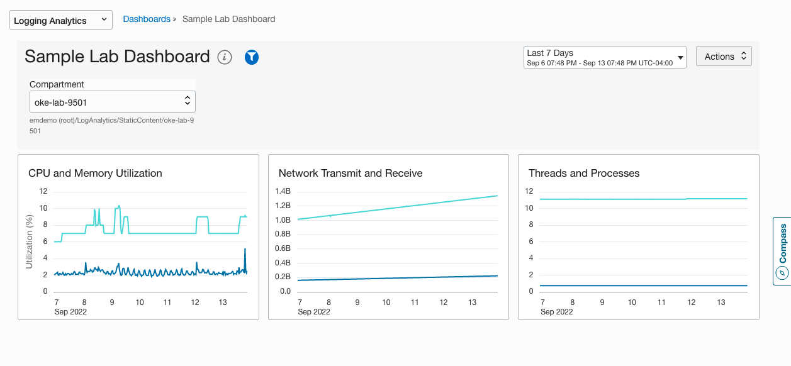 
  

**Congratulations!**, you have successfully created the dashboard with the Metric widgets.  You can explore other Source data to learn about the metrics available through the Management Agent.  Please, proceed to next lab.

## Acknowledgements
* **Author** - Nirav Gandhi , OCI Management Agent
* **Contributors** -  Chaitanya Kulkarni, Madhavan Arnisethangaraj, OCI Management Agent
* **Last Updated By/Date** - Nirav Gandhi, Sep, 2022