# Build a Query to list the Load Balancers and Summarize the results using tiles

## Introduction

In this lab you'll learn advanced analytics features of Logging Analytics. You'll learn more about the query language, do correlation (link), generate standard statistical metrics from logs, extract new fields for analysis, and visualize dense information for dashboards and interactive analysis.

Watch the video below for a quick walk-through of the lab.

### Objectives

In this lab, we will build two queries. One to get an inventory of the kubernetes services of type Load Balancers, and using Load Balancer Access and Error Logs. Finally, you'll link the two queries to build interactive analysis view to correlated LBaaS(infrastructure) telemetry with that of a Kubernetes Service(Platform Object).

We will use these commands and features:
- [Query Search](https://docs.oracle.com/en-us/iaas/logging-analytics/doc/query-search.html)
- [Link Visualization](https://docs.oracle.com/en-us/iaas/logging-analytics/doc/link-visualization.html)
- [stats](https://docs.oracle.com/en-us/iaas/logging-analytics/doc/stats.html) command
- [eventstats](https://docs.oracle.com/en-us/iaas/logging-analytics/doc/eventstats.html) command
- [addfields](https://docs.oracle.com/en-us/iaas/logging-analytics/doc/addfields.html) command
- [eval](https://docs.oracle.com/en-us/iaas/logging-analytics/doc/eval.html) replace and [url](https://docs.oracle.com/en-us/iaas/logging-analytics/doc/eval.html#GUID-B4C729D1-689B-4AD5-A12F-4359D93D0800) commands
- [Link Tiles feature](https://docs.oracle.com/en-us/iaas/logging-analytics/doc/tiles-link-visualization.html)


Estimated Time: 30 minutes


## Task 1: Inventory of Services with Load Balancers

In Kubernetes, a [Service](https://kubernetes.io/docs/concepts/services-networking/service/) is a method for exposing a network application that is running as one or more Pods in your cluster.

In this task we'll find kubernetes services which are exposed through an OCI Load Balancer.

1. Navigate to Log Explorer and reset previous selections.

    - From Navigation Menu  > Observability & Management > Logging Analytics > Log Explorer.

    - Click on **Actions** > **Create New** to reset the view.


2. Select the log group.

    - Click on the **Log Group** field in the fields panel.

    - Select **kubernetes_logs** log group checkbox.

    - Click on **Apply**.
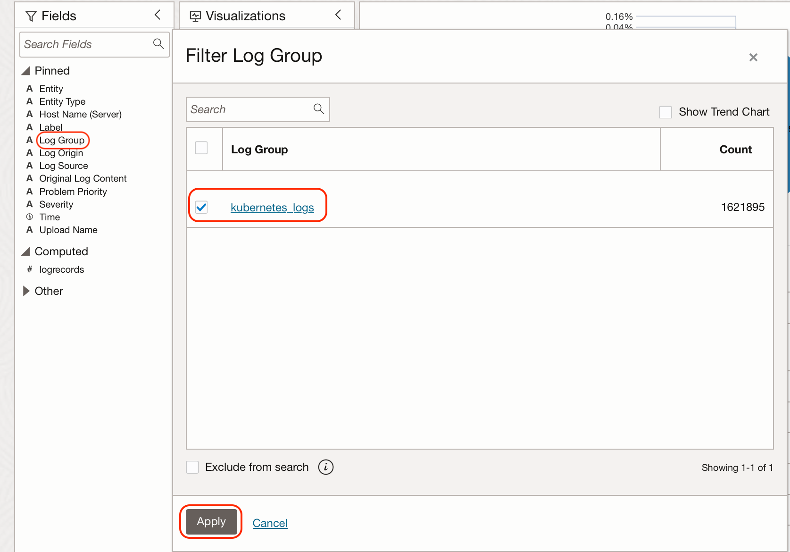


3. Switch to the **Link** Visualization.

    - In Visualizations panel, Click on the dropdown and select **Link** under Analysis section.
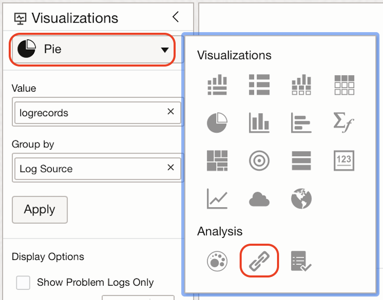

    - You should now see around 36 log sources that fetch information about various parts of your Kubernetes Infrastructure.


4. Find the unique combinations of different values of **Namespace**, **Service** and **Load Balancer IP**.

    - We'll use  link command with these field names to group-by.

    - In the Search Fields textbox, search **Namespace**, **Service** and **Load Balancer IP**(public IP address that serves as the entry point for incoming traffic) fields and drag and drop these fields into the **Group By** area.

    - Remove the **Log Source** field from the Group By.

    - Click on **Apply** button.
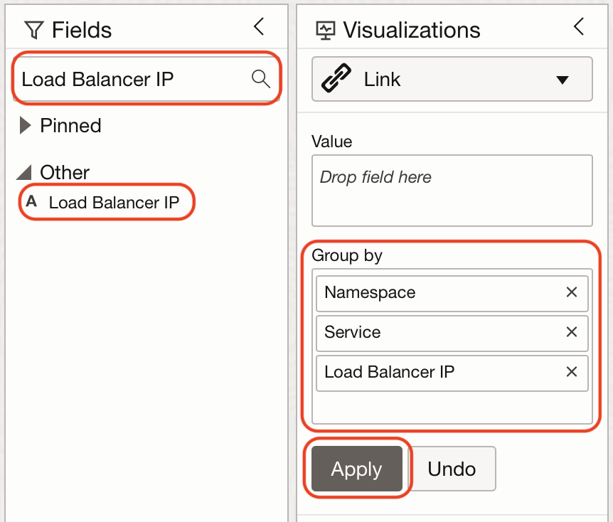
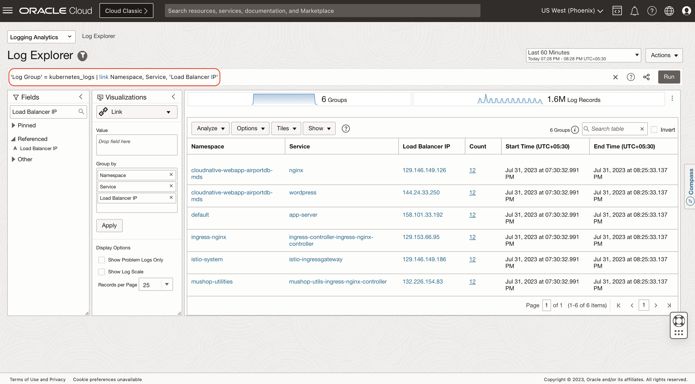


5. Add *includenulls = True* to the link command.

    -   The link query will bring in only those Log Sources that have all of the fields specified in the Group By. In this case, we want to bring in the records, even if at least one of those fields are non-null. This is achieved by adding **includenulls = True** to the link command.

    - Change the query from:
    ```
        <copy>
            'Log Group' = kubernetes_logs | link Namespace, Service, 'Load Balancer IP'
        </copy>   
    ```
    To:
    ```
        <copy>
            'Log Group' = kubernetes_logs | link includenulls = True Namespace, Service, 'Load Balancer IP'
        </copy>   
    ```

    - Click on the **Run** button to run the query.
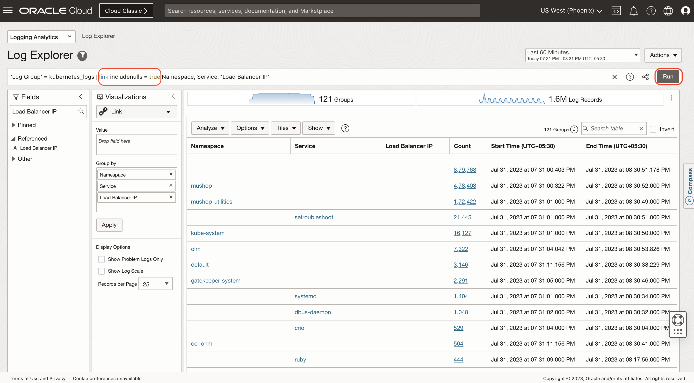


6. Extract additional fields using the *stats* command.

    - The link table has one row per unique combination of the selected Group By fields. Each of these rows has underlying log records, as shown in the Count field.

    - The *stats* command is similar to a foreach command, that goes through each row in this table. For each row, the stats command is applied to all the underlying log records, and the value is added as an additional column to the table.

    - We want to fetch the **Kubernetes Cluster Name** and the **Load Balancer Type** into the main table. The **unique()** function can be used fetch the unique value from each of these fields.

    - Append the following to your query:
    ```
         <copy>
            | stats unique('Kubernetes Cluster Name') as Cluster, unique(Type) as 'LB Type'
         </copy>   
    ```

    - The modified query looks like this:
    ```
         <copy>
            'Log Group' = kubernetes_logs
| link includenulls = true
   Namespace,
   Service,
 'Load Balancer IP'
| stats
   unique('Kubernetes Cluster Name')
      as Cluster,                                        
   unique(Type) as 'LB Type'
         </copy>   
    ```

    - Click on the **Run** button to run the query.

    - You should now see the **Cluster** and the **LB Type** columns. If there is more than one value, then you would see a comma separated list.


7. Identify Load Balancer Errors using *addfields*.

    - OCI Load Balancer Access Logs and OCI Load Balancer Error Logs capture details about the Load Balancers.

    - *addfields* is a command that can be used to apply stats commands to select logs. In this case, we want to look at all the logs that have a Load Balancer IP field and see if the Problem Priority field is non-null, and compute the count.

    - Append the following to your query:
    ```
         <copy>
            | addfields [ 'Load Balancer IP' != null and 'Problem Priority' != null | stats count as Errors ]
         </copy>   
    ```

    - Click on the **Run** button to run the query.

    - You should now see an Errors column in the table.
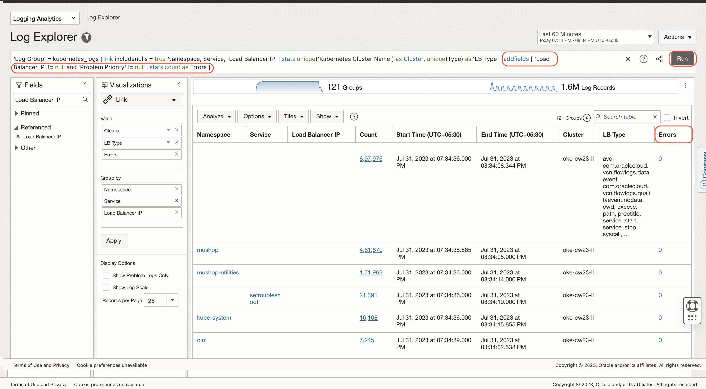


8. Rollup the Load Balancer Errors using the *eventstats* command.

    - Use the *eventstats* command to aggregate the Load Balancer Errors by each Load Balancer.

    - Append the following to your query:
    ```
         <copy>
            | eventstats sum(Errors) as 'LB Errors' by 'Load Balancer IP'
         </copy>   
    ```

    - Click on the **Run** button to run the query.

    - The **LB Errors** column would now report the number of errors against each Load Balancer IP
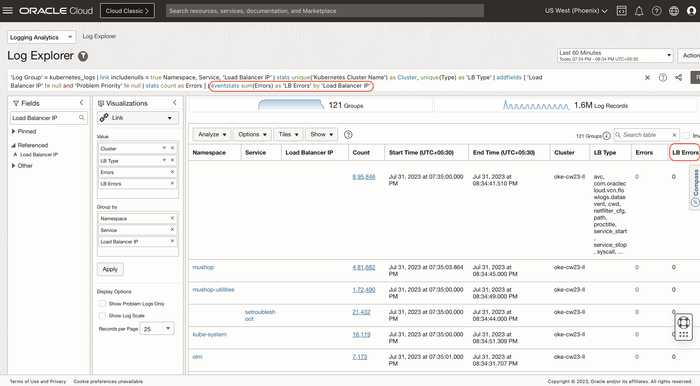


9. Summarize using the *eventstats* Command.

    - We will use the *eventstats* command to aggregate the fields we have generated so far.

    - Append the following to your query:
    ```
         <copy>
            | eventstats distinctcount(Namespace) as Namespaces, distinctcount(Service) as Services, distinctcount('Load Balancer IP') as 'Load Balancers'
         </copy>   
    ```

    - The modified query looks like this:
    ```
         <copy>
            'Log Group' = kubernetes_logs
| link includenulls = true
      Namespace,
      Service,
     'Load Balancer IP'
| stats
  unique('Kubernetes Cluster Name') as Cluster,                                            
  unique(Type) as 'LB Type'
| addfields
  [ 'Load Balancer IP' != null and
    'Problem Priority' != null
        | stats count as Errors
  ]
| eventstats sum(Errors) as 'LB Errors'
              by 'Load Balancer IP'
| eventstats
   distinctcount(Namespace) as Namespaces,
   distinctcount(Service)   as Services,
   distinctcount('Load Balancer IP')
                   as 'Load Balancers'
         </copy>   
    ```

    - Click on the **Run** button to run the query.

    - *eventstats* would add the results to ALL the rows of the table, unless there is a **by** clause. If there is a **by** clause, then all the rows for that unique by field will have the same values.
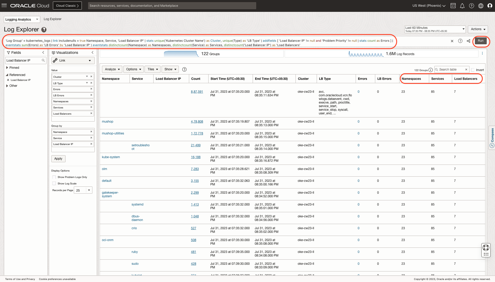


10. Filter the Table using *Type = loadbalancer* using the where command.

    - There are multiple types of Load Balancers in the cluster. We will limit our analysis to only the type *loadbalancer*.

    - Append the following command to your query to filter the table:
    ```
         <copy>
            | where 'LB Type' = loadbalancer
         </copy>   
    ```

    - Click on the **Run** button to run the query.

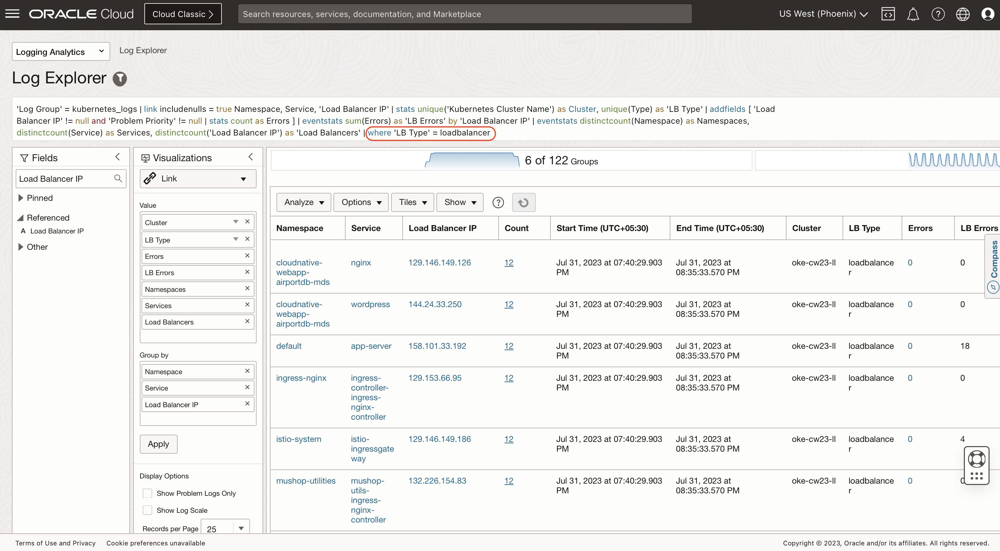


11. Hide unnecessary columns in the UI.

    - We have several fields that we would only use in the Tiles.

    - Click on the **Options** dropdown and click on **Hide/Show Columns** and uncheck the following to hide these columns:
        - Count
        - Start Time
        - End Time
        - Cluster
        - Errors
        - Namespaces
        - Services
        - Load Balancers
    
        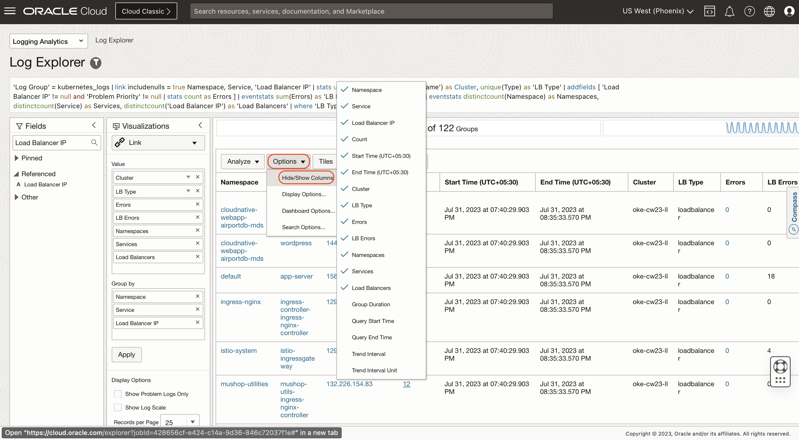


12. Summarize using Link Tiles.

    - The values in the first row of the link table can be used to create Tiles.

    - Click on the **Tiles** dropdown and click on **New** to open the Tile editor.
    

    - Remove the existing Tile definition from the editor.

    - Copy/paste the following Tile definition into the editor and click on **Save Changes** to save:
    ```
         <copy>
            <summary>
                <container display="none">
                    <table>
                        <row>
                            <column>
                                <tiles>
                                    <title>
                                        <title-text>Summary for Cluster </title-text>
                                        <title-text field="Cluster"/>
                                    </title>
                                    <tile field="Namespaces"/>
                                    <tile type="separator"/>
                                    <tile field="Services"/>
                                    <tile type="separator"/>
                                    <tile field="Load Balancers"/>
                                </tiles>
                            </column>
                        </row>
                    </table>
                </container>
            </summary>
         </copy>   
    ```

        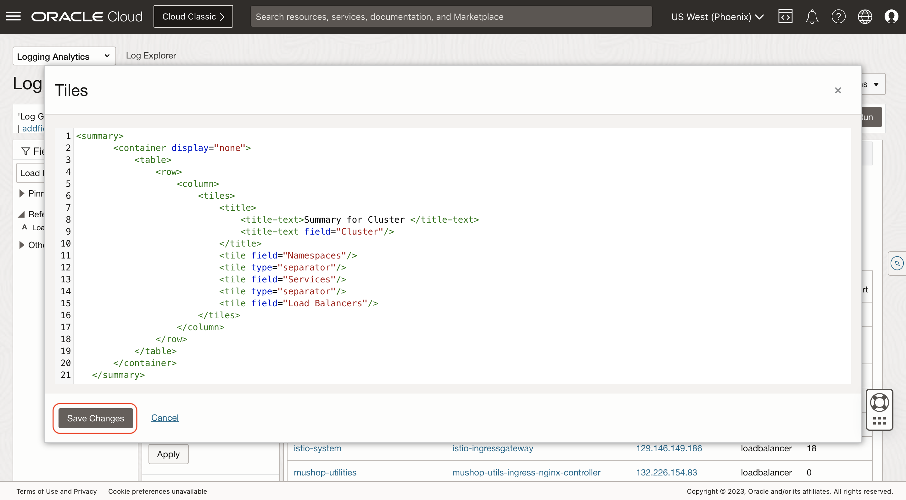


13. Summary view.

    - You should now be able to view the summary tiles.

    - The final query looks like this:
    ```
         <copy>
            'Log Group' = kubernetes_logs
| link includenulls = true
     Namespace,
     Service,
    'Load Balancer IP'
| stats
    unique('Kubernetes Cluster Name')
        as Cluster,                     
    unique(Type) as 'LB Type'
| addfields
    [ 'Load Balancer IP' != null and
      'Problem Priority' != null
        | stats count as Errors
    ]
| eventstats
   sum(Errors) as 'LB Errors'
     by 'Load Balancer IP'
| eventstats
   distinctcount(Namespace) as Namespaces,
   distinctcount(Service)   as Services,
   distinctcount('Load Balancer IP')
      as 'Load Balancers'
| where 'LB Type' = loadbalancer
         </copy>   
    ```

        


14. Save the search.

    - Click on the **Actions** dropdown and click on **Save As**.
    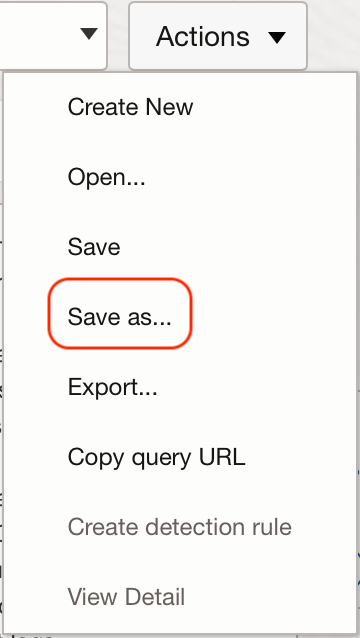

    - Type the Compartment name in the **Saved Search Compartment**. For your user the Compartment name will be **LLresrvationid-COMPARTMENT**.

    > **Note:** You can always find the **Compartment** name from the View Login Info page.

    - Enter the name in the **Search Name** field and click on the **Save** button to save the search.
    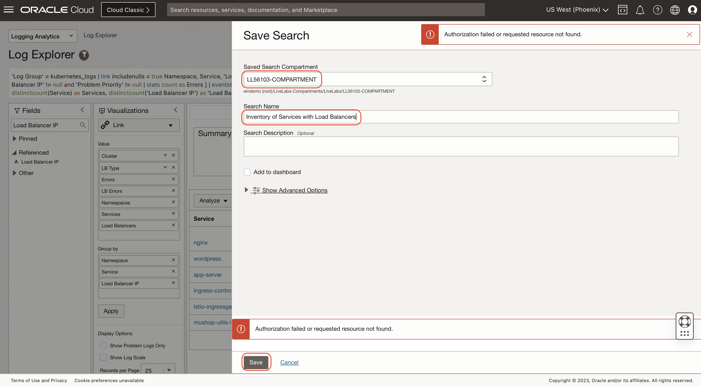
    > **Note:** You will be see the Authorization error, which is expected since by default *root* Compartment is selected.

    - A saved search will be created and added to the Dashboard.
    


## Task 2: Query to Monitor Load Balancers

1. Open new tab and navigate to Log Explorer.

    - Open a new browser and login to the Oracle cloud.

    - From Navigation Menu  > Observability & Management > Logging Analytics > Log Explorer.

    - Click on **Actions** > **Create New** to reset the view.
    


2. Choose a Load Balancer IP.

    - In the Search Fields textbox, search **Load Balancer IP** field.

    - Load Balancer IP field will appear in the **Other** section.

    - Click on the **Load Balancer IP** field and in the pop up click on any Load Balancer IP checkbox.

    - Click on **Apply** button.
    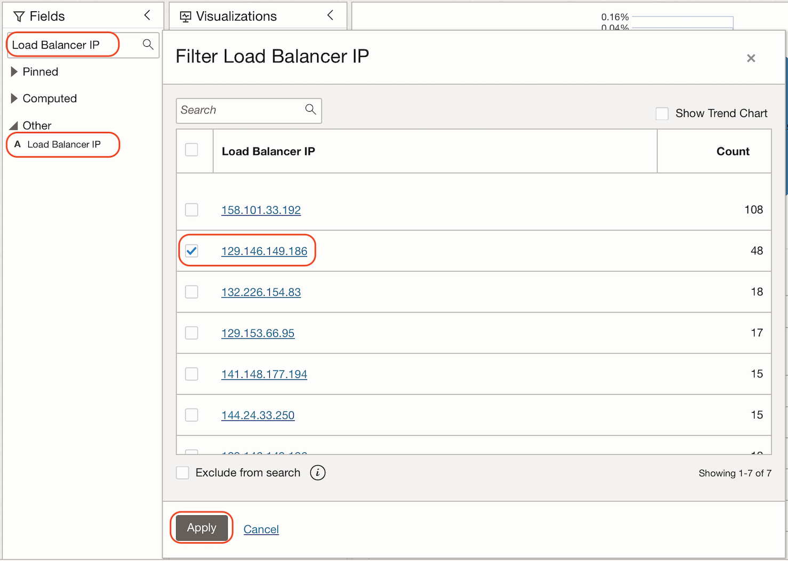
    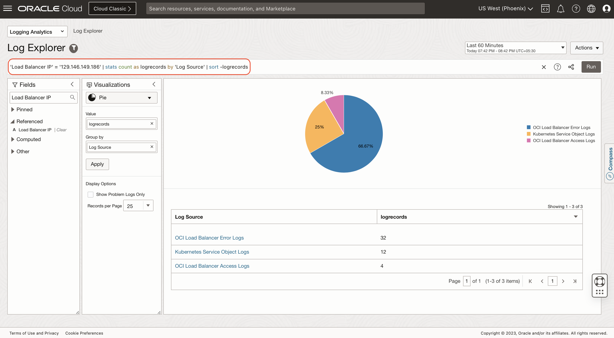


3. Switch to Records with Histogram view.

    - In Visualizations panel, Click on the dropdown and select **Records with Histogram**.
    

    - Records with Histogram view will get displayed.
    


4. Display issues in the selected Load Balancer.

    - Under **Display Options**, Click on the **Show Problem Logs Only** checkbox.

    - The query is automatically updated. You should see a similar query like this:
    ```
        'Load Balancer IP' = '129.146.149.186' and 'Problem Priority' != null
| timestats count as logrecords by 'Log Source'
| sort -logrecords  
    ```

    - Click on the **Run** button to run the query.

    - You can now see all the issues in the selected Load Balancer for the chosen time period.
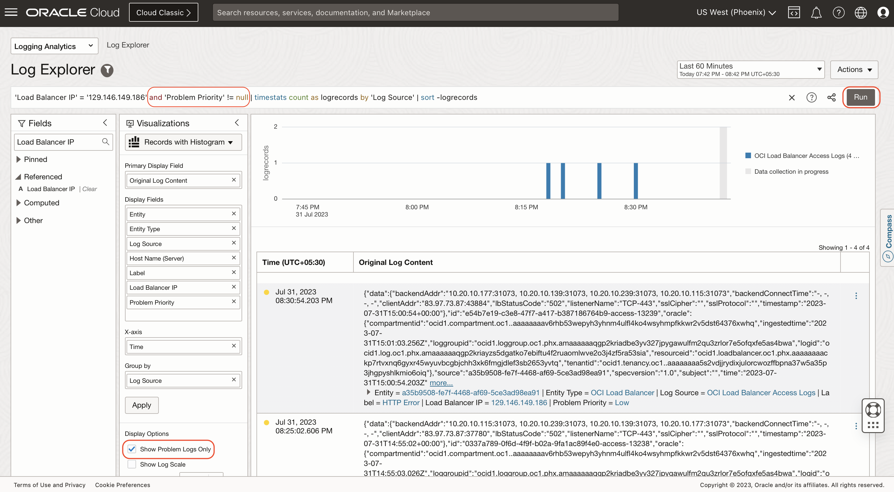


5. Group by Destination IP.

    - Let us now group the issues by the backend server IPs.

    - In the Search Fields textbox, search **Destination IP** field and drag and drop these fields into the **Group By** area.

    - The query is automatically updated. You should see a similar query like this:
    ```
        'Load Balancer IP' = '129.146.149.186' and 'Problem Priority' != null | timestats count as logrecords by 'Destination IP' | sort -logrecords 
    ```

    - Click on **Apply** button.

    - You can now view the Load Balancer issues grouped by backend IPs.
    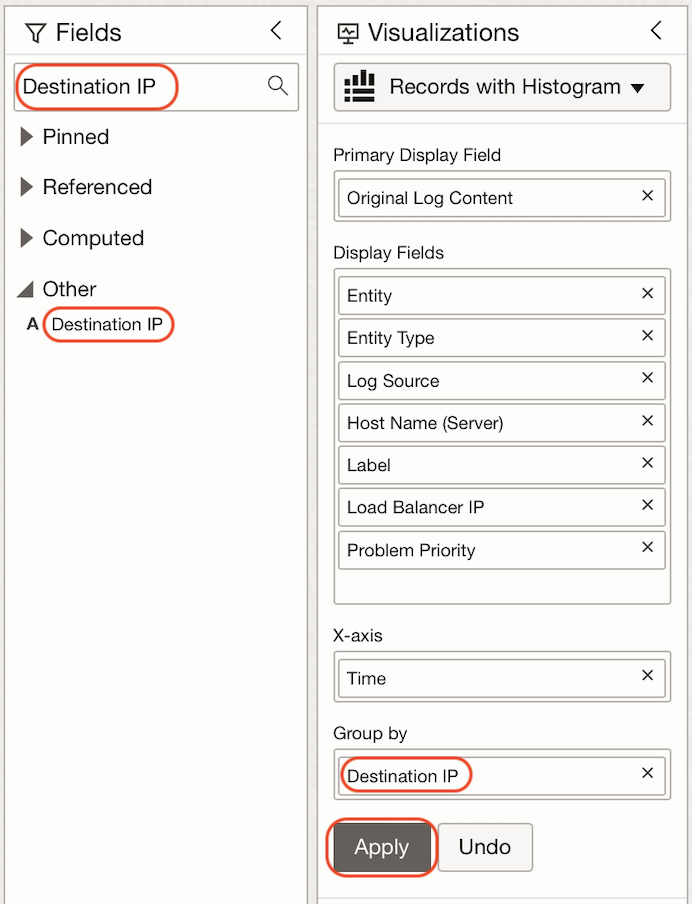
    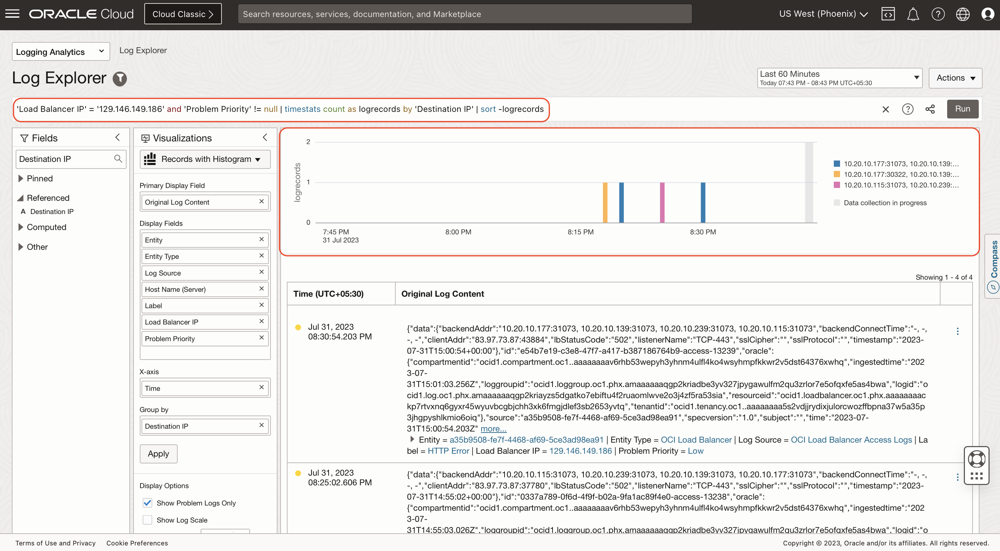


6. Add a Time between clause to the query.

    - This query now shows the Load Balancer issues for the selected time period. We will edit the query and add another criteria so that the time selection happens in the query instead of the UI.

    - We will copy this modified query and link this from the first query we built.

    - Append the following command to the beginning of your query. The actual time does not matter, since we will replace this in the first query:
    ```
        <copy>
            Time between '2023-06-29T00:00:00.000Z' and '2023-06-30T00:00:00.000Z' and
        </copy>   
    ```

    - The modified query looks like this:

        >**Note:** Following is the sample query for reference. **Do Not Copy these.**

        ```
            Time between '2023-06-29T00:00:00.000Z' and '2023-06-30T00:00:00.000Z' and 'Load Balancer IP' = '129.146.149.186' and 'Problem Priority' != null
| timestats count as logrecords by 'Destination IP'
| sort -logrecords
        ```

    - Click on the **Run** button to run the query.    
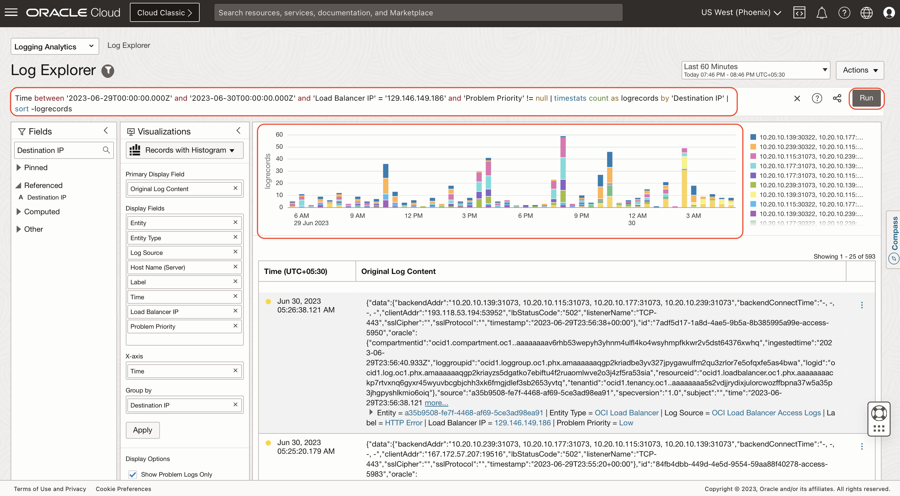


7. Copy query URL.

    - We will Copy this query URL and modify our first query, so that you can move between these two reports.

    - Click on **Actions** > **Copy query URL** to copy the query URL.
 


## Task 3: Updating the First query to add a link to the Second Query

1. Open the previous query.

    - Navigate back to the previous tab where you had the query for **Inventory of Services with Load Balancers**.

    - If you do not have the tab open, then you can retrieve the saved search which you had done in Task 1.

        - Open new tab and navigate to Log Explorer.

        - Click on **Actions** > **Open**.
    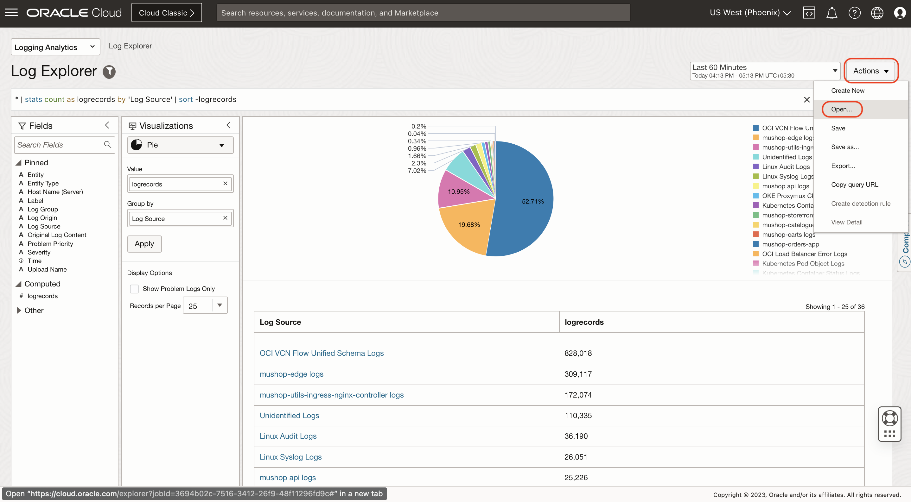

        - In the **Widget Compartment**, enter your user the Compartment i.e. **LLresrvationid-COMPARTMENT**.

        - In the **Search** textbox, enter the name you used to save the first search and select your saved search from the results.

        - Click on **Open** button to open the search.
    


2. Create a new field using the *eval* command to store the URL.

    - Append the following to the query. In place of <URL\>, paste the URL you had copied in the earlier step.
        ```
             <copy>
                | eval URL1 = '<URL>'
            </copy>   
        ```
        > **Note:** Make sure the URL is inside single quotes. 
    
    - Click on the **Run** button to run the query.
    

    - Place the cursor on the query bar and press **Ctrl+I** to indent the query.
    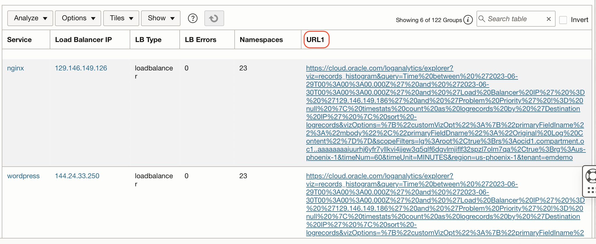


3. Set the URL Parameters using the eval  replace() command.

    -   Our copied URL has a query, and the query contains these three parameters:
        - **Start Time** as part of the *Time between* command
        - **End Time** as part of the *Time between* command
        - **Load Balancer IP**

    - Replace **Start Time** and **End Time** with the values from the fields *Query Start Time* and *Query End Time* respectively. These fields hold the current time selection.

    - Replace the hard-coded Load Balancer IP with the value of the Load Balancer IP in each row. This way the query will be dynamic.

    - Append the following to the query. Make sure to replace the Start and End Time with the values you had in your query. Similarly, use the Load Balancer IP you had in your query. These are the values we want to replace.
    ```
            | eval URL2 =
     replace(replace(replace(URL1,
         '2023-06-29T00:00:00.000Z',                                
           formatDate('Query Start Time')),
         '2023-06-30T00:00:00.000Z',
           formatDate('Query End Time')),
          '129.146.149.186',
            'Load Balancer IP')
    ```

    - Following is a sample query after the updates. Your query may look different if you had different values in your URL:
    
        >**Note:** Following is the sample query for reference. **Do Not Copy these.**

        ```
                'Log Group' = kubernetes_logs
    | link includenulls = true Namespace, Service, 'Load Balancer IP'
    | stats unique('Kubernetes Cluster Name') as Cluster, unique(Type) as 'LB Type'
    | addfields [ 'Load Balancer IP' != null and 'Problem Priority' != null | stats count as Errors ]
    | eventstats sum(Errors) as 'LB Errors' by 'Load Balancer IP'
    | eventstats distinctcount(Namespace) as Namespaces, distinctcount(Service) as Services, distinctcount('Load Balancer IP') as 'Load Balancers'
    | where 'LB Type' = loadbalancer
    | eval URL1 = 'https://cloud.oracle.com/loganalytics/explorer?viz=records_histogram&query=Time%20between%20%272023-06-29T00%3A00%3A00.000Z%27%20and%20%272023-06-30T00%3A00%3A00.000Z%27%20and%20%27Load%20Balancer%20IP%27%20%3D%20%27129.146.149.186%27%20and%20%27Problem%20Priority%27%20!%3D%20null%20%7C%20timestats%20count%20as%20logrecords%20by%20%27Destination%20IP%27%20%7C%20sort%20-logrecords&vizOptions=%7B%22customVizOpt%22%3A%7B%22primaryFieldIname%22%3A%22mbody%22%2C%22primaryFieldDname%22%3A%22Original%20Log%20Content%22%7D%7D&scopeFilters=lg%3Aocid1.compartment.oc1..aaaaaaaav6rhb53wepyh3yhnm4ulfl4ko4wsyhmpfkkwr2v5dst64376xwhq%2Ctrue%3Brs%3Aocid1.compartment.oc1..aaaaaaaauxh6chgelqkqzrxmwdsydbnvodf4hhceqbsltkv63islsduvanga%2Ctrue%3Brg%3Aus-phoenix-1&timeNum=60&timeUnit=MINUTES&region=us-phoenix-1&tenant=emdemo'
    | eval URL2 = replace(replace(replace(URL1, '2023-06-29T00:00:00.000Z', formatDate('Query Start Time')), '2023-06-30T00:00:00.000Z', formatDate('Query End Time')), '129.146.149.186', 'Load Balancer IP')
        ```

    - Click on the **Run** button to run the query.
    
    


4. Create a clickable field using the eval url() function.

    - The **URL2** field we created in the previous step contains a custom URL for each row of our table. But it is too long.

    - Create a clickable field using the **url()** function. In this example, the first argument is the URL, and the second argument is the name we want to appear for the URL. *LB Errors* is a numeric field that contains the number of errors. We will convert that to a string and use that as the name.

    - Append the following to the query:
    ```
         <copy>
            | eval 'Load Balancer Errors' = url(URL2, toString('LB Errors'))
         </copy>   
    ```

    - Click on the **Run** button to run the query.
    

    - You should now see a new clickable field **Load Balancer Errors**.
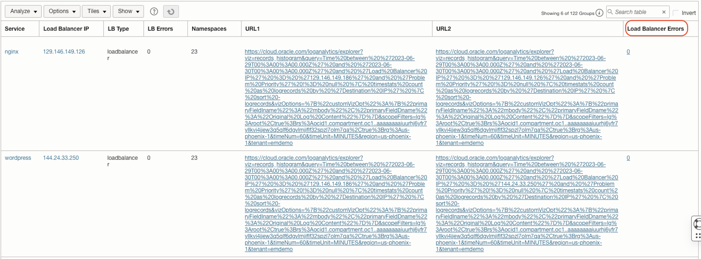


5. Hide unnecessary columns using the fields command.

    - We created few temporary fields that are not required in the final report.

    - Append the following to the query to hide the unwanted fields. These fields will not be returned by the query backend.
    ```
         <copy>
            | fields -'LB Type', -'LB Errors', -URL1, -URL2
         </copy>   
    ```

    - The final query looks similar to this:
    ```
         <copy>
            'Log Group' = kubernetes_logs
| link includenulls = true
   Namespace,
   Service,
   'Load Balancer IP'
| stats
   unique('Kubernetes Cluster Name') as Cluster,
   unique(Type) as 'LB Type'
| addfields
    [ 'Load Balancer IP' != null and 'Problem Priority' != null
        | stats count as Errors
    ]
| eventstats sum(Errors) as 'LB Errors' by 'Load Balancer IP'
| eventstats
   distinctcount(Namespace) as Namespaces,
   distinctcount(Service)   as Services,
   distinctcount('Load Balancer IP') as 'Load Balancers'
| where 'LB Type' = loadbalancer
| eval URL1 = 'https://cloud.oracle.com/loganalytics/explorer?viz=records_histogram&query=Time%20between%20%272023-06-29T00%3A00%3A00.000Z%27%20and%20%272023-06-30T00%3A00%3A00.000Z%27%20and%20%27Load%20Balancer%20IP%27%20%3D%20%27129.146.149.186%27%20and%20%27Problem%20Priority%27%20!%3D%20null%20%7C%20timestats%20count%20as%20logrecords%20by%20%27Destination%20IP%27%20%7C%20sort%20-logrecords&vizOptions=%7B%22customVizOpt%22%3A%7B%22primaryFieldIname%22%3A%22mbody%22%2C%22primaryFieldDname%22%3A%22Original%20Log%20Content%22%7D%7D&scopeFilters=lg%3Aocid1.compartment.oc1..aaaaaaaav6rhb53wepyh3yhnm4ulfl4ko4wsyhmpfkkwr2v5dst64376xwhq%2Ctrue%3Brs%3Aocid1.compartment.oc1..aaaaaaaauxh6chgelqkqzrxmwdsydbnvodf4hhceqbsltkv63islsduvanga%2Ctrue%3Brg%3Aus-phoenix-1&timeNum=60&timeUnit=MINUTES&region=us-phoenix-1&tenant=emdemo'
| eval URL2 = replace(replace(replace(URL1,
                                      '2023-06-29T00:00:00.000Z',
                                      formatDate('Query Start Time')),
                              '2023-06-30T00:00:00.000Z',
                              formatDate('Query End Time')),
                      '129.146.149.186',
                      'Load Balancer IP')
| eval 'Load Balancer Errors' = url(URL2, toString('LB Errors'))
| fields -'LB Type', -'LB Errors', -URL1, -URL2
         </copy>   
    ```

    - Click on the **Run** button to run the query.


6. Report is complete.

    - You have successfully built a **Cluster Monitoring Query** with dynamic drill downs.

    - Click on any non-zero value for the **Load Balancer Errors** column to drill down and view the second report.

    - Change the time period in the UI or click on the **Load Balancer Errors** for different Load Balancers to confirm the IP changes in each report.
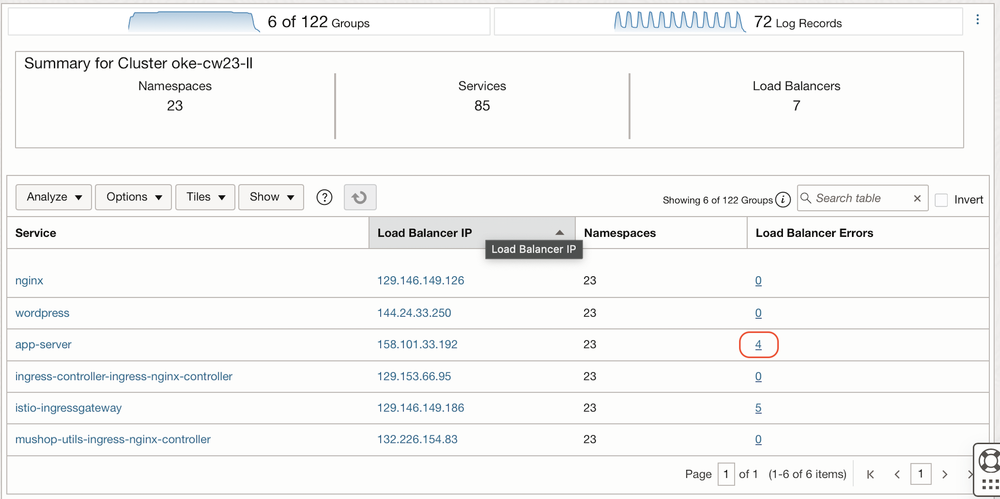


**Congratulations!** In this lab, you have successfuly completed the following tasks:
- Build query to get an inventory of the kubernetes services of type Load Balancers.
- Build query to monitor Load Balancers.
- Link the two queries to build interactive analysis view to correlated LBaaS(infrastructure) telemetry with that of a Kubernetes Service(Platform Object).

  You may now proceed to the [next lab](#next).

## Acknowledgements
* **Author** - Samarthya Sahu , OCI Logging Analytics
* **Contributors** - Sreeji Das , OCI Logging Analytics
* **Last Updated By/Date** - Samarthya Sahu, Sep, 2023
