# Logging Analytics Overview (Optional Study)

## Introduction
Logging Analytics is a cloud solution in Oracle Cloud Infrastructure(OCI) that lets you index, enrich, aggregate, explore, search, analyze, correlate, visualize and monitor all log data from your applications and system infrastructure.

Estimated Time: 5 minutes


### Objectives

In this lab, you will familiarize with:
* Navigating to Log Explorer
* User interfaces of Log Explorer
* Discovering & enabling OCI Service Logs in bulk
* Collecting new logs (log sources) for existing entities


## Task 1:  Navigating to Log Explorer

To navigate to Log Explorer, follow one of the below two methods.

1. From Navigation Menu  > **Observability & Management** > **Logging Analytics** > **Log Explorer**.
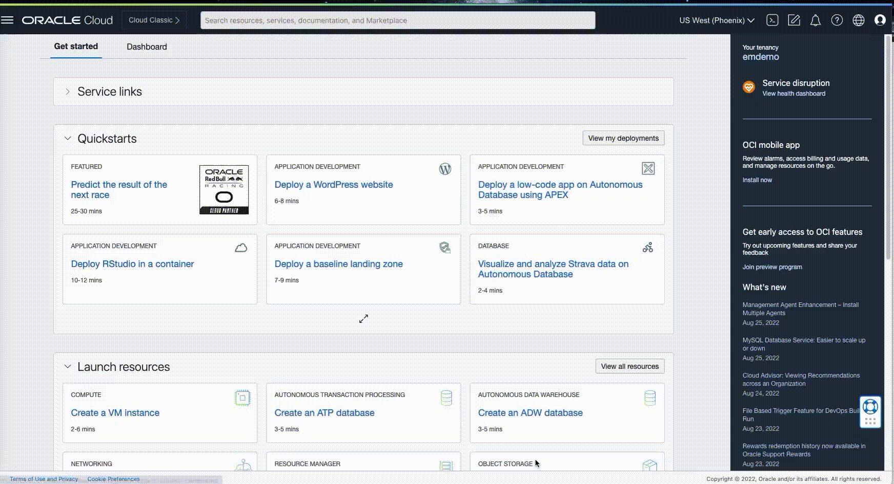

2. You can also copy-paste the following link in your browser's address bar to navigate to the Log Explorer.
    ```
         <copy>
            https://cloud.oracle.com/loganalytics/explorer?region=us-phoenix-1
         </copy>   
    ```


## Task 2:  User interfaces of Log Explorer

Here are the main parts of the user interface that will be used throughout this workshop.

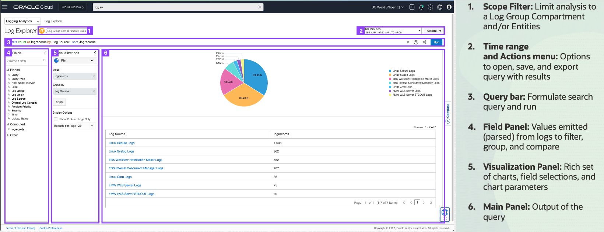

1. **Scope Filter** for setting Entity and Log Group Compartment scope for exploration.

2. **Time range** picker, and **Actions** menu where you can find actions such as, *Open*, *Save*, and *Save as*.

3. **Query bar**, with **Clear**, **Search Help** and **Run** buttons at the right end of the bar.

4. **Fields panel**, where you can select sources and fields to filter your data.

5. **Visualization panel**, where you can select the way to view search data in a form that helps you.

6. **Main panel**, where the visualization output appears above the results of the query.

      >**Note:** The main panel is empty till you set up log ingestion, which will be performed in the [next lab](#next).


## (Reading Excercise Only) Task 3: Navigating to the Add Data Page

> **Note** : **No action is needed from the user as this is only reading excercise.**


The Add Data Page lists the different mechanisms through which the user can ingest data to Logging Analytics.

  1. Monitor OCI core infrastructure : Allows user setting up data ingestion using Service Connector.

  2. Monitor apps and on-premises infrastructure : Allows user setting up data ingestion using Management Agent.

  3. Advanced collection methods : Allows user to upload the data from there computer desktop. This mechanism will be used if user wants to ingest log files without continuously collecting them using the Service Connector or  Management Agent.


There are three ways to navigate to the **Add Data** page.

### **Option 1 : Using Compass icon**

1. In the Log Explorer page, click on the **Compass** icon.
 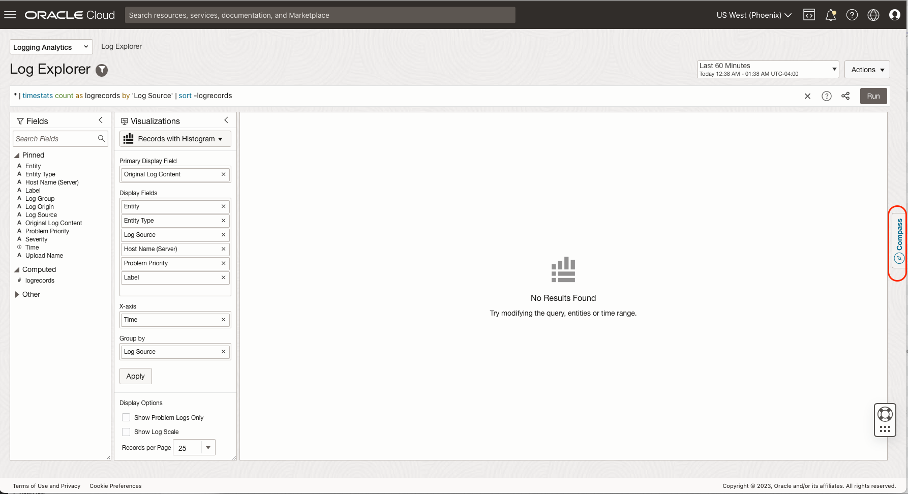

2. A compass panel will be displayed. In the compass panel, click on the **Add Data** button.
 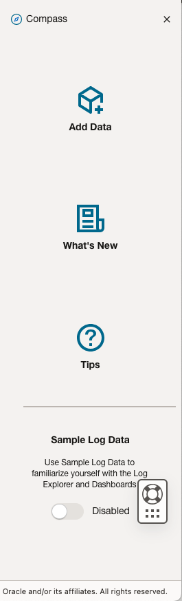

3. Add Data page will be displayed.
 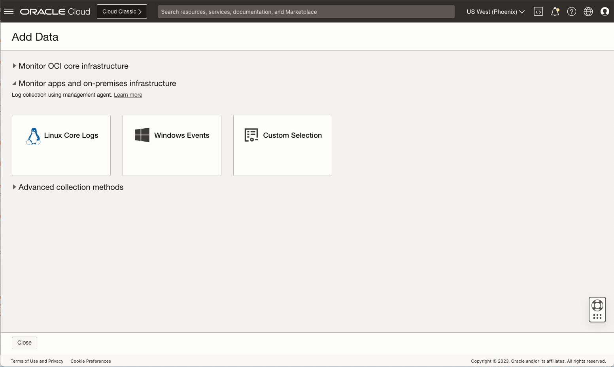


### **Option 2 : Via Administration Overview Page**
1. In the Log Explorer page, click on the dropdown icon and select **Administration**.
  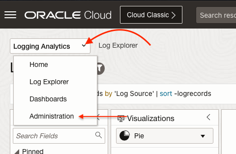

2. Administration Overview page will be displayed. Click on **Add Data** button.
  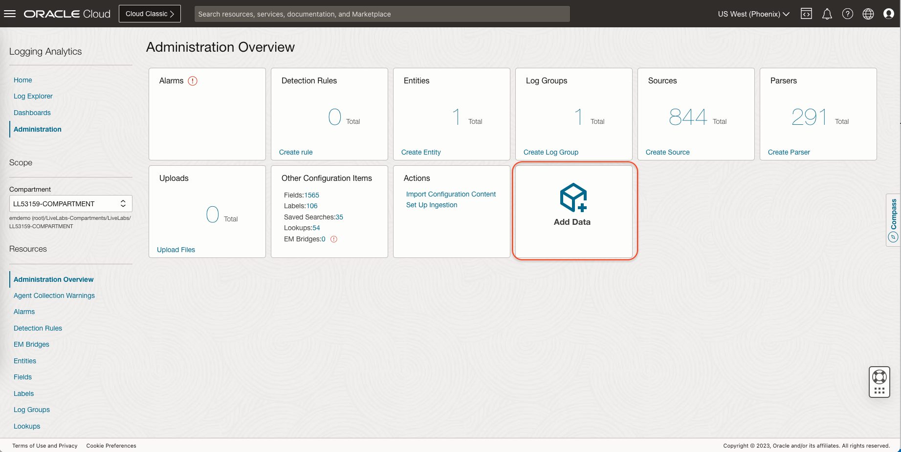

3. Add Data page will be displayed.
  

### **Option 3 : Direct Link** 
1. You can also copy-paste the following link in your browser's address bar to navigate to the Add Data page.
    ````
    <copy>
         https://cloud.oracle.com/loganalytics/add_data?region=us-phoenix-1 
    </copy>
    ```

2. Add Data page will be displayed.
    


## (Reading Excercise Only) Task 4: Ingesting logs using Service Connector

> **Note** : **No action is needed from the user as this is only reading excercise.**

The following setup is already done for this **Workshop**, no further action required.

1. Click on the **Monitor OCI core infrastructure** header. OCI Core Infrastructure section will be displayed.
 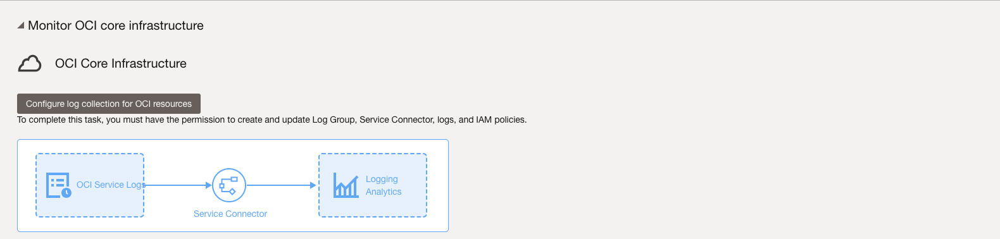

2. Click on the **Configure log collection for OCI resources** button. 
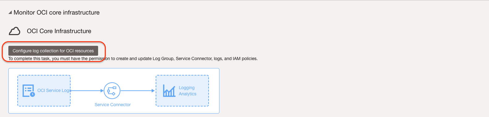

3. The **Configure log collection for OCI resources** page will be displayed and table will display all OCI Resources (entities) which your user has access (read) to and from which logs can be collected.
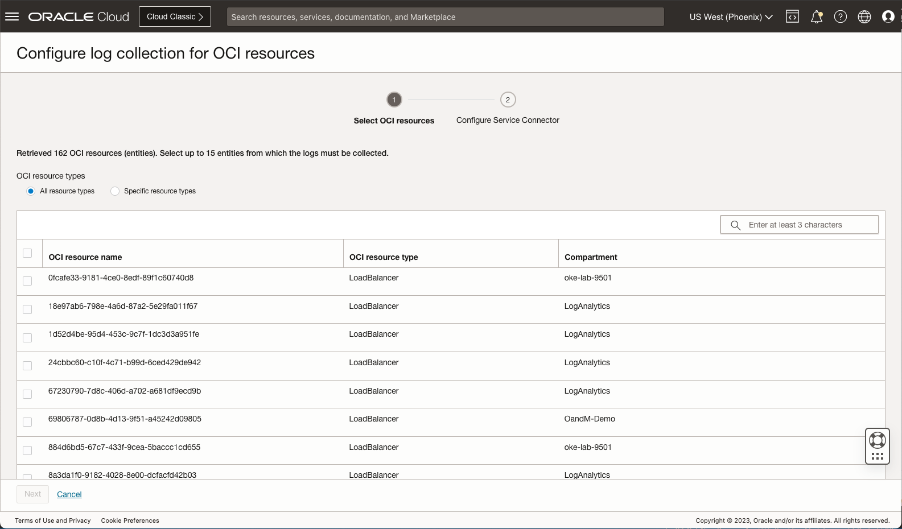

    - **Log Source** - Log Sources define where the log files are located and how to parse and enrich the logs while ingesting them, irrespective of the method of ingestion.

    - **Entity** - An entity is a resource in Logging Analytics which is used to reference the real asset on your on-premises host or virtual host. After you discover this entity in Logging Analytics, you can associate it with a log source and enable log collection from it.

4. **Load Balancer Flow**

    - Under OCI resource types select the **Specific resource types** radio button. An empty textbox to select resource types will be displayed.
        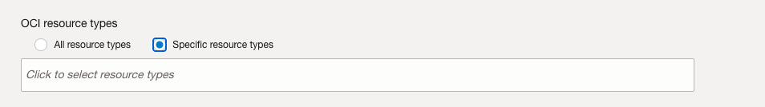

    - In the textbox enter the text **LoadBalancer**  and click on the resultant **LoadBalancer** text. A list of all available Load Balancers will be displayed.
        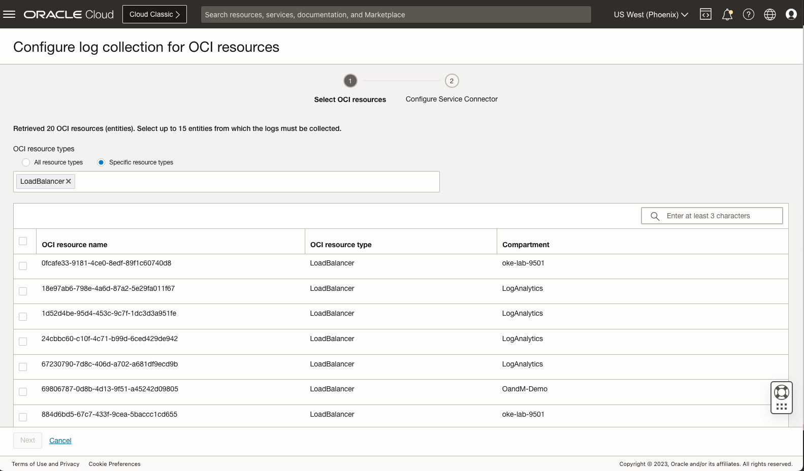

    - Select the Load Balancer from which logs needs to be collected. Click **Next**
        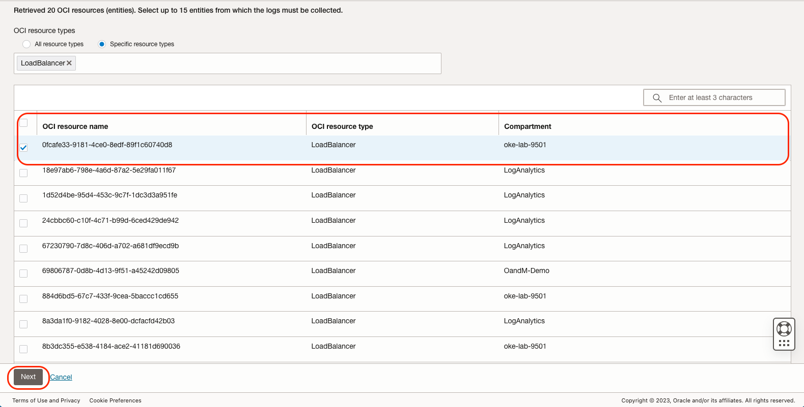 

    - Configure Service Connector Panel will be displayed. Click on **Configure Log Collection** button.
        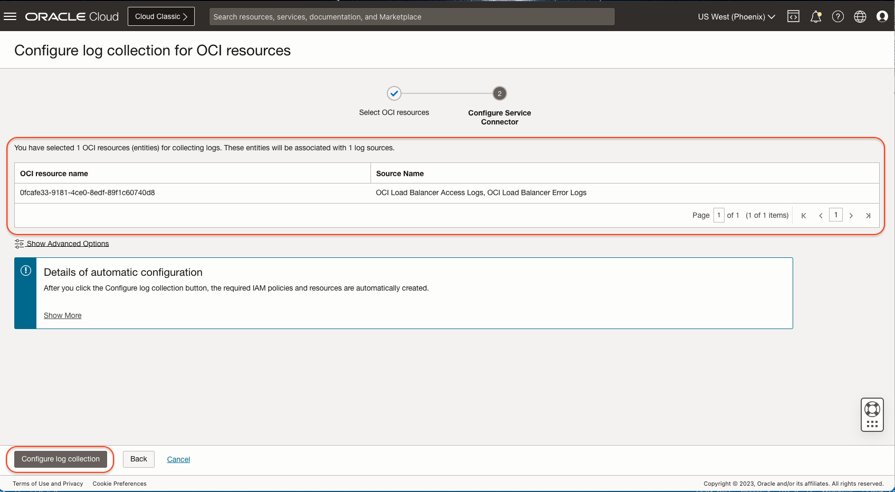 

    - In the next page Log Configuration will start. And the successful configuration will look like below.
      Click on **Take me to Log Explorer** button.
        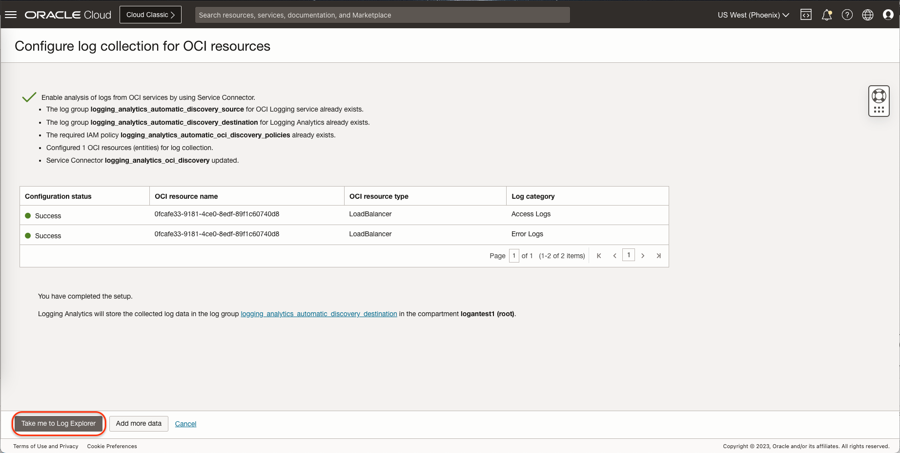

    - Log Explorer will display all the logs ingested using the **Service Connector Flow** in previous steps of this task.
        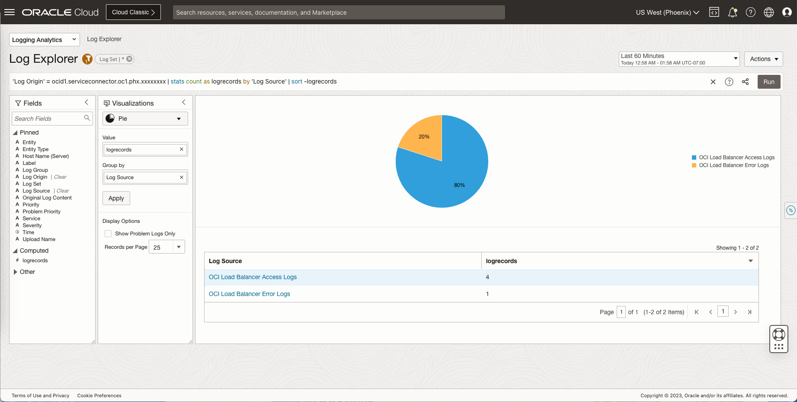


      

       

## (Reading Excercise Only) Task 5: Ingesting logs using Management Agent

> **Note** : **No action is needed from the user as this is only reading excercise.**

  This task will walk you through the steps for setting up Log collection with Management Agent. As part of this workshop the following tasks have already been done.
  
  1. Required entities have been created, entity properties have been set, and entity has been mapped with an agent which has access to the entity's logs. 
  2. Users can select a specific entity type (database)

  3. Each Log Source has one or more target entity-types. This information is used to identify and configure which logs can be collected for an entity. 

  The following gif shows the steps for setting up Log collection with Management Agent.
    
    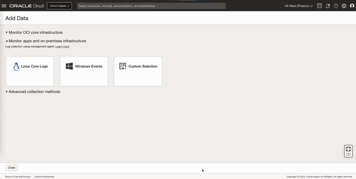


## (Reading Excercise Only) Task 6: Upload log files from your computer desktop

> **Note** : **No action is needed from the user as this is only reading excercise.**

1. Navigate to the **Add Data** page by using any one of the options in Task #3.

2. Click on the **Advanced Collection Methods**. 
      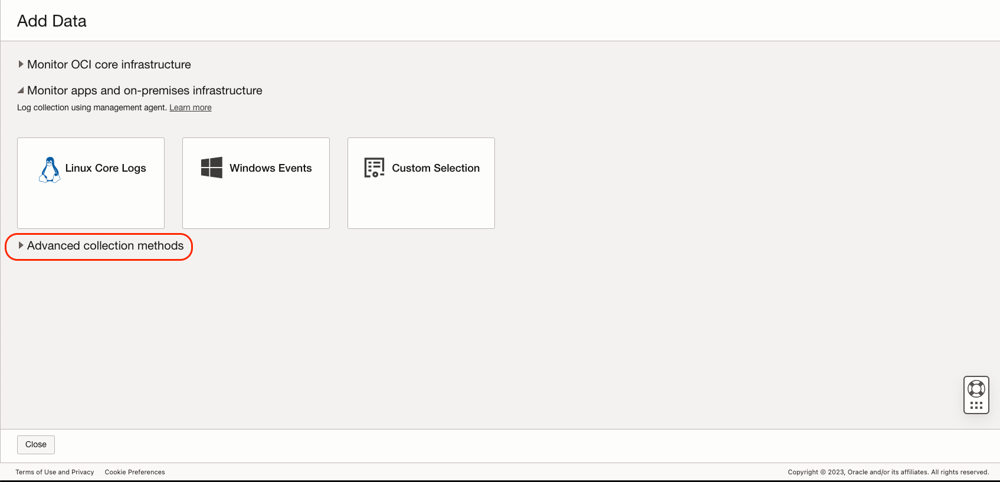  

3. A section with different Advanced Collection Methods will be displayed.  
      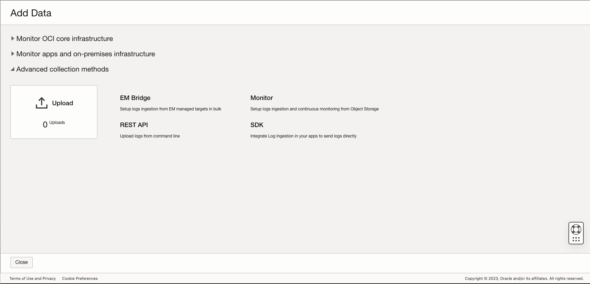 

4. Click on the Upload tile.
      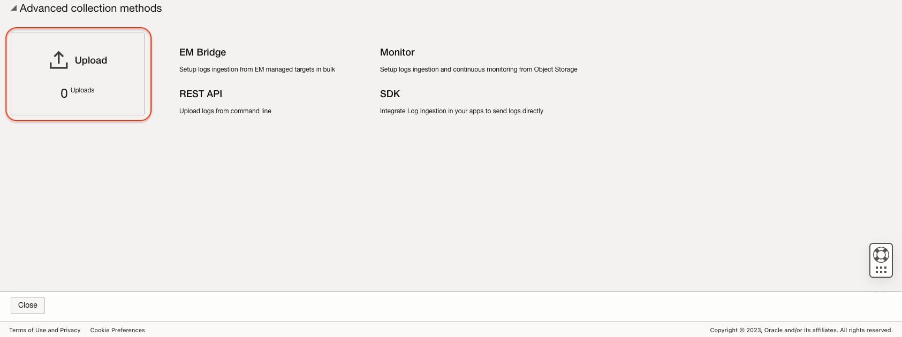

5. Upload files page will be displayed.
      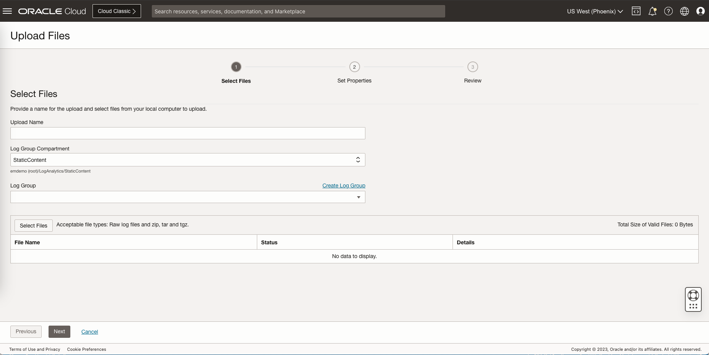

6. In the Upload Files Page, perform the following actions
    - **Upload Name** - Specify any text value.

    - **Log Group Compartment** - Select your user's Log Group Compartment from the dropdown.

    - **Log Group** - Select your user's Log Group Name in the Log Group Compartment.
     
          > **Note** : **Log Group Compartment** &  **Log Group** can be found in **View Login Info** page.

    - Click on the **Select Files** button and select the file to upload from your **Computer Desktop**.
     
          > **Note** : I have selected LinuxSyslogSource.log file from the  **Computer Desktop**.

    - Click on **Next** button. 
      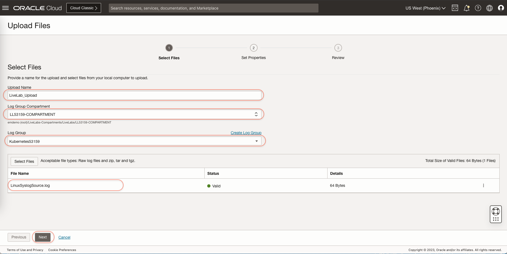
    - Set Properties page will be displayed.
      


7. Click on the **Set Properties** button. A Set Properties panel will be displayed.
      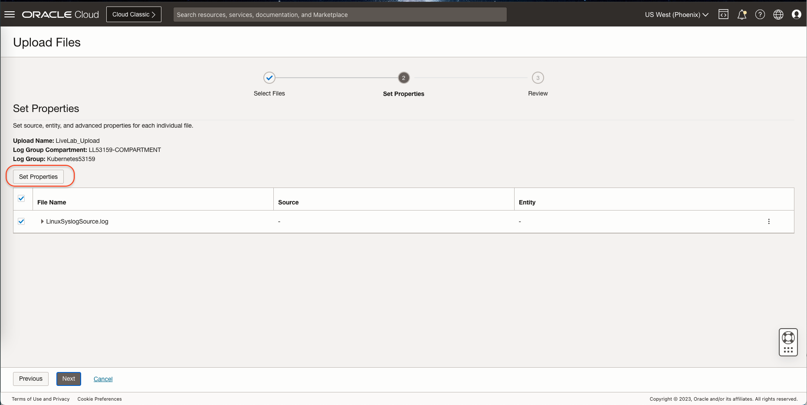

      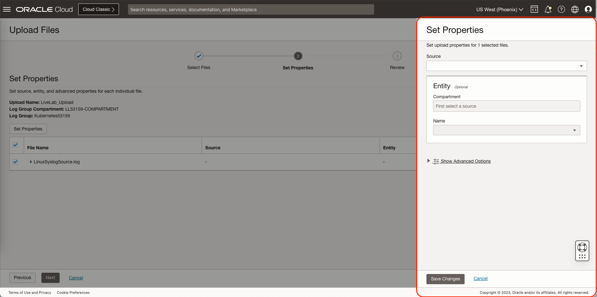

8. In the Set Properties panel, perform the following actions 
    - Select **Source**.

    - In Entity Section, select **Compartment** and **Entity Name**.

    - Click **Save Changes** button.
      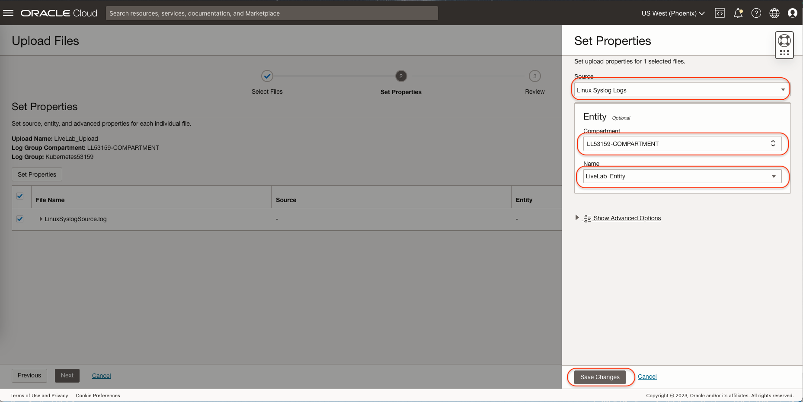
      
    - Click on **Next** button in the Set Properties page. 
      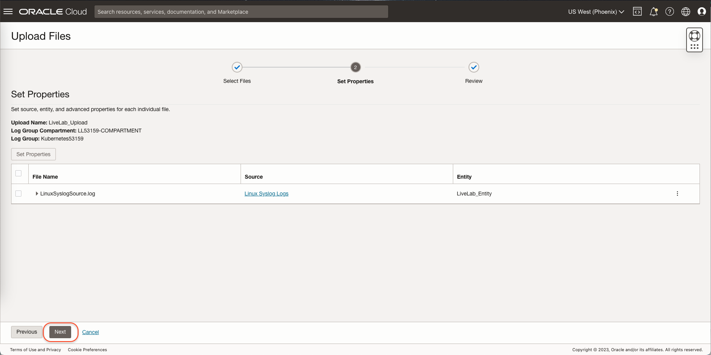

9. Review page will be displayed. Click on the **Upload** button.
      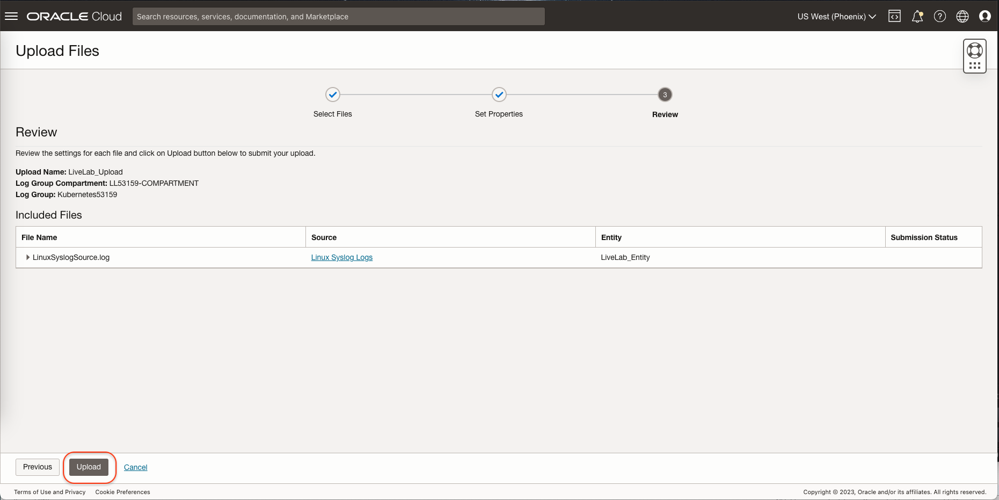

10. File(s) will be sent to processing. Click on the **Close** button.
      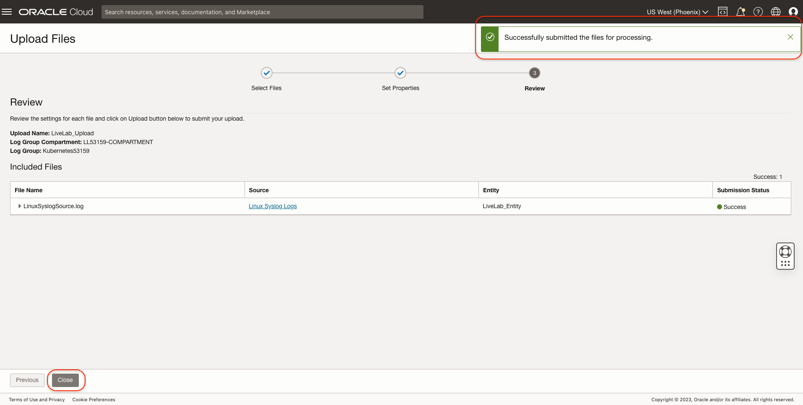

11. Uploads Information page will be displayed. Click on the **View In Log Explorer**  button.
      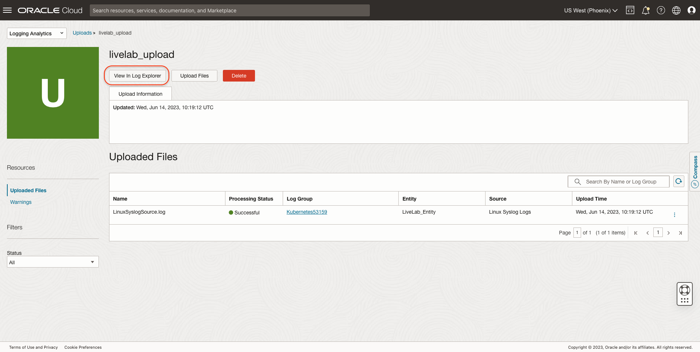 

12. Log Explorer will display all the logs collected/parsed via On-Demand Upload (ODU).  
      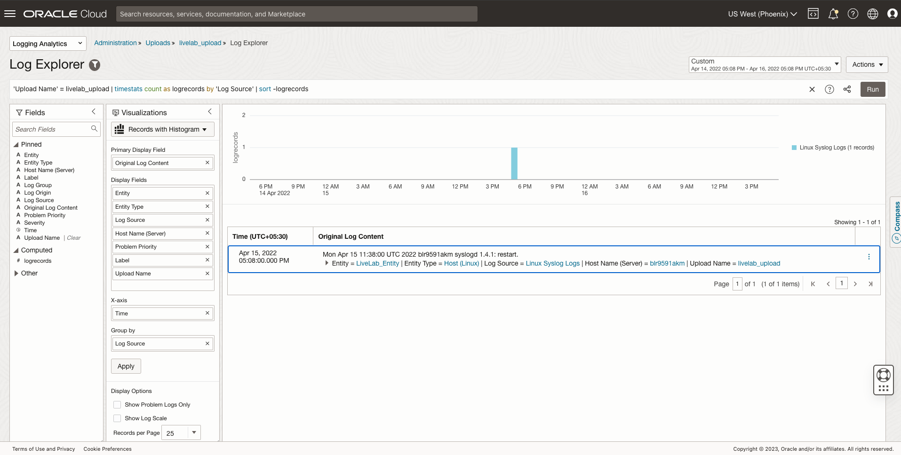  

You may now proceed to the [next lab](#next).
## Learn More
For further reading please refer to the resources.

[Configure Sources] (https://docs.oracle.com/en-us/iaas/logging-analytics/doc/configure-sources.html)

[Manage Entities] (https://docs.oracle.com/en-us/iaas/logging-analytics/doc/manage-entities.html)

[Upload Logs on Demand] (https://docs.oracle.com/en-us/iaas/logging-analytics/doc/upload-logs-demand.html)

## Acknowledgements
* **Author** - Vikram Reddy , OCI Logging Analytics
* **Contributors** -  Vikram Reddy, Santhosh Kumar Vuda , OCI Logging Analytics
* **Last Updated By/Date** - Vikram Reddy, Aug, 2023
