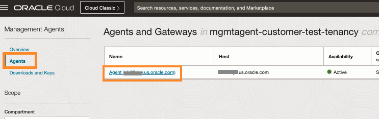
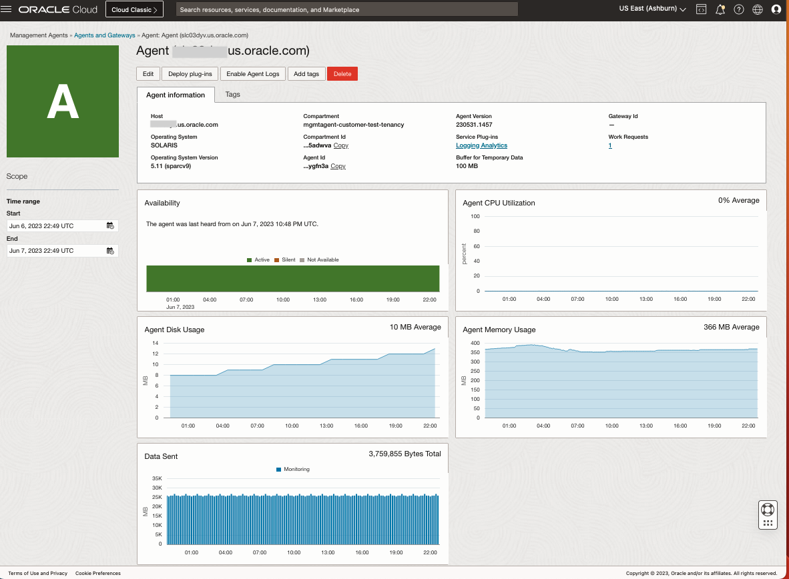

# Get Familiar with Management Agent Cloud Service UI


## Objectives

In this lab, you will get familiarized with:
* Navigating to Management Agent Service
* Generating an Install Key for use with Management Agents
* Downloading an Install Key file
* Navigating to the Agent Home Page to view its health

Estimated Time: 5 minutes

## **Task 1:**  Navigating to Management Agent Service

To navigate to Management Agent Service, follow one of the below two methods.

1. From Navigation Menu  > **Observability & Management** > **Management Agent** > **Overview**.


2. You can also copy-paste the following link in your browser's address bar to navigate to the Log Explorer.
    ```
         <copy>
            https://cloud.oracle.com/macs?region=us-ashburn-1
         </copy>   
    ```

## **Task 2:**  Generating an Install Key for use with Management Agents

Install Key is needed to register the agent with Management Agent Cloud Service.  The key lets the Management Agent Cloud Service know  how many agents are permitted to be installed.  The key can be made restritive: to allow a certain number of agents within a set number of days or can be made unrestricted (unlimited). This key is used only once by the Management Agent during the registration process. 

**Note:** The install key is only used for registration.  Once the agent is installed using a key, the agent functionality is not affected even if the install key expires.


1. **Key name** to use for the Install key.

2. **Compartment** picker to choose the compartment to use for the Management Agents.

3. **Maximum Installations** to limit the Management Agents that can be installed using this install key.

4. **Valid for** to pick the duration for which Management Agents installations will be allowed using this install key.

5. **Unlimited** checkbox to make this install key unrestricted which will allow unlimited agent installations and the install key will not expire.

## **Task 3:**  Download Install Key File
The install key that was created in Task 2 can be downloaded and provided to the agent during installation.


## **Task 4:**  Navigate to the Agent Home Page
Agent Home page will provide diagnostic and health information for the Agent

Click on the higlighted sections to navigate to the Agent Home Page


The Agent Home Page provides the availability information for the agent along with some key metrics as shown in this snapshot.


## Acknowledgements
* **Author** - Nirav Gandhi , OCI Management Agent
* **Contributors** -  Zubair Ansari, Nirav Gandhi, OCI Management Agent
* **Last Updated By/Date** - Nirav Gandhi, June 2022