# Monitor the existing Kubernetes Cluster Solution

## Introduction

In this lab, you'll use OCI Logging Analytics Solutions offering to get familiar with Kubernetes Monitoring on the existing Kubernetes cluster which has monitoring enabled.

Estimated Time: 15 minutes

### Objectives

In this lab, you will see step-by-step instructions to:

  - Navigate to the existing Kubernetes cluster on which monitoring is enabled.
  - Understanding the current state of the Kubernetes Cluster.
  - Visualizing the data in different views Cluster, Workload, Node & Pod.

    > **Note :** Please note that the screenshots provided in the live lab steps may differ from the current state of the solution. 
    Ensure you follow the instruction carefully, even if visual elements are changed.

## Task 1: Navigating to Cluster

1. To navigate to Solutions page, follow one of the below two methods.

    - Open url : https://cloud.oracle.com/loganalytics/solutions?region=us-phoenix-1&tenant=emdemo

    - From Navigation Menu > **Observability & Management** > **Logging Analytics** > **Solutions**.
    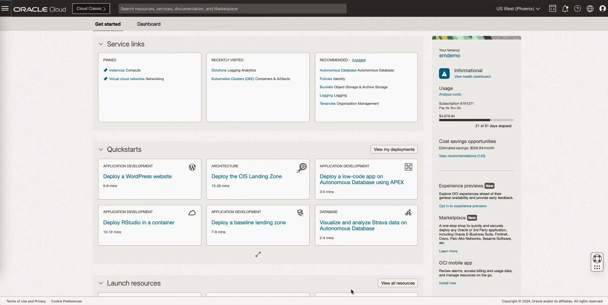

2. Click on the Kubernetes tile.
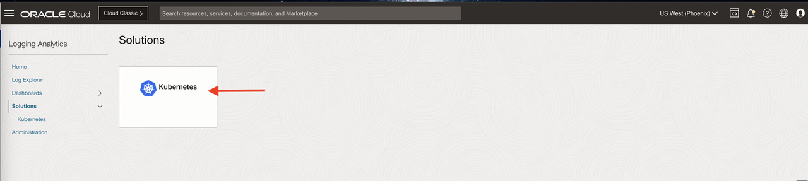

3. Kubernetes Monitoring Solution page is displayed. You will see two clusters -

    - ***education-eks-rQNmdNI7*** : An AWS EKS cluster. We support multi-cloud Kubernetes clusters to monitor their logs.
    - ***oke-cw24*** : An OCI OKE Cluster.
    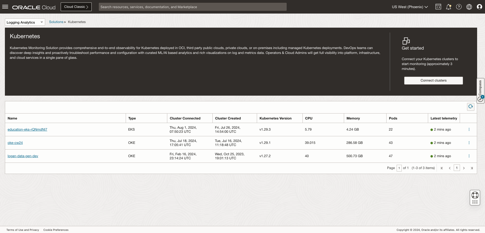

4. In the Kubernetes Monitoring Solution page, click the ***oke-cw24*** cluster.

5. The Cluster view of the ***oke-cw24*** cluster will be displayed.

6. The cluster view has the following important sections :

    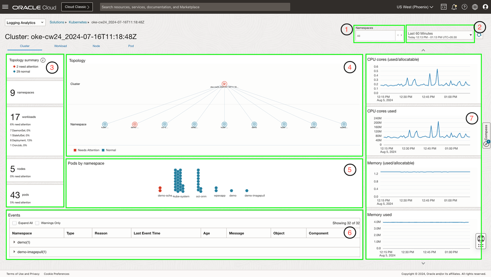

    1. ***Namespaces*** Filter to filter the cluster view by Kubernetes namespaces.
    2. ***Time selector***  has two time range options, Last 60 Minutes (default) and Last 24 Hours. Any changes you make in the time range will impact the Events and Metrics Widget.
    3. ***Summary Panel***  shows the current state of the Kubernetes Objects (namespace, workloads, nodes, pods) & topology summary.
    4. ***Topology*** the objects data collected from the Kubernetes cluster is displayed in this section. The color of each object in the topology indicates its status derived from active warning events associated with the object or its children.
    5. ***Pods by namespace*** all the pods available in the Kubernetes cluster. 
    6. ***Events Panel*** displays the State changes occurring in Kubernetes Cluster in the form of Events.
    7. ***Telemetry Panel***  help you to monitor the health of the system.

## Task 2: Understanding the Cluster View

### **Task 2.1 : Understand the data presented in Summary panel** ###

1. **Prerequisite** : Change time range to 24 hours in time selector at top right corner.

2. Understand when was the topology updated. 
   
    - In Cluster view, observe the first tile in left panel, hover over info icon to see the time when topology was last updated.
    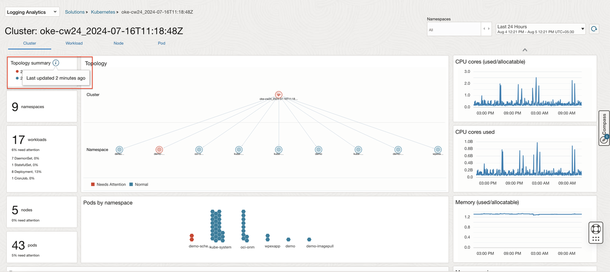

3. Understand how many namespaces, workloads, nodes, and pods are in the cluster.
  
    - Observe second tile in left summary panel, it displays the number of namespaces in kubernetes cluster. You can check all namespaces in cluster by reviewing the topology view Namespace tier.
    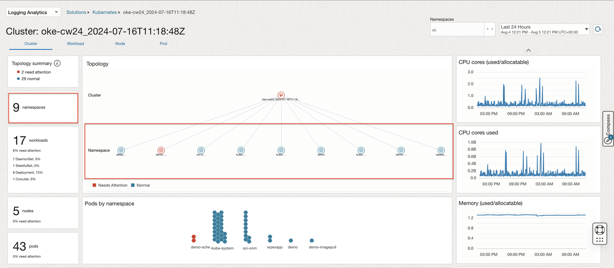
    - Third tile shows total number of workloads with the overall percentage of workloads which needs attention. You can also see the breakdown of workload types & percentage of workload type that needs attention.
    Objects with associated warning events are flagged as Needs Attention.
    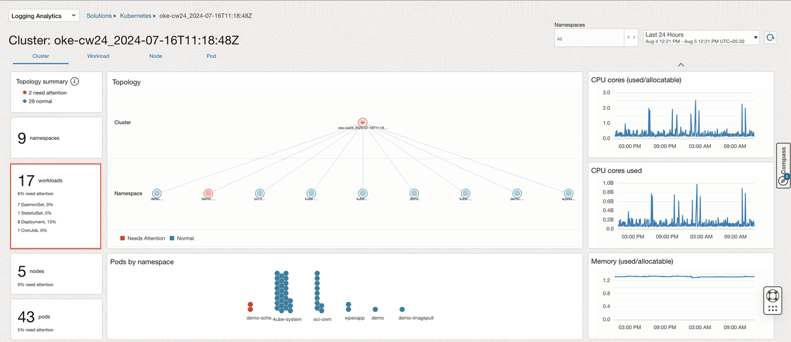
    - Fourth tile shows the number of Nodes along with percentage of nodes that needs attention due to warning events.
    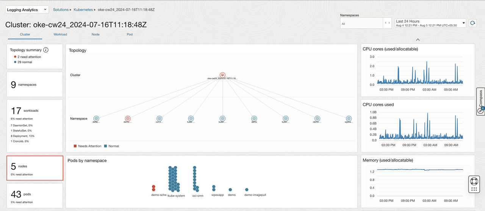
    - Last tile in left panel shows number of Pods along with percentage of problem pods which needs attention.
    - All pods grouped by namespace are displayed in *Pods by namespace* section. This section shows only the namespaces that contain pods, which could be fewer than those shown in left summary panel namespaces tile.
    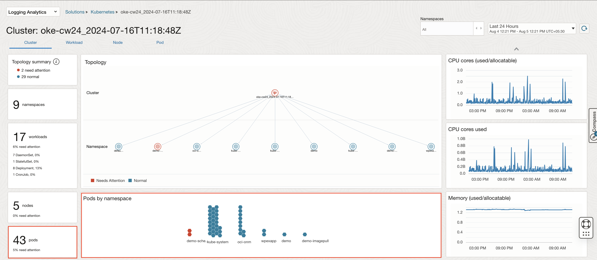

4. Understand how many objects need attention in cluster.
    
    - Topology Summary tile displays count of kubernetes objects in blue which are healthy and red for those objects which needs attention due to any active warning event.
    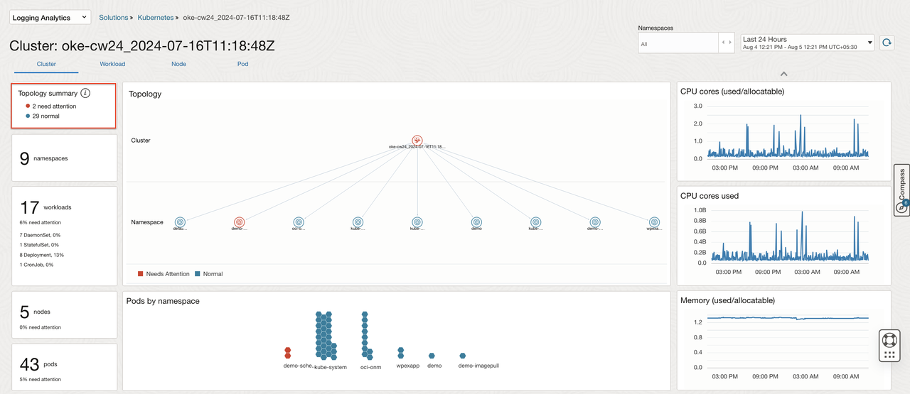
    - Topology chart shows nodes in red which Needs Attention. The red colour of each object in the topology indicates its status derived from warning events associated with the object or it's children.
    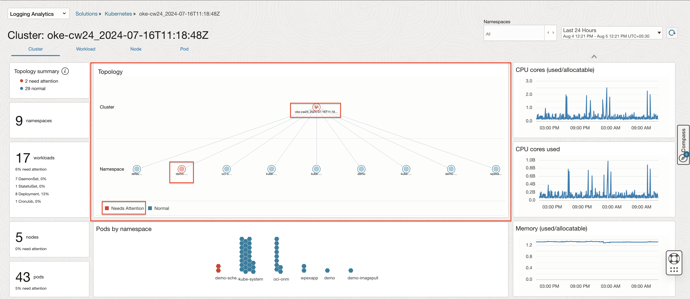
    - In Pods by namespace section, review all the red coloured polygons representing problem pods grouped by namespace.
    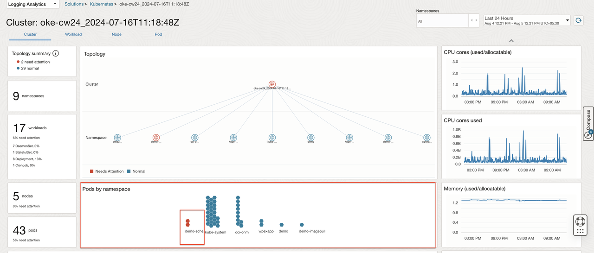

### **Task 2.2:  View and compare metrics** ###

1. Review metrics for the entire cluster (Ensure no filter selection).

    - Observe the right panel telemetry widgets, these widgets help you to monitor the overall health of the system.
    
    - View *CPU cores (used/allocatable)* widget. This widget displays chart for Total CPU cores used by selected pods divided by total allocatable CPU in the cluster.
    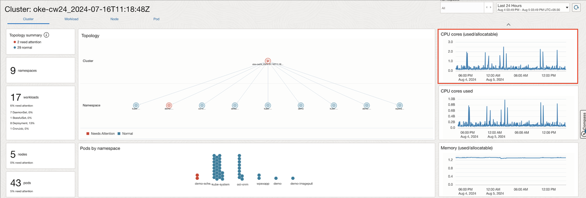
    - There are total 17 metrics widgets available in cluster view. For details of metrics widgets refer [here](https://docs.oracle.com/en-us/iaas/logging-analytics/doc/kubernetes-solution.html).

2.  Use scroll up and down to see different telemetry widgets.

    - To view all metrics widgets available in cluster, use arrow above first widget to move up and arrow below fourth widget to move down.
    
    - **Exercise** : Scroll up/down telemetry widgets panel and view all metrics widgets in cluster view.

3. Expand ***CPU cores (used/allocatable)*** metric widget.

    - You can expand each widget to view a larger visualization. Hover the over first widget - 
    *CPU core (used/allocatable)* and click on expand icon on top right corner.
    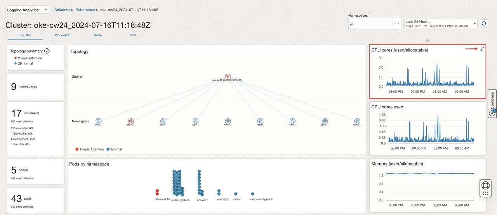
    - In expanded widget, hover over the chart to see metrics details.
    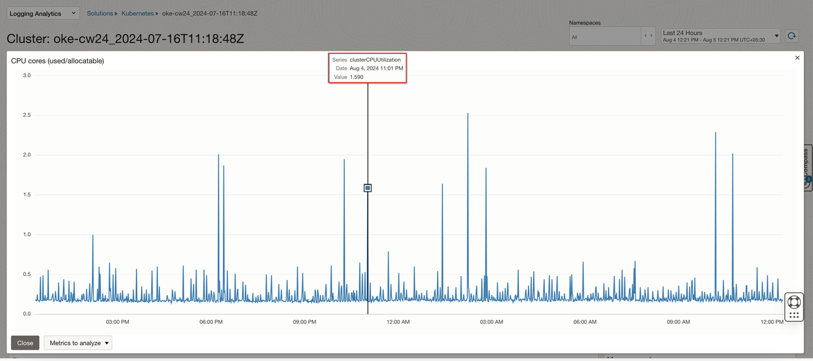

4. Add two metric widgets to compare.

    - In expanded widget, hit Metrics to analyze to open list of all metrics available for comparison with current metrics widget chart.
    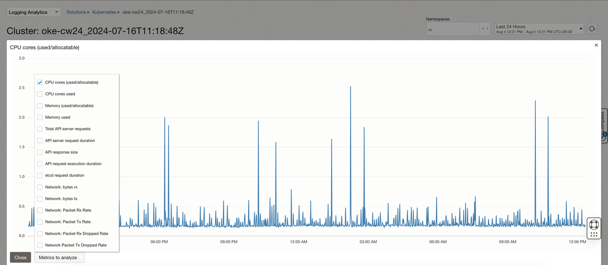
    - Select any widget for analysis. e.g. - *CPU cores used*
    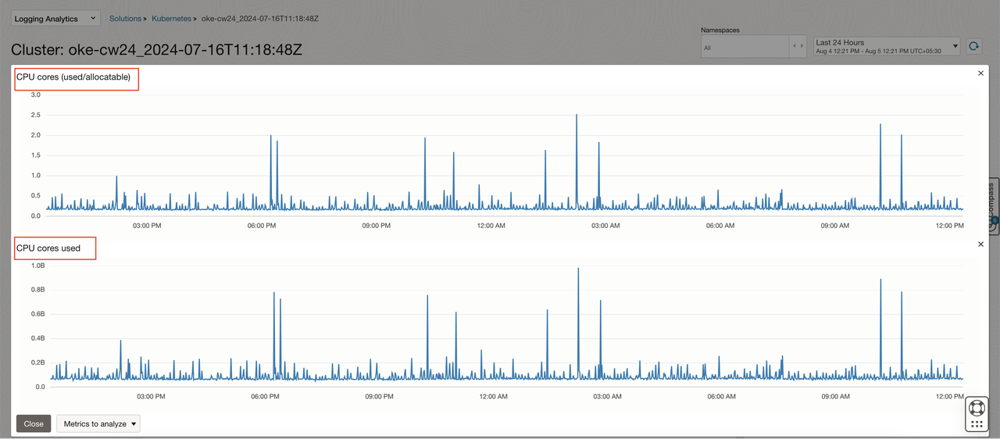
    **Note** - Maximum three metrics can be used for comparison at a time.

    - Hit Close button to close the widget.

    - **Exercise**  - Try selecting different metrics and compare.

### **Task 2.3: View Kubernetes system logs** ###

This widget helps you to monitor the trend and distribution of potential issues in Kubernetes component logs (API Server, Controller Manager, CSI Node Driver).

1. **Prerequisite** :  Change time range to 60 min in time selector at top right corner.

2. Expand ***Kubernetes system*** widget.

    - In right panel widget scroll down to view *Kubernetes system* widget, expand this widget.
    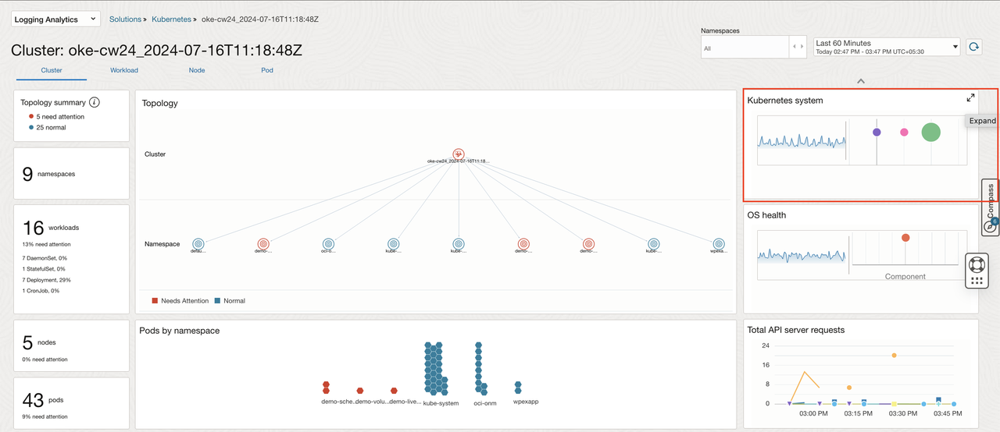

3. Review Issue trend and potential issues charts.

    - Observe All Issues section showing Issue trend chart. This time series chart gives count of Issues detected over given time interval. Hover over data points for details.
    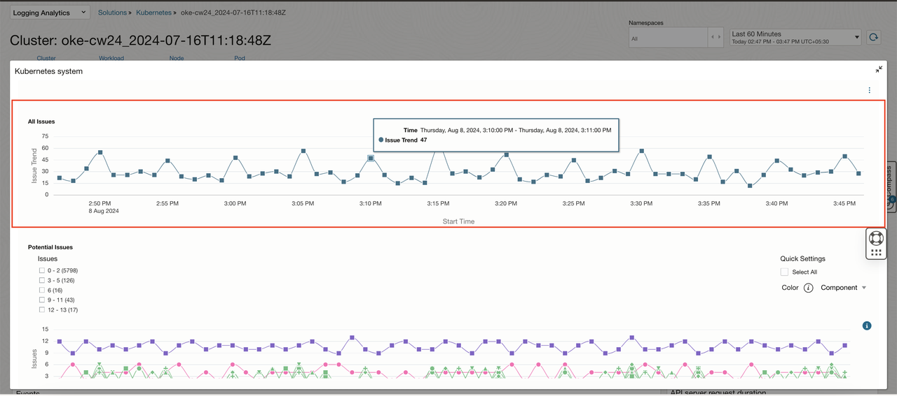
    - Check Potential Issues chart to view Issues count grouped by kubernetes components & error. Hover over different colored data points to view details of components with corresponding error.
    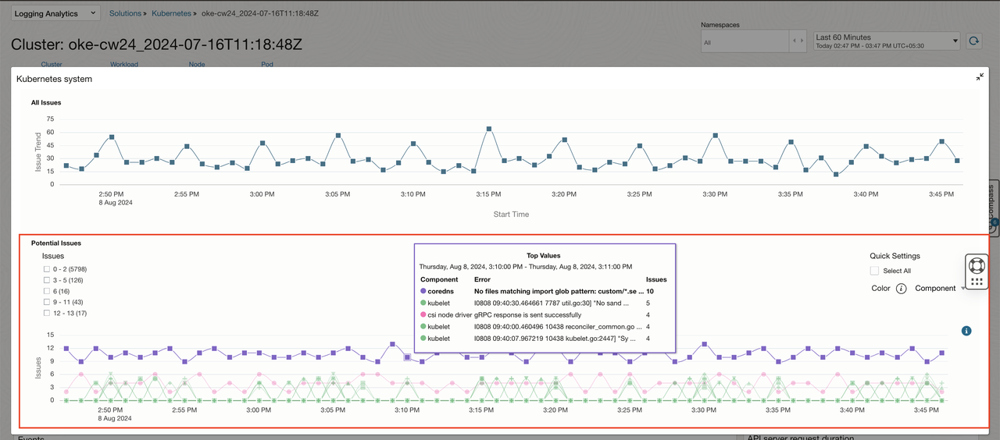

4. Review issues table to see kubernetes component logs. 

    - Move down to view logs table. Check the log records for Error samples and Issue count for different components.
    
    - Collapse widget by clicking collapse icon on top right corner.

### **Task 2.4: View OS health logs** ###

This widget helps you to monitor the trend and distribution of potential issues identified in compute OS logs.

1. Expand ***OS health*** widget.

    - In right telemetry widget panel scroll down to view *OS health* widget, expand it.
    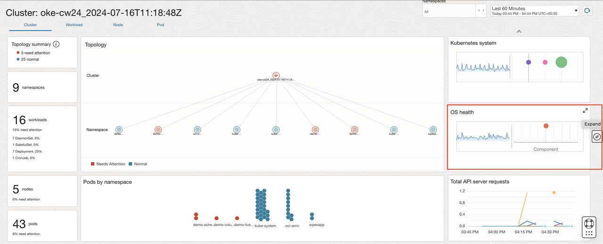

2. Review trend of issues and specific issues.

    - Observe All Issues section showing Issue trend chart. This time series chart gives count of Issues detected over given time interval. Hover over data points for details.
    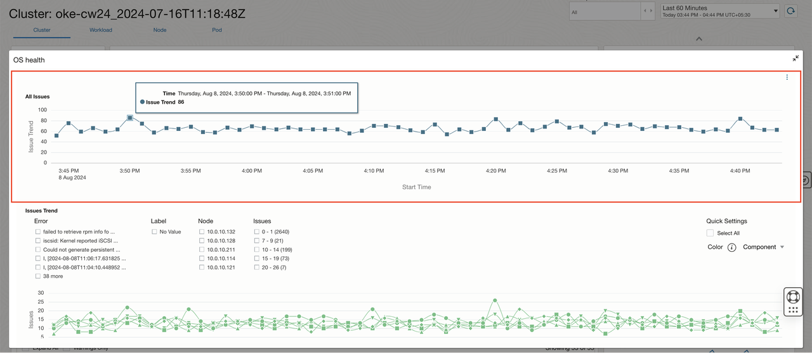
    - Check Issues chart to view Issues count grouped by kubernetes component, Node, Issues count, Label & Error. Hover over the data points to get potential issue details.
    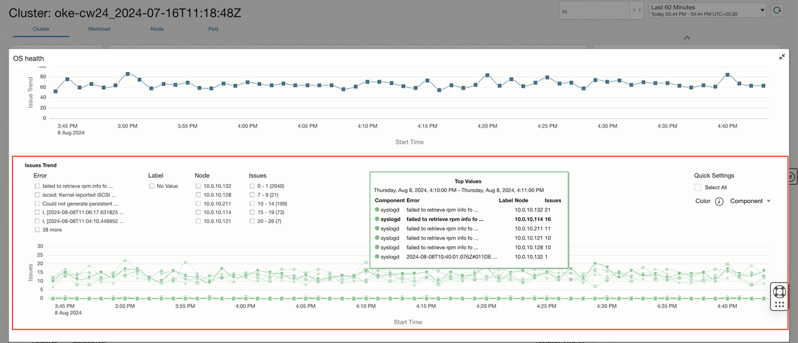
    - Move down to view logs table. Check the Cluster sample column records for list of issues and see related details about node, count etc in different columns.
    
    - Collapse OS health expanded widget.

### **Task 2.5: Review latest kubernetes events** ###

Events section displays the State changes occurring in Kubernetes Cluster in the form of Events.

1. Expand Events panel.

    - Hover over top right corner of Events panel to view Expand icon. Click on it, widget will expand.
    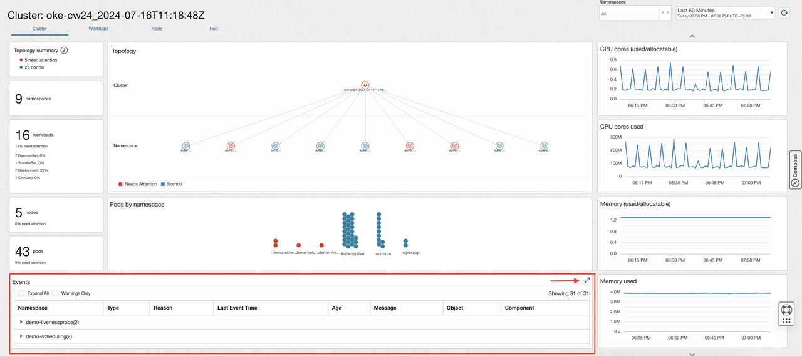
    - Events grouped by namespace are listed.
    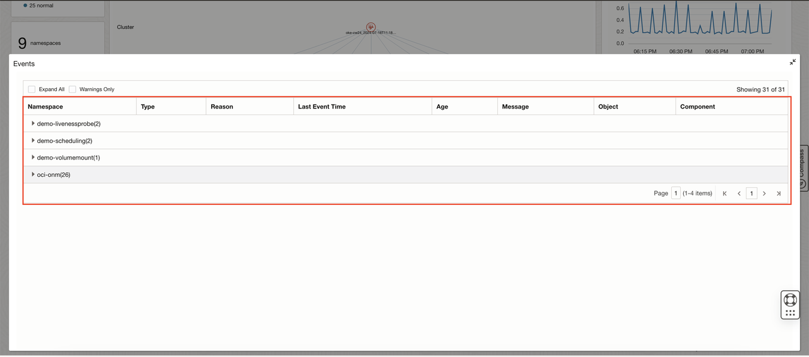

2. "Expand All" in Events.

    - Check the Expand All checkbox to expand all event entries grouped by namespace.
    - View details of each event entry shown in columns. Move through pages in table to view all entries.
    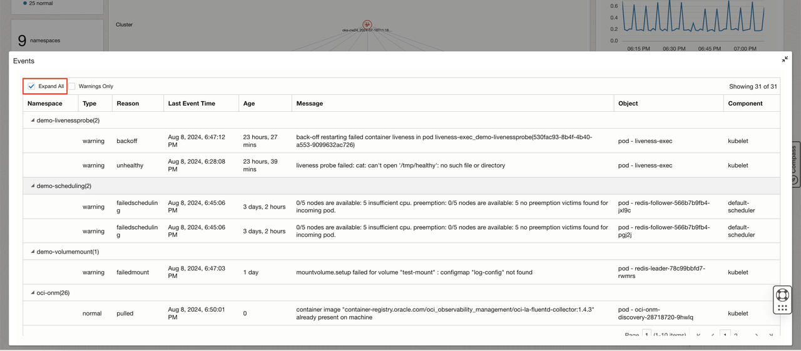

3. Filter Warning events only.

    - Check the Warnings Only checkbox to filter out all warning events.
    - Warning events entries are listed.Type column shows warning. Review more details of this event in other columns.
    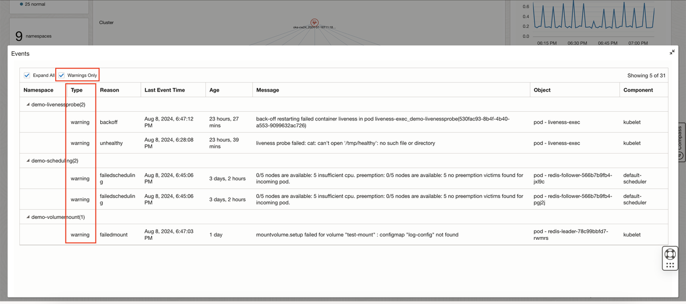

4. Close the Events panel by clicking collapse icon on top right corner of panel.

### **Task 2.6: Understand kubernetes cluster namespace and pods topology** ###

1. Filter ***wpexapp*** namespace from topology to see workloads, nodes and pods for this namespace.

    - In Topology diagram, in Namespace tier search for node with name - *wpexapp* and right click on it.
    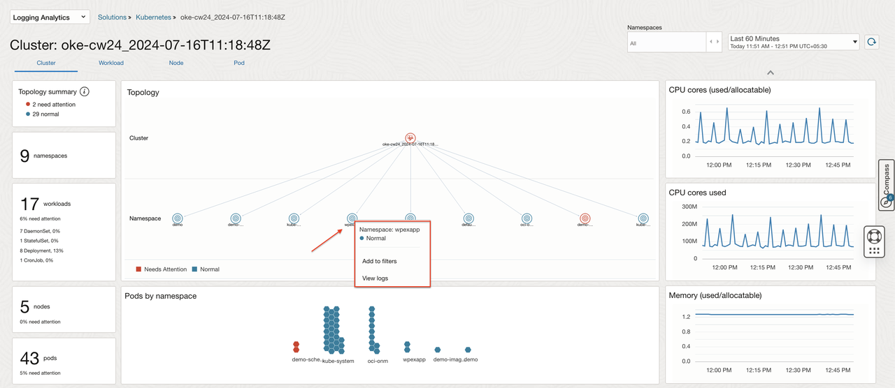
    - Hit Add to filters option, *wpexapp* will be added to Namespace filter in top right corner. Observe the topology view reflecting changes in objects in the namespace which includes workloads and nodes.
    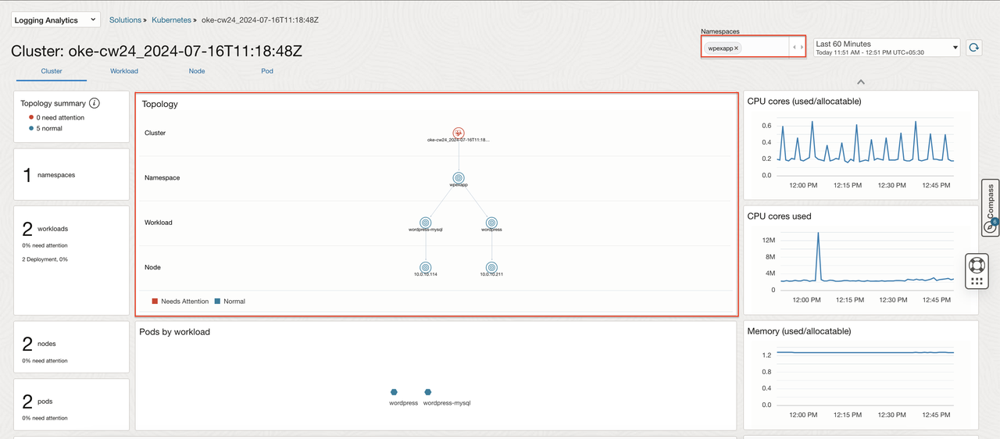
    - Notice Left panel tiles showing object counts corresponding to filtered namespace.
    Also, Pods by namespace section is now changed to Pods by workload section and it shows pods grouped by workloads under filtered namespace - *wpexapp*.
    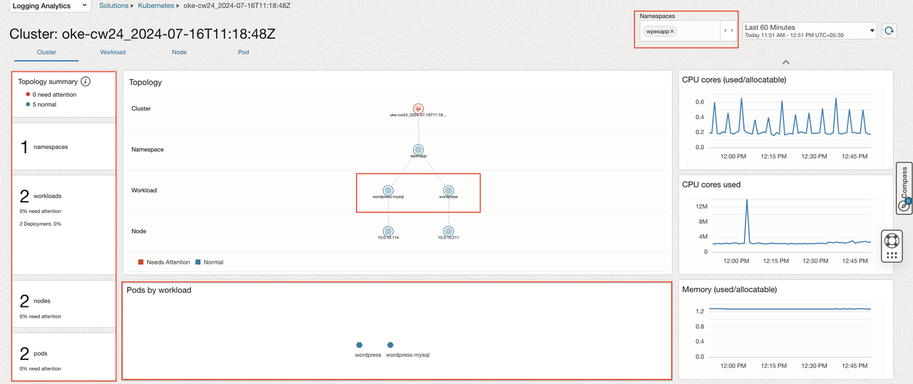

2. Observe changes in telemetry panel and compare metrics.

    - Move to *CPU cores used* widget in telemetry panel, after applying namespace filter observe the changes in metrics chart.
    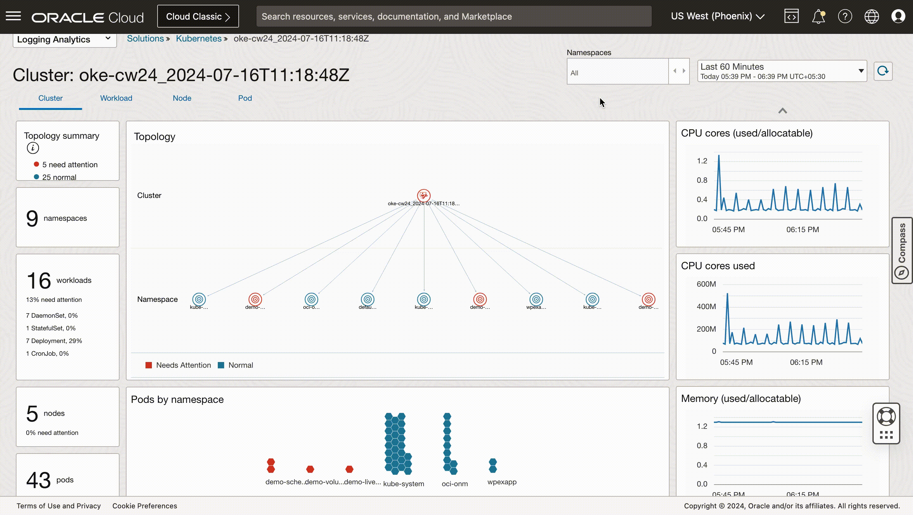
    - **Exercise** : Observe metrics charts changes on applying namespace filter for widgets - CPU cores used, Memory used, Network: bytes rx, Network: bytes tx, Network: Packet Rx Rate, Network: Packet Tx Rate, Network Packet Rx Dropped Rate, Network Packet Tx Dropped Rate.

3. View logs for different topology nodes including pods.

    - **Prerequisite** : Update time range to 24 hours and retain the ***wpexapp*** namespace in namespace filter.

    - View logs for cluster node in topology.
        
        - In topology right click on main cluster node and hit View logs on context menu.
        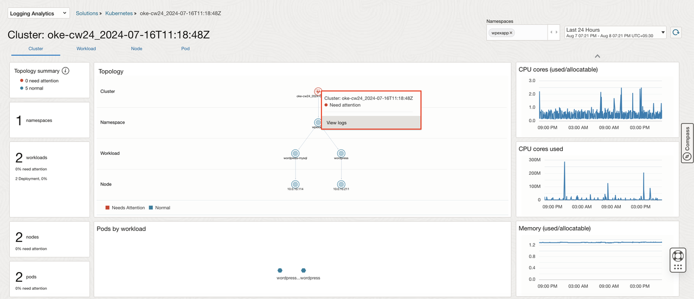
        - A Visualization pops up which helps identifying New issues in logs in the selected time range, at cluster level.
        - These are the issues found in the selected time range but are not present in the baseline time range specified for the analysis(last 12 hours). Hover info icon for more details.
        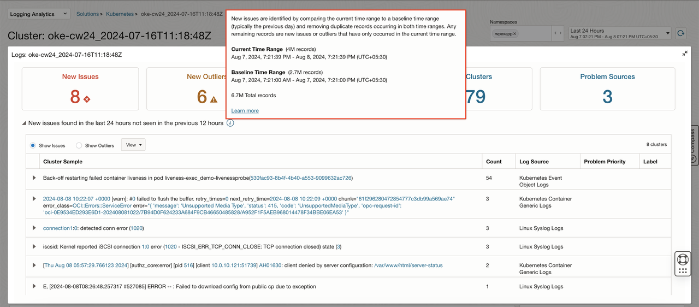
        - This view also shows New Outliers found in the selected set of logs. Outliers are the log records that occurred only once in the current range and not occurred in the baseline. An outlier may or may not be an issue. This visualization summarizes the number of log records used in the analysis, total number of unique log clusters identified, and the number of log sources in which issues were detected.
        - Review errors in table records and corresponding details of log sources, issue counts and others in different columns.
        By default, the Show Issues option is selected for the table. You may select Show Outliers to view the details of the outliers.
        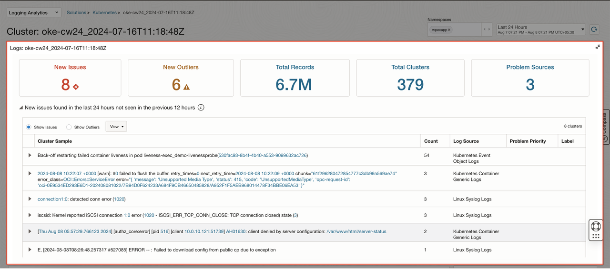
       
        - Collapse this logs panel using collapse icon at top right corner.
            

    - View logs for ***wpexapp*** namespace node in topology.

        - In topology view Namespace tier right click on *wpexapp* and hit View logs on context menu.
        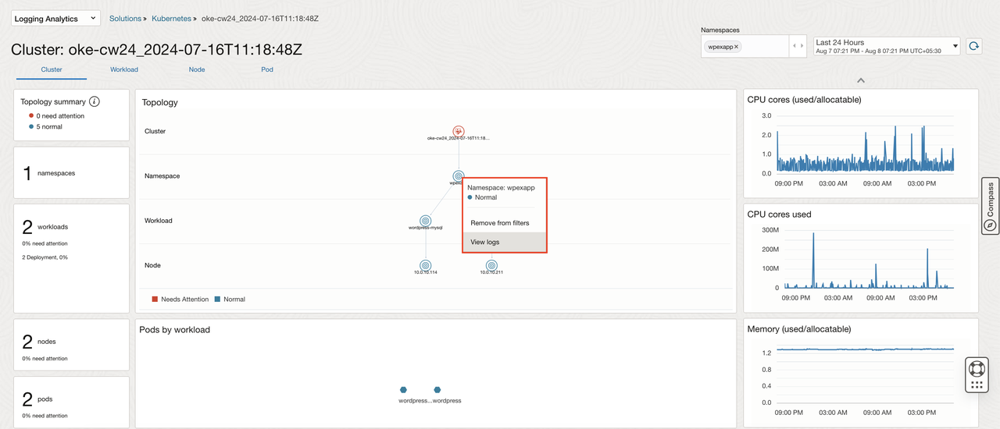
        - A panel pops up which helps identifying new issues under *wpexapp* namespace in the selected time range. Review errors in records and corresponding details of log sources, issue counts and others in different columns.
        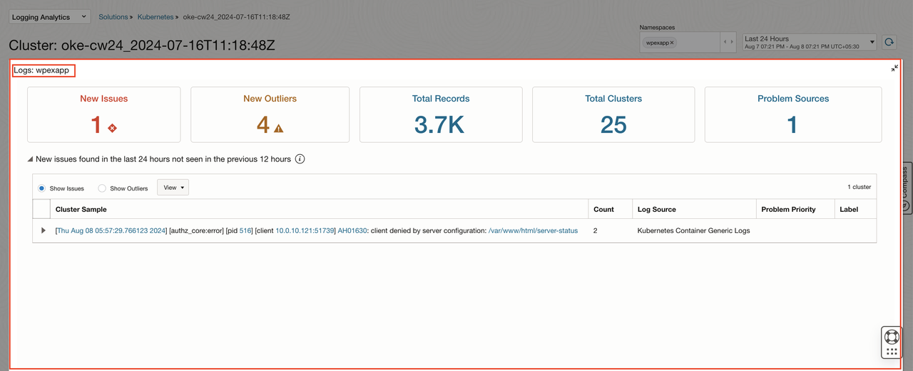
        - Collapse this logs panel using collapse icon at top right corner.

    - View logs for a workload in ***wpexapp*** namespace.

        -  In topology in Workload tier right click on any workload and hit View logs on context menu.
        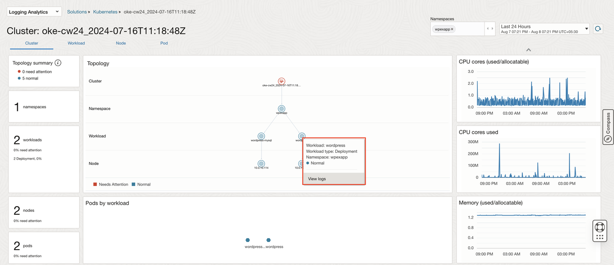
        - A panel pops up which helps identifying new issues for this workload under *wpexapp* namespace in the selected time range. Review issues in Cluster Sample column and other columns to view details of error log sources, issue counts, etc.
        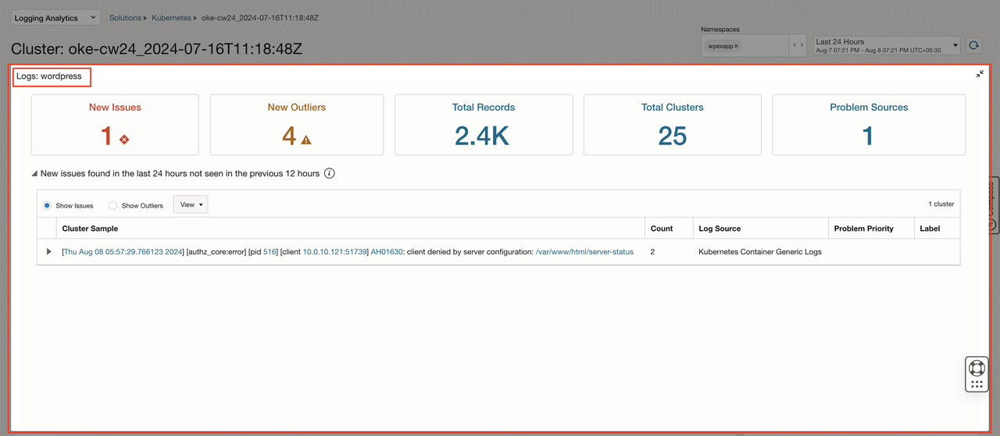
        - Collapse this panel.
        

    - View logs for a Node in ***wpexapp*** namespace.

        - In topology in Node tier right click on any Node and hit View logs on context menu.
        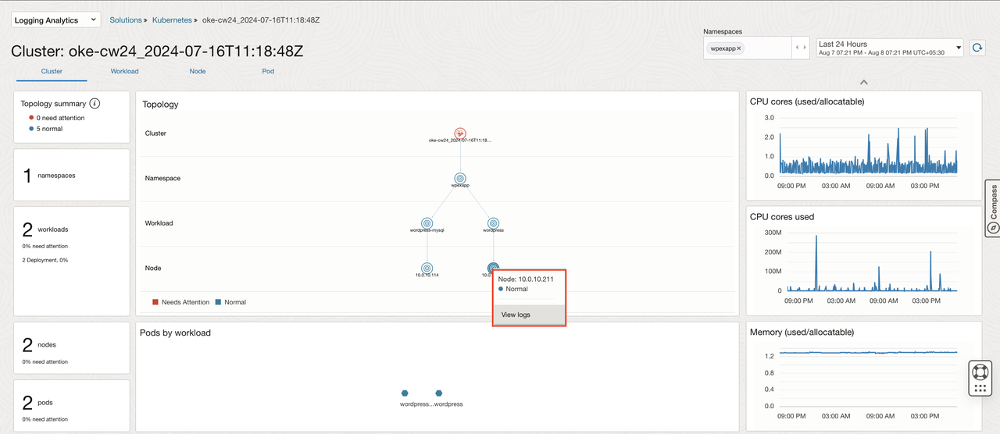
        - A panel pops up which helps identifying new issues for this Node under *wpexapp* namespace in the selected time range. Review table records for issue details.
        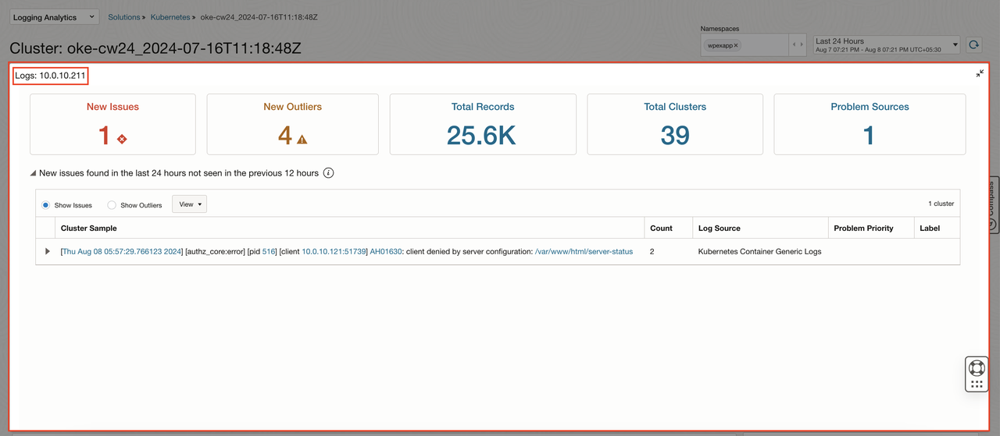
        - Collapse this panel.

    - View logs for pods from Pods by workload section.

        - In Pods by workload section right click on any pod polygon and hit View logs on context menu.
        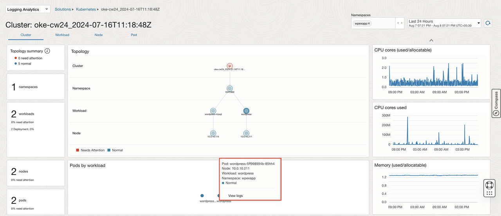
        - A panel pops up which helps identifying new issues for this pod in *wpexapp* namespace in the selected time range. Review table records for issue details.
        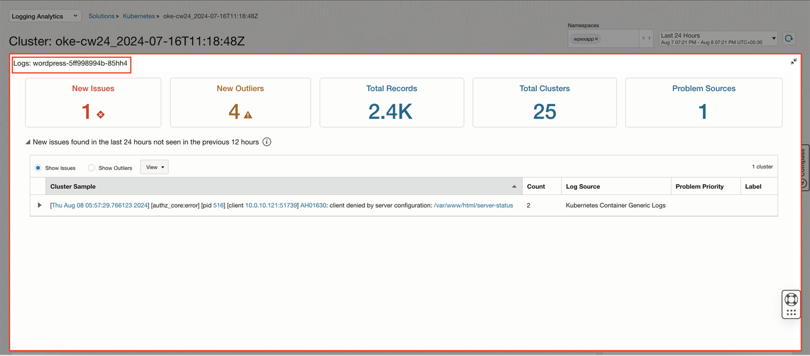
        - Collapse this panel.

    - **Exercise** : View logs all other workloads, nodes and pods.

## Task 3: Understand Workload, Node, Pod View - which workload types, applications are running in "wpexapp"

### **Task 3.1: Understand Workload View** ###

1. **Prerequisite** : Retain the ***wpexapp*** namespace in namespace filter from cluster view & change time range to 60 min.

2. Understand Workload tab details with ***wpexapp*** Namespace filter only.
    
    - Click on the Workload tab.
    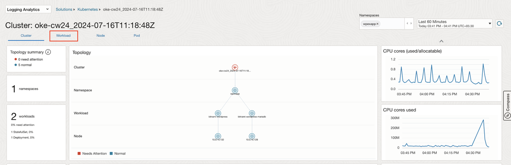

    - The workload view in the context of the filtered namespace *wpexapp* is displayed.

    - Observe in the Workload view Topology panel is replaced by Workload details table & Topology summary by Workload summary, other sections remains same as cluster view.
     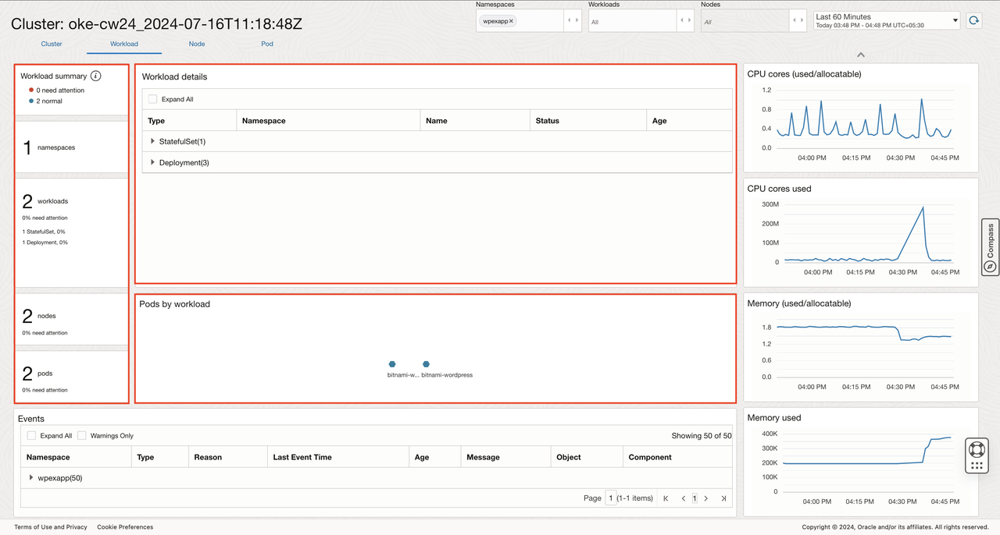

    - Notice left summary panel is updated and each tile will show details specific to the namespace *wpexapp*.

    - Workload summary tile shows health of all workloads under namespace *wpexapp*.

    - Observe Workloads details panel, all the workloads running in the namespace *wpexapp* are listed grouped by workload types. Click on the Expand All checkbox, to view important details of filtered workload such as Namespace, Name, Status and Age. 
    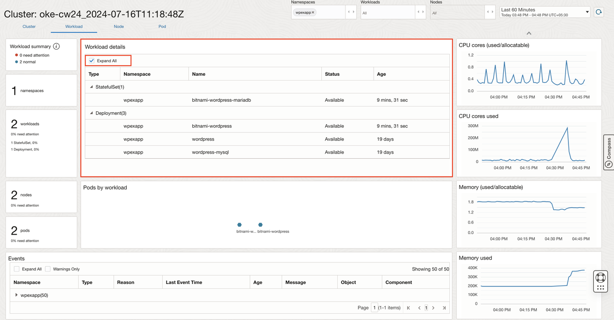

    - Pods by workloads will show all the pods grouped by all workloads in the namespace *wpexapp*.

    - Telemetry Panel will show the data now in the context of the namespace *wpexapp*. Use the arrows above first & below the fourth widget to view all the widgets.

    - Events section will now show all events logged under *wpexapp* namespace. If no events visible for last 60 minutes, try adjusting the time range to 24 hrs.
      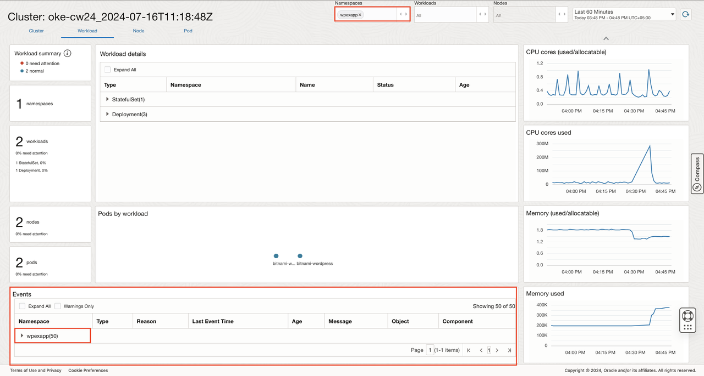

### **Task 3.2: Incrementally add workloads (running in "wpexapp") to workload filter and nodes to nodes filter in workload tab.** ###
    
1.  Add a workload running in ***wpexapp*** to Workload filter.

    - Click on the Workloads filter.
    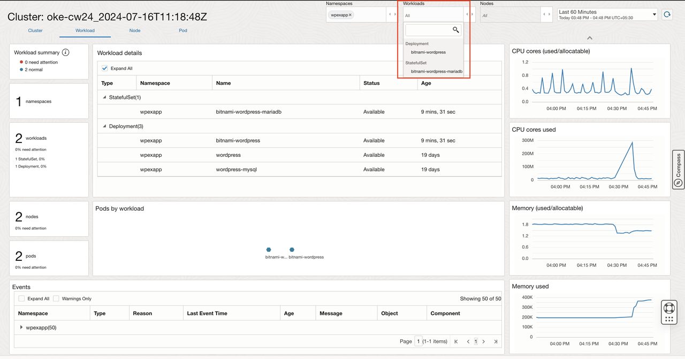
    
    - Select a workload from the list.
     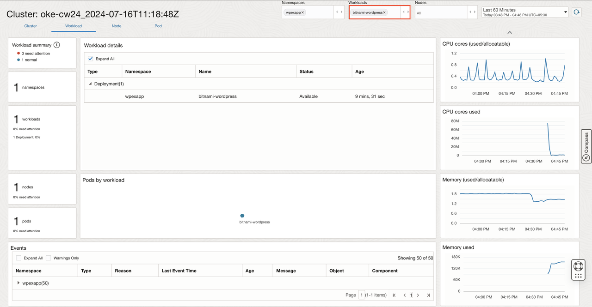

2.  Add a node running in ***wpexapp*** to Node filter.

    - Click on the Node filter, node associated with filtered workload will be listed. 
      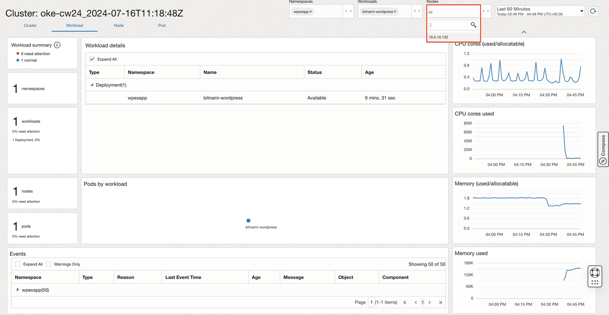 

    - Select a Node IP from the list.
      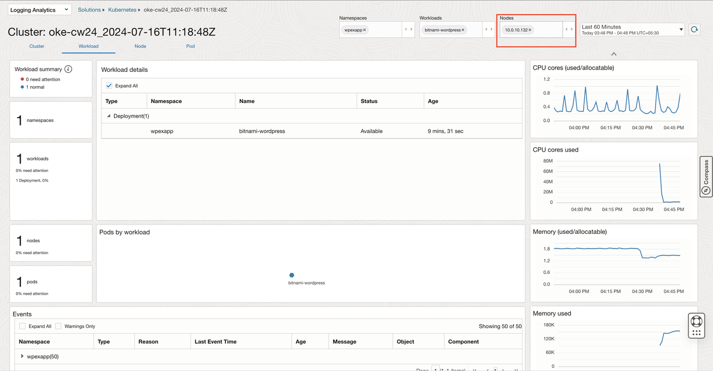

### **Task 3.3: Check Workload details and status in Workload Tab** ###

1.  Understand Workload tab details with all Namespace and Workload filter applied.

    - Observe left summary panel tiles updated as per applied namespace, workload & node filter.

    - Observe Workloads details table, filtered workload running in the namespace *wpexapp* is listed grouped by workload type. 

    - Click on the Expand All checkbox, to view important details of filtered workload such as Namespace, Name, Status and Age.
    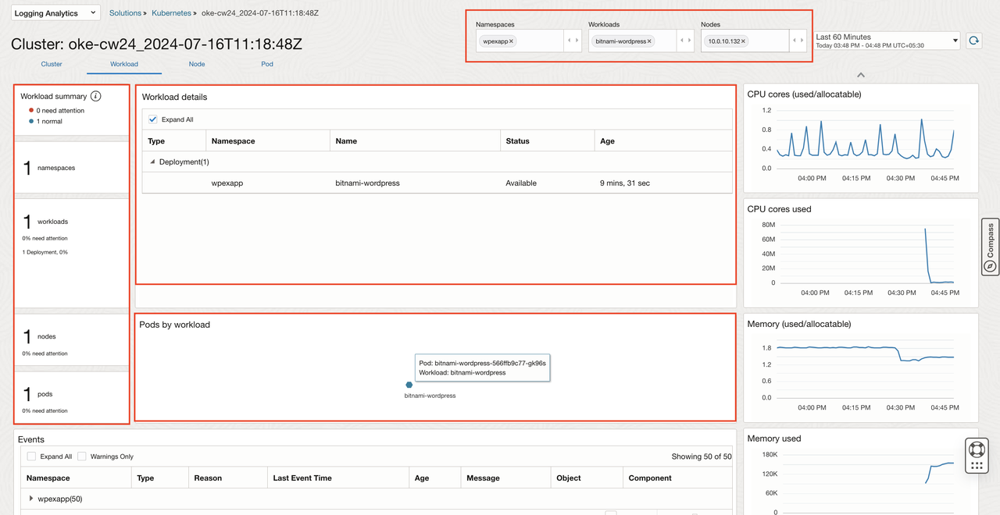
    
    - Pods by workload section now shows pods associated with filtered workload.
    
    - Observe changes in Metric widgets in telemetry panel on applying workload filter. Use the arrows in widget panel to view all the widgets.

    - Events section will show events as per filtered namespace.

### **Task 3.4: Understand Node View - Check Node health and status in Node Tab** ###

1. Understand Node tab details with Namespace, Workload and Node filters applied.

    - Click on the Node tab. 
      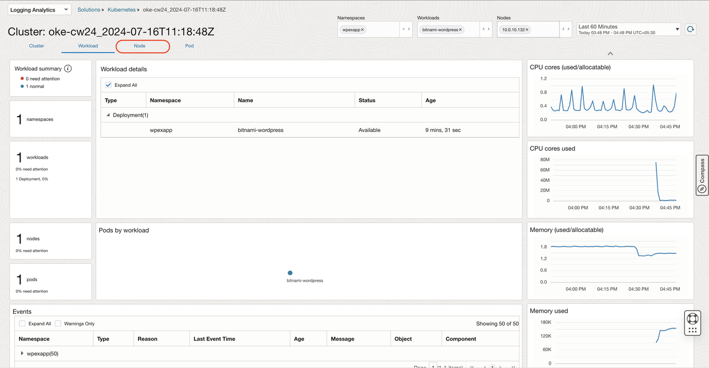

    - The Node view in the context of the filtered namespace, workload & node will be displayed.

    - In the Node view, Workload details panel is replaced by Node status panel, Pods by workload section is replaced by Pods by node & Workload summary by Node summary.

    - The Node status table shows all the nodes in which the filtered workload is running. By default Show All radio button is selected.
    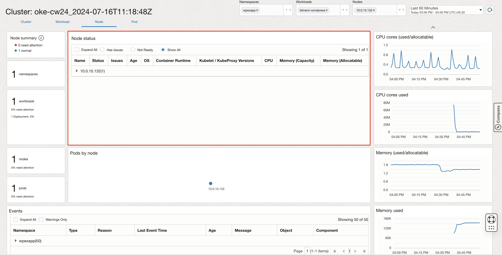

    - In the Node status section, click on the Expand All checkbox to view the important details of filtered node such as Status, OS details, CPU, Memory details etc in different columns of table. You may click on expand icon of node IP in table row to expand node details.
    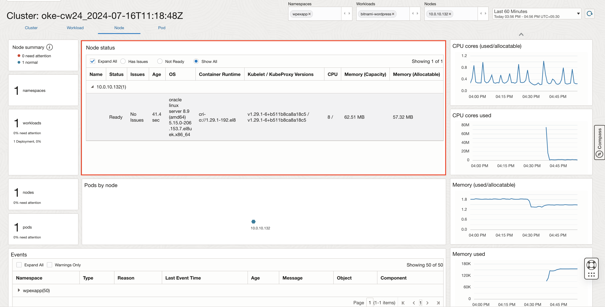

    - You may filter out nodes based on status - *Not Ready* and *Has Issues* by selecting given radio buttons.
    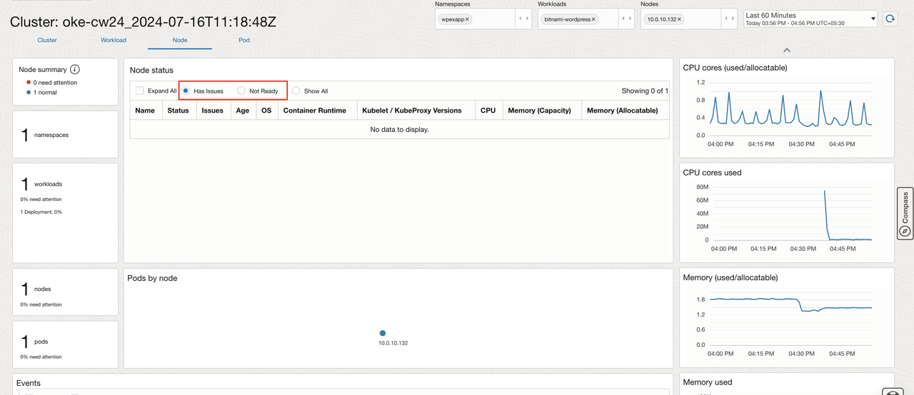

    - Pods by node section shows the pods running in the filtered node.
    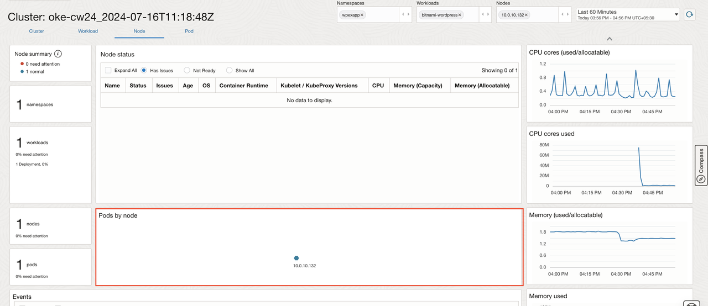

    - Observe the changes in telemetry panel on applying filter on node.

    - The Node summary tile shows node health.

    - Events section & all other tiles in summary panel remains same.

    - **Exercise** : Filter the nodes based on different status in Node status table. 

### **Task 3.5: Understand Pod View - Check Pod details and health in Pod Tab** ###

1. Understand Pod tab details with Namespace, Workload and Node filters applied.

    - Click on the Pod tab.
    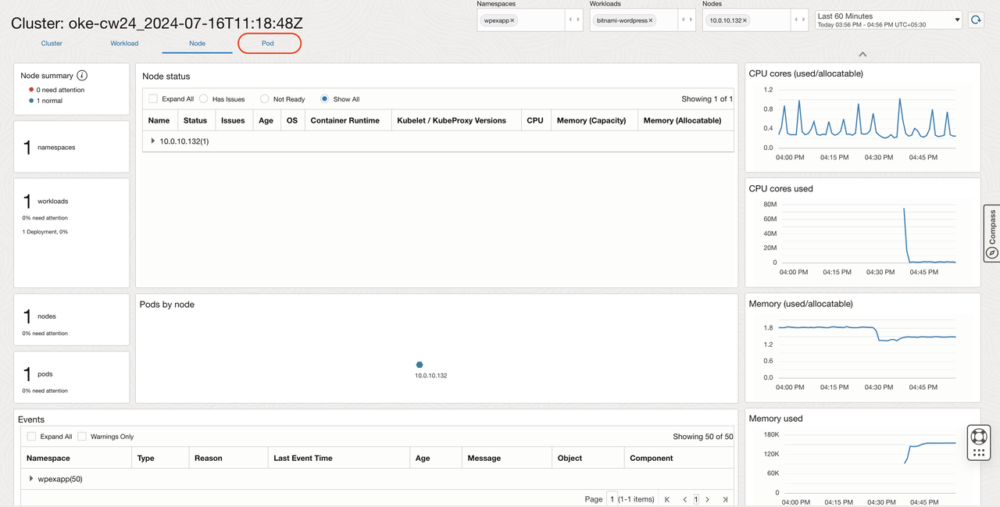

    - The Pod view in the context of the filtered namespace, workload & node will be displayed.
    
    - In the Pod view, Node status panel is replaced by Pods status panel, Pods by node section is replaced by Pods &  Node summary by Pod summary. 
    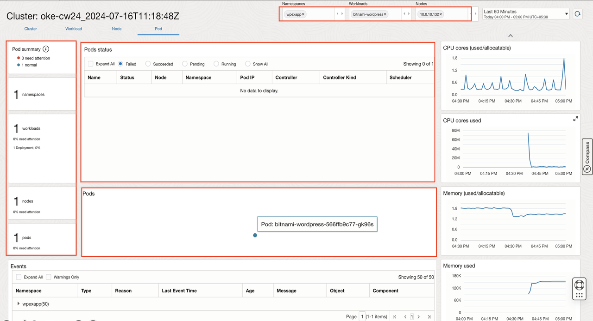

    - The Pod status table shows all the pods associated with filtered workload.
    You may filter the pods based on status by selecting given radio buttons - *Failed*, *Succeeded*, *Pending* & *Running*.
    By default, all pods with Failed status are shown. 
    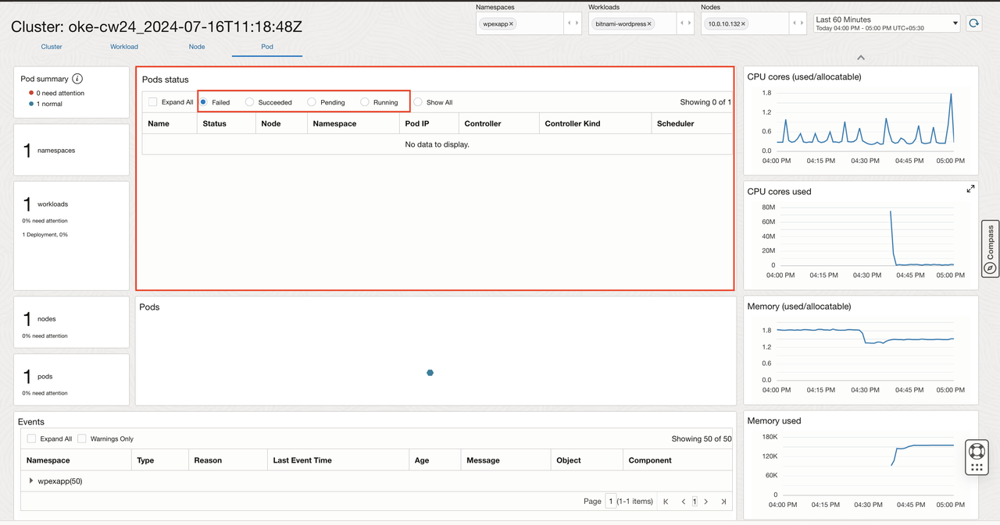

    - Hit Show All radio button to view all the pods running under filtered workload, node & namespace.

    - In the Pods status table, check Expand All checkbox to view the important details such as Status, Node, Pod IP, Controller etc for the filtered pod. You may also click on the expand icon of pods in row to view these details. 
    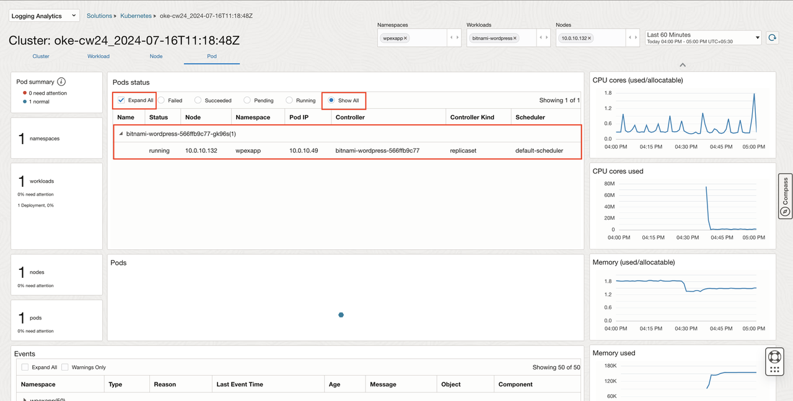

    - Pods section shows polygons for the pods running under filtered namespace, workload & corresponding node.Hover over pod polygon to view details.

    - Observe the changes in telemetry panel on applying filters.

    - The Pod summary tile shows number of pods that needs attention & pods which are healthy.

    - Events section & all other tiles in summary panel remains same.

    - **Exercise** : View the details of the pods based on different status like running, failed, succeeded, and pending in pods status table.

**Congratulations!** In this lab, you have successfuly completed the following tasks:
  - Navigated to the existing Kubernetes cluster on which monitoring is enabled
  - Understood the current state of the Kubernetes Cluster
  - Visualized the data in different views Cluster, Workload,  Node & Pod

  You may now proceed to the [next lab](#next).

## Acknowledgements
* **Author** - Heena Rahangdale, OCI Logging Analytics
* **Contributors** -  Vikram Reddy, Heena Rahangdale , OCI Logging Analytics
* **Last Updated By/Date** - Heena Rahangdale, Aug, 2024