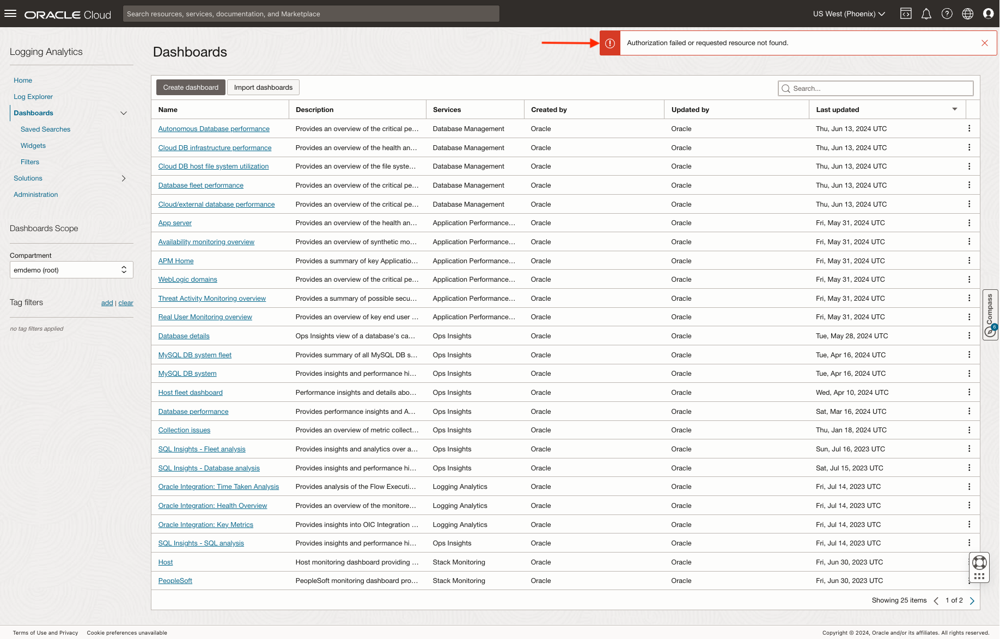
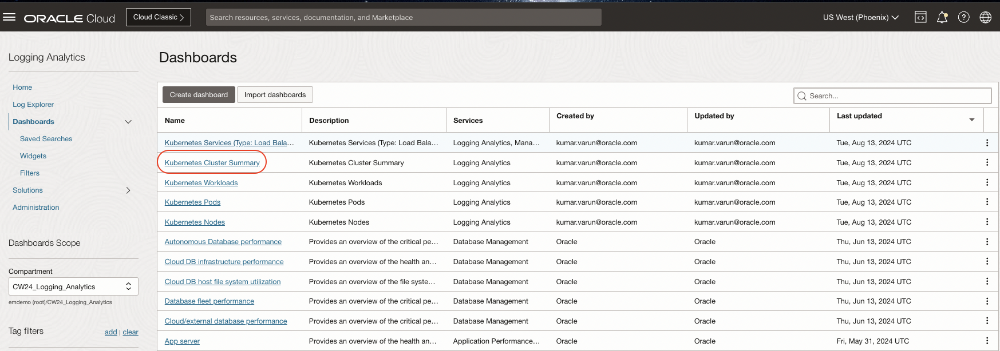
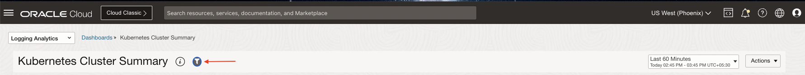
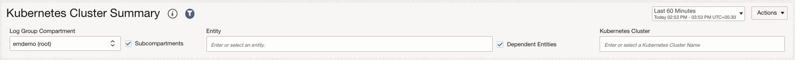
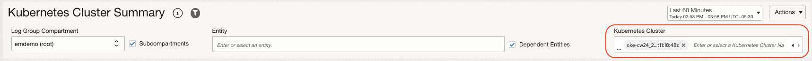
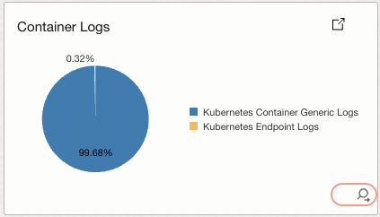
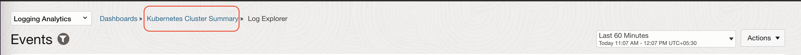

# Next Steps for more Insights

## Introduction

In this lab, you will visualize the data collected from the OKE Cluster through Dashboards.

### About
In this lab we will be exploring

  - Dashboards: A data visualization tool that gathers real-time data from the various tiers of Kubernetes Cluster.
  - Widgets: A component that displays the real-time data.

Estimated Time: 10 minutes

### Objectives

In this lab, you will see step-by-step instructions to:

   - Visualize Pre-imported dashboards
   - Visualize data in the Log Explorer


## Task 1: Visualize the Pre-imported dashboards

  In the connect cluster flow, the solution creates dashboards for the target Kubernetes cluster. These dashboards are available in **CW24\_Logging\_Analytics** compartment for this exercise.
  > **Note** : For a quick refresher on connect cluster flow [review Lab 1](?lab=connect-cluster-flow).

  1. To navigate to the Dashboards page use one of the following method.
    - From Navigation Menu  > **Observability & Management** > **Logging Analytics** > **Dashboards**.
   
        OR
   
    - You can use the direct link to land on the **Dashboards** page.
    ```
         <copy>
            https://cloud.oracle.com/loganalytics/dashboards?region=us-phoenix-1
         </copy>   
    ```
  2. Dashboards page will be displayed.
    

  3. Switch to the compartment **CW24\_Logging\_Analytics**.
    - From the **Compartment** dropdown select the compartment **CW24\_Logging\_Analytics**.
      
    - All the Dashboards in the Compartment **CW24\_Logging\_Analytics** will be displayed.
      

  4. Click on the **Kubernetes Cluster Summary** dashboard. It will take few seconds for the dashboard widgets to load.
      > **Important tip** : Observe the dashboard widgets & values once they are loaded.
      
      

  5. Selecting the OKE cluster to visualize the dashboards data. 
      - Click on the **Scope Filter** button.
        
      - A scope filter panel will be displayed.
        
      - Select **oke-cw24\_creation\_time** cluster in the **Kubernetes Cluster** field. The example cluster name format will be **oke-cw24_2024-07-16t11:18:48z**
            
          > **Note:** We add the creation time to the cluster while deploying the solution using [connect cluster flow of Lab 1](?lab=connect-cluster-flow) to uniquely identify the Kubernetes clusters with same name.
        
       
         
  6. You should be able to see the all the widgets displaying the data specific to your OKE Cluster.
      > **Important tip** : Observe the dashboard widgets & values once they are loaded. Did you notice the change ?
      
      

  7. Scroll down to the **Container Logs** widget in the dashboard.
          

  8. Click on the View Query Icon to view the query used to populate the data in widget.

      
      

    After viewing the query, click on **Close** button.

  9. **Exercise** Repeat the steps 7 & 8 for the **Events** widget.  

   


## Task 2: Drill-down to log explorer 
  1. Click on the Punch Out Icon on the Events widget.
       

  2. This will take you to the **Pie Chart view** of Log Explorer in context of Kubernetes Cluster Name.
    

  3. **Exercise** Explore the different visualizations on Log Explorer page. Read more about [how to use Log Explorer for analyzing and visualizing logs in Logging Analytics.] (https://livelabs.oracle.com/pls/apex/r/dbpm/livelabs/run-workshop?p210_wid=3887)

    
  
  4. To navigate back to the Kubernetes Cluster Summary page, click on the **Kubernetes Cluster Summary** as highlighted in the image below.
    

  5. Similarly you can explore other widgets in the Kubernetes Cluster Summary and other dashboards. 

**Congratulations!** In this lab, you have successfuly completed the following tasks:
  - Visualized Pre-imported dashboards
  - Visualized data in the Log Explorer
  
  You may now proceed to the [next lab](#next).

## Acknowledgements
* **Author** - Vikram Reddy, OCI Logging Analytics
* **Contributors** -  Vikram Reddy, Heena Rahangdale , OCI Logging Analytics
* **Last Updated By/Date** - Vikram Reddy, Aug, 2024