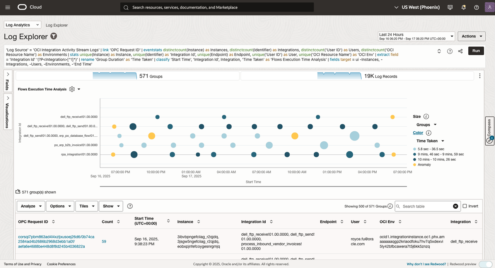

# Lab 4 - Monitoring End-to-End Purchase Order Flow with Oracle Log Analytics

## Introduction

This lab demonstrates how to monitor and troubleshoot the complete Purchase Order (PO) business flow from Oracle Fusion ERP Cloud through Oracle Integration Cloud (OIC) to Autonomous Data Warehouse (ADW) using Oracle Log Analytics. You will learn to correlate logs across multiple Oracle Cloud services, track business identifiers, and visualize the entire PO flow to detect bottlenecks and failure points.

Estimated Time: 45 minutes

### Objectives
In this lab, you will:
- Understand Oracle Log Analytics concepts including visualizations and dashboards
- Correlate logs across Fusion Applications, OIC, and Database using transaction identifiers and event timestamps
- Visualize the entire PO flow and detect bottlenecks or failure points
- Learn how logs support dependency analysis for business process monitoring
- Track PO business identifiers (PO Header ID, Order Number, Supplier, Status) across all systems

## Task 1: End-to-End Purchase Order Flow Monitoring and Tracing Strategy

### Oracle SaaS Fusion and Integration Components telemetry

The following components generate logs that are crucial for end-to-end observability:

| Component | Log Types | Key Information | Integration Points |
|-----------|-----------|-----------------|-------------------|
| **Oracle SaaS Fusion Apps** | Fusion Audit Logs, User Activity, ESS job requests | PO creation, approval status, user actions | OIC via REST/SOAP |
| **Oracle Integration Cloud** | OIC Activity Stream Logs | Flow execution, data transformation, EDI processing | SaaS ERP Cloud, ADW, Trading Partners |
| **Oracle Autonomous Data Warehouse** | Business data in table/view, Database Audit Logs | Data persistence, analytics queries, access patterns | OIC, VBCS |
| **Oracle Visual Builder Cloud Service** | Application Logs, API Logs, Error Logs | User interactions, backend calls, UI performance | ADW, OIC |

### Monitoring and Log Correlation Strategy

**Key Correlation and Tracking Field**
- **Primary business identifier across all systems**
    - PO Header Id
    - Order Number
    - Trading Partner ID
    - Document Status
- **Technical correlation for integration flows**
    - Transaction ID
    - OPC Request ID
- **User ID** to track user actions across ERP and VBCS
- **Timestamp** to track chronological ordering of events across components

**Cross-Component Traceability:**
- **Correlation ID**: Unique identifier passed through all components
- **Timestamp Alignment**: Synchronized timestamps across all log sources
- **Business Context**: PO number, user ID, and transaction ID tracking
- **Error Propagation**: Error details flow from source to downstream components

## Task 2: Tracing the Oracle Integration Transactions

### Oracle Integration Cloud Milestones Trend

- Select the Time Range: Last 24 hours
- Visualization: Records with Histogram
- Run the following query in Log Explorer: 

   ```sql
   <copy>
   'Action Type' in (Invoke, Log, Notification, Raise_error, Submitnow, Stop, Switch, Raise_new_error, Receive) and 'Log Source' = 'OCI Integration Activity Stream Logs' | timestats count(Action) as Milestones by Action
   </copy>
   ```
   
- Example Result Screenshot: 


### Oracle Integration Action Types Summary

- Select the Time Range: Last 24 hours
- Visualization: Pie
- Run the following query in Log Explorer: 

   ```sql
   <copy>
   'Action Type' in (Invoke, Log, Notification, Raise_error, Submitnow, Stop, Switch, Raise_new_error, Receive) and 'Log Source' = 'OCI Integration Activity Stream Logs' and Identifier != null and 'OPC Request ID' != null | stats count(Action) as Milestones by Action
   </copy>
   ```

- Example Result Screenshot: 


### Analyze Oracle Integration Cloud Transaction Performance

```sql
'Log Source' = 'OCI Integration Activity Stream Logs' and 'Action Type' in (Invoke, Log, Notification, Raise_error, Submitnow, Stop, Switch, Raise_new_error, Receive) and Identifier != null | link 'OPC Request ID', 'Transaction ID' | rename 'Group Duration' as 'Transaction Time' | sequence name = Milestones [ Action != null and 'Action Type' != null and 'Event ID' != null ]{1,} select Action, 'Action Type', 'Event ID', Integration | stats latest(Integration) as Integration, latest(Action) as 'Latest Action', unique('OIC Project') as 'Project Name', distinctcount(Identifier) as Integrations, unique(Entity) as Entity, unique(Instance) as Instance | classify correlate = -*, Integration, 'Project Name', 'Transaction ID' 'Start Time', 'Latest Action', 'Transaction Time' as 'Transaction Execution Time' | fields target = ui -'OPC Request ID', -Entity, -Instance
```

### Tracking Purchase Order Integration Flows

- Select the Time Range: Last 24 hours
- Visualization: Link
- Update the Chart Option by clicking on the **Gear** icon and select **Chart Options** which will launch "Chart Options" a pop-up.
- 
- Run the following query in Log Explorer: 

   ```sql
   <copy>
   'Log Source' = 'OCI Integration Activity Stream Logs' | link 'OPC Request ID' | eventstats distinctcount(Instance) as Instances, distinctcount(Identifier) as Integrations, distinctcount('User ID') as Users, distinctcount('OCI Resource Name') as Environments | stats unique(Instance) as Instance, unique(Identifier) as 'Integration Id', unique(Endpoint) as Endpoint, unique('User ID') as User, unique('OCI Resource Name') as 'OCI Env' | extract field = 'Integration Id' '(?P<Integration>[^!]*)' | rename 'Group Duration' as 'Time Taken' | classify 'Start Time', 'Integration Id', Integration, 'Time Taken' as 'Flows Execution Time Analysis' | fields target = ui -Instances, -Integrations, -Users, -Environments, -'End Time'
   </copy>
   ```

- Example Result Screenshot: 




## Task 3: Tracing the Purchase Order Business Identifiers

### Create a Purchase Order Flow Timeline Visualization

- Select the Time Range: Last 24 hours
- Visualization: Link
- Run the following query in Log Explorer: 

   ```sql
   -- Create a PO Flow Timeline Visualization
   'Log Source' = 'OCI Integration Activity Stream Logs' | eval 'Purchase Order' = if(Key = poheaderid, Value, null) | link 'Purchase Order' | sequence name = 'Sequence of Events' [ Integration != null ]{1,} select Integration
   ```
- Select the Sequence of Events in the table view

Example Result Screenshot: 


### Track a specific Purchase Order for example: 300000313760215 or US165676 across all systems

- Select the Time Range: Last 30 days
- Visualization: Table
- Run the following query in Log Explorer: 

   ```sql
   -- Track Purchase Order flow across all systems
   (300000313760215 or US165676) and 'Log Source' in ('OCI Integration Activity Stream Logs', AIW_PO_ERP_ATP) | fields -Entity, -'Host Name (Server)', -'Problem Priority', -Label, Integration, Message, Value, Action, 'Action Type', 'OPC Request ID', -'Entity Type'
   ```

- Example Result Screenshot: 


### Purchase Order Integration Runs Duration

- Select the Time Range: Last 30 days
- Visualization: Link
- Run the following query in Log Explorer: 

```sql
-- Track PO duration
(300000313760215 or US165676) and 'Log Source' in ('OCI Integration Activity Stream Logs', AIW_PO_ERP_ATP) | link 'OPC Request ID', Integration | eval Duration = 'End Time' - 'Start Time'
```

- Example Result Screenshot: 


## Task 4: Visualize the Purchase Order business data in Autonomous Data Warehouse

### Identify the long running Purchase Order integrations

- Select the Time Range: Last 24 hours
- Visualization: Link
- Run the following query in Log Explorer: 

   ```sql
   -- Identify the long running Purchase Order integrations
   'Log Source' in ('OCI Integration Activity Stream Logs', AIW_PO_ERP_ATP) | link 'OPC Request ID', Integration | eval Duration = 'End Time' - 'Start Time' | sort -'Start Time'
   ```

- Example Result Screenshot: 


- Select the Time Range: Last 24 hours
- Visualization: Link
- Run the following query in Log Explorer: 

   ```sql
   -- Identify the long running Purchase Order integrations with Chart
   'Log Source' in ('OCI Integration Activity Stream Logs', AIW_PO_ERP_ATP) and Integration != rpa_integration and Integration != dell_ftp_receive | link 'OPC Request ID', Integration | stats avg(Duration) as Duration | eval Duration = 'End Time' - 'Start Time' | sort -Duration | fields -'End Time' | classify topcount = 500 correlate = -*, 'OPC Request ID' 'Start Time', Integration, Duration as 'PO Integrations duration'
   ```

- Example Result Screenshot: 


### Purchase Order table with Order Status

- Select the Time Range: Last 60 minutes
- Visualization: Table
- Run the following query in Log Explorer: 

   ```sql
   -- Purchase Order table with Order Status
   'Log Source' = AIW_PO_ERP_ATP | fields -'Host Name (Server)', -'Problem Priority', -Label, INVOICE_STATUS, LINE_STATUS, ORDER_AMOUNT, ORDER_NUMBER, 'Order Status', PO_HEADER_ID, -'Entity Type', INVOICE_NAME, -'Log Source'
   ```
- Example Result Screenshot: 


### OIC Integrations Run Analysis

- Select the Time Range: Last 24 hours
- Visualization: Link
- Run the following query in Log Explorer: 

   ```sql
   -- Identify slow processing steps
   'Log Source' = 'OCI Integration Activity Stream Logs' | link 'OPC Request ID' | eventstats distinctcount(Instance) as Instances, distinctcount(Identifier) as Integrations, distinctcount('User ID') as Users, distinctcount('OCI Resource Name') as Environments | stats unique(Instance) as Instance, unique(Identifier) as 'Integration Id', unique(Endpoint) as Endpoint, unique('User ID') as User, unique('OCI Resource Name') as 'OCI Env' | extract field = 'Integration Id' '(?P<Integration>[^!]*)' | rename 'Group Duration' as 'Time Taken' | classify 'Start Time', 'Integration Id', Integration, 'Time Taken' as 'Flows Execution Time Analysis' | fields target = ui -Instances, -Integrations, -Users, -Environments
   ```

- Example Result Screenshot: 


**Congratulations!** In this lab, you have successfully completed the following tasks:
- Understanding Oracle Log Analytics concepts and capabilities
- Correlating logs across Fusion Applications, OIC, and Database systems
- Visualizing the complete PO flow with timeline and performance metrics
- Detecting bottlenecks and failure points in the business process
- Performing dependency analysis and business impact assessment

You now have the skills to monitor and troubleshoot end-to-end Purchase Order flows using Oracle Log Analytics, enabling effective cross-team collaboration and rapid issue resolution.

You may now proceed to the [next lab](#next).

## Learn More

* [Oracle Cloud Infrastructure Logging Analytics Documentation](https://docs.oracle.com/en-us/iaas/logging-analytics/)
* [Log Analytics Query Language (LAQL) Reference](https://docs.oracle.com/en-us/iaas/logging-analytics/doc/query-language.html)
* [Creating Dashboards in Log Analytics](https://docs.oracle.com/en-us/iaas/logging-analytics/doc/create-dashboards.html)
* [Setting up Alerts in Log Analytics](https://docs.oracle.com/en-us/iaas/logging-analytics/doc/set-up-alerts.html)
* [Oracle Fusion Applications Documentation](https://docs.oracle.com/en/applications/)
* [Oracle Integration Cloud Documentation](https://docs.oracle.com/en/cloud/paas/integration-cloud/)

## Acknowledgements
* **Author** - Royce Fu, Master Principal Cloud Architect,Kumar Varun, Log Analytics Product Management
* **Contributors** -  Kumar Varun, Royce Fu, Supriya Joshi, Jolly Kundu
* **Last Updated By/Date** - Royce Fu, Sep, 2025
