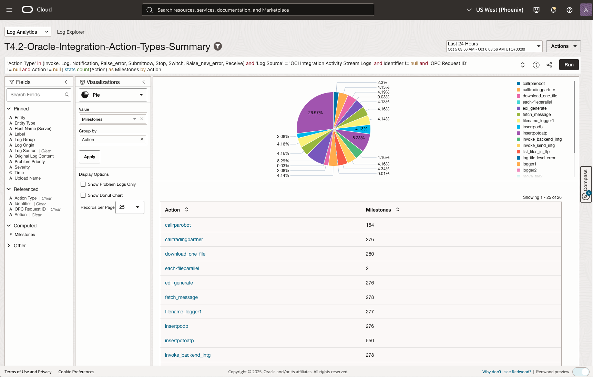

# Lab 4 - Monitor End-to-End Purchase Order Flow with Oracle Log Analytics

## Introduction

This lab demonstrates how to monitor and troubleshoot the complete Purchase Order (PO) business flow from Oracle Fusion ERP Cloud through Oracle Integration Cloud (OIC) to Autonomous Data Warehouse (ADW) using Oracle Log Analytics. You will learn to correlate logs across multiple Oracle Cloud services, track business identifiers, and visualize the entire PO flow to detect bottlenecks and failure points.

Estimated Time: 45 minutes

### Objectives
In this lab, you will:
- Understand Oracle Log Analytics concepts including visualizations and dashboards
- Correlate logs across Fusion Applications, OIC, and Database using transaction identifiers and event timestamps
- Visualize the entire PO flow and detect bottlenecks or failure points
- Learn how logs support dependency analysis for business process monitoring
- Track PO business identifiers (PO Header ID, Order Number, Supplier, Status) across all systems

## Task 1: End-to-End Purchase Order Flow Monitoring and Tracing Strategy

### Oracle SaaS Fusion and Integration Components telemetry

The following components generate logs that are crucial for end-to-end observability:

| Component | Observability Log Source | Functional Components | Upstream and Downstream Systems | Ingestion method | 
|-----------|-----------|-----------------|-------------------|
| **Oracle SaaS Fusion Apps** | Fusion Audit Logs, User Activity, ESS job requests | ESS Audit, User Activity Audit, Fusion Audit, ESS job requests, Business Objects Audit | OIC via REST/SOAP | Fusion REST API endpoints based log ingestion via Management Agent| 
| **Oracle Integration Cloud** | OIC Activity Stream Logs | integration execution, B2B processing | SaaS ERP Cloud, ADW, APEX | Service Logs via Service Connector |
| **Oracle Autonomous Data Warehouse** | Business data in table/view, Database Audit Logs | Data persistence, analytics queries, access patterns | OIC, APEX | Database SQL connector based log ingestion via Management Agent |
| **Oracle APEX Application** | User Activity, Application Usage, Error Logs | User Success and Failed Logins, Application and User Activity, Application Errors | ADW, OIC | Database connector based log ingestion via Management Agent |

### Monitoring and Log Correlation Strategy

**Key Correlation and Tracking Field**
- **Primary business identifier across all systems**
    - PO Header Id
    - Order Number
    - Trading Partner ID
    - Document Status
- **Technical correlation for integration flows**
    - Transaction ID
    - OPC Request ID
- **User ID** to track user actions across ERP and VBCS
- **Timestamp** to track chronological ordering of events across components

**Cross-Component Traceability:**
- **Correlation ID**: Unique identifier passed through all components
- **Timestamp Alignment**: Synchronized timestamps across all log sources
- **Business Context**: PO number, user ID, and transaction ID tracking
- **Error Propagation**: Error details flow from source to downstream components

## Task 2: Find the Purchase Order information

### Use APEX app to check the Real-Time Purchase Order information

- Follow the APEX app [AI World 25 Fusion Purchase Order Demo](https://ep8c8t82piuc9mv-ligiq4h13k1nhb8s.adb.us-phoenix-1.oraclecloudapps.com/ords/r/vector/sample-interactive-grids103/home)
- On the Home page, note down the **POHeaderId** and **OrderNumber** for the most recent purchase orders
- 

## Task 3: Tracing the Purchase Order Business Identifiers

- **Navigate to Oracle Cloud Console**
   - Log in to your Oracle Cloud Infrastructure console
   - Navigate to **Observability & Management** → **Log Analytics**
   - Click on **Log Explorer**

- **Click the Log Explorer filter**
   - Make sure the Log Group Compartment **emdemo(root)** is selected
   - Make sure the Region **US West (Phoenix)** is selected
   - Change the Time Range to **Last 8 hours**
   - Click on **Apply** or **Close** if needed
   - 

### **Number of the Purchase Order created in last 8 hours**

- Select the Time Range: Last 8 hours
- Visualization: Tile
- Click the saved search URL [**Number of the Purchase Order created in last 8 hours**](https://cloud.oracle.com/loganalytics/explorer?savedSearchId=ocid1.managementsavedsearch.oc1..aaaaaaaa55xdml2m2g4fwu5z663a2qr4navhk7kgndvbq4sa7h6p3ajnxkka&jobId=4fabcbda-7e1c-67c8-e86f-46765558dcf5&region=us-phoenix-1) to open the saved search in Log Explorer
- Run the following query in Log Explorer: 

   ```sql
   <copy>
   'Log Source' = 'OCI Integration Activity Stream Logs' and Key = ordernumber and Integration = LL_ERPPO_BACKEND_B2B | stats count(Key), count(Key), trend(count(Key)) | compare timeshift = auto
   </copy>
   ```

- Example Result Screenshot: 


### **Purchase Order Integration Runs Duration**

- Select the Time Range: Last 30 days
- Visualization: Link
- Run the following query in Log Explorer: 
- Click the saved search URL [**Purchase Order Integration Runs Duration**](https://cloud.oracle.com/loganalytics/explorer?savedSearchId=ocid1.managementsavedsearch.oc1..aaaaaaaa7dz5imt6qebrrdet4r4zwme7qjh5mpeo53ox2tlbig2f6q5m64pq&jobId=3f01334b-17d5-3c6a-5e2d-013ff05b6c9e&region=us-phoenix-1) to open the saved search in Log Explorer

   ```sql
   <copy>
   (300000313760215 or US165676) and 'Log Source' in ('OCI Integration Activity Stream Logs', AIW_PO_ERP_ATP) | link 'OPC Request ID', Integration | eval Duration = 'End Time' - 'Start Time'
   </copy>
   ```

- Example Result Screenshot: 


### **Purchase Order Flow Timeline**

- Select the Time Range: Last 24 hours
- Visualization: Link
- Click the saved search URL [**Purchase Order Flow Timeline**](https://cloud.oracle.com/loganalytics/explorer?savedSearchId=ocid1.managementsavedsearch.oc1..aaaaaaaagibcw7an4rryjyozga3iqr7udva24h4p5idoh2xijcsdmr3idl5q&jobId=2e412276-e814-1cfd-f5df-4ed035aed6d8&region=us-phoenix-1) to open the saved search in Log Explorer
- Run the following query in Log Explorer: 

   ```sql
   <copy>
   'Log Source' = 'OCI Integration Activity Stream Logs' | eval 'Purchase Order' = if(Key = poheaderid, Value, null) | link 'Purchase Order' | sequence name = 'Sequence of Events' [ Integration != null ]{1,} select Integration
   </copy>
   ```
- Select the Sequence of Events in the table view

Example Result Screenshot: 


### **Track a specific Purchase Order for example: 300000313760215 or US165676 across all systems**

- Select the Time Range: Last 30 days
- Visualization: Table
- Click the saved search URL [**Track a specific Purchase Order for example: 300000313760215 or US165676 across all systems**](https://cloud.oracle.com/loganalytics/explorer?savedSearchId=ocid1.managementsavedsearch.oc1..aaaaaaaaatq6boajnavzdpjf2oa6htih5jzdqetq6w4w4jwe4hotoqlb3owq&jobId=95046557-fc66-aa76-508f-0c37f3332164&region=us-phoenix-1) to open the saved search in Log Explorer
- Run the following query in Log Explorer: 

   ```sql
   <copy>
   (300000313760215 or US165676) and 'Log Source' in ('OCI Integration Activity Stream Logs', AIW_PO_ERP_ATP) | fields -Entity, -'Host Name (Server)', -'Problem Priority', -Label, Integration, Message, Value, Action, 'Action Type', 'OPC Request ID', -'Entity Type'
   </copy>
   ```

- Example Result Screenshot: 


## Task 4: Monitoring the Oracle Integration Transactions Performance

### **Oracle Integration Cloud Milestones Trend**

- Select the Time Range: Last 24 hours
- Visualization: Records with Histogram
- Click the saved search URL [**Oracle Integration Cloud Milestones Trend**](https://cloud.oracle.com/loganalytics/explorer?savedSearchId=ocid1.managementsavedsearch.oc1..aaaaaaaa5k23nuywnvlorwmhzm3amzqyduix4ijimatifxdqrhddsiah2upq&jobId=f2b2c50a-5088-ca02-2a37-7ac59e121ba6&region=us-phoenix-1) to open the saved search in Log Explorer
- Run the following query in Log Explorer: 

   ```sql
   <copy>
   'Action Type' in (Invoke, Log, Notification, Raise_error, Submitnow, Stop, Switch, Raise_new_error, Receive) and 'Log Source' = 'OCI Integration Activity Stream Logs' | timestats count(Action) as Milestones by Action
   </copy>
   ```
   
- Example Result Screenshot: 


### **Oracle Integration Action Types Summary**

- Select the Time Range: Last 24 hours
- Visualization: Pie
- Click the saved search URL [**Oracle Integration Action Types Summary**](https://cloud.oracle.com/loganalytics/explorer?savedSearchId=ocid1.managementsavedsearch.oc1..aaaaaaaagsk2yup63wu52yjjvhazqrwrhtlgyah52bki3iumu7pgf4pjnmca&jobId=8d66a7b0-bbac-faa8-b420-0723bbe64cd8&region=us-phoenix-1) to open the saved search in Log Explorer
- Run the following query in Log Explorer: 

   ```sql
   <copy>
   'Action Type' in (Invoke, Log, Notification, Raise_error, Submitnow, Stop, Switch, Raise_new_error, Receive) and 'Log Source' = 'OCI Integration Activity Stream Logs' and Identifier != null and 'OPC Request ID' != null | stats count(Action) as Milestones by Action
   </copy>
   ```

- Example Result Screenshot: 



### **Analyze Oracle Integration Cloud Transaction Performance**

### Tracking Purchase Order Integration Flows

- Select the Time Range: Last 24 hours
- Visualization: Link
- Click the saved search URL [**Analyze Oracle Integration Cloud Transaction Performance**](https://cloud.oracle.com/loganalytics/explorer?savedSearchId=ocid1.managementsavedsearch.oc1..aaaaaaaa32o74wmh6ler6mxqwilpviqttuqu74yhmnf7rcxqtlbpsd7jkbsa&jobId=85f6ff26-2f02-95f5-ca45-8cca3fd47629&region=us-phoenix-1) to open the saved search in Log Explorer
- Run the following query in Log Explorer: 

   ```sql
   <copy>
   'Log Source' = 'OCI Integration Activity Stream Logs' | link 'OPC Request ID' | eventstats distinctcount(Instance) as Instances, distinctcount(Identifier) as Integrations, distinctcount('User ID') as Users, distinctcount('OCI Resource Name') as Environments | stats unique(Instance) as Instance, unique(Identifier) as 'Integration Id', unique(Endpoint) as Endpoint, unique('User ID') as User, unique('OCI Resource Name') as 'OCI Env' | extract field = 'Integration Id' '(?P<Integration>[^!]*)' | rename 'Group Duration' as 'Time Taken' | classify 'Start Time', 'Integration Id', Integration, 'Time Taken' as 'Flows Execution Time Analysis' | fields target = ui -Instances, -Integrations, -Users, -Environments
   </copy>
   ```
- Update the Chart Option by clicking on the **Gear** icon and select **Chart Options** which will launch "Chart Options" a pop-up.
- 

- Example Result Screenshot: 


### **Potential Performance issues in the Purchase Order integration flows**
- Too many orders generated in a short period of time
- Bottleneck in the integration flow
- Slow FTP Server due to network response time
- Database performance issue due to high wait events

### **Identify the long running Purchase Order integrations**

- Select the Time Range: Last 24 hours
- Visualization: Link
- Click the saved search URL [**Identify the long running Purchase Order integrations**](https://cloud.oracle.com/loganalytics/explorer?savedSearchId=ocid1.managementsavedsearch.oc1..aaaaaaaaceb6o434pqfihntr5xsstfabzgay34j36arevkrfkjmesmcqkgaq&jobId=843d119e-600b-63aa-929e-b9e580e363c8&region=us-phoenix-1) to open the saved search in Log Explorer
- Run the following query in Log Explorer: 

   ```sql
   <copy>
   'Log Source' in ('OCI Integration Activity Stream Logs', AIW_PO_ERP_ATP) | link 'OPC Request ID', Integration | eval Duration = 'End Time' - 'Start Time' | sort -'Start Time'
   </copy>
   ```

- Example Result Screenshot: 


### **Identify the long running Purchase Order integrations with Chart**

- Select the Time Range: Last 24 hours
- Visualization: Link
- Run the following query in Log Explorer: 

   ```sql
   <copy>
   'Log Source' in ('OCI Integration Activity Stream Logs', AIW_PO_ERP_ATP) and Integration != rpa_integration and Integration != dell_ftp_receive | link 'OPC Request ID', Integration | stats avg(Duration) as Duration | eval Duration = 'End Time' - 'Start Time' | sort -Duration | fields -'End Time' | classify topcount = 500 correlate = -*, 'OPC Request ID' 'Start Time', Integration, Duration as 'PO Integrations duration'
   </copy>
   ```

- Example Result Screenshot: 


## Task 5: Visualize the Purchase Order business data in Log Analytics

### **Purchase Order table with Order Status**

- Select the Time Range: Last 60 minutes
- Visualization: Table
- Click the saved search URL [**Purchase Order table with Order Status**](https://cloud.oracle.com/loganalytics/explorer?savedSearchId=ocid1.managementsavedsearch.oc1..aaaaaaaab5wb3g3xj6w545h5cdqomtuawaof7krgxcojbiu4bx3nqzr4jkva&jobId=59c9f09f-aac2-3d27-895d-05391943b283&region=us-phoenix-1) to open the saved search in Log Explorer
- Run the following query in Log Explorer: 

   ```sql
   <copy>
   'Log Source' = AIW_PO_ERP_ATP | fields -'Host Name (Server)', -'Problem Priority', -Label, INVOICE_STATUS, LINE_STATUS, ORDER_AMOUNT, ORDER_NUMBER, 'Order Status', PO_HEADER_ID, -'Entity Type', INVOICE_NAME, -'Log Source'
   </copy>
   ```
- Example Result Screenshot: 


**Congratulations!** In this lab, you have successfully completed the following tasks:
- Understanding Oracle Log Analytics concepts and capabilities
- Correlating logs across Fusion Applications, OIC, and Database systems
- Visualizing the complete PO flow with timeline and performance metrics
- Detecting bottlenecks and failure points in the business process
- Performing dependency analysis and business impact assessment

You now have the skills to monitor and troubleshoot end-to-end Purchase Order flows using Oracle Log Analytics, enabling effective cross-team collaboration and rapid issue resolution.

You may now proceed to the [next lab](#next).

## Learn More

* [Oracle Cloud Infrastructure Log Analytics Documentation](https://docs.oracle.com/en-us/iaas/log-analytics/)
* [Log Analytics Query Language Reference](https://docs.oracle.com/en-us/iaas/log-analytics/doc/query-language.html)
* [Creating Dashboards in Log Analytics](https://docs.oracle.com/en-us/iaas/log-analytics/doc/create-dashboards.html)
* [Setting up Alerts in Log Analytics](https://docs.oracle.com/en-us/iaas/log-analytics/doc/set-up-alerts.html)
* [Oracle Fusion Applications Documentation](https://docs.oracle.com/en/applications/)
* [Oracle Integration Cloud Documentation](https://docs.oracle.com/en/cloud/paas/integration-cloud/)

## Acknowledgements
* **Author** - Royce Fu, Master Principal Cloud Architect,Kumar Varun, Log Analytics Product Management
* **Contributors** -  Kumar Varun, Royce Fu, Supriya Joshi, Jolly Kundu
* **Last Updated By/Date** - Royce Fu, Sep, 2025
