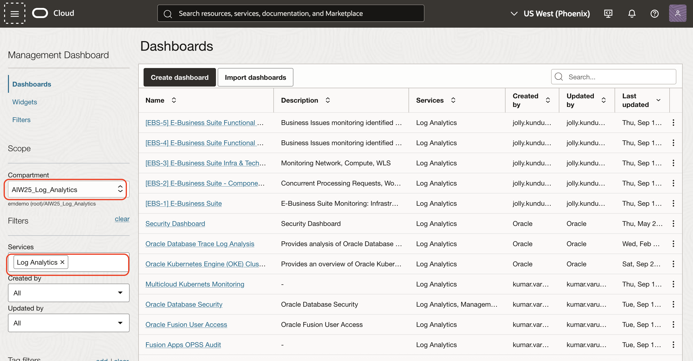
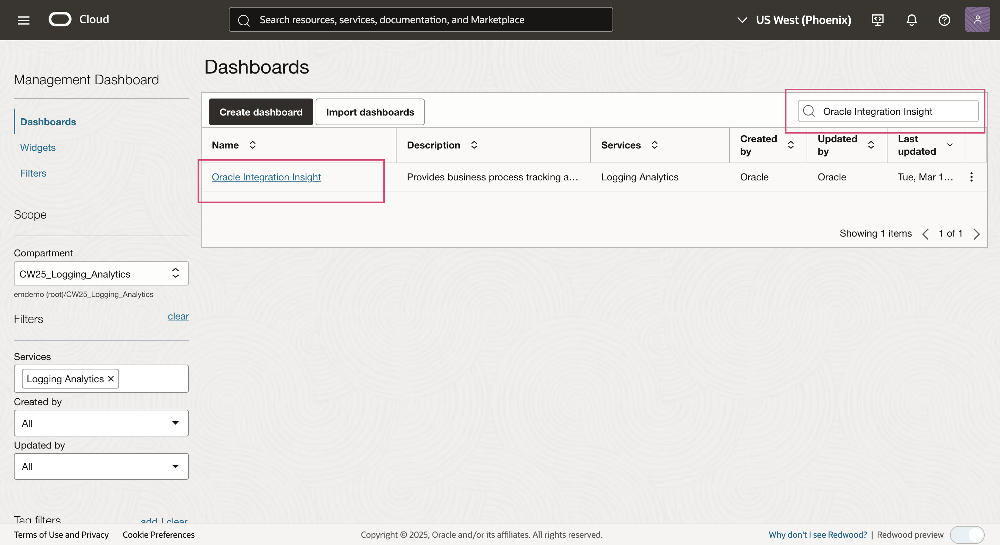
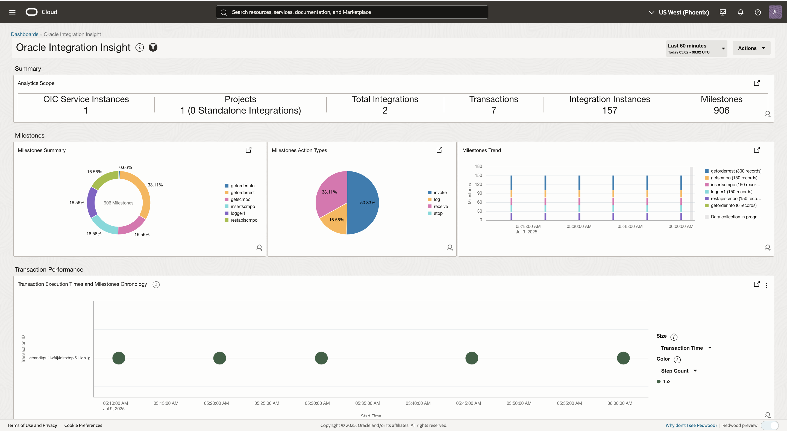
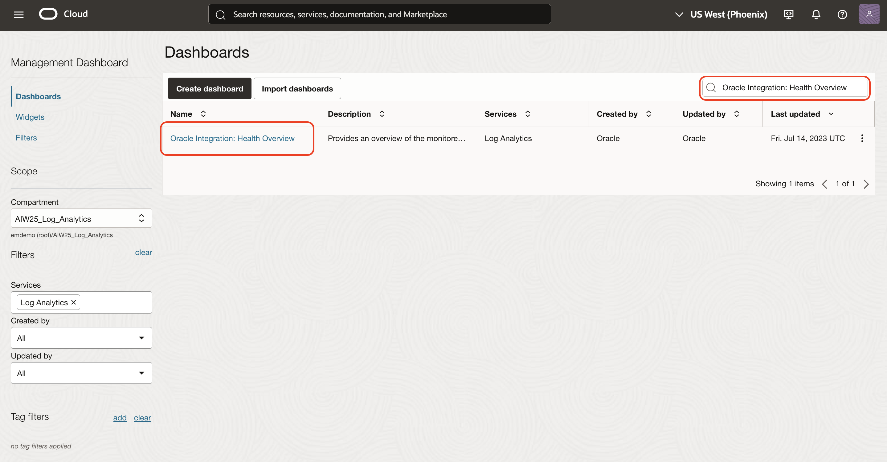
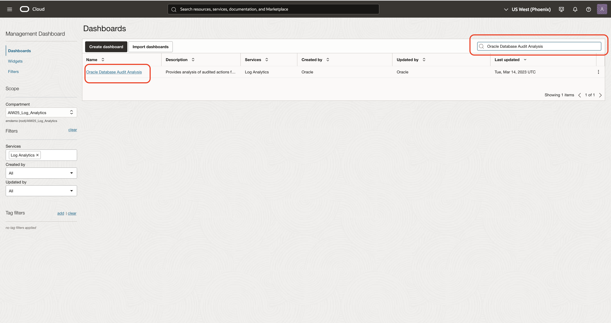
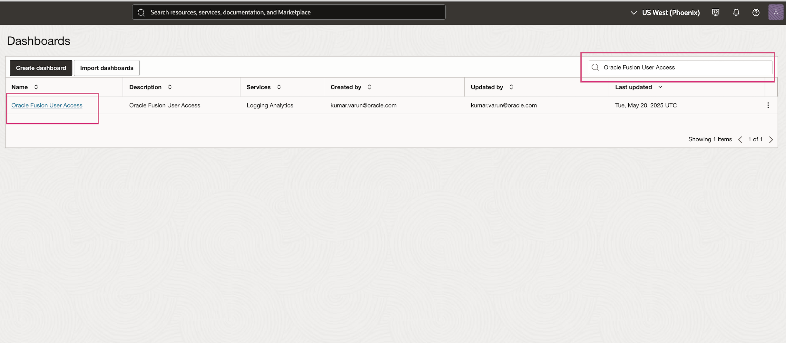
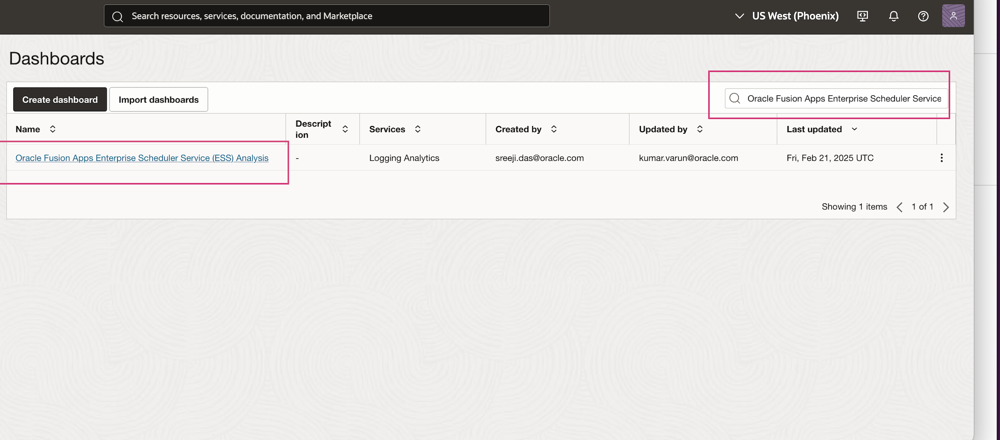
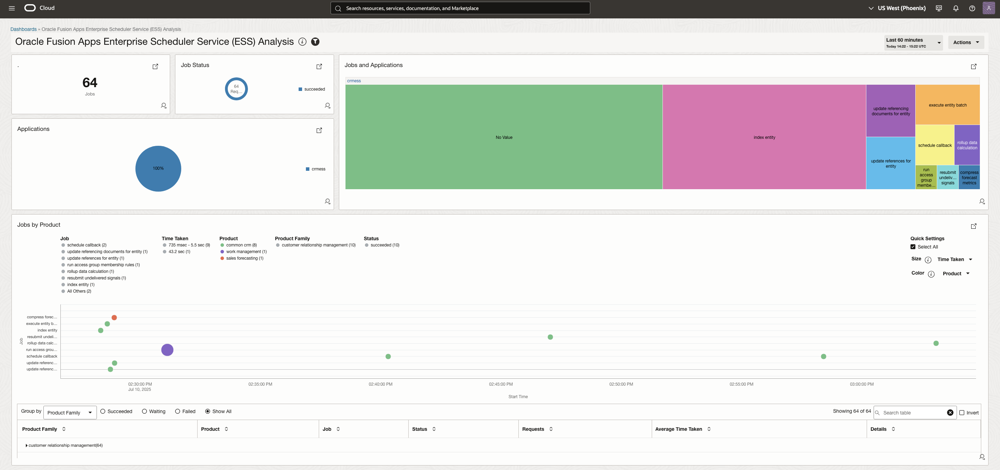

# Lab 3 - Monitor individual components

## Introduction

In this lab, you will explore the various dashboards available in Oracle for monitoring Fusion Applications, Oracle Integration Cloud (OIC), and Oracle Database (DB). These dashboards offer a unified and centralized view of log data, allowing users to efficiently monitor system health, analyze performance, and troubleshoot issues across Fusion Applications, OIC integrations, and database instances.

Estimated Time: 5 minutes

### Objectives
In this lab, you will get an overview of the different dashboards, including their usage and the various widgets provided within each dashboard.

## Task 1: Dashboard Navigation
- To navigate to the Dashboards page use one of the following method.
    From Navigation Menu  > **Observability & Management** > **Management Dashboard** > **Dashboards**.
     
    OR
    
    You can use the direct link to land on the **Dashboards** page.
    ```
         <copy>
            https://cloud.oracle.com/management-dashboard/dashboards?region=us-phoenix-1
         </copy>   
    ```
 -  Dashboards page will be displayed.
       

    > **Note** : You will see an authorization error. It is expected as current user doesn't have permission to the root compartment.

 -  Switch to the compartment **CW25\_Logging\_Analytics**.
    - From the **Compartment** dropdown select the compartment **CW25\_Logging\_Analytics**.
    - From the **Services** dropdown select the service **Log Analytics**.
    - All the Dashboards in the Compartment **CW25\_Logging\_Analytics** will be displayed.
      
   

## Task 2: Overview of Oracle Integration Insight  dashboard
  
-  **Oracle Integration Insight**  dashboard provides real-time business monitoring by linking technical integrations to business processes and KPIs. The dashboard enables business users, analysts, and IT teams to visualize the progress, performance, and bottlenecks in their business operations. It consists of different widgets like Summary widget, Milestone progress widget, Transction Performance widget , Transaction Tracking Fields widget etc. 

| Component | Observability Log Source | Functional Components | Upstream and Downstream Systems | Ingestion method | 
|-----------|-----------|-----------------|-------------------|
| **Oracle Integration Cloud** | OIC Activity Stream Logs | integration execution, B2B processing | SaaS ERP Cloud, ADW, VBCS | Service Logs via Service Connector |


- In order to view this dashboard one has to search for and click on the **Oracle Integration Insight** dashboard from the  **Dashboard** home page. It will take few seconds for the dashboard widgets to load.

	> **Important tip** : Observe the dashboard widgets & values once they are loaded.
	

## Task 3: Overview of Oracle Integration: Health Overview dashboard

  - **Oracle Integration: Health Overview** dashboard provides an overview of the monitored OIC instances, integrations, and their health based on the metrics and logs. This dashboard is used to gain insights into the current health of your OIC Instances, Integrations, and Flow Instances. Filters can be used to narrow down to a specific OIC Instance, Integration, and Integration Instance. It displays both metrics and log data at the compartment level. 

  - In order to view this dashboard one has to search for and click on the **Oracle Integration: Health Overview** from the  **Dashboard** home page. It will take few seconds for the dashboard widgets to load. 
      > **Important tip** : Observe the dashboard widgets & values once they are loaded.
      

## Task 4: Overview of Oracle Database Audit Analysis dashboard

- **Oracle Database Audit Analysis** dashboard provides analysis of audited actions for Oracle Databases monitored by Log Analytics using Unified Database Audit Logs available in DB v12.2 onwards. This dashboard is used to understand user activity, schema changes etc.


| Component | Observability Log Source | Functional Components | Upstream and Downstream Systems | Ingestion method | 
|-----------|-----------|-----------------|-------------------|
| **Oracle Autonomous Data Warehouse** | Business data in table/view, Database Audit Logs | Data persistence, analytics queries, access patterns | OIC, VBCS | Database SQL connector based log ingestion via Management Agent |

- In order to view this dashboard one has to search for and click on the **Oracle Database Audit Analysis** dashboard from the  **Dashboard** home page. It will take few seconds for the dashboard widgets to load. 
      > **Important tip** : Observe the dashboard widgets & values once they are loaded.
      

## Task 5: Overview of Oracle Fusion User Access and Audit Dashboard

**Oracle Fusion User Access** dashboard provides comprehensive visibility into user authentication and access patterns within Oracle Fusion Applications. This dashboard tracks sign-in and sign-out activities of Fusion users, allowing administrators and security teams to monitor who is accessing the system, when, and from where. 

| Component | Observability Log Source | Functional Components | Upstream and Downstream Systems | Ingestion method | 
|-----------|-----------|-----------------|-------------------|
| **Oracle SaaS Fusion Apps** | Fusion Audit Logs, User Activity, ESS job requests | ESS Audit, User Activity Audit, Fusion Audit, ESS job requests, Business Objects Audit | OIC via REST/SOAP | Fusion REST API endpoints based log ingestion via Management Agent| 

- In order to view this dashboard one has to search for and click on the **Oracle Fusion User Access** dashboard from the  **Dashboard** home page. It will take few seconds for the dashboard widgets to load. 
      > **Important tip** : Observe the dashboard widgets & values once they are loaded.
         

## Task 6: Overview of Oracle Fusion Apps Enterprise Scheduler Service (ESS) Analysis dashboard

**Oracle Fusion Apps Enterprise Scheduler Service (ESS) Analysis** dashboard provides deep visibility into the execution and status of ESS job requests within Oracle Fusion Applications. By collecting and analyzing ESS logs using OCI Logging Analytics, this dashboard enables you to monitor job execution trends, identify failed or long-running jobs, and troubleshoot scheduling issues. The dashboard leverages log ingestion via the OCI Logging Analytics REST API, offering actionable insights into job request patterns, error rates, and operational bottlenecks. For more details on how ESS logs are collected and analyzed.

- In order to view this dashboard one has to search for and click on the **Oracle Fusion Apps Enterprise Scheduler Service (ESS) Analysis**  dashboard from the  **Dashboard** home page. It will take few seconds for the dashboard widgets to load. 
      > **Important tip** : Observe the dashboard widgets & values once they are loaded.
               

- **Oracle Fusion Enterprise Scheduler Service (ESS) job request monitoring**

```sql
'Log Source' = 'Oracle Fusion Apps: Enterprise Scheduler Service' | stats distinctcount('Request ID') as Jobs
```

**Congratulations!** In this lab, you have successfuly completed the following tasks:
- Monitoring different dashboards


## Learn More

* [Fusion Apps Observability by Collecting ESS Logs Using OCI Logging Analytics REST API Ingestion](https://www.ateam-oracle.com/post/fusion-apps-observability-by-collecting-ess-logs-using-oci-logging-analytics-rest-api-ingestion)
* [Oracle Integration Insight Dashboard](https://docs.oracle.com/en-us/iaas/logging-analytics/doc/oracle-integration-insight-dashboard.html)
* [Oracle Integration: Health Overview Dashboard](https://docs.oracle.com/en-us/iaas/logging-analytics/doc/oracle-integration-health-overview-dashboard.html)
* [Oracle Database Audit Analysis Dashboard](https://docs.oracle.com/en-us/iaas/logging-analytics/doc/oracle-database-audit-analysis-dashboard.html)
* [Oracle Fusion User Access Dashboard](https://docs.oracle.com/en-us/iaas/logging-analytics/doc/oracle-fusion-user-access-dashboard.html)
* [Oracle Fusion Apps Enterprise Scheduler Service (ESS) Analysis Dashboard](https://docs.oracle.com/en-us/iaas/logging-analytics/doc/oracle-fusion-apps-enterprise-scheduler-service-ess-analysis-dashboard.html)


You may now proceed to the [next lab](#next).

## Acknowledgements
* **Author** - Supriya Joshi, OCI Log Analytics
* **Contributors** -  Supriya Joshi, Jolly Kundu, Kumar Varun, Royce Fu
* **Last Updated By/Date** - Royce Fu, Sep, 2025
