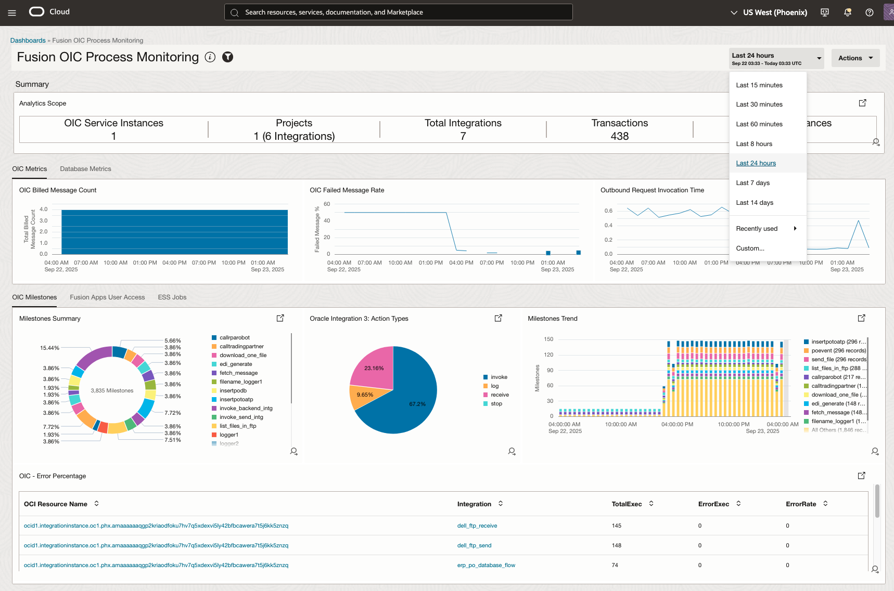
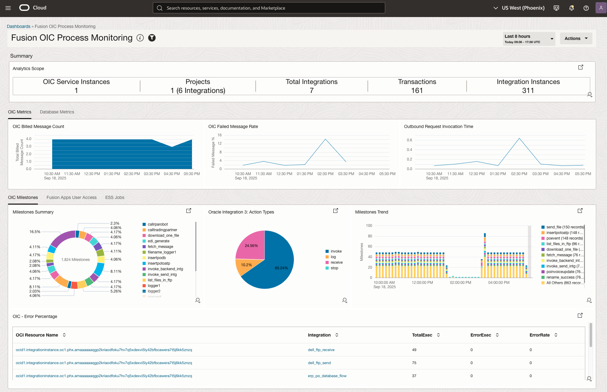
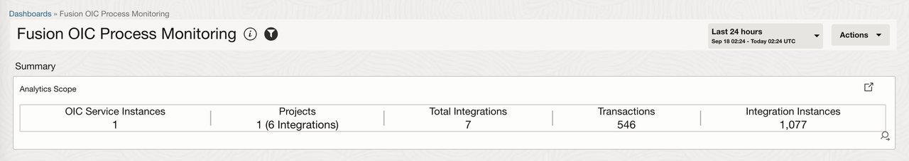
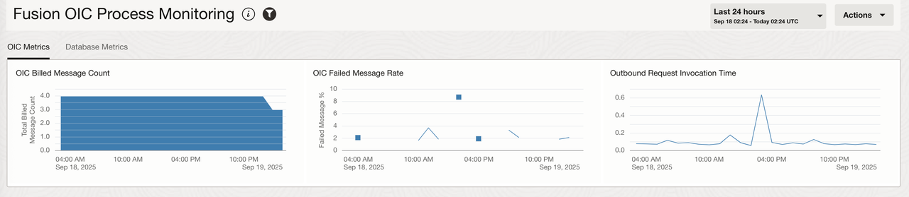
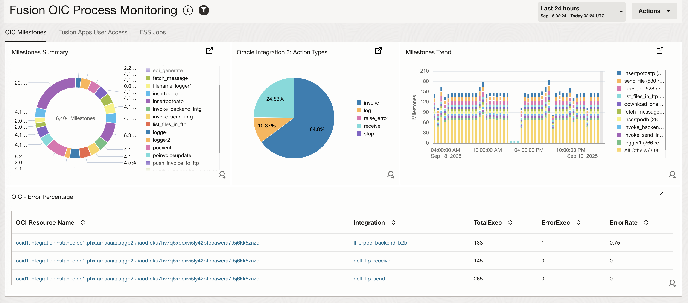
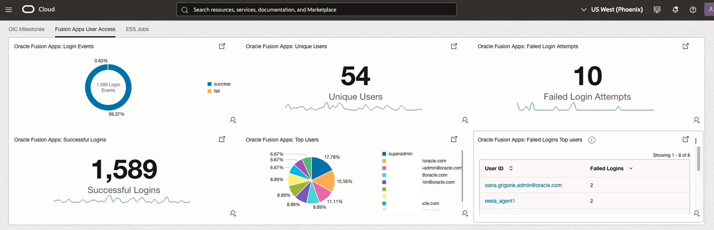
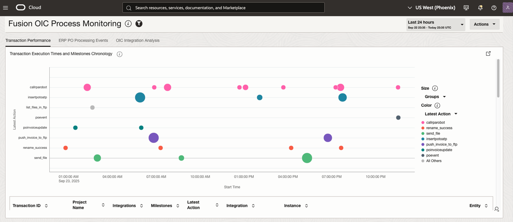
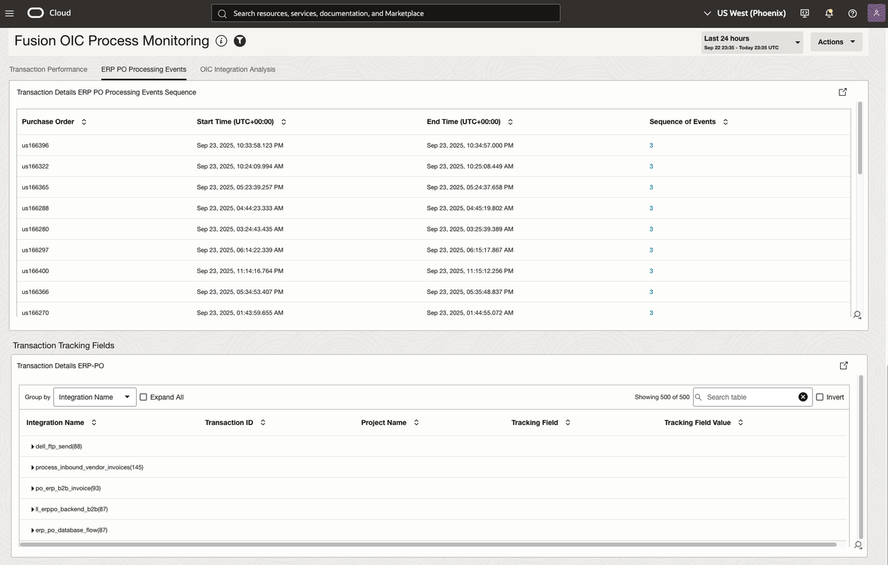
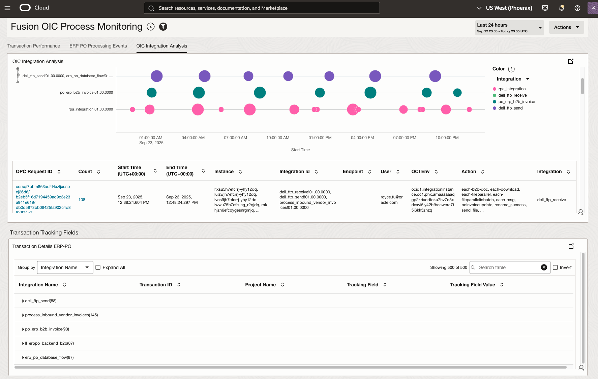

# Lab 5 - Monitor Business Flow Using Fusion and OIC Process Monitoring Dashboard

## Introduction

This lab demonstrates how to use the Oracle Fusion and OIC Process Monitoring Dashboard to monitor and troubleshoot business flows in real-time. You will learn to leverage pre-built monitoring capabilities to track Purchase Order processes, identify performance bottlenecks, and quickly resolve issues across Fusion Applications and Oracle Integration Cloud.

The Process Monitoring Dashboard provides comprehensive visibility into business process execution, allowing you to monitor end-to-end flows, track business metrics, and receive real-time alerts for process anomalies.

Estimated Time: 30 minutes

### Objectives
In this lab, you will:
- Understand the Fusion and OIC Process Monitoring Dashboard widgets and components
- Learn to navigate and interpret dashboard visualizations
- Monitor Purchase Order business flows near-real-time
- Troubleshoot business process issues using dashboard insights

## Task 1: Understanding the Fusion and OIC Process Monitoring Dashboard

### Dashboard Overview

The Fusion and OIC Process Monitoring Dashboard provides a centralized view of business process execution across Oracle Cloud services. It offers real-time monitoring capabilities with the following key features:

**Key Dashboard Components:**
- **Process Flow Visualization**: Real-time view of business process execution
- **Performance Metrics**: Request Invocation Time, Query Latency, Connection Latency, Long running integrations and ESS jobs
- **Error Monitoring**: OIC Error Count and Error Percentage, Failed Message Rate
- **Business Metrics**: Purchase Order count, Open orders, Processed Orders, Invoice count
- **System Health**: Overall system status and availability

### Accessing the Process Monitoring Dashboard

- **Navigate to Oracle Cloud Console**
   - Log in to your Oracle Cloud Infrastructure console
   - Navigate to **Observability & Management** → **Log Analytics**

- **Access Process Monitoring**
   - Select compartment **AIW25\_Log\_Analytics**
   - Click on **Dashboards** in the left navigation menu
   - Select **Fusion OIC Process Monitoring** from the dashboard list
   - Or create a new dashboard specifically for PO monitoring

- **Update Time Range** 
Set **Time range**  to **Last 24 Hours**. 

## Task 2: Understanding the Dashboard Widgets

The Fusion and OIC Process Monitoring Dashboard provides comprehensive visibility into your business processes through seven specialized tabs. Each widget is designed to monitor specific aspects of your Purchase Order flow and help identify bottlenecks, errors, and performance issues in real-time.

### **Summary - Analytics Scope widget**

- **Purpose**: Provides an overview of the Oracle Integration Cloud environment. 
- **Key Insights**: 
    - OIC Service Instance
    - Projects
    - Total Integrations
    - Transactions
    - Integration Instances

### **OIC Key Performance Metrics**

- **Purpose**: Monitor Oracle Integration Cloud failed message rate and billed message count
- **OIC Billed Message Count**: Tracks the total number of billed messages processed by OIC over time, providing insights into integration volume and usage patterns
- **OIC Failed Message Rate**: Monitors the percentage of failed integration messages, providing real-time visibility into integration reliability
- **Outbound Request Invocation Time**: Measures the response time for outbound integration requests, helping identify performance bottlenecks
- **Key Insights**: 
    - OIC Integration volume spikes during business hours
    - Sudden drops may indicate integration failures; spikes may suggest system overload
    - High failure rates indicate integration issues requiring immediate attention
    - High response times may indicate network issues, system overload, or integration design problems

### **Database Metrics**

- **Purpose**: Monitor Autonomous Database performance and health supporting Purchase Order processes
- **ADBs Availability**: Tracks database uptime and availability percentage, ensuring continuous access to PO data
- **ADBs CPU Time**: Monitors CPU utilization across database instances, helping identify resource constraints
- **Average Active Sessions**: Tracks concurrent database connections, providing visibility into user activity and system load
- **Connection Latency**: Tracks database connection establishment time, monitoring network and authentication performance
- **Current Logons**: Shows active database connections, providing real-time visibility into user activity
- **Key Insights**:
    - Database availability trends
    - Average active sessions and Wait Time
    - CPU usage patterns during PO processing
    - Peak usage and latency identification 

### **OIC Milestones**

**Purpose**: Track integration flow execution milestones and performance for Purchase Order processes

- **Oracle Integration 3: Action Types**: Shows the distribution of different action types within integration flows, providing visibility into integration complexity
- **Milestones Summary**: Provides an overview of integration milestone completion rates, showing overall integration health
- **Milestones Trend**: Shows milestone execution trends over time, helping identify performance patterns and issues
- **OIC - Error Percentage**: Calculates error rates by integration, providing clear visibility into integration reliability
- **Key Insights**:
    - Integration trend analysis
    - Action and Event Step distribution
    - Error rates by integration
    - Integration reliability comparison

### **Fusion User Access and Audit**

- **Purpose**: Monitor Fusion Applications user activity and access patterns for Purchase Order management
- **Oracle Fusion Apps: Login Events**: Tracks user login and logout events, providing visibility into application usage patterns
- **Oracle Fusion Apps: Unique Users**: Shows the count of unique users accessing the system, indicating user engagement levels
- **Oracle Fusion Apps: Successful Logins**: Tracks successful authentication events, monitoring login success rates
- **Oracle Fusion Apps: Failed Login Attempts**: Monitors failed login attempts, providing security visibility and access issue detection
- **Oracle Fusion Apps: Top Users**: Shows the most active users, providing insights into system usage patterns
- **Oracle Fusion Apps: Failed Logins Top Users**: Identifies users with the most failed login attempts, highlighting potential security risks
- **Key Insights**:
    - User login patterns
    - Application usage trends
    - Top users

### **Fusion Apps Enterprise Scheduler Service(ESS) Jobs and Audit**

- **Purpose**: Monitor Enterprise Scheduler Service job execution for Purchase Order processing
- **Oracle Fusion Apps: ESS Requests**: Tracks total ESS job requests, providing visibility into background job volume
- **Oracle Fusion Apps: ESS States**: Shows the distribution of job execution states, providing visibility into job health
- **Oracle Fusion Apps: ESS Applications**: Shows job distribution by application, providing insights into workload distribution
- **Oracle Fusion Apps: ESS Jobs by Product Heatmap Schedule**: Provides a heatmap view of job scheduling patterns, showing resource utilization over time
- **Key Insights**:
    - Job volume trends
    - Job execution states
    - Workload distribution
    - Job scheduling patterns
    - Resource utilization
    - Job performance analysis

### **Transaction Performance**

- **Purpose**: Analyze end-to-end transaction execution and performance for Purchase Order processes
- **Transaction Execution Times and Milestones Chronology**: Provides a complete timeline view of transaction execution, showing all milestones and their timing
- **Transaction Tracking Fields**: Shows business process tracking fields and their values, enabling transaction correlation
- **Transaction Details ERP Purchase Order**: Provides PO-specific transaction details, showing all tracking fields for Purchase Orders
- **Transaction Details ERP Purchase Order Event Sequence**: Shows the sequence of events for PO transactions, providing process flow visibility
- **OIC Integration Time Taken Analysis**: Provides detailed analysis of OIC integration flows, showing execution patterns and performance
- **Key Insights**:
    - Complete transaction timeline
    - Milestone execution order
    - Performance trends
    - Tracking Fields tracibility
    - Field mapping accuracy

**Congratulations!** In this lab, you have successfully completed the following tasks:

- Understanding the Fusion and OIC Process Monitoring Dashboard capabilities
- Creating comprehensive monitoring dashboards with detailed visualizations
- Setting up real-time monitoring alerts for critical business processes
- Implementing business metrics tracking and KPI monitoring
- Learning troubleshooting techniques for common PO processing issues
- Applying root cause analysis methods for business flow problems

You now have comprehensive knowledge of how to use the Fusion and OIC Process Monitoring Dashboard to monitor, troubleshoot, and optimize business processes in real-time.

## Learn More

* [Oracle Cloud Infrastructure Log Analytics Documentation](https://docs.oracle.com/en-us/iaas/log-analytics/)
* [Creating Dashboards in Log Analytics](https://docs.oracle.com/en-us/iaas/log-analytics/doc/create-dashboards.html)
* [Setting up Alerts in Log Analytics](https://docs.oracle.com/en-us/iaas/log-analytics/doc/set-up-alerts.html)
* [Oracle Fusion Applications Documentation](https://docs.oracle.com/en/applications/)
* [Oracle Integration Cloud Documentation](https://docs.oracle.com/en/cloud/paas/integration-cloud/)
* [Oracle Integration 3 - Automate ERP Cloud and B2B Integration with Trading Partners](https://livelabs.oracle.com/pls/apex/r/dbpm/livelabs/run-workshop?p210_wid=3803&p210_wec=&session=25827311700854)

## Acknowledgements
* **Author** - Royce Fu, Master Principal Cloud Architect,Kumar Varun, Log Analytics Product Management
* **Contributors** -  Kumar Varun, Royce Fu, Supriya Joshi, Jolly Kundu
* **Last Updated By/Date** - Royce Fu, Sep, 2025
