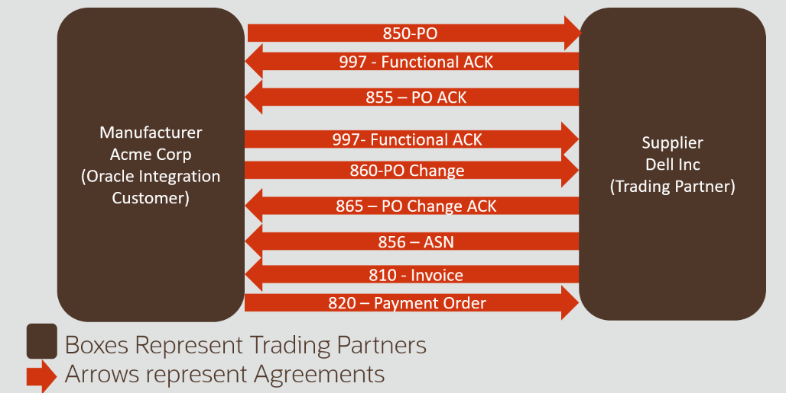
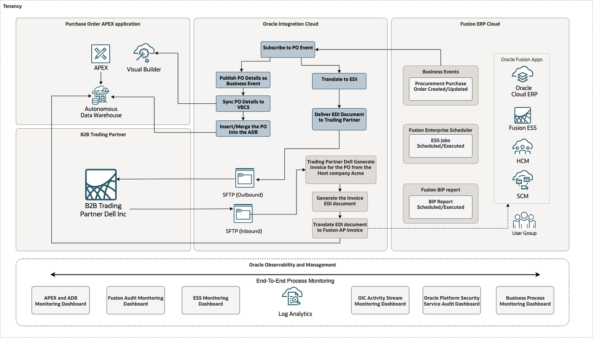
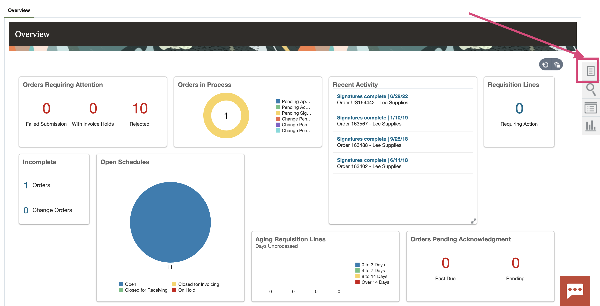
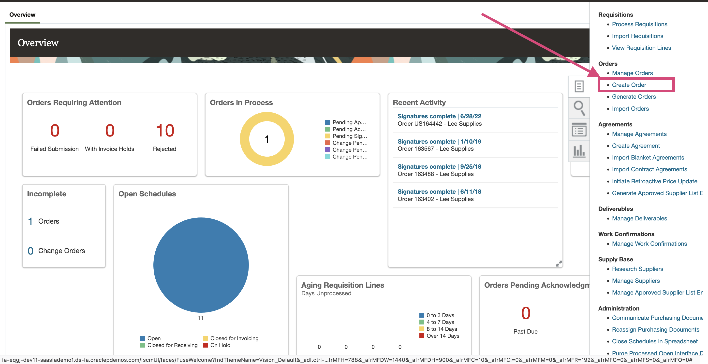
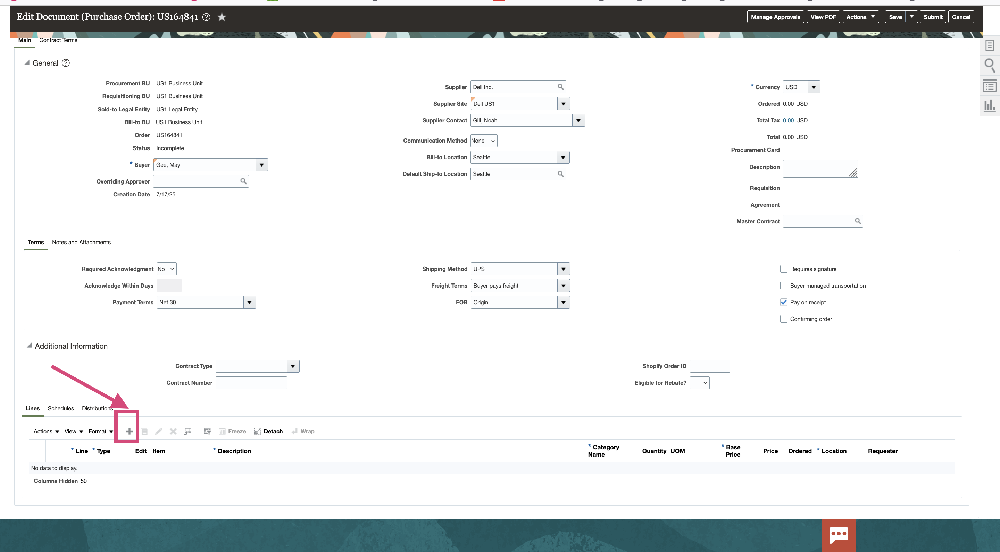
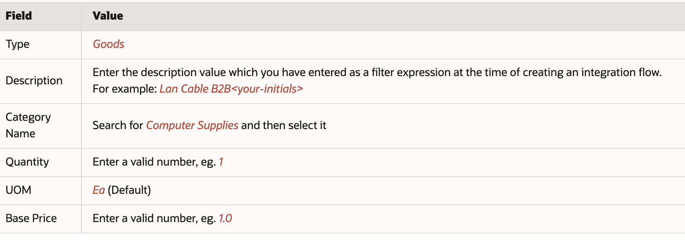

# Lab 2 - Oracle Fusion SaaS ERP Cloud Purchase Order and Oracle Integration Business Flow

## Introduction

This Lab introduces Oracle Fusion SaaS ERP Cloud and Oracle Integration (OIC) integration and business flow with a focus on observability and log analysis. When a user creates a Purchase Order (PO) in ERP Cloud, a real-time PO event is generated, creating the first observability touchpoint. Oracle Integration captures this event and transforms the relevant data, generating comprehensive integration logs throughout the process. The transformed data is pushed to a custom table in Autonomous Data Warehouse (ADW) and Visual Builder Cloud Service (VBCS), each generating their own log streams. The B2B component within Oracle Integration translates the PO payload into an EDI 850 document using the X12 Business Protocol, which is then delivered to a Trading Partner via FTP, creating additional observability points for delivery tracking. Additionally, an approval workflow is initiated by an ERP Process user who selects the order and attaches Letter of Credit (LOC) information via a web form, generating audit trails and user activity logs. Once approved, the PO record in ERP Cloud is updated with the LOC details for cross-referencing, completing the end-to-end traceable business process.


Estimated Time: 60 minutes

### Objectives
In this lab, you will:
- Understand the end-to-end Purchase Order flow architecture involving ERP Cloud, OIC, and B2B trading partners
- Identify observability-relevant touchpoints and log-emitting components across the architecture
- Map out component interactions and log correlation strategies for comprehensive monitoring
- Learn how to trace business processes across multiple Oracle Cloud services using log analytics

## Task 1: Understanding the End-to-End Purchase Order Flow Architecture

In this task, you will explore the complete Purchase Order (PO) business flow architecture and understand how data flows through different Oracle Cloud services, with a focus on observability touchpoints and log-emitting components.

B2B stands for business-to-business integration. This is essentially multiple companies or vendors or enterprises communicating with each other or with their trading partner community with predefined and mutually agreed upon standards. The trading partner community could be a company, your vendors, your suppliers, your business partners, or whoever you need to exchange information and data. The common sets of practices you would use to communicate with them would include essentially a document format and a transport protocol, which together combine to form a common language that you mutually agree upon with your partner. The document formats could be standards like EDI X12 or UN/EDIFACT. The transport protocol layer will be the additional aspect here, where you will establish a connectivity with your trading partner using business protocols like AS2, sFTP, or other B2B protocols. Once you have this connectivity established, you now have B2B integration with your business partners.

**[B2B Overview Video](https://videohub.oracle.com/media/B2B%20in%20Oracle%20Integration%203/1_l80kjw3v/214384793)**

- **Host Company**: The organization initiating the B2B transaction, typically sending or receiving business documents.

- **Trading Partner**: An external company or entity that exchanges business documents with the host company.

- **Outbound Message**: A business document or transaction sent from the host company to a trading partner.

- **Inbound Message**: A business document or transaction received by the host company from a trading partner.

- **Transport Communication**: The protocol and method (such as FTP, SFTP, or AS2) used to securely exchange messages between companies.

- **Agreements**: Predefined rules and configurations that govern how messages are exchanged between the host company and trading partners.

- **B2B Documents and Schemas**: Standardized formats (like EDI X12 or EDIFACT) and their definitions used for structuring business documents exchanged in B2B transactions.

### Example Relationship between Trading Partner and Agreements



### Oracle Fusion SaaS ERP Cloud, Oracle Integration Cloud, Oracle Database, and Visual Builder Monitoring Reference Architecture



The Purchase Order process involves multiple Oracle Cloud services working together to create a seamless business flow with comprehensive observability:

- **Oracle Fusion ERP Cloud** - Initiates the PO creation process and generates business events
- **Oracle Integration Cloud (OIC)** - Orchestrates data transformation, routing, and B2B processing
- **Oracle Database (ADW)** - Stores transformed data for analytics and generates database logs
- **Visual Builder Cloud Service (VBCS)** - Provides user interface and generates application logs
- **B2B Trading Partners** - External systems receiving EDI documents via FTP/SFTP

## (Optional)Task 2: Create Purchase Order in ERP Cloud

**Note: We have configured OIC Robotic Process Automation (RPA) to create a Purchase Order in ERP Cloud via the robots. Therefore the Task 3 and Task 4 are optional. If you are not using RPA, you can proceed to the next task.** Read more: [Get Started with Robots in Oracle Integration 3](https://livelabs.oracle.com/pls/apex/f?p=133:180:110448655824915::::wid:3996)

 1. Access your ERP Cloud environment and login with a user may.gee or equivalent having the correct roles and privileges to create a PO using below URL
    ```
    <copy>
        https://fa-eqgj-dev11-saasfademo1.ds-fa.oraclepdemos.com/fscmUI/faces/FuseWelcome?fndThemeName=Vision_Default
    </copy>   
    ```
    
 2. Navigate to the <em> Procurement </em> Tab.

 3. Click <em> Purchase Orders </em> .

 4. In the **Overview** section, click the <em>Tasks</em> button on the right. 
   
     

    This opens the Tasks menu.

 5. Under the **Orders** section, select <em>Create Order</em>. 
     

    The **Create Order** dialog is displayed. 

 6. Select **Requisitioning BU** and **Procurement BU** as <em>US1 Business Unit</em> and Enter <em>Dell Inc.</em> in the **Supplier** field and select the corresponding supplier in the dropdown. Rest of the fields should be populated automatically.  
           
 
      
      > **Tip:** You can also search for valid suppliers using the **Search** icon.

 7. Click <em>Create</em>. The **Edit Document (Purchase Order)** page is displayed. 

 8. In the **Lines** Tab, click <em>+</em> to add a Purchase Order line row. 
   

 9. Enter values in the below fields (sample values provided) and click on <em>Save</em>
     

 10. Click <em>Submit</em> to initiate the Purchase Order processing. After submitting the Purchase Order, a confirmation message will appear with the PO number. Make a note of the **PO Number**


## (Optional)Task 3: Validate Purchase Order status

After the PO is submitted, the initial status becomes **Pending Approval**. The PO Create event will occur once the status changes to **Open**.

 1.  In the **Overview** section, click <em>Tasks</em> button on the right. This opens the **Tasks** menu.

 2.  Under the **Orders** section, click on <em>Manage Orders</em>.

 3.  Click <em>Search</em>. You should see the Purchase Orders for the current user OR enter the PO number to search for the purchase order which you have created.

 4.  Look for your Purchase Order in the list with the PO number displayed in the previous task.

    > **Tip:** The last created PO should generally be the top one in the list. 

 5. Validate the PO Status. If it's **Open** then the Business Event has occurred.

    > **Note:** If PO has another Status, such as <em>Pending Approval</em>, then wait a couple of minutes and refresh the page until the status changes to **Open**. 
 
 6. Note down the PO Order Number for the future lab reference.

You may now proceed to the [next lab](#next).

## Learn More

* [Oracle Integration 3 B2B](https://livelabs.oracle.com/pls/apex/r/dbpm/livelabs/run-workshop?p210_wid=3921&p210_wec=&session=10094054008456)
* [Oracle Integration 3 - Automate ERP Cloud and B2B Integration with Trading Partners](https://livelabs.oracle.com/pls/apex/r/dbpm/livelabs/run-workshop?p210_wid=3803&p210_wec=&session=25827311700854)
* [Get Started with Robots in Oracle Integration 3](https://livelabs.oracle.com/pls/apex/f?p=133:180:110448655824915::::wid:3996)
* [Oracle Fusion Applications Documentation](https://docs.oracle.com/en/applications/)
* [Oracle Integration Cloud Documentation](https://docs.oracle.com/en/cloud/paas/integration-cloud/)
* [Oracle Autonomous Data Warehouse Documentation](https://docs.oracle.com/en/cloud/paas/autonomous-data-warehouse/)
* [Oracle Visual Builder Cloud Service Documentation](https://docs.oracle.com/en/cloud/paas/visual-builder-cloud/)


## Acknowledgements
* **Author** - Royce Fu, Master Principal Cloud Architect,Kumar Varun, Log Analytics Product Management
* **Contributors** -  Kumar Varun, Royce Fu, Supriya Joshi, Jolly Kundu
* **Last Updated By/Date** - Royce Fu, Sep, 2025
