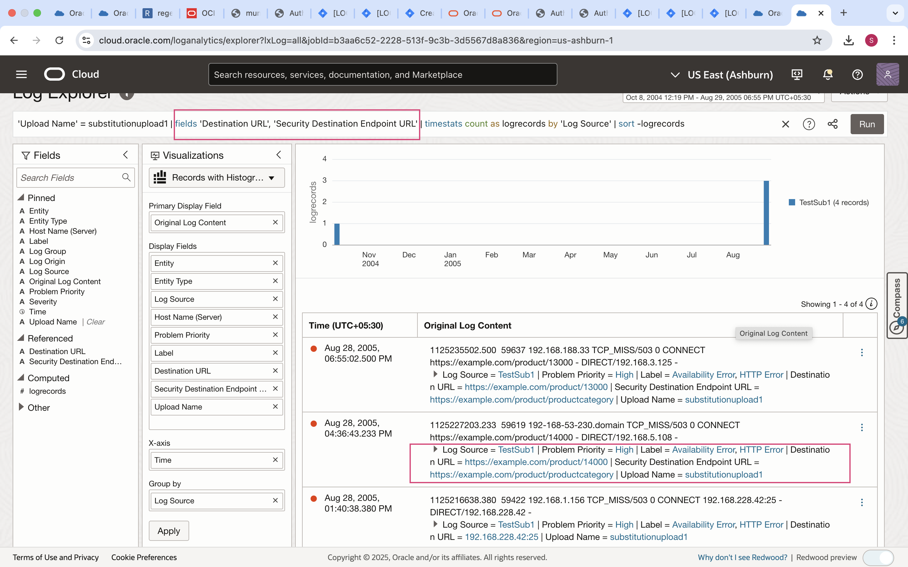

# Ingest, View and Analyze enriched logs

## Introduction
You will learn how to use the Log Explorer to view log records grouped by the field substituted using substitution function.

Estimated Time: 10 minutes

### Objectives

In this lab, you will:
* Explore Visualization

### Prerequisites
* An Oracle Cloud Environment
* Working knowledge of OCI Logging Analytics and OCI in general.

## **Task 1:**  Ingest Logs for Substitution Function enabled Sources
1. In Logging Analytics, upload logs on-demand using substitution enabled Source eg. Source used in Lab 1. 
Download sample logs file for [Squid Proxy Access Logs](./files/squid-access.log) 

    Additional details on On Demand Upload are available in [blog](https://blogs.oracle.com/observability/post/use-oci-logging-analytics-on-demand-upload-to-easily-figure-out-root-cause-issues). 

    > **Note:** To understand more about how log ingestion works see the Logging Analytics [documentation](https://docs.oracle.com/en-us/iaas/logging-analytics/doc/ingest-logs.html).

## **Task 2:**  Viewing enriched logs on Log Explorer
 
1. From the upper left of the OCI Console select the navigation icon   ,  and navigate to **Logging Analytics** and then the **Log Explorer**.  

2. First you will set the log search range. From the upper right of the Log Explorer page (to the left of Actions), drop down the menu to Select the time range as per logs uploaded and click the **Apply** button.

3. On the Log Explorer page, select the upload name and view the logs.

4. Drill down further using input field **Destination URL** and output field  **Security Destination Endpoint URL** used in Lab1 while creating substitution function.

There are many business reasons to use substitution function such as in aforementioned case you want to extract all the log records that have the field **Destination URL** with the content of the format **`https://example.com/product/<ID>`** , and the value of ID varies with each log record. 

In such cases, you can substitute the value of **ID** in the field of each log record with a string **productcategory** and store in a field **Security Destination Endpoint URL**. As a result, all the log records extracted with **Destination URL** in the above format will also have the field **Security Destination Endpoint URL** with the value **`https://example.com/product/productcategory`**. You can now use the field **Security Destination Endpoint URL** in your search query for filtering those logs for further analysis in the Log Explorer.

## Acknowledgements
* **Author** - Supriya Joshi, Logging Analytics Development Team
* **Contributors** -  Jolly Kundu, Logging Analytics Development Team
* **Last Updated By/Date** - Mar 2025
