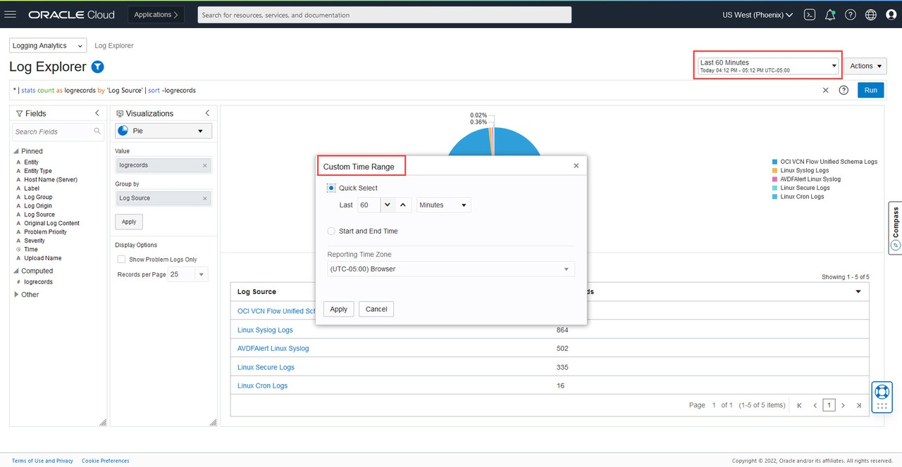
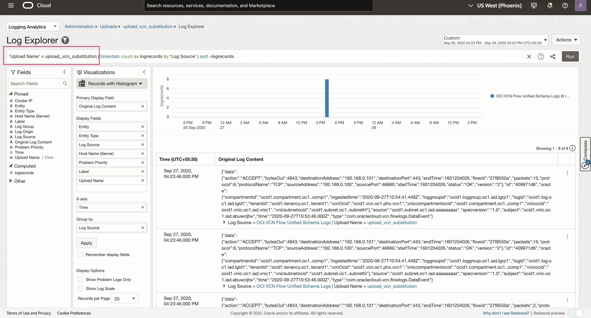
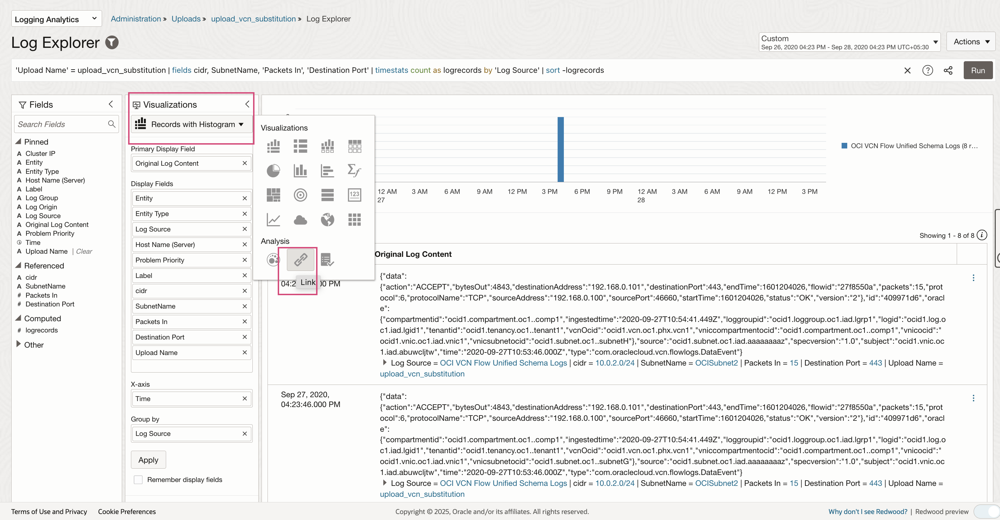
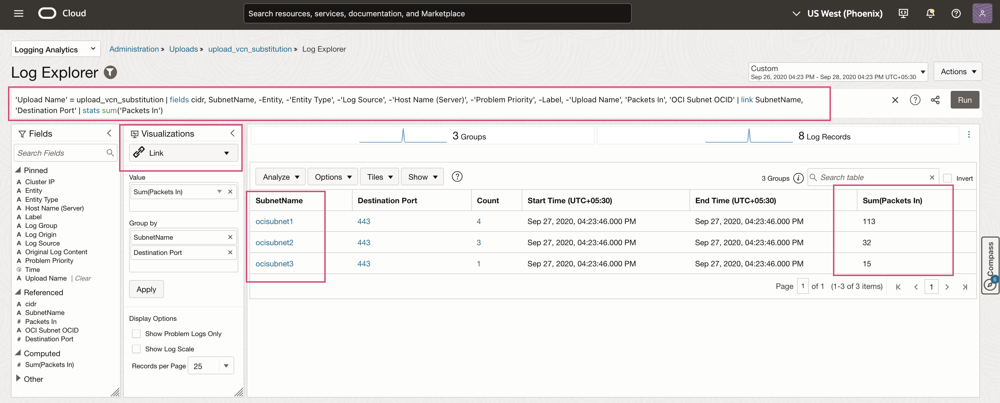

# Ingest, View and Analyze enriched logs

## Introduction
You will learn how to use the Log Explorer to view log records grouped by the field substituted using substitution function and also  the usage of Link Visualization capability to view log records grouped by SubnetName to extract total Packets.

Estimated Time: 10 minutes

### Objectives

In this lab, you will:
* Explore Visualization

### Prerequisites
* An Oracle Cloud Environment
* Working knowledge of OCI Logging Analytics and OCI in general.

## **Task 1:**  Ingest Logs for Substitution Function enabled Sources
1. In Logging Analytics, upload logs on-demand using source **OCI VCN Flow Unified Schema Logs**. 
Download sample logs file for [OCI VCN Flow Unified Schema Logs](./files/vcnflowlog.log) 

    Additional details on On Demand Upload are available in [blog](https://blogs.oracle.com/observability/post/use-oci-logging-analytics-on-demand-upload-to-easily-figure-out-root-cause-issues). 

    > **Note:** To understand more about how log ingestion works see the Logging Analytics [documentation](https://docs.oracle.com/en-us/iaas/logging-analytics/doc/ingest-logs.html).

## **Task 2:**  Viewing enriched logs on Log Explorer
 1. From the upper left of the OCI Console select the navigation icon   ,  and navigate to **Logging Analytics** and then the **Log Explorer**.  

2. First you will set the log search range. From the upper right of the Log Explorer page (to the left of Actions), drop down the menu to Select the time range as per logs uploaded and click the **Apply** button.

3. On the Log Explorer page, select the upload name and view the logs.

4. View more detailed fields by modifying query to include fields used for Substitution function like cidr, SubnetName, Packets In, Destination port and you can see the SubnetName being populated based on substitution function added previously.

## **Task 3:**  Open Link Visualization##
1. On the Log Explorer page, from the upper left and under the **Visualizations** column, select **Link** from the drop-down menu. You will now see a visual **Link**.

2. View the data in link and refine the data displayed by using query where you can sum **Packets In** based on different **SubnetName** extracted by using Substitution function 

There are several business scenarios beyond the one described above where substitution functions are useful. For example, you may want to extract all log records where the field Destination URL contains values in the format  **`https://example.com/product/<ID>`**, where the **ID** varies across log entries.

In such cases, you can substitute the value of **ID** in the field of each log record with a string say **productcategory** and store in a field **Destination Endpoint URL**. As a result, all the log records extracted with **Destination URL** in the above format will also have the field **Destination Endpoint URL** with the value **`https://example.com/product/productcategory`**. You can now use the field **Destination Endpoint URL** in your search query for filtering those logs for further analysis in the Log Explorer.

## Acknowledgements
* **Author** - Supriya Joshi, Logging Analytics Development Team
* **Contributors** -  Jolly Kundu, Logging Analytics Development Team
* **Last Updated By/Date** - May 2025
