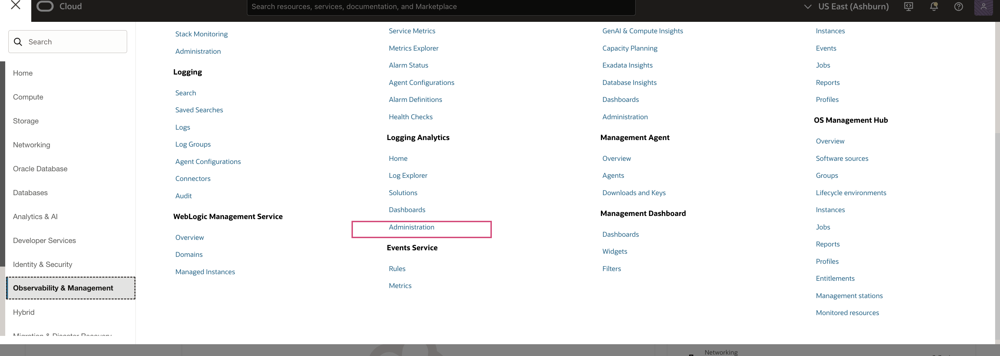
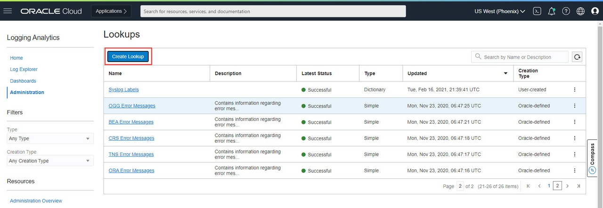
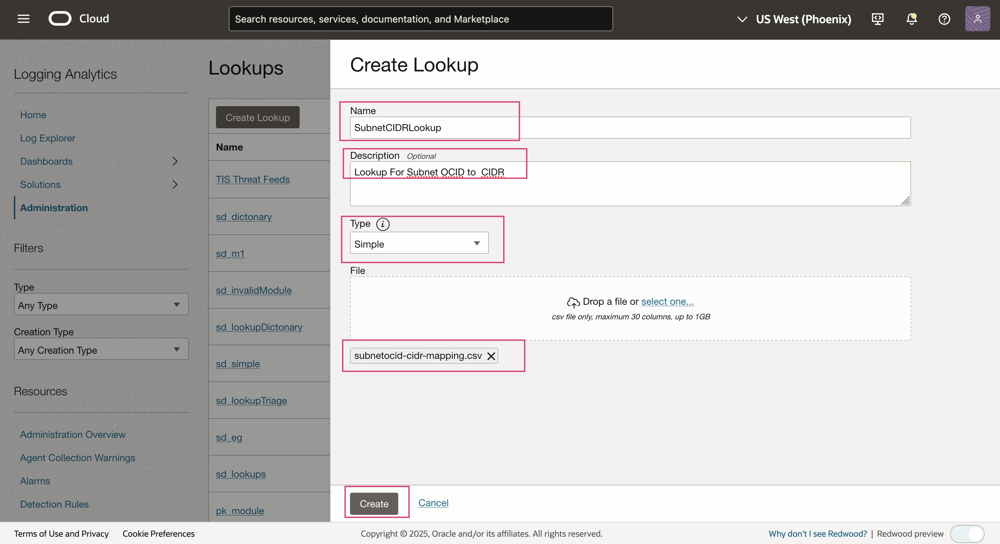
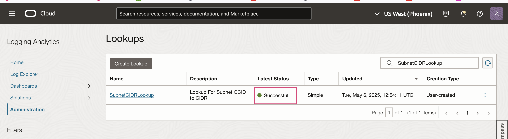
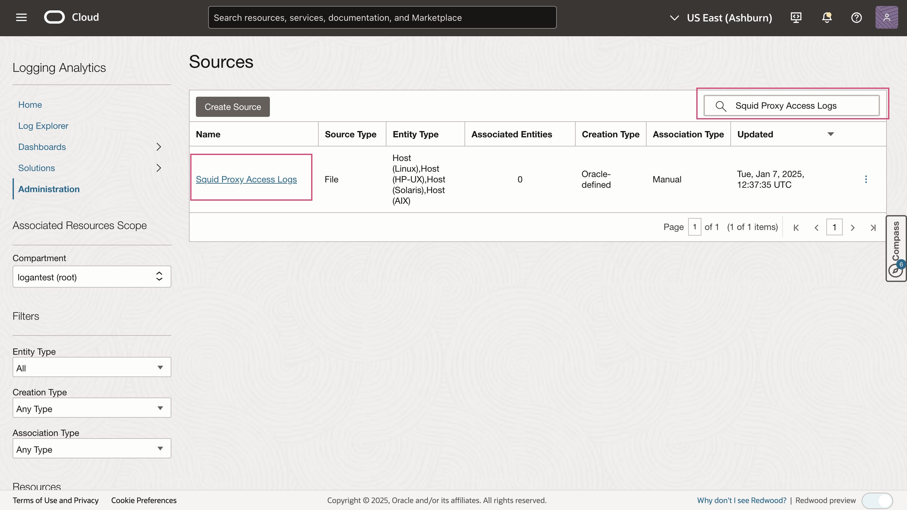
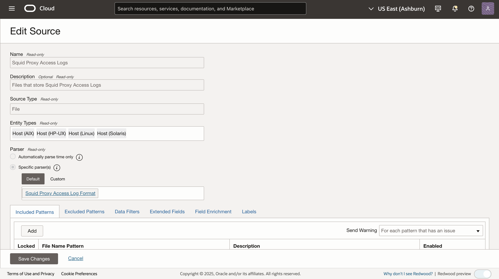
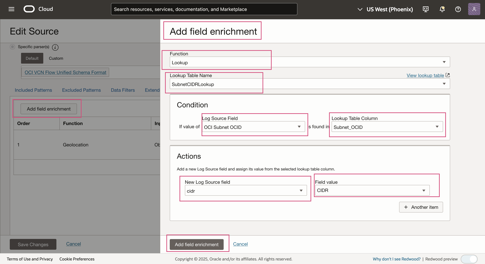
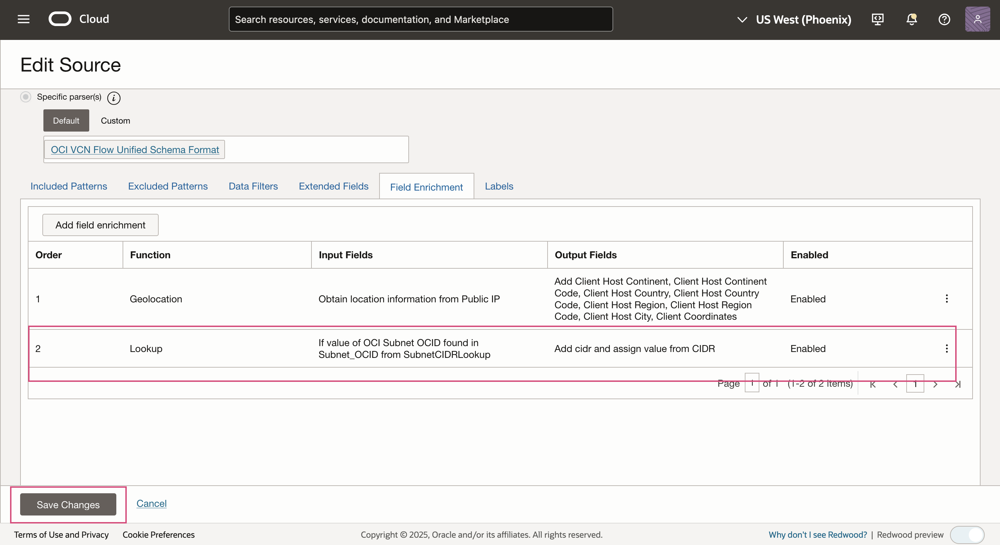
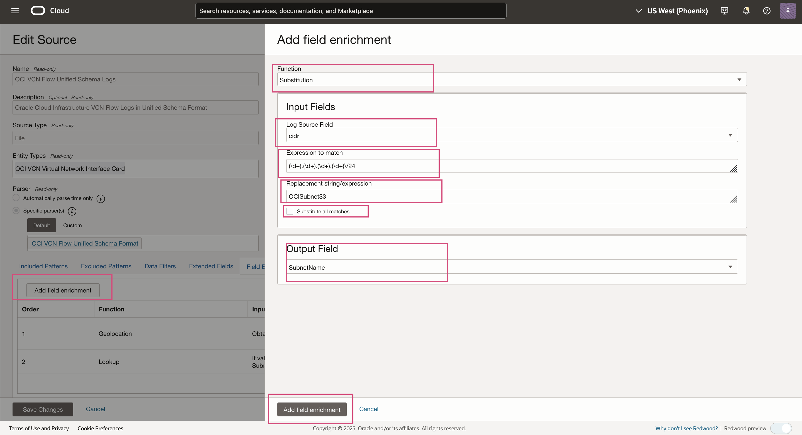
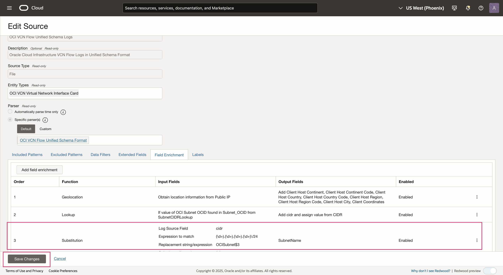

# Configure field enrichment - Substitution Function

## Introduction

In this Lab, you will configure a Logging Analytics out of the box source and use substitution function as a field enrichment option.
You can see an example use case published at [Substitution Function Blog](https://blogs.oracle.com/observability/post/unlocking-power-log-data-la-substitution-function).

In the above use case, Oracle Cloud Logging Analytics utilizes the Substitution Function to extract Subnet OCIDs, perform CIDR lookups, replace them with corresponding subnet names, and store the results in a new field. This enriched data is then applied to log records, enabling packet counts to be grouped by subnet name — thereby improving security visibility and delivering deeper network insights.


Estimated Time: 30 minutes

### Objectives

In this lab, you will:
* Create a Lookup to map Subnet OCID → CIDR.
* Enrich the `OCI VCN Flow Unified Schema Logs` log source using the created lookup.
* Apply regex-based substitution enrichment to:
   Extract Subnet OCIDs from logs
   Retrieve corresponding CIDR and subnet details using the lookup
   Replace raw OCIDs with meaningful subnet information


### Prerequisites

* You must have an [Oracle Cloud Infrastructure](https://cloud.oracle.com/en_US/cloud-infrastructure) enabled account.
* Logging Analytics Service must be onboarded.
* Working knowledge of OCI Logging Analytics and OCI in general.


Now we will walk through creating a lookup, configuring a source with lookup and substitution function.

## **Task 1:**  Create Lookup in Logging Analytics
Lookup allows you to match field-value combinations from Source to an external Lookup table, and if matched, the service appends field-value combinations to the log.</br>
For this task, we will be creating a **Simple** Lookup.</br>
Additional details are available in [Lookup documentation](https://docs.oracle.com/en-us/iaas/logging-analytics/doc/manage-lookups.html)

Lookup is created using a Comma Separated Values (csv) file. You will use the mapping table provided by your Network Administrator and create the file.

1. First create a Comma Separated Values (csv) file containing Subnet OCID → CIDR mappings.</br>
Please save the [sample lookup file](./images/subnetocid-cidr-mapping.csv) which we will upload later.
This is what the csv file looks like.
    ```
    <copy>
    Subnet_OCID,CIDR
    ocid1.subnet.oc1..subnetA,10.0.0.0/24
    ocid1.subnet.oc1..subnetB,10.0.1.0/24
    ocid1.subnet.oc1..subnetC,10.0.2.0/24
    ocid1.subnet.oc1..subnetD,10.0.3.0/24
    ocid1.subnet.oc1..subnetE,10.0.1.0/24
    ocid1.subnet.oc1..subnetF,10.0.1.0/24
    ocid1.subnet.oc1..subnetG,10.0.2.0/24
    ocid1.subnet.oc1..subnetH,10.0.2.0/24
    </copy>
    ```
    
2. Open the navigation menu and click **Observability & Management**. Under **Logging Analytics** click **Administration**.


3. The administration resources are listed in the left hand navigation pane under **Resources**. Click **Lookups** to open lookups listing page.</br>
Here you will see Lookups for Oracle sources already defined. For this Lab, you are going to create a custom Lookup. Now click the **Create Lookup** button to open the Lookup creation dialog.
     

4. Next, configure your custom Lookup

    a. Enter **SubnetCIDRLookup** into the **Name** field.</br>
    b. Type in **Lookup For Subnet OCID to CIDR** into the optional **Description** field.</br>
    c. For the **Type** field, drop down the menu and select **Simple**.</br>
    d. And choose **csv** as the file extension for the file that you created above.</br>
    e. Once you have finished the configuration of your custom Lookup, click **Create** button and you will be returned to the Lookup listing page where you will see the newly added Lookup `SubnetCIDRLookup`</br>
        
    f. Refresh the Lookups listing page and watch for a **Successful** status to appear under the **Latest Status** heading.</br>
        
> **Note:** It may take up to 5 minutes to process the Lookup data.

## **Task 2:**  Create Fields in Logging Analytics
Create user defined field **cidr** and **SubnetName** which will be used for field enrichment.
> **Note:** To understand more about how field is created see the Logging Analytics [documentation](https://docs.oracle.com/en-us/iaas/logging-analytics/doc/create-field.html).

## **Task 3:**  Configure Log Source with Lookup
In this task, you will configure a Log Source to add Field Enrichment as Lookup.

1. From the upper left of the OCI Console select the navigation icon (looks like 3 bars), drop down the menu and navigate to **Logging Analytics** then to **Administration**, and then **Sources**. On the Sources page, type **OCI VCN Flow Unified Schema Logs** into the search field and then enter.
     

2. In the Source row, look to the right of **OCI VCN Flow Unified Schema Logs**, then click the three dots to be brought to the **Edit Source** page for this source.


3. From the **Edit Source** page, click **Field Enrichment** tab to add  **Lookup**.</br>
      a. On the Field Enrichment tab, click the **Add field enrichment** button (appears under Included Patterns heading) to add the Lookup.</br>
      b. When the **Add Field Enrichment** dialog appears, from the **Function** field, select **Lookup** from the drop-down menu.</br>
      c. For the **Lookup Table Name** field, select **SubnetCIDRLookup** from the drop-down menu.</br>
      d. In the **Condition** section for the **Log Source Field** select **OCI Subnet OCID** from the drop-down menu and for the **Lookup Table Column** field select **Subnet_OCID** from the drop-down menu.</br>
      e. In the **Actions** section for the **New Log Source field**  select **cidr** from the drop-down menu and for the **Field value** select **CIDR** from the drop-down menu.</br>
      f. Click **Add field enrichment** button to return to the **Field Enrichment** tab.</br>
      

4. Observe the new row for **Lookup** that appear under the **Extended Fields** tab.
      

5. Click the  **Save Changes** button to save the Source.

## **Task 4:**  Configure Log Source with Substitution Function
In this task, you will configure a Log Source to add Field Enrichment as Substitution function.

1. Follow Task 3, Step 1 and Step 2 to edit the source 

2. From the **Edit Source** page, click **Field Enrichment** tab  and add Substitution Function.</br>
      a. Click **Add Field Enrichment** button to open Field Enrichment dialog box.</br>
      b. Select **Substitution** as the **Function**.</br>
      c. In **Input Fields** section, type **Log Source Field** as **cidr**.</br>
      d. In **Expression to match**, provide the regex expression to match for the string in the    
         field that must be replaced say **(\d+).(\d+).(\d+).(\d+)\/24**.</br>
      e. Specify **Replacement string/expression** , that should be  substituted in place of the original 
         value of the input field say  **OCISubnet$3** in this case</br>
      f. For multiple occurrences of the string to be replaced within a field, enable **Substitute all matches** check box.</br> 
      g. In **Output Field** section, select the field that must store the new value of the input field after the original value is replaced with the substitution value say **SubnetName**.</br>
      h. Click **Add field enrichment**. 
      

3. Observe new row that appear under the **Field Enrichment** tab.


4. Click the  **Save Changes** button to save the Source.
 
 > Note: After saving the Source, it takes up to 10 minutes to refresh it on server. Any logs ingested meanwhile will use old version of the Source.

This completes the Administration changes for Substitution Function Enrichment.

You may now **proceed to the [next lab](#next)**.

## Acknowledgements
* **Author** - Supriya Joshi, Logging Analytics Development Team
* **Contributors** -  Jolly Kundu, Logging Analytics Development Team
* **Last Updated By/Date** - May 2025
