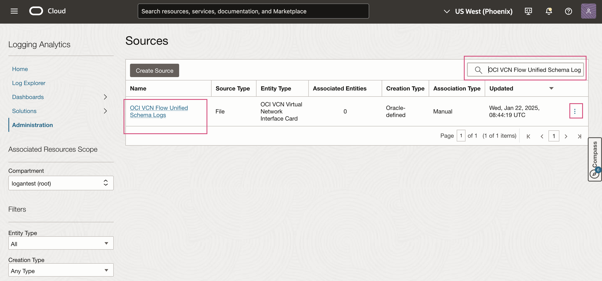

# Configure field enrichment - Substitution Function

## Introduction

In this Lab, you will configure a Logging Analytics out of the box source and use substitution function as a field enrichment option.

Estimated Time: 30 minutes

### Objectives

In this lab, you will see step-by-step instructions to:

* Configure an Out of the box source  `Squid Proxy Access Logs` with substitution function for replacing an expression in the field.
 

### Prerequisites

* You must have an [Oracle Cloud Infrastructure](https://cloud.oracle.com/en_US/cloud-infrastructure) enabled account.
* Logging Analytics Service must be onboarded.
* Working knowledge of OCI Logging Analytics and OCI in general.

Now we will walk through configuring a substitution function for a source.

## **Task 1:**  Configure Log Source
In this task, you will configure a Log Source to add Field Enrichment - Substitution Function.

1. Open the navigation menu and click **Observability & Management**. Under **Logging Analytics** click **Administration**.

2. The administration resources are listed in the left hand navigation pane under **Resources**. Click **Sources** to open source listing page. In the **Sources** page in the upper right, type `Squid Proxy Access Logs` into the search field and enter. Squid Proxy Access Logs source will be displayed under Name.

3. In the Source row, look to the right of `Squid Proxy Access Logs`, then click the three dots and select **Edit** menu to be brought to the **Edit Source** page.

4. Click the **Field Enrichment** tab and add Substitution Function. 
      a. Click **Add** button to open Field Enrichment dialog box. 
      b. Select **Substitution** as the **Function**. 
      c. In **Input Fields** section, type **Log Source Field** as **Destination URL**. 
      d. In **Expression to match**, provide the regex expression to match for the string in the    
         field that must be replaced say **(https:\/\/)([a-zA-Z0-9.-]+)(\/product\/)(\d+)**. 
      e. Specify **Replacement string/expression** , that should be  substituted in place of the original 
         value of the input field say  **$1$2$3productcategory** in this case 
      f. For multiple occurrences of the string to be replaced within a field, enable **Substitute all matches** 
         check box.  
      g. In **Output Field** section, select the field that must store the new value of the input field after 
         the original value is replaced with the substitution value say **Security Destination Endpoint URL**. 
      h. Click **Add field enrichment**. 
      

5. Observe new row that appear under the **Field Enrichment** tab.

6. Click the **Save Changes** button to save the Source.

This completes the Administration changes for Substitution Function Enrichment.

You may now **proceed to the [next lab](#next)**.

## Acknowledgements
* **Author** - Supriya Joshi, Logging Analytics Development Team
* **Contributors** -  Jolly Kundu, Logging Analytics Development Team
* **Last Updated By/Date** - Mar 2025
