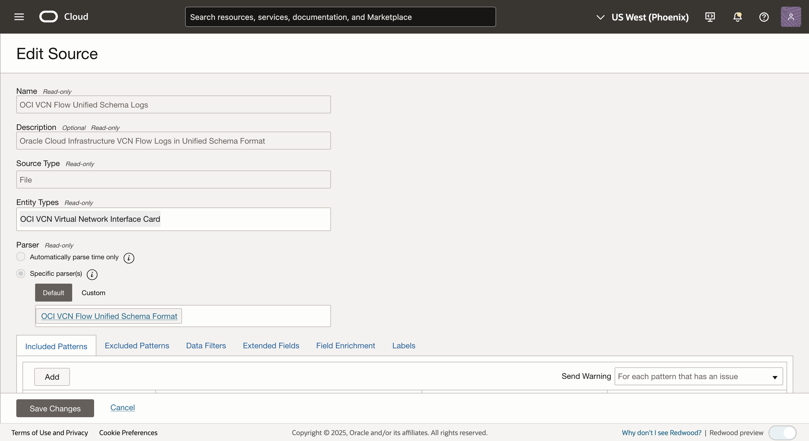

# Configure field enrichment - Substitution Function

## Introduction

In this Lab, you will configure a Logging Analytics out of the box source and use substitution function as a field enrichment option.
Ingest logs for the same source and use the Log Explorer to view log records grouped by the field substituted using substitution function.

Estimated Time: 30 minutes

### Objectives

In this lab, you will see step-by-step instructions to:

* Configure an Out of the box source  `Squid Proxy Access Logs` with substitution function for replacing an expression in the field.
* Ingest Logs using ODU
* Explore Visualization

### Prerequisites
* An Oracle Cloud Environment
* Working knowledge of OCI Logging Analytics and OCI in general.
 

### Prerequisites

* You must have an [Oracle Cloud Infrastructure](https://cloud.oracle.com/en_US/cloud-infrastructure) enabled account.
* Logging Analytics Service must be onboarded.
* Working knowledge of OCI Logging Analytics and OCI in general.

Now we will walk through configuring a substitution function for a source, ingest logs and view enriched logs.

## **Task 1:**  Configure Log Source
In this task, you will configure a Log Source to add Field Enrichment - Substitution Function.

1. Open the navigation menu and click **Observability & Management**. Under **Logging Analytics** click **Administration**.

2. The administration resources are listed in the left hand navigation pane under **Resources**. Click **Sources** to open source listing page. In the **Sources** page in the upper right, type `Squid Proxy Access Logs` into the search field and enter. Squid Proxy Access Logs source will be displayed under Name.

3. In the Source row, look to the right of `Squid Proxy Access Logs`, then click the three dots and select **Edit** menu to be brought to the **Edit Source** page.

4. Click the **Field Enrichment** tab and add Substitution Function. 
      a. Click **Add** button to open Field Enrichment dialog box. 
      b. Select **Substitution** as the **Function**. 
      c. In **Input Fields** section, type **Log Source Field** as **Destination URL**. 
      d. In **Expression to match**, provide the regex expression to match for the string in the    
         field that must be replaced say **(https:\/\/)([a-zA-Z0-9.-]+)(\/product\/)(\d+)**. 
      e. Specify **Replacement string/expression** , that should be  substituted in place of the original 
         value of the input field say  **$1$2$3productcategory** in this case 
      f. For multiple occurrences of the string to be replaced within a field, enable **Substitute all matches** 
         check box.  
      g. In **Output Field** section, select the field that must store the new value of the input field after 
         the original value is replaced with the substitution value say **URIL**. 
      h. Click **Add field enrichment**. 
      

5. Observe new row that appear under the **Field Enrichment** tab.

6. Click the **Save Changes** button to save the Source.

This completes the Administration changes for Substitution Function Enrichment.

## **Task 2:**  Ingest Logs for Substitution Function enabled Sources
1. In Logging Analytics, upload logs on-demand using substitution enabled Source eg. Source used in Task 1 and provide an 
**Upload Name** say **substitution_upload1**. 
Download sample logs file for [Squid Proxy Access Logs](./files/squid-access.log) 

    Additional details on On Demand Upload are available in [blog](https://blogs.oracle.com/observability/post/use-oci-logging-analytics-on-demand-upload-to-easily-figure-out-root-cause-issues). 

    > **Note:** To understand more about how log ingestion works see the Logging Analytics [documentation](https://docs.oracle.com/en-us/iaas/logging-analytics/doc/ingest-logs.html).

## **Task 3:**  View enriched logs on Log Explorer
 
1. From the upper left of the OCI Console select the navigation icon   ,  and navigate to **Logging Analytics** and then the **Log Explorer**.  

2. First you will set the log search range. From the upper right of the Log Explorer page (to the left of Actions), drop down the menu to Select the time range as per logs uploaded and click the **Apply** button.

3. On the Log Explorer page, select the upload name and view the logs.

4. Drill down further using input field **Destination URL** and output field  **URI** used in Task 1 while creating substitution function.

There are many business reasons to use substitution function such as in aforementioned case you want to extract all the log records that have the field **Destination URL** with the content of the format **`https://example.com/product/<ID>`** , and the value of ID varies with each log record. 

In such cases, you can substitute the value of **ID** in the field of each log record with a string **productcategory** and store in a field **URI**. As a result, all the log records extracted with **Destination URL** in the above format will also have the field **URI** with the value **`https://example.com/product/productcategory`**. You can now use the field **URI** in your search query for filtering those logs for further analysis in the Log Explorer.

## Acknowledgements
* **Author** - Supriya Joshi, Logging Analytics Development Team
* **Contributors** -  Jolly Kundu, Logging Analytics Development Team
* **Last Updated By/Date** - Mar 2025
