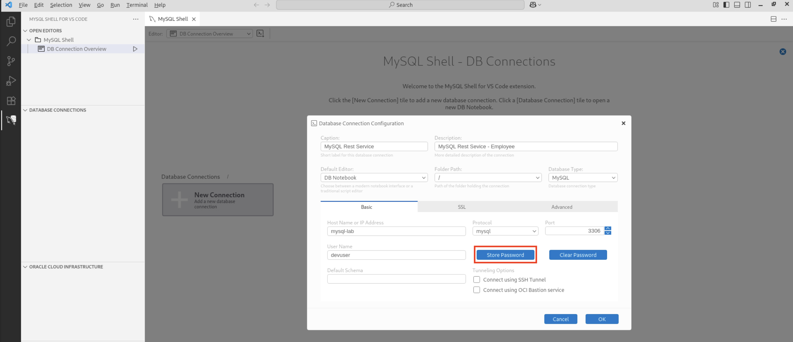
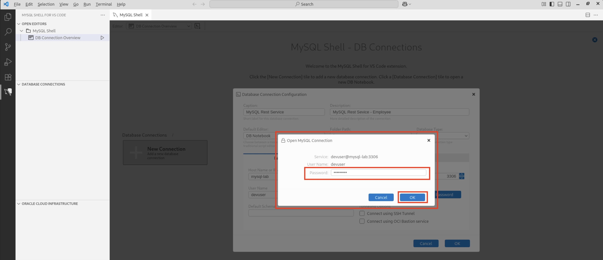
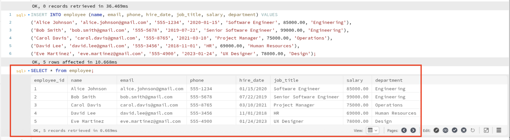
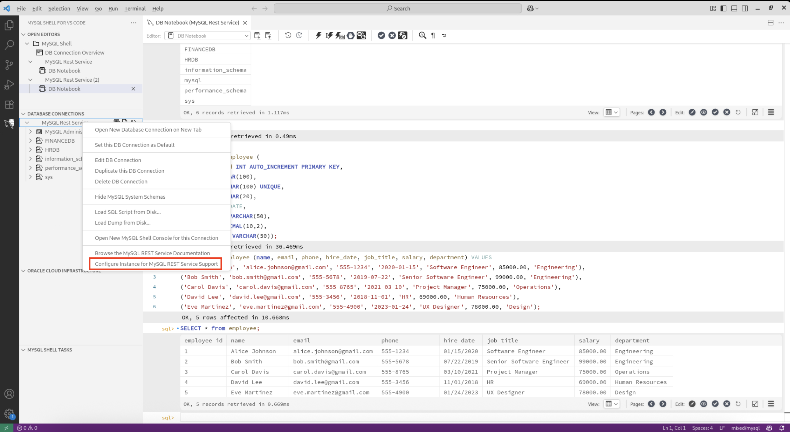
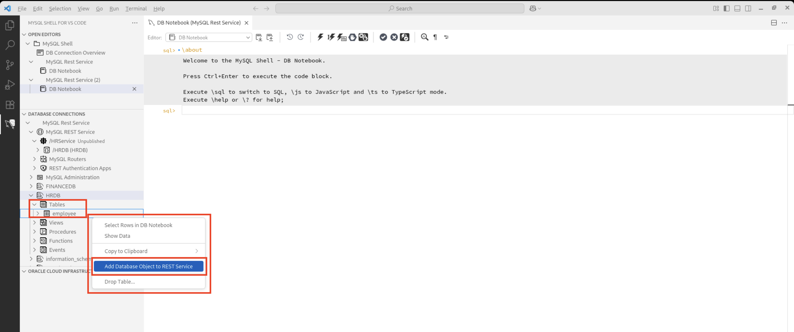
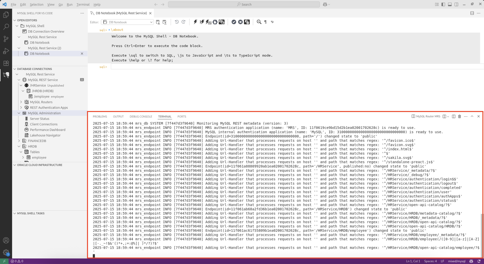
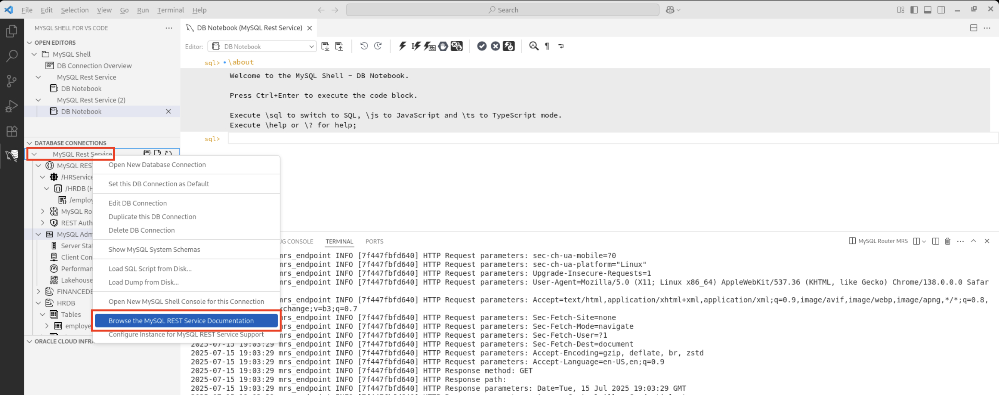

# MySQL Rest Service

## Introduction

Modern development demands tools that minimize context switching and improve efficiency. The MySQL Shell extension for Visual Studio Code makes that possible by bringing powerful database interaction directly into the developer's workspace. With seamless support for connecting, querying, and scripting in SQL, Javascript, and TypeScript - all inside the familiar VS Code environment - it helps developers stay focused and productive.

In this lab, you'll learn how to connect to a MySQL DB system using the MySQL Shell Extension in Visual Studio Code. This setup is especially useful if you are working in a development environment and prefer using VS code interface to manage your database.

Estimated time: 20 minutes

### Objectives

* Connect to a MySQL DB system on OCI using MySQL Shell extension for VS Code
* Create a sample employees table
* Enable MySQL Rest Service (MRS)
* Perform CRUD operations using curl via REST API

## Task 1: Connect to a MySQL DB system using MySQL Shell extension for VS Code

1. Launch Visual Studio Code and click on the MySQL Shell for VS Code icon in the left sidebar. This opens the database panel where you can add and manage connections.

     

2. Click the **+ New Connection** button within the Database Connections panel or on the home tab. Either ways will work to create a new connection.

     

3. This opens up a new connection tab to fill in the required details in the dialog box.

     

4. Fill in the required fields:

    * **Caption**: A friendly name for your connection - In our example use the caption as MySQL Rest Service
    * **Description**: A optional but helpful description - In our example use the desription as MySQL Rest Service - Employee
    * **Host Name or IP Address**: Enter the hostname as **mysql-lab**
    * **Port**: The port your MySQL server is running on - In our example we are typically using 3306
    * **Username**: Enter the username as **devuser**

    

5. Once you have filled in the above details, click on **Store Password** to minimize entering the password every time for convenience. Enter password as **Welcome$1** to connect to the host.

    

6. Once the password is entered, click on **OK** to save the password.

    

7. After all these details are entered, click on **OK** to save connection to the MySQL DB system.

    

8. If the connection is successful, you will see the connection created and the MySQL DB system name appears under Database Connections as well.

    

9. Clicking on the connection opens the MySQL Shell Extension for the MySQL DB system.

    

10. Run a simple query given below to list the databases inside the MySQL DB system. Click the **Run** button in the top editor toolbar to execute your query.

     ```
     <copy>SHOW DATABASES;</copy>
     ```
     

11. Once executed successfully it lists all available databases on the connected MySQL DB system. Results appear just below, displayed in a clean, tabular layout.

    

12. You can also connect to your MySQL DB system from the left bar navigation by clicking on the notebook icon.

    

## Task 2: Create an employees Table

1. In the connected shell, you can now connect to the database called **HRDB** using the following command and click on execute button on the top navigation bar.

     ```
     <copy>use HRDB;</copy>
     ```
     

2. Since now you got connected to the MySQL database, you can create a sample table called **employees**.

     ```
     <copy>CREATE TABLE employee (employee_id INT AUTO_INCREMENT PRIMARY KEY, name VARCHAR(100), email VARCHAR(100) UNIQUE, phone VARCHAR(20), hire_date DATE, job_title VARCHAR(50), salary DECIMAL(10, 2), department VARCHAR(50));</copy>
     ```
     

3. Insert sample records into the table to proceed to the next task by clicking on the execute button to run the query.

     ```
     <copy>INSERT INTO employee (name, email, phone, hire_date, job_title, salary, department) VALUES
('Alice Johnson', 'alice.johnson@gmail.com', '555-1234', '2020-01-15', 'Software Engineer', 85000.00, 'Engineering'),
('Bob Smith', 'bob.smith@gmail.com', '555-5678', '2019-07-22', 'Senior Software Engineer', 99000.00, 'Engineering'),
('Carol Davis', 'carol.davis@gmail.com', '555-8765', '2021-03-10', 'Project Manager', 75000.00, 'Operations'),
('David Lee', 'david.lee@gmail.com', '555-3456', '2018-11-01', 'HR', 69000.00, 'Human Resources'),
('Eve Martinez', 'eve.martinez@gmail.com', '555-4900', '2023-01-24', 'UX Designer', 78000.00, 'Design');</copy>
     ```
     

4. You can view the records of the table using the below command.

     ```
     <copy>SELECT * from employees;</copy>
     ```
     

5. Here is the output to the query executed.

    

## Task 3: Configuring MRS and Creating a MRS Service

1. To configure a MySQL instance for MRS, right click on the MySQL Rest Service database connection and select **Configure Instance for MySQL REST Service Support** from the popup menu. This step will create the MRS metadata schema that will store all metadata information about the REST services.

     

2. After MRS has been configured, a new REST Service can be added. Open the Database Connection, right click the MySQL REST Service entry and the select **Add REST Service**.

     

3. Fill in the **Rest Service Path** and **Rest Service Name** as mentioned and click on **OK**.

     

     

4. To add a MySQL database schema to the MRS Service with MySQL Shell for VS Code, simply right click on the schema in the DATABASE CONNECTIONS view and select **Add Schema to REST Service** from the popup menu.

     

     

5. In the next step, a MySQL table can be added. Right click on the table in the DATABASE CONNECTIONS view and select **Add Database Object to REST Service** from the popup menu. Ensure the desired CRUD operations are selected (READ is selected by default) and again remove the checkmark from the Requires Authentication flag to make the object publicly available.

     

     

     

6. The MySQL Shell for VS Code extension ships with the MySQL Router included and can be used to bootstrap and starting the MySQL Router. Right click the MySQL REST Service tree item and select Start Local MySQL Router Instance. This will automatically initiate the bootstrap process if it was not completed before.

     

     

7. Enter the DB Connection's password as **Welcome$1** and a random JSON Web Token (JWT) secret as **Welcome$1**. Please note that this JWT secret always needs to be the same for every MySQL Router instance when deploying multiple routers for the same MySQL solution.

     

8. As soon as the MySQL Router is started the debug output can be seen in the VS Code terminal.

     

9. Now that a REST Service has been created and the MySQL Router has been started we can access the REST endpoints with a web browser.

    

10. If no host name has been specified for the REST Service, https://localhost:8447 will be added automatically. Access the APIs using the URL https://mysql-lab:8447/HRService/HRDB/employee.

     

11. Adding a Primary Key value to the request path (e.g. /1) will filter the result to a single data set.
Adding offset and limit as query parameters allow you to page the full data set. The default page size can be set in the REST Schema and REST Object settings.

     

12. Take a look at the documentation for further details.

     

## Acknowledgements

* **Author** - Sindhuja Banka, HeatWave MySQL Product Manager
* **Contributors** - Sindhuja Banka, Anand Prabhu
* **Last Updated By/Date** - Sindhuja Banka, July 2025
