# MySQL Rest Service

## Introduction

Modern application development demands tools that reduce context switching and improve developer productivity. The MySQL Shell extension for Visual Studio Code brings powerful database interaction directly into your development workspace.

With seamless support for SQL, Javascript, and TypeScript right inside the familiar VS Code environment developers can connect, query, and script against MySQL databases without ever leaving their IDE.

In this lab, you'll learn how to connect to a MySQL DB system using the MySQL Shell extension in Visual Studio Code. This setup is especially useful if you are working in a development environment and prefer using VS code interface to manage your databases.

Estimated time: 30 minutes

### Objectives

* Connect to a MySQL DB system using MySQL Shell extension for VS Code
* Create a sample employee table
* Enable MySQL Rest Service (MRS)
* Perform CRUD operations using OpenAPI Web UI

## Task 1: Connect to a MySQL DB system using MySQL Shell extension for VS Code

1. Launch Visual Studio Code and click on the **MySQL Shell for VS Code icon** in the left sidebar. This opens the database panel where you can add and manage connections.

     

2. Click the **+ New Connection** button within the Database Connections panel or on the home tab. Either ways will work to create a new connection.

     

3. This opens up a new connection tab to fill in the required details in the dialog box.

     

4. Fill in the required fields:

    * **Caption**: A friendly name for your connection. In this example, use **MySQL Rest Service**
    * **Description**: An optional but helpful description. Use **MySQL Rest Service - Employee** as the description
    * **Host Name or IP Address**: Enter the hostname as **mysql-lab**
    * **Port**: This is the port your MySQL server is running on. Typically, it is **3306**
    * **Username**: Enter the username as **devuser**

    

5. Once you filled in the above details, click on **Store Password** to minimize entering the password every time for convenience. Enter password as **Welcome$1** to connect to the host.

    

6. Once the password is entered, click on **OK** to save the password.

    

7. After all the details are entered, click on **OK** to save connection to the MySQL DB system.

    

8. If the connection is successful, you will see a connection created and the MySQL DB system connection name appears under Database Connections as well.

    

9. Clicking on the connection opens MySQL Shell DB Notebook for MySQL DB system.

    

10. Run a simple query given below to list the databases inside the MySQL DB system. Click the **Run** button in the top editor toolbar to execute your query.

     ```
     <copy>SHOW DATABASES;</copy>
     ```
     

11. Once executed successfully it lists all available databases on the connected MySQL DB system. Results appear just below, displayed in a clean, tabular layout.

    

12. You can also connect to your MySQL DB system from the left bar navigation by clicking on the **notebook** icon beside the connection name.

    

## Task 2: Create an employee Table

1. In the connected shell, you can now connect to the database called **HRDB** using the following command and click on run button on the top navigation bar to execute the query.

     ```
     <copy>use HRDB;</copy>
     ```
     

2. Since now you got connected to the MySQL DB system, you can create a sample table called **employee** by using the following command and click on run button on the top navigation to execute the query.

     ```
     <copy>CREATE TABLE employee (
          employee_id INT AUTO_INCREMENT PRIMARY KEY,
          name VARCHAR(100),
          email VARCHAR(100) UNIQUE,
          phone VARCHAR(20),
          hire_date DATE,
          job_title VARCHAR(50),
          salary DECIMAL(10, 2),
          department VARCHAR(50));</copy>
     ```
     

3. Insert sample records into the table **employee** to proceed to the next task by clicking on the run button to execute the query.

     ```
     <copy>INSERT INTO employee (name, email, phone, hire_date, job_title, salary, department) VALUES
('Alice Johnson', 'alice.johnson@gmail.com', '555-1234', '2020-01-15', 'Software Engineer', 85000.00, 'Engineering'),
('Bob Smith', 'bob.smith@gmail.com', '555-5678', '2019-07-22', 'Senior Software Engineer', 99000.00, 'Engineering'),
('Carol Davis', 'carol.davis@gmail.com', '555-8765', '2021-03-10', 'Project Manager', 75000.00, 'Operations'),
('David Lee', 'david.lee@gmail.com', '555-3456', '2018-11-01', 'HR', 69000.00, 'Human Resources'),
('Eve Martinez', 'eve.martinez@gmail.com', '555-4900', '2023-01-24', 'UX Designer', 78000.00, 'Design');</copy>
     ```
     

4. Retrieve all the records from the employee table using the following query.

     ```
     <copy>SELECT * from employee;</copy>
     ```
     

5. Here is the output of the query where it lists all the records from employee table.

    

## Task 3: Configuring MRS and Creating a MRS Service

1. To configure a MySQL DB system for MRS, right click on the MySQL Rest Service database connection and select **Configure Instance for MySQL REST Service Support** from the popup menu. This step will create the MRS metadata schema that will store all metadata information about the REST services.

     

2. Click **OK** to configure instance for MySQL Rest Service Support. Uncheck create default REST authentication app.

     

3. After MRS has been configured, a new REST Service can be added. Expand MySQL Rest Service database connection to right click the MySQL REST Service entry and select **Add REST Service**.

     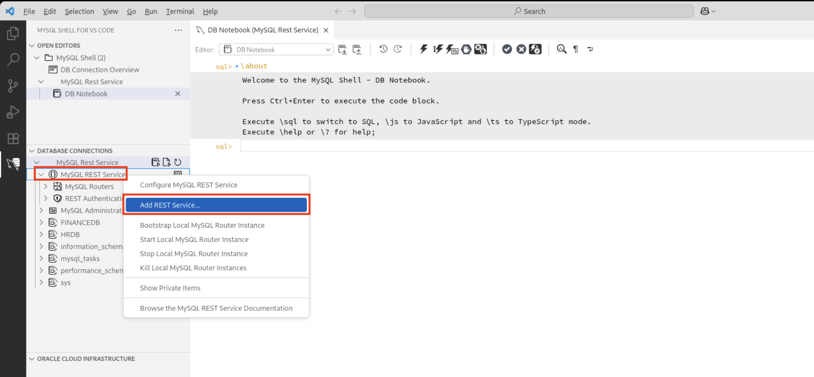

4. Fill in the Rest Service Path as **/HRService** and Rest Service Name as **HRService** and click on **OK**.

     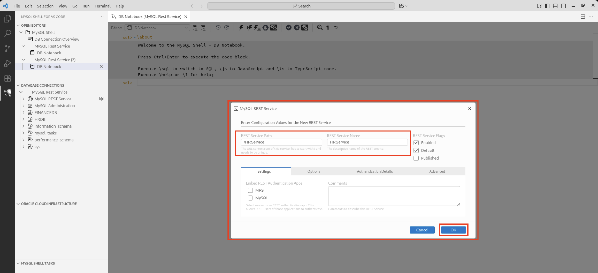

5. Once created, you will see HRService Rest Service under MySQL Rest Service entry.

     

6. To add a MySQL database schema to the MRS Service with MySQL Shell for VS Code, simply right click on schema **HRDB** in the DATABASE CONNECTIONS view and select **Add Schema to REST Service** from the popup menu.

     

7. Once clicked, a new dialog window appears to fill the required details. Once filled, click on OK to add schema to the REST service.

     

8. In the next step, a MySQL table can be added. Right click on the table **employee** in the DATABASE CONNECTIONS view and select **Add Database Object to REST Service** from the popup menu.

     

9. A new dialog box appears to fill the required details.

     

10. Ensure the desired **CRUD** operations are selected (READ is selected by default) uncheck **Requires Authentication flag** to make the object publicly available.

     

11. The MySQL Shell for VS Code extension ships with the **MySQL Router** included and can be used to bootstrap and starting the MySQL Router. Right click the MySQL REST Service tree item and select **Boostrap Local MySQL Router Instance**.

     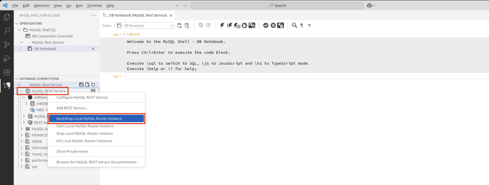

12. It opens the terminal where you can enter DB Connection's password as **Welcome$1** and JSON Web Token (JWT) secret as **Welcome$1**. Please note that this JWT secret always needs to be the same for every MySQL Router instance when deploying multiple routers for the same MySQL solution.

     

     

13. As soon as the MySQL Router is bootstrapped, right click the MySQL Rest service tree item and click on **Start Local MySQL Router Instance**.

     

14. Now that a MySQL REST Service has been created and the MySQL Router has been started we can access the REST endpoints with a web browser.

    

15. Access the APIs using the URL **https://localhost:8445/HRService/HRDB/employee**.

     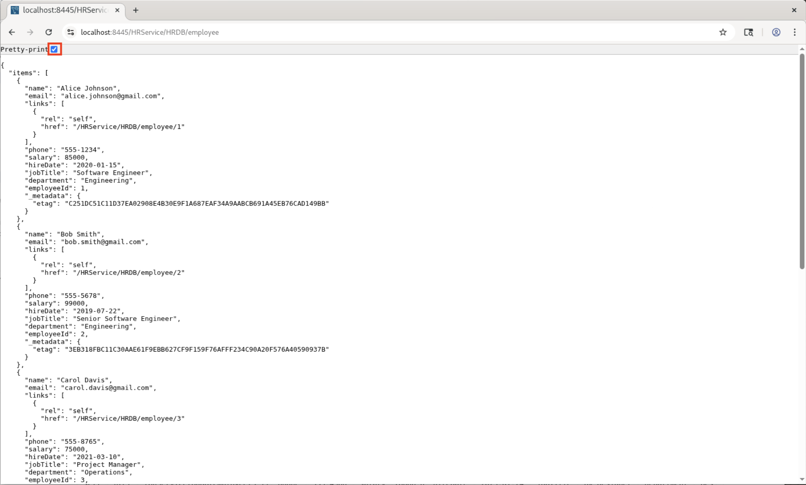

16. Adding a Primary Key value to the **request path (e.g. /1)** will filter the result to a single data set.
Adding offset and limit as query parameters allow you to page the full data set. The default page size can be set in the REST Schema and REST Object settings.

     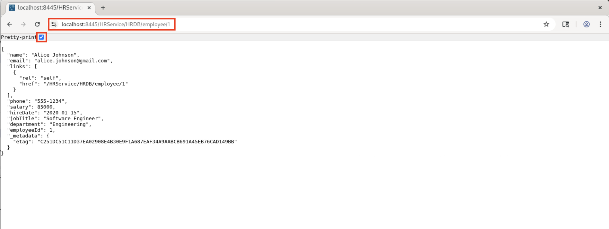

## Task 4: Deploy OpenAPI Web UI and Test CRUD Operations

1. Go back to the VS Code window. Under the database connection, right click on the service and select **Deploy OpenAPI Web UI** which will expose your REST endpoints through a browsable OpenAPI-based UI.

     

2. Once the deployment window opens, leave all the default values as they are and simply click **OK** to proceed. This will trigger the deployment of your service and make the OpenAPI-based Web UI available for interaction.

     

3. After deployment completes access the Web UI. Open in your browser to launch OpenAPI Web UI, where you can test and explore the REST endpoints for your HR service **https://localhost:8445/myService/openApiUi/#/**.

     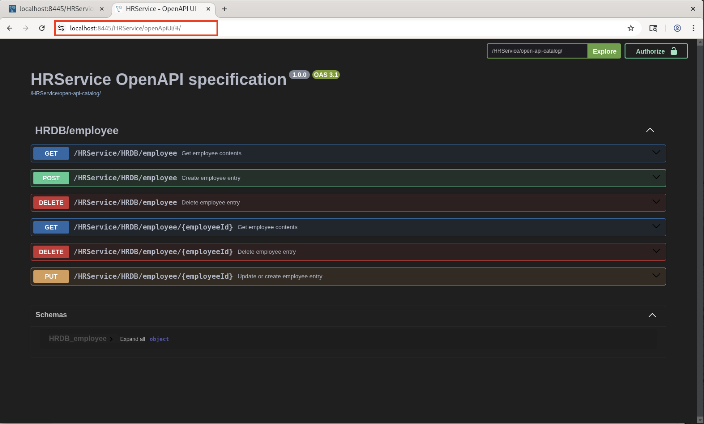

4. Once the Web UI loads, you'll see a list of available endpoints grouped by HTTP methods. You can expand each one to try them.

     * **GET** /employee – List employees
     * **POST** /employee – Create employee
     * **PUT** /employee/{employeeId} – Update employee
     * **DELETE** /employee/{employeeId} – Delete employee

5. **Get** method retrieves all employees. Scroll to the **GET /HRService/HRDB/employee** endpoint and expand the menu. Click **Try it out**.

     

6. Then click on **Execute**. You'll get a list of current employees from the HR service in the response section below.

     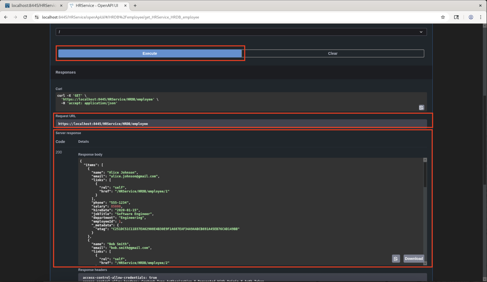

7. **Post** method adds a new employee. Scroll to the **POST /HRService/HRDB/employee** endpoint and expand the menu. Click **Try it out**.

     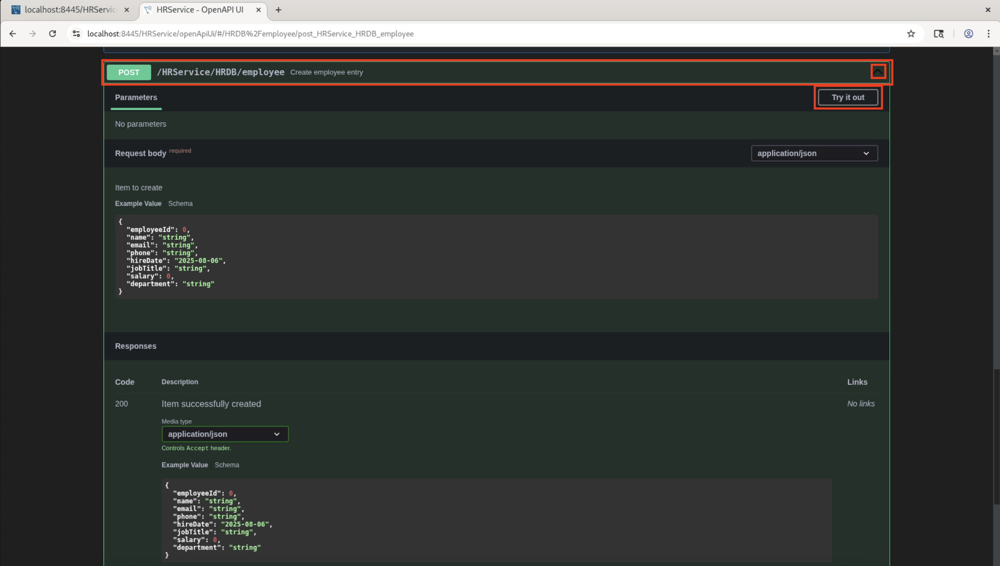

8. In the Request body, enter the details as shown. Here intentionally I added wrong email to modify later in the PUT request. Click **Execute** to submit the new employee record.

     

9. After that check the output of **https://localhost:8445/HRService/HRDB/employee** on the other chrome tab to see the new employee added in the list.

     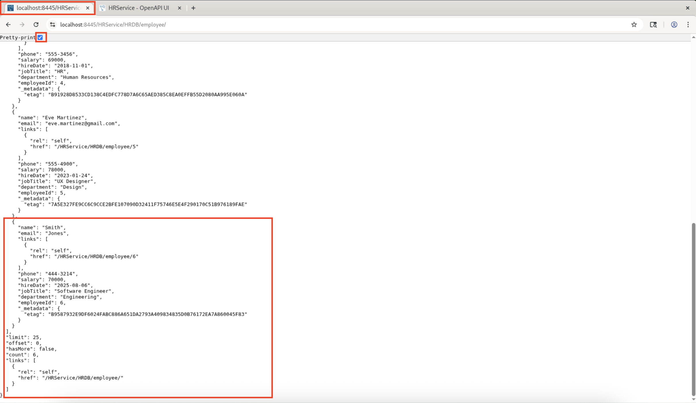

10. **Delete** method removes an employee. Scroll to the **DELETE /HRService/HRDB/employee/{employeeId}** endpoint and expand the menu. Click **Try it out**.

     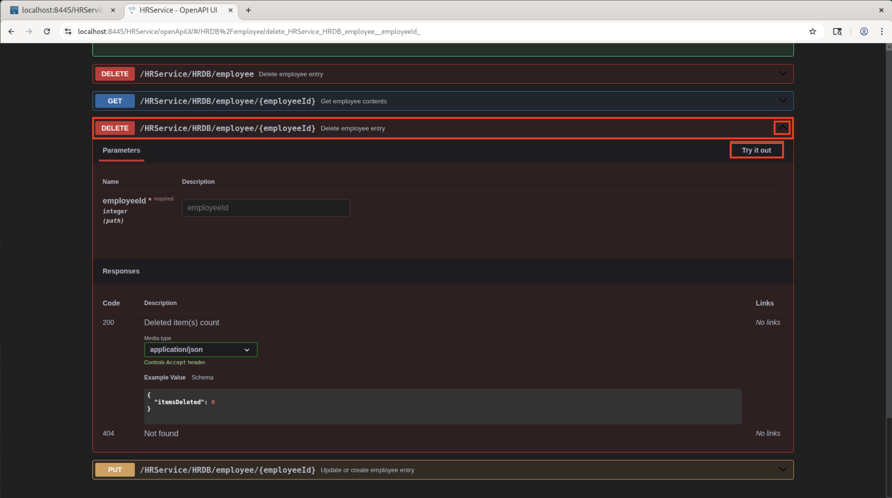

11. In the parameters, enter the employee ID to delete (e.g., 5 in this example), then click **Execute**.

     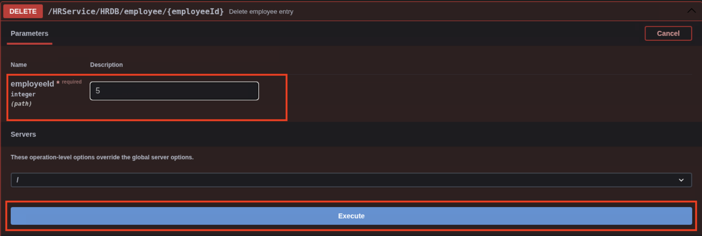

12. After that check the output of **https://localhost:8445/HRService/HRDB/employee** on the other chrome tab where the deleted record should no longer appear in the list.

     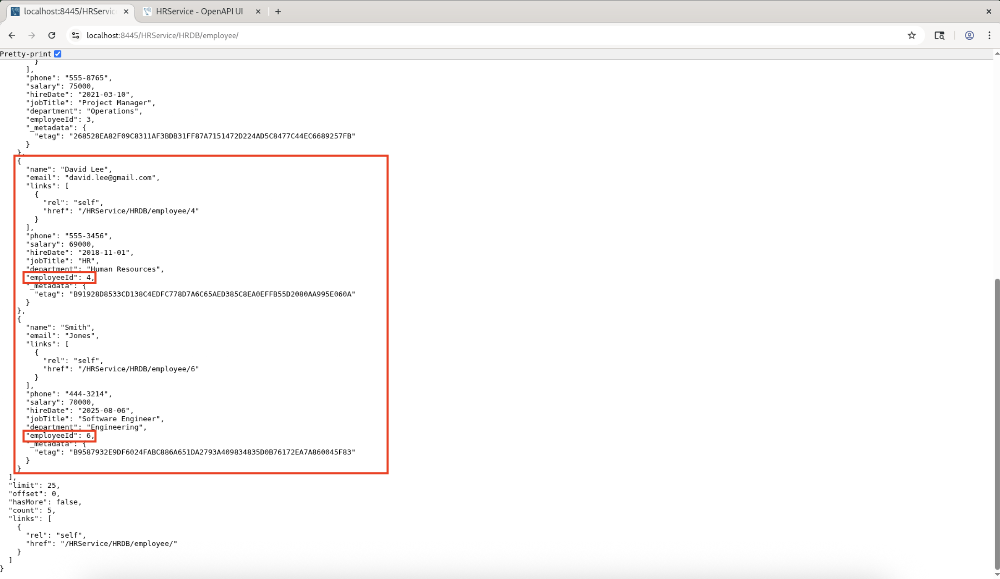

13. **Put** method updates an existing employee. Scroll to the **PUT /HRService/HRDB/employee/{employeeId}** endpoint and expand the menu. Click **Try it out**.

     

14. In the parametersm enter the employee ID to update as 6. In the Request body, make changes to the email and salary fields leaving rest of the fields with their previous values. Once done, click **Execute** to update the employee record.

     

15. After that check the output of **https://localhost:8445/HRService/HRDB/employee** on the other chrome tab to look for the updated details in the response.

     

16. For further details you can right click MySQL Rest service tree in the Visual Studio Code and click on **Browse the MySQL Rest Service Documentation**.

     

## Acknowledgements

* **Author** - Sindhuja Banka, HeatWave MySQL Product Manager
* **Contributors** - Sindhuja Banka, Anand Prabhu
* **Last Updated By/Date** - Sindhuja Banka, August 2025
