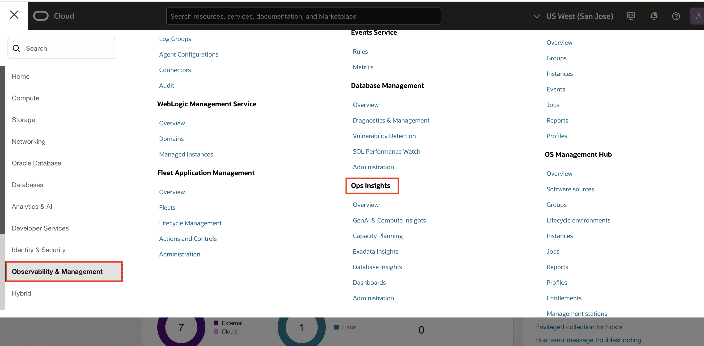
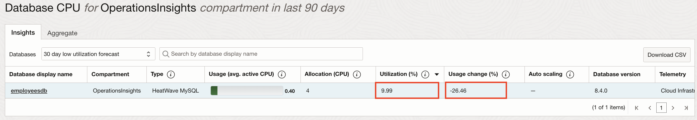

# Javascript inside MySQL

## Introduction

JavaScript is the most popular programming language among developers.  Besides the simpler syntax and the support for modern language features, a key factor in it's popularity is the rich ecosystem which provides a multitude of reusable code modules.

When in need for persistent storage, MySQL, the most popular open-source database, will be a natural choice for JavaScript developers. By supporting JavaScript in stored programs, developers will be able to write MySQL stored programs in a familiar language and take advantage of the extensive JavaScript ecosystem!

The support for JavaScript stored programs, will not only improve developer productivity by leveraging the large ecosystem; more developers will now possess the necessary skills to write stored programs.  In other words, organizations may now tap into a broader range of developer talent by utilizing the widely accessible JavaScript skill set for backend development.

Stored programs offer a key advantage by minimizing data movement between the database server and applications. Transferring large amount of data, especially for batch-processing, can be problematic for many reasons:

* It is time consuming and can cause significant network overhead.
* Increased latency may become noticeable when applications are “chatty”.
* Processing large data volumes in the mid- or application-tier requires large amounts of memory and storage, adding cost.
* Data transfer between machines, especially in cloud environments, often must be avoided due to security risks and data protection requirements.
* Moving large amount of data outside the database service, will increase egress costs.
* Using stored programs to process data within the database is a common solution to these problems.

Estimated time: 20 minutes

### Objectives

MySQL-JavaScript unlocks new opportunities in application design that were once constrained by a trade-off. JavaScript stored programs empower developers to sidestep data movement and seamlessly implement advanced data processing logic inside the database with ease.

* Data extraction
* Data formatting
* Approximate search
* Data Validation
* Compression / Encoding
* Data Transformation

## Task 1: Enable Demo Mode

1. To access Ops Insights, click on the Oracle Cloud Console **Navigation menu** (aka hamburger menu) located in the upper left. Under **Observability & Management**, go to **Ops Insights** and click **Overview**.

      

2. Click on **Enable Demo Mode** to enable Demo Mode.

      

3. Once the demo mode is enabled the overview page will now show resource information for the OperationsInsights compartment, notice the upper-right hand corner will show Demo Mode is now ON for your session.  When you would like to exit demo mode you can either click the disable link in the corner or click the **Disable Demo Mode** button where you initially enabled it on the overview page.

      

4. On the left-hand pane you will find links to quickly navigate to Ops Insights offerings for HeatWave MySQL which includes Capacity Planning, SQL Insights and Dashboards.

      

## Task 2: Capacity Planning - Databases

1. On the **Ops Insights Overview** page, from the left pane click on **Capacity Planning**.

      

2. On the **Database Capacity Planning** page, you will obtain a fleet-wide overview of your resource consumption and trends.  CPU insights, storage insights, and memory insights give a quick view into top resource consumers now and forecast potential resource bottlenecks over the selected period.

      

    From this page you can perform the following tasks in support of the Capacity Planning use case goals:

    * View total allocation and utilization of CPU, Storage, Memory, and I/O resources for all (enabled) databases in the compartment
    * Identify top-5 databases of CPU, Storage, and Memory by absolute usage or utilization percentage
    * Identify top-5 databases by CPU, Storage, and Memory growth over the period
    * See aggregated historical usage trends for CPU, Storage, and Memory over the period

3. From **Database type** on the left pane select **HeatWave MySQL**.

      

4. From **Time Range** on the left pane select **Last 90 days**.

      

      You can filter based on **Time range**, **Database type** or **Tags**. This let’s you customize the fleet of database of your choice by using combination of one of these.

      

5. Review the **Inventory** section. The **Inventory** section displays the total number of databases enabled for Ops Insights along with the database types. In addition, the CPU, Storage, Memory, and I/O usage charts display overall resource consumption (Top Consumers and Usage Trend) by these database targets.

      

6. **CPU Insights** - Database utilization percentage for the 90th percentile value of the daily average CPU Usage over the selected time period. These sections show the number of databases running with low (0–25%) and high (75–100%) utilization of CPU.

      

7. **Storage Insights** - Database utilization percentage for the 90th percentile value of the daily average Storage Usage over the selected time period.  These sections show the number of databases running with low (0–25%) and high (75–100%) utilization of storage.

      

8. **Memory Insights** - Database utilization percentage for the 90th percentile value of the daily average Memory Usage over the selected time period.  These sections show the number of databases running with low (0–25%) and high (75–100%) utilization of memory.

      

## Task 3: Capacity Planning - CPU

1. On the **Database Capacity Planning** page, from the left pane click on **CPU**.

      

2. **Database CPU** page has a master-detail design with three primary components:

    * Insights – table of databases flagged for CPU utilization insights
    * Aggregate – treemap of CPU utilization over all databases in the compartment
    * Trend & Forecast – time series charts of CPU usage trends and forecasts for individual or groups of databases

      

3. On the **Database CPU** page, under **Insights** tab, select **30 Day Low Utilization Forecast** against **Databases**, to view database CPU utilization forecast for next 30 days.

      

4. Under the **Database Display Name** column, select the row corresponding to the **employeesdb** database.

      

5. Check the **Utilization (%)** and **Usage Change (%)** for database **employeesdb**.

    * Utilization (%) -  Utilization percentage for the 90th percentile value of the daily average storage usage over the selected time period
    * Usage Change (%): Percentage change in the linear trend of storage usage over the selected time

    

6. The **Trend and Forecast** chart displays historical time series plots related to CPU allocation and usage for the selected database **employeesdb**.

      

      * Historical CPU Usage (dark solid green line) is the Avg Usage - average value of daily (hourly) CPU usage data.

      * Avg Usage Forecast - forecast of Avg Usage data using linear forecast model (dashed green line) and the Max Allocation - maximum allocation of CPU for the database.

      * The value **0.08** AVG ACTIVE CPU USAGE is forecasted for after 15 days for Avg usage of CPU.

      * The red line is **Max Usage** - maximum value of daily (hourly) CPU usage data for database **employeesdb**.

      * The value **1.1** AVG ACTIVE CPU USAGE is forecasted for after 15 days for Max usage Forecast of CPU.

    You can see the difference in average forecasted value v/s Max forecasted value. If the workload is critical and cannot tolerate any performance issues then the database must be allocated the max forecasted value. If the workload is not so critical and can tolerate deviations in performance then it is ok to allocate CPU based on average forecasted value and save money.

7. The trending and forecast chart facilitates:

     * Forecast future maximum and average demand for CPU resources
     * Compare current usage to allocation to detect over-provisioning
     * Compare maximum to average usage and trends to assess demand volatility
     * Forecast difference between the maximum and average daily CPU usage to estimate potential savings from workload smoothing

8. The following models can be selected for display on the upper right of the Trend and Forecast chart:

     * **Linear regression**: The linear regression model assumes a linear relationship across variables to predict the future resource usage.

      

     * **Seasonality aware**: The seasonal option combines a simple model that detects basic seasonality with dynamic, user-selectable data.

      

     * **AutoML forecasting**: The AutoML forecasting option selects the best fit from multiple machine learning models trained on fixed data window. AutoML (Machine Learning) forecasting leverages Oracle Data Science, employing metalearning to quickly identify the most relevant features, model and hyperparameters for a given training dataset. Forecast and model are precomputed and the forecasts are periodically retrained. The forecast uses up to 13 months of data, or the highest amount of data available for a resource if the resource has less than 13 months since onboarding.

     Within the **Trend & Forecast** chart, click **AutoML forecasting**

      

      A new pop up will appear with the AutoML forecasting charts loaded. It will state the training period and the selected forecast algorithms for maximum usage and average usage. The maximum and average confidence channels are also displayed within the chart. The confidence interval for these are 95%, meaning that 95% of future points are expected to fall within this radius from the forecast.

      

      Click **Close** to close the **AutoML forecasting** pop-up and return to **Database CPU** page.

9. Click **Aggregate** on the top and from **Grouping** select **Database Type**.

      

     The page displays a Treemap of all databases breaking it down by Database Type. This lets you compare how your different, individual databases are using their resources as well as between various database types.

## Acknowledgements

* **Author** - Sindhuja Banka, HeatWave MySQL Product Manager
* **Contributors** - Sindhuja Banka, Anand Prabhu
* **Last Updated By/Date** - Sindhuja Banka, July 2025
