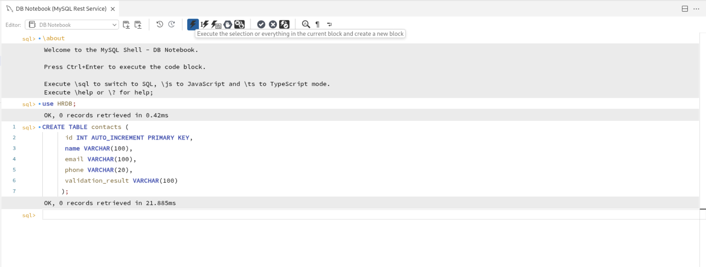

# Javascript inside MySQL

## Introduction

JavaScript is the most popular programming language among developers.  Besides the simpler syntax and the support for modern language features, a key factor in it's popularity is the rich ecosystem which provides a multitude of reusable code modules.

When in need for persistent storage, MySQL, the most popular open-source database, will be a natural choice for JavaScript developers. By supporting JavaScript in stored programs, developers will be able to write MySQL stored programs in a familiar language and take advantage of the extensive JavaScript ecosystem!

The support for JavaScript stored programs, will not only improve developer productivity by leveraging the large ecosystem; more developers will now possess the necessary skills to write stored programs.  In other words, organizations may now tap into a broader range of developer talent by utilizing the widely accessible JavaScript skill set for backend development.

Stored programs offer a key advantage by minimizing data movement between the database server and applications. Transferring large amount of data, especially for batch-processing, can be problematic for many reasons:

* It is time consuming and can cause significant network overhead.
* Increased latency may become noticeable when applications are “chatty”.
* Processing large data volumes in the mid- or application-tier requires large amounts of memory and storage, adding cost.
* Data transfer between machines, especially in cloud environments, often must be avoided due to security risks and data protection requirements.
* Moving large amount of data outside the database service, will increase egress costs.
* Using stored programs to process data within the database is a common solution to these problems.

Estimated time: 20 minutes

### Objectives

MySQL-JavaScript unlocks new opportunities in application design that were once constrained by a trade-off. JavaScript stored programs empower developers to sidestep data movement and seamlessly implement advanced data processing logic inside the database with ease.

* Data extraction
* Data formatting
* Approximate search
* Data Validation
* Compression / Encoding
* Data Transformation

## Task 1: Data Validation

1. HR-DB system

      

2. You can view the records of the table using the below command.

     ```
     <copy>CREATE TABLE contacts (
      id INT AUTO_INCREMENT PRIMARY KEY,
      name VARCHAR(100),
      email VARCHAR(100),
      phone VARCHAR(20),
      validation_result VARCHAR(100)
     );
     </copy>
     ```
     

4. You can view the records of the table using the below command.

     ```
     <copy>CREATE FUNCTION validate_contact(email TEXT, phone TEXT)
     RETURNS TEXT
     LANGUAGE JAVASCRIPT AS $$
     function isValidEmail(e){
      return /^[^\\s@]+@[^\\s@]+\\.[^\\s@]+$/.test(e);
     }
     function isValidPhone(p){
      return /^\\(?\\d{3}\\)?[-.\\s]?\\d{3}[-.\\s]?\\d{4}$/.test(p);
     }
     if (!isValidEmail(email)){
      'return Invalid Email';
     }
     if (!isValidPhone(phone)){
      'return Invalid Phone Number';
     }
     return 'Valid';
     $$;
     </copy>
     ```
     

## Task 2: Capacity Planning - Databases

1. On the **Ops Insights Overview** page, from the left pane click on **Capacity Planning**.

      

2. On the **Database Capacity Planning** page, you will obtain a fleet-wide overview of your resource consumption and trends.  CPU insights, storage insights, and memory insights give a quick view into top resource consumers now and forecast potential resource bottlenecks over the selected period.

      

    From this page you can perform the following tasks in support of the Capacity Planning use case goals:

    * View total allocation and utilization of CPU, Storage, Memory, and I/O resources for all (enabled) databases in the compartment
    * Identify top-5 databases of CPU, Storage, and Memory by absolute usage or utilization percentage
    * Identify top-5 databases by CPU, Storage, and Memory growth over the period
    * See aggregated historical usage trends for CPU, Storage, and Memory over the period

3. From **Database type** on the left pane select **HeatWave MySQL**.

      

4. From **Time Range** on the left pane select **Last 90 days**.

      

      You can filter based on **Time range**, **Database type** or **Tags**. This let’s you customize the fleet of database of your choice by using combination of one of these.

      

5. Review the **Inventory** section. The **Inventory** section displays the total number of databases enabled for Ops Insights along with the database types. In addition, the CPU, Storage, Memory, and I/O usage charts display overall resource consumption (Top Consumers and Usage Trend) by these database targets.

      

6. **CPU Insights** - Database utilization percentage for the 90th percentile value of the daily average CPU Usage over the selected time period. These sections show the number of databases running with low (0–25%) and high (75–100%) utilization of CPU.

      

7. **Storage Insights** - Database utilization percentage for the 90th percentile value of the daily average Storage Usage over the selected time period.  These sections show the number of databases running with low (0–25%) and high (75–100%) utilization of storage.

      

8. **Memory Insights** - Database utilization percentage for the 90th percentile value of the daily average Memory Usage over the selected time period.  These sections show the number of databases running with low (0–25%) and high (75–100%) utilization of memory.

      

## Acknowledgements

* **Author** - Sindhuja Banka, HeatWave MySQL Product Manager
* **Contributors** - Sindhuja Banka, Anand Prabhu
* **Last Updated By/Date** - Sindhuja Banka, July 2025
