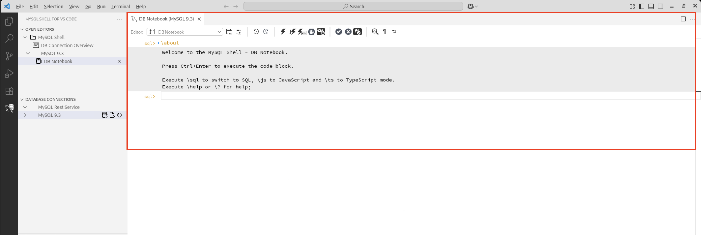
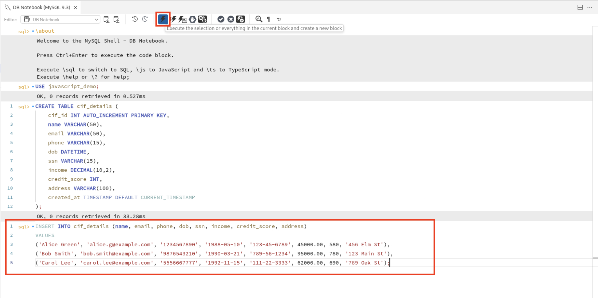
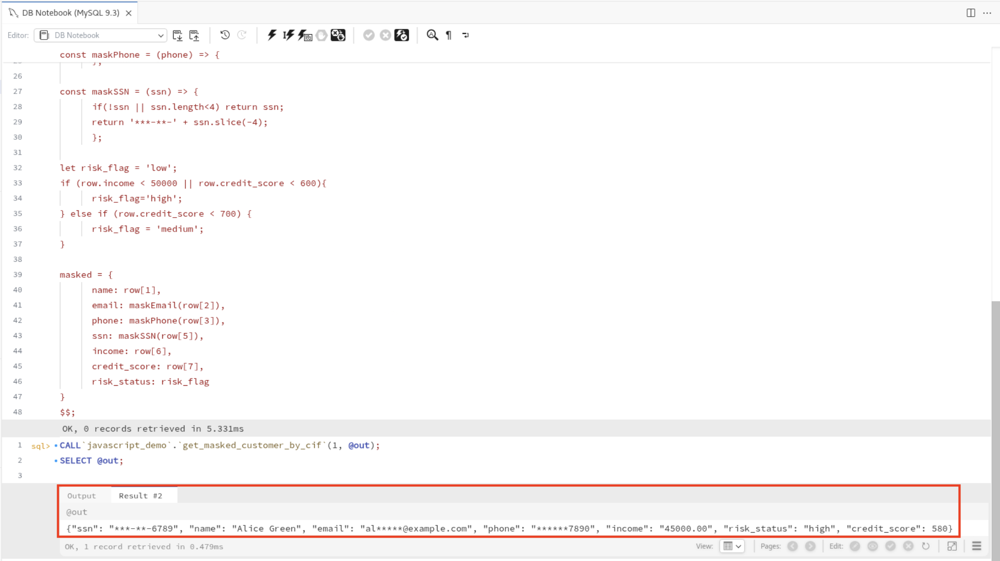
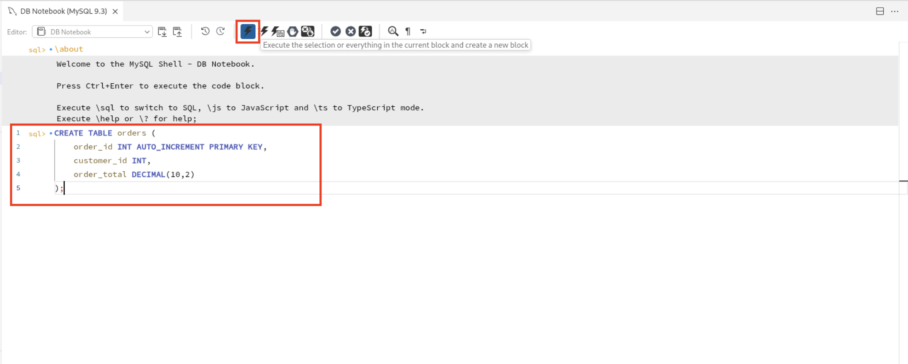
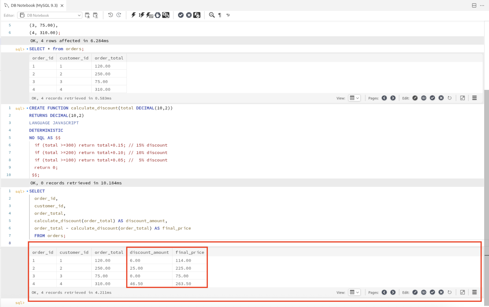

# Javascript inside MySQL

## Introduction

JavaScript is the most popular programming language among developers.  Besides the simpler syntax and the support for modern language features, a key factor in it's popularity is the rich ecosystem which provides a multitude of reusable code modules.

The support for JavaScript stored programs, will not only improve developer productivity by leveraging the large ecosystem; more developers will now possess the necessary skills to write stored programs.  In other words, organizations may now tap into a broader range of developer talent by utilizing the widely accessible JavaScript skill set for backend development.

Stored programs offer a key advantage by minimizing data movement between the database server and applications. Transferring large amount of data, especially for batch-processing, can be problematic for many reasons:

* It is time consuming and can cause significant network overhead.
* Increased latency may become noticeable when applications are “chatty”.
* Processing large data volumes in the mid-tier or application-tier requires large amounts of memory and storage, adding cost.
* Data transfer between machines, especially in cloud environments, often must be avoided due to security risks and data protection requirements.
* Moving large amount of data outside the database service, will increase egress costs.
* Using stored programs to process data within the database is a common solution to these problems.

Estimated time: 20 minutes

### Objectives

MySQL-JavaScript unlocks new opportunities in application design that were once constrained by a trade-off. JavaScript stored programs empower developers to sidestep data movement and seamlessly implement advanced data processing logic inside the database with ease.

* Data extraction
* Data formatting
* Approximate search
* Data Validation
* Compression / Encoding
* Data Transformation

## Task 1: Connect to MySQL 9.x DB system

1. **MySQL 9.x (Innovation release)** includes support for JavaScript stored procedures and functions. This lab focuses on demonstrating how JavaScript can be used inside MySQL for PII masking, data transformation, and secure access control.

2. From the Database Connections tab in the left panel:
      * Click on the **MySQL 9.3** connection.
      * This connection is pre-configured for this lab, similar to the one you set up in workshop 1 (MySQL Rest Service).

      

3. Click on the **Notebook** icon next to the MySQL 9.3 connection to open a SQL editor connected to the database.

      

4. This will launch a new **SQL Notebook** tab where you can run queries and create JavaScript stored procedures.

      

5. Run the following query to switch to the **javascript_demo** schema.

      ```
     <copy>USE javascript_demo;
     </copy>
     ```

     

## Task 2: Implement JavaScript Based PII Masking and Risk Evaluation

1. Create a table called **cif_details** that simulates real-world customer data and includes personally identifiable information (PII) like email and SSN, along with financial details like income and credit score. Click on run to execute the query.

     ```
     <copy>
    CREATE TABLE cif_details (
    cif_id INT AUTO_INCREMENT PRIMARY KEY,
    name VARCHAR(50),
    email VARCHAR(50),
    phone VARCHAR(15),
    dob DATETIME,
    ssn VARCHAR(15),
    income DECIMAL(10,2),
    credit_score INT,
    address VARCHAR(100),
    created_at TIMESTAMP DEFAULT CURRENT_TIMESTAMP

);</copy>
     ```

2. Add a few test records representing different customer profiles with varying income and credit scores. These records will help you test PII masking and risk classification logic.

     ```
     <copy>
     INSERT INTO cif_details (name, email, phone, dob, ssn, income, credit_score, address)
     VALUES
     ('Alice Green', 'alice.g@example.com', '1234567890', '1988-05-10', '123-45-6789', 45000.00, 580, '456 Elm St'),
     ('Bob Smith', 'bob.smith@example.com', '9876543210', '1990-03-21', '789-56-1234', 95000.00, 780, '123 Main St'),
     ('Carol Lee', 'carol.lee@example.com', '5556667777', '1992-11-15', '111-22-3333', 62000.00, 690, '789 Oak St');
     </copy>
     ```

     

3. Before we apply JavaScript logic, let's see how the actual data looks in the table. Run the following query to view all records.

    ```
     <copy>
    SELECT * from cif_details;</copy>
     ```
     

4. This example shows how JavaScript inside MySQL enables secure in-database logic for PII masking, risk classification, and data transformation. It reduces data exposure by applying business logic within the database improving performance and reducing data leakage risks.

5. Execute the following procedure that calculates risk based on income and credit score, with JavaScript inside MySQL handling the maskung of PII fields for secure data processing.

    ```
     <copy>
      create PROCEDURE get_masked_customer_by_cif(IN cif_id int)
      LANGUAGE javascript as $$
      let selectStatement = session.prepare(
        "SELECT * FROM cif_details where cif_id = ?"
      );
      let result = selectStatement.bind(cif_id).execute();
      let row = result.fetchOne();

      if(!row){
      console.log("Error retrieving details");
      return {error: "No customer found."};
      }

      const maskEmail = (email) => {
            if(!email || !email.includes('@')) return email;
            const [local, domain] = email.split('@');
            if(local.length<=2) return '*'.repeat(local.length) + '@' + domain;
            return local.slice(0,2) + '*'.repeat(local.length-2) + '@' + domain;
      };

      const maskPhone = (phone) => {
            if(!phone || phone.length<4) return email;
            return '*'.repeat(phone.length-4) + phone.slice(-4);
      };

      const maskSSN = (ssn) => {
            if(!ssn || ssn.length<4) return ssn;
            return '***-**-' + ssn.slice(-4);
      };

      let risk_flag = 'Low';
      if (row.income < 50000 || row.credit_score < 600){
            risk_flag='High';
      } else if (row.credit_score < 700) {
            risk_flag = 'Medium';
      }

      console.log(">> PII Masked Record for CIF:", row[0])
      console.log("   Masked Email: ", maskEmail(row[2]))
      console.log("   Masked Phone: ", maskPhone(row[3]))
      console.log("   Masked SSN: ", maskSSN(row[5]))
      console.log("   Risk Status: ", risk_flag)

      return {
            name: row[1],
            email: maskEmail(row[2]),
            phone: maskPhone(row[3]),
            dob: row[4],
            ssn: maskSSN(row[5]),
            income: row[6],
            credit_score: row[7],
            address: row[8],
            created_at: row[9]
      }
      $$;
    </copy>
     ```
     

6. Test the procedure call by calling it with a customer ID to retrieve customer data with masked PII fields and calculated risk based on income and credit score.

    ```
     <copy>
    CALL get_masked_customer_by_cif(1);</copy>
     ```
     

7. The procedure returns a single row showing the customer's details.

      

8. In this lab, we explored how JavaScript inside MySQL can bring logic and security closer to your data. By masking sensitive information like email and SSN, and tagging records with a risk level based on business needs, we showed how Javascript inside MySQL can go beyond basic SQL to act as intelligent data access layers and making it ideal for modern and compliance-conscious applications.

## Task 3: Dynamic Discount Calculation for Orders

1. Create a table **orders** to store order information including the total amount of each order.

     ```
     <copy>
    CREATE TABLE orders (
    order_id INT AUTO_INCREMENT PRIMARY KEY,
    customer_id INT,
    order_total DECIMAL(10,2)
     );</copy>
     ```
     

2. Insert sample records with varying order totals to simulate different discount scenarios.

     ```
     <copy>
     INSERT INTO orders (customer_id, order_total)
     VALUES
     (1, 120.00),
     (2, 250.00),
     (3, 75.00),
     (4, 310.00);
     </copy>
     ```

     

3. Before we apply JavaScript logic, let's see how the actual data looks in the table. Run the following query to view all records.

    ```
     <copy>
    SELECT * from orders;</copy>
     ```
     

4. Create a JS function that evaluates the order total and returns the discount amount based on predefined thresholds.

    ```
     <copy>
      CREATE FUNCTION calculate_discount(total DECIMAL(10,2))
      RETURNS DECIMAL(10,2)
      LANGUAGE JAVASCRIPT
      DETERMINISTIC
      NO SQL AS $$
       if (total >=300) return total*0.15; // 15% discount
       if (total >=200) return total*0.10; // 10% discount
       if (total >=100) return total*0.05; //  5% discount
       return 0;
      $$;
    </copy>
     ```

     

5. Retrieve all orders and calculate their discounts and final prices dynamically using the JavaScript function.

    ```
     <copy>
      SELECT
       order_id,
       customer_id,
       order_total,
       calculate_discount(order_total) AS discount_amount,
       order_total - calculate_discount(order_total) AS final_price
      FROM orders;
    </copy>
     ```

     

6. The output displays original and discounted prices for each product, calculated using JavaScript inside MySQL. It shows how business logic like promotions or seasonal discounts can be applied directly within SQL queries.

      

## Acknowledgements

* **Author** - Sindhuja Banka, HeatWave MySQL Product Manager
* **Contributors** - Sindhuja Banka, Anand Prabhu
* **Last Updated By/Date** - Sindhuja Banka, July 2025
