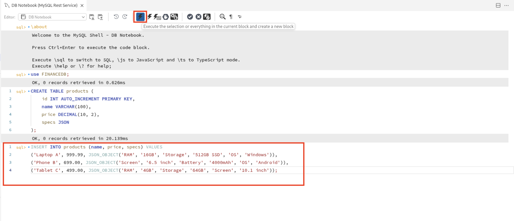
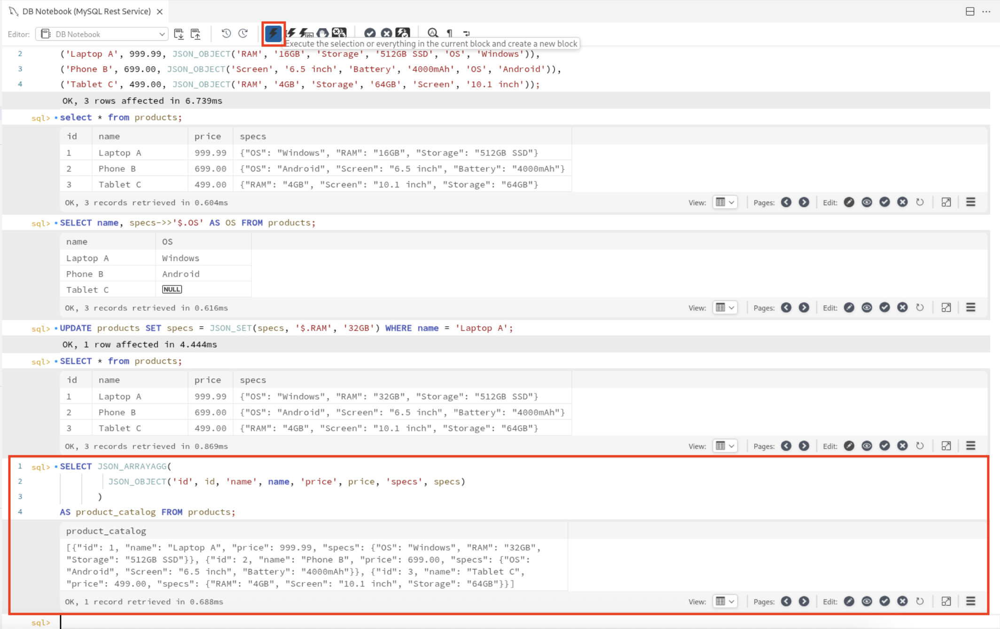

# Boost developer productivity with JSON functions

## Introduction

In this workshop, we'll explore how MySQL's native JSON data type simplifies flexible schema design and modern application development. MySQL allows storing, querying, and modifying JSON objects efficiently using built-in functions, without needing external parsing logic. With support for indexing JSON keys, developers can achieve fast lookups and filters on semi-structured data. We'll demonstrate how these capabilities streamline backend logic and help serve frontend ready data directly from the database.

Estimated time: 10 minutes

### Objectives

* Create products table
* Insert products with varying specifications
* Query and update JSON fields
* Build API Response like JSON
* Index on JSON keys for performance

## Task 1: Create products table

1. In a new connected shell, you can now connect to the database **FINANCEDB** using the following command and click on run button on the top navigation bar to execute the query.

     ```
     <copy>use FINANCEDB;</copy>
     ```
     

2. Create **products** table with id, name, price and a specs column using the native JSON type using the following query and clicking on run button on the top navigation bar to execute the query.

     ```
     <copy>CREATE TABLE products (
          id INT AUTO_INCREMENT PRIMARY KEY,
          name VARCHAR(100),
          price DECIMAL(10, 2),
          specs JSON);</copy>
     ```
     

## Task 2: Insert products with Varying Specs

1. Insert records into the products table to demonstrate how different products can have unique set of specifications without altering the table structure.

    ```
     <copy>INSERT INTO products (name, price, specs) VALUES
('Laptop A', 999.99, JSON_OBJECT('RAM', '16GB', 'Storage', '512GB SSD', 'OS', 'Windows')),
('Phone B', 699.00, JSON_OBJECT('Screen', '6.5 inch', 'Battery', '4000mAh', 'OS', 'Android')),
('Tablet C', 499.00, JSON_OBJECT('RAM', '4GB', 'Storage', '64GB', 'Screen', '10.1 inch'));</copy>
    ```
    

2. Retrieve all product records including the JSON specifications. There is no need to create new columns or tables for screen, battery etc.

     ```
     <copy>SELECT * from products;</copy>
     ```
     

## Task 3: Query and Update Specific JSON Fields

1. Retrieve each product's name along with its Operating System (OS) by querying the corresponding JSON key inside the specs column.

     ```
     <copy>SELECT name, specs->>'$.OS' AS OS FROM products;</copy>
     ```
     

2. Update a specification (RAM) within the JSON specs column for **Laptop A**, demonstrating how targeted JSON updates eliminate the need to alter the table schema when product specifications change.

     ```
     <copy>UPDATE products SET specs = JSON_SET(specs, '$.RAM', '32GB') 
     WHERE name = 'Laptop A';</copy>
     ```
     

3. Select all rows from the product table to confirm the specs JSON field reflects the RAM update.

     ```
     <copy>SELECT * from products;</copy>
     ```
     

## Task 4: Build JSON like API Response

1. Using JSON_OBJECT(), selected fields, and aliases to format query into ready-to-use JSON structures. This reduces backend transformation logic that would lead to faster JSON response for APIs.

2. Run the following query to see how the response looks when using JSON_OBJECT().

     ```
     <copy>SELECT JSON_ARRAYAGG(
          JSON_OBJECT('id', id, 'name', name, 'price', price, 'specs', specs)
          )
     AS product_catalog FROM products;
     </copy>
     ```
     

## Task 5: Add a Functional Index on a JSON Key (for Performance)

1. We can create virtual/generated columns that would extract key from specs (e.g., OS), and index them.

2. This improves filtering and searching performance for API endpoints querying JSON data.

     ```
     <copy>CREATE INDEX idx_os ON products ((JSON_UNQUOTE(specs→'$.OS')));;</copy>
     ```

## Acknowledgements

* **Author** - Sindhuja Banka, HeatWave MySQL Product Manager
* **Contributors** - Sindhuja Banka, Anand Prabhu
* **Last Updated By/Date** - Sindhuja Banka, July 2025
