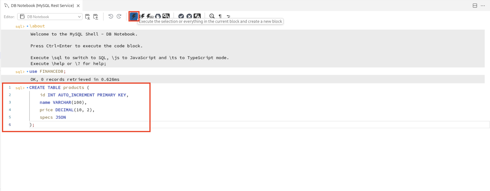

# Boost developer productivity with JSON functions

## Introduction

JavaScript is the most popular programming language among developers.  Besides the simpler syntax and the support for modern language features, a key factor in it's popularity is the rich ecosystem which provides a multitude of reusable code modules.

Estimated time: 20 minutes

### Objectives

MySQL-JavaScript unlocks new opportunities in application design that were once constrained by a trade-off. JavaScript stored programs empower developers to sidestep data movement and seamlessly implement advanced data processing logic inside the database with ease.

## Task 1: Create Products table

1. Use FinanceDB.

      

2. Create products table using the following query.

     ```
     <copy>CREATE TABLE products (id INT AUTO_INCREMENT PRIMARY KEY, name VARCHAR(100), price DECIMAL(10, 2), specs JSON);</copy>
     ```
     

3. Developer Productivity Benefit: No need to ALTER TABLE when specs change.

## Task 2: Insert Products with Varying Specs

1. Flexibility: No need to create new columns or tables for screen, battery, etc.

    ```
     <copy>INSERT INTO products (name, price, specs) VALUES
('Laptop A', 999.99, JSON_OBJECT('RAM', '16GB', 'Storage', '512GB SSD', 'OS', 'Windows')),
('Phone B', 699.00, JSON_OBJECT('Screen', '6.5 inch', 'Battery', '4000mAh', 'OS', 'Android')),
('Tablet C', 499.00, JSON_OBJECT('RAM', '4GB', 'Storage', '64GB', 'Screen', '10.1 inch'));</copy>
    ```
    

5. Select records from the products table.

     ```
     <copy>SELECT * from products;</copy>
     ```
     

## Task 3: Query Specific JSON Fields

1. Simpler API development: JSON query is aligned with how frontend expects data.

     ```
     <copy>SELECT name, specs->>'$.OS' AS OS FROM products;</copy>
     ```
     

## Task 4: Update JSON Field

1. Targeted updates without rewriting entire row or column structure.

     ```
     <copy>UPDATE products SET specs = JSON_SET(specs, '$.RAM', '32GB') WHERE name = 'Laptop A';</copy>
     ```
     

2. Select records from the products table.

     ```
     <copy>SELECT * from products;</copy>
     ```
     

## Task 5: Build API Response-like JSON

1. Fast JSON response for APIs — no need for backend transformations.

     ```
     <copy>UPDATE products SET specs = JSON_SET(specs, '$.RAM', '32GB') WHERE name = 'Laptop A';</copy>
     ```
     

## Task 6: Add a Functional Index on a JSON Key (for Performance)

1. Fast JSON response for APIs — no need for backend transformations.

     ```
     <copy>CREATE INDEX idx_os ON products ((JSON_UNQUOTE(specs→'$.OS')));;</copy>
     ```
     

## Acknowledgements

* **Author** - Sindhuja Banka, HeatWave MySQL Product Manager
* **Contributors** - Sindhuja Banka, Anand Prabhu
* **Last Updated By/Date** - Sindhuja Banka, July 2025
