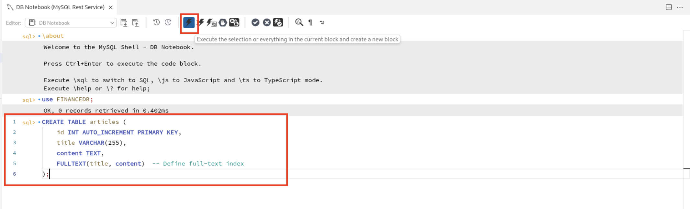
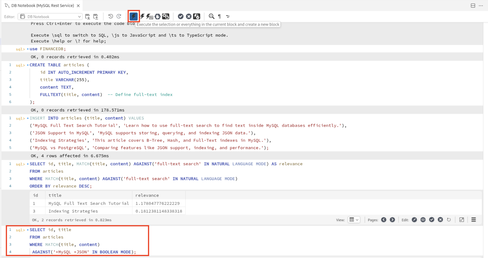
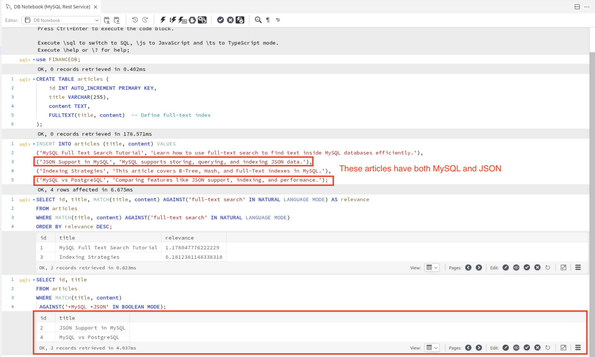

# Full Text Search in MySQL

## Introduction

Full-text search in MySQL enables efficient natural language search directly within SQL. It's especially useful in scenarios like:

* Blog or article content search
* Product catalog filtering
* FAQ or documentation lookup

Unlike basic LIKE or regular expressions, full-text search supports relevance ranking, stemming, stopwords, and boolean search operators, offering a much richer search experience.

Estimated time: 10 minutes

### Objectives

This lab introduces full-text search capabilities in MySQL and shows how they can be leveraged in real-world applications. You will:

* Create an articles table
* Insert sample records containing text content
* Perform natural language and boolean full-text searches using MATCH() and AGAINST()
* Understand relevance-based ranking and how it boosts application search results

## Task 1: Create articles table

1. In a new connected shell, you can now connect to the database **FINANCEDB** using the following command and click on run button on the top navigation bar to execute the query.

     ```
     <copy>use FINANCEDB;</copy>
     ```
     

2. Define an article table with columns id, title, content with content and title having a FULLTEXT index.

     ```
     <copy>CREATE TABLE articles (
    id INT AUTO_INCREMENT PRIMARY KEY,
    title VARCHAR(255),
    content TEXT,
    FULLTEXT(title, content)  -- Define full-text index
);</copy>
     ```
     

## Task 2: Insert articles

1. Populate the table with multiple articles containing natural language text for testing search.

2. Copy the following query to execute in the MySQL Shell DB Notebook and click on run button on the top navigation bar to execute the query.

    ```
     <copy>INSERT INTO articles (title, content) VALUES
('MySQL Full Text Search Tutorial', 'Learn how to use full-text search to find text inside MySQL databases efficiently.'),
('JSON Support in MySQL', 'MySQL supports storing, querying, and indexing JSON data.'),
('Indexing Strategies', 'This article covers B-Tree, Hash, and Full-Text indexes in MySQL.'),
('MySQL vs PostgreSQL', 'Comparing features like JSON support, indexing, and performance.');</copy>
    ```
    

## Task 3: Query using natural language

1. In this task, you will retrieve relevant articles by performing a natural language full-text search using MATCH() and AGAINST().

     ```
     <copy>SELECT id, title, MATCH(title, content) AGAINST('full-text search' IN NATURAL LANGUAGE MODE) AS relevance
FROM articles
WHERE MATCH(title, content) AGAINST('full-text search' IN NATURAL LANGUAGE MODE)
ORDER BY relevance DESC;</copy>
     ```
     

2. MySQL's natural language mode ranks results based on relevance where it analyzes the significance of words across the dataset, not just presence.

3. Here is the output of the query using natural language which are based on relevance.

     

## Task 4: Boolean Mode Search

1. You will use Boolean mode to perform more advanced full-text searches. Boolean mode allows you to include, execlude, or prioritize certain keywords using special operators.

2. Copy and paste the following query and click on run button on the top navigation bar to execute the query. The **+MySQL** term ensures thta only articles containing MySQL are returned. The **+JSON** term includes any article that contains only JSON either in title or content.

     ```
     <copy>SELECT id, title
FROM articles
WHERE MATCH(title, content)
AGAINST('+MySQL +JSON' IN BOOLEAN MODE);</copy>
     ```
     

3. Here is the output of the query using boolean mode search. Results are filtered, not ranked by relevance in the same way as natural language mode.

     

4. You will notice that the returned articles contain both MySQL and JSON either in content or title showing how Boolean logic refines results.

## Acknowledgements

* **Author** - Sindhuja Banka, HeatWave MySQL Product Manager
* **Contributors** - Sindhuja Banka, Anand Prabhu
* **Last Updated By/Date** - Sindhuja Banka, July 2025
