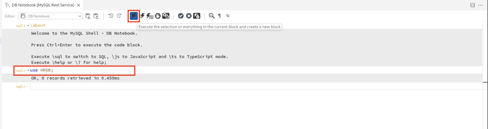
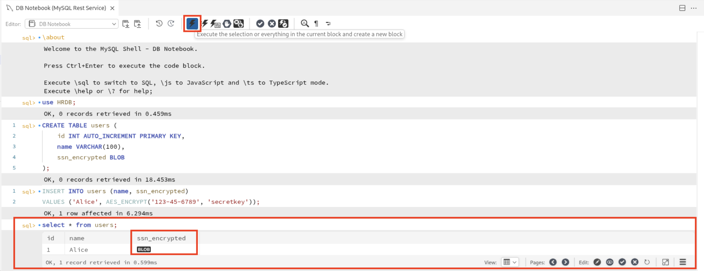
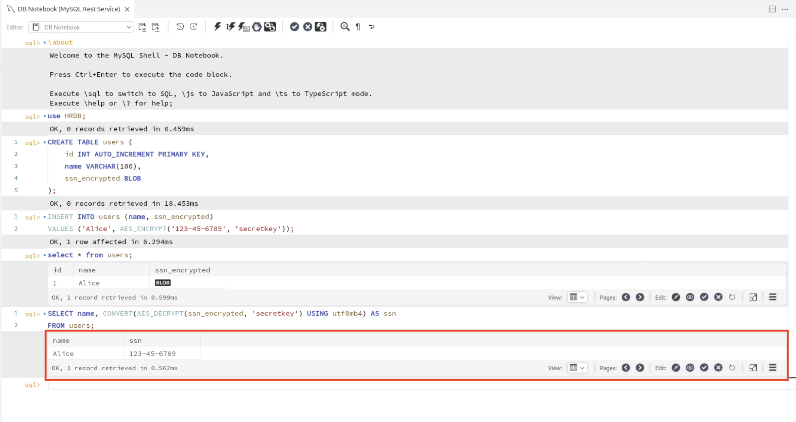
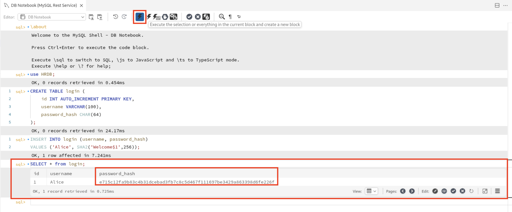
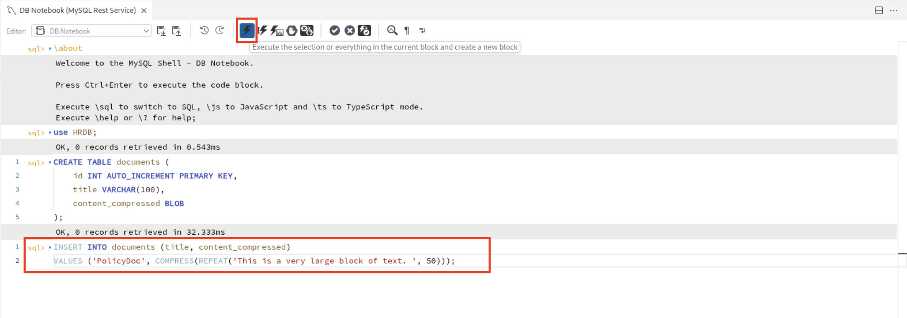
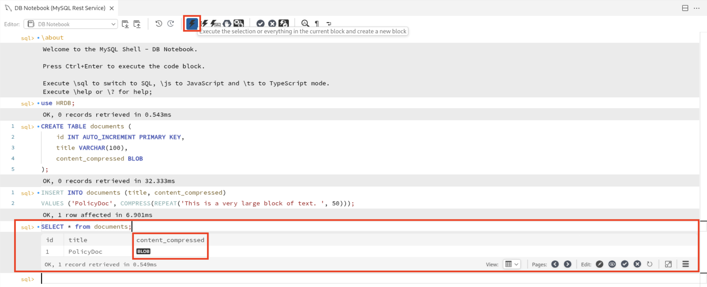
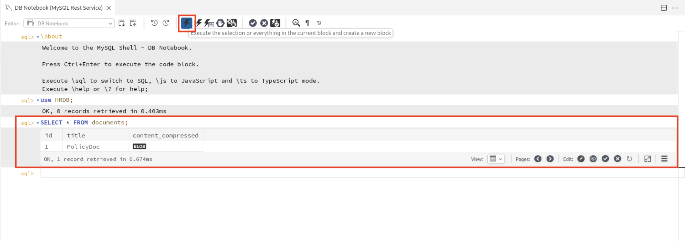

# Encryption and Compression Functions in MySQL

## Introduction

In this lab, we'll explore how MySQL helps you protect sensitive data and save storage space using built-in encryption and compression functions. Whether you are storing passwords, credit card numbers, or large text blobs, MySQL makes it easy to keep your data secure and efficient without needing complex external tools.

Estimated time: 10 minutes

### Objectives

By the end of this lab, you'll be able to:

* Encrypt and decrypt data using AES\_ENCRYPT() and AES\_DECRYPT() to protect sensitive information
* Hash data securely with SHA2() for one-way password storage
* compress and decompress text using COMPRESS() and UNCOMPRESS() to save space
* Compare byte size using LENGTH() to evaluate compression impact

## Task 1: AES_ENCRYPT() and AES_DECRYPT()

1. In a new connected shell, you can now connect to the database **HRDB** using the following command and click on run button on the top navigation bar to execute the query. This will switch to the HRDB database.

     ```
     <copy>use HRDB;</copy>
     ```
     

2. Create a table **users** where we can store encrypted SSNs in users table using a BLOB column.

     ```
     <copy>CREATE TABLE users (
    id INT AUTO_INCREMENT PRIMARY KEY,
    name VARCHAR(100),
    ssn_encrypted BLOB
);</copy>
     ```
     

3. Insert records into the table where you can encrypt sensitive data like SSNs using AES\_ENCRYPT() with a **user-defined secret key**. In our example, we use **secretkey** as our secret key to encrypt the senstive data.

     ```
     <copy>INSERT INTO users (name, ssn_encrypted)
VALUES ('Alice', AES_ENCRYPT('123-45-6789', 'secretkey'));</copy>
     ```
     

4. Execute the following query to fetch all records to observe how encrypted data is stored where it appears as unreadable binary content.

     ```
     <copy>SELECT * FROM users;</copy>
     ```
     

5. This query decrypts the ssn_encrypted field using AES\_DECRYPT() function and same secret key. CONVERT() function is used to convert it to readable text.

     ```
     <copy>SELECT name, CONVERT(AES_DECRYPT(ssn_encrypted, 'secretkey') USING utf8mb4)
     AS ssn FROM users;</copy>
     ```
     

6. Here is the output of the decryption function where the output ssn is a readable text.

    

7. It is ideal for protecting sensitive data such as Personally Identifiable Information (PII), credit card, or credentials.

## Task 2: Secure Hashing with SHA2()

1. In the connected shell, you can now connect to the database **HRDB** using the following command and click on run button on the top navigation bar to execute the query. This will switch to the HRDB database.

     ```
     <copy>use HRDB;</copy>
     ```
     

2. Create a **login** table with a fixed-length column to store SHA2(256) hashes, which are 64 characters long by clicking on the run button to execute the query.
     ```
     <copy>CREATE TABLE login (
    id INT AUTO_INCREMENT PRIMARY KEY,
    username VARCHAR(100),
    password_has CHAR(64)
);</copy>
     ```
     

3. Insert records into the table where we store the password as a **one-way secure hash**, which cannot be decrypted, ensuring password security.

     ```
     <copy>INSERT INTO login (username, password_hash)
VALUES ('Alice', SHA2('Welcome$1', 256));</copy>
     ```
     

4. View the stored username and corresponding hashed password. Notice that the password appears as a 64-character hash string.

     ```
     <copy>SELECT * FROM login;</copy>
     ```
     

## Task 3: COMPRESS() and UNCOMPRESS()

1. In the connected shell, you can now connect to the database **HRDB** using the following command and click on run button on the top navigation bar to execute the query. This will switch to the HRDB database.

     ```
     <copy>use HRDB;</copy>
     ```
     

2. Create a table **documents** to store compressed versions of large content to reduce storage size.
     ```
     <copy>CREATE TABLE documents (
    id INT AUTO_INCREMENT PRIMARY KEY,
    title VARCHAR(100),
    content_compressed BLOB
);</copy>
     ```
     

3. Insert compressed text using COMPRESS() function which compressses a repetitive string block and stores it in the BLOB field for efficient storage.
     ```
     <copy>INSERT INTO documents (title, content_compressed)
VALUES ('PolicyDoc', COMPRESS(REPEAT('This is a very large block of text. ', 50)));</copy>
     ```
     

4. Display raw binary content stored in the table. It cannot be read without decompression.

     ```
     <copy>SELECT * FROM documents;</copy>
     ```
     

5. Retrieve the original text from the compressed binary data using UNCOMPRESS() function.

     ```
     <copy>SELECT title, UNCOMPRESS(content_compressed) AS content from documents;</copy>
     ```
     

6. Convert decompressed content to readable UTF-8 text to ensure proper character encoding when displaying the decompressed string.

     ```
     <copy>SELECT title, CONVERT(UNCOMPRESS(content_compressed) USING utf8mb4) AS content from documents;</copy>
     ```
     

7. Use COMPRESS() for storing large, repetitive content to save space in storage or transmission and UNCOMPRESS() to display the compressed content.

## Task 4: Compare Size of Compressed vs Original Data

1. In the connected shell, you can now connect to the database **HRDB** using the following command and click on run button on the top navigation bar to execute the query. This will switch to the HRDB database.

     ```
     <copy>use HRDB;</copy>
     ```
     

2. Retrieve the raw binary content stored in the table by running the following query to see how data looks while at rest which is unreadable without decompression.

     ```
     <copy>SELECT * FROM documents;</copy>
     ```
     

3. This query returns the size in bytes of the compressed data and the size of the original data after decompression, helping you to quantify storage savings.

     ```
     <copy>SELECT
     LENGTH(content_compressed) AS compressed_size,
     LENGTH(CONVERT(UNCOMPRESS(content_compressed) USING utf8mb4)) AS decompressed_size
     FROM documents WHERE title='PolicyDoc';</copy>
     ```
     

4. Here is the output of the query executed to compare the size of the compressed data and the original data after decompression.

    

5. It shows how compression reduces storage requirements for large text data directly in MySQL, without needing external tools.

## Acknowledgements

* **Author** - Sindhuja Banka, HeatWave MySQL Product Manager
* **Contributors** - Sindhuja Banka, Anand Prabhu
* **Last Updated By/Date** - Sindhuja Banka, July 2025
