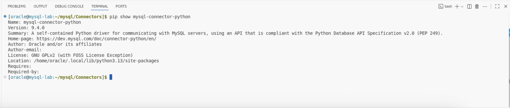
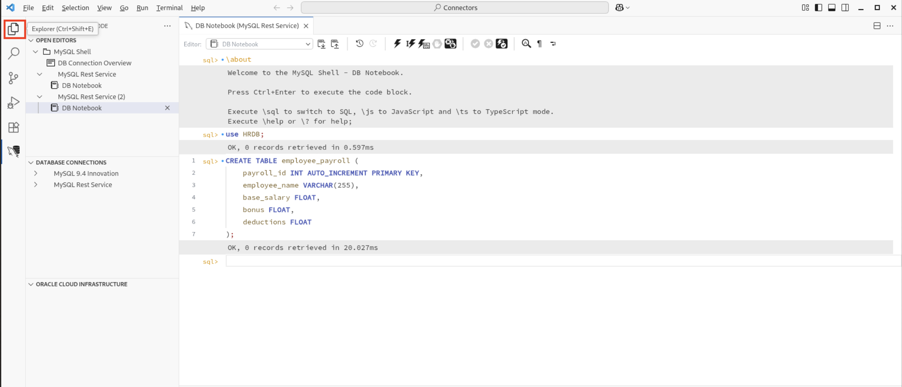
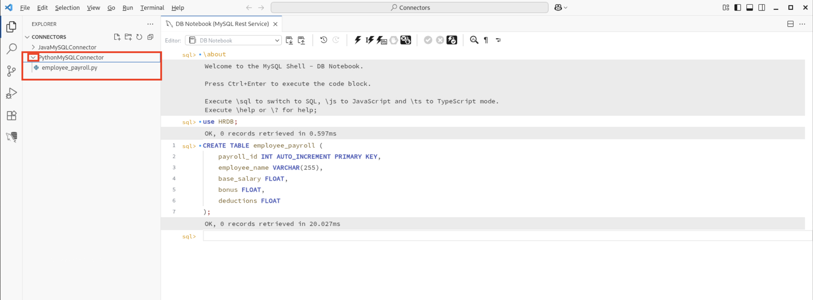
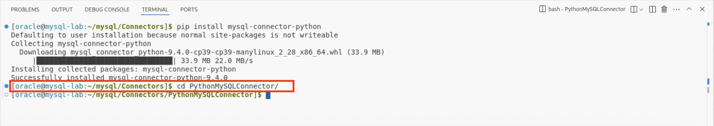
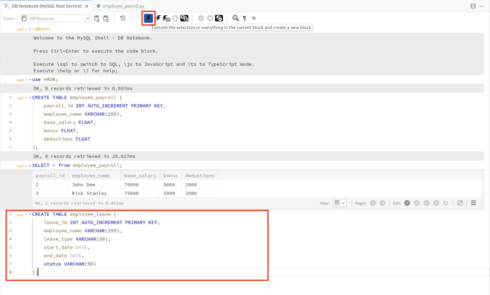
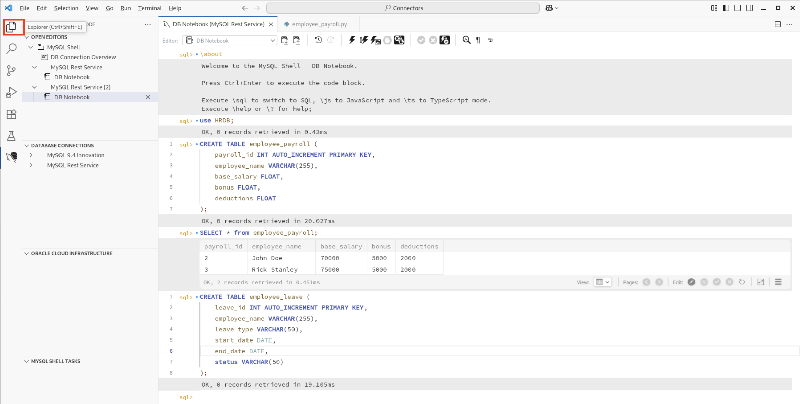
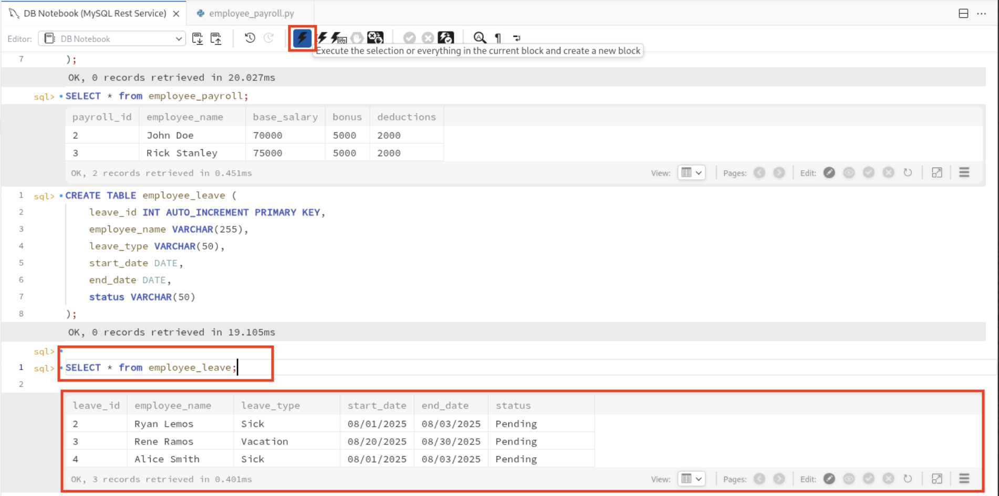

# Working with MySQL Connectors in Python and Java

## Introduction

MySQL Connectors are official libraries that allow your applications to communicate with MySQL databases using various programming languages.  

The two popular connectors are:  
MySQL Connector/Python: Allows Python applications to connect and interact with MySQL.  
MySQL Connector/J (Java): Provides the JDBC driver implementation for Java programs to work with MySQL.

In this lab, you’ll learn how to set up, connect to MySQL, and perform basic database operations using both Python and Java.

Estimated time: 15 minutes

### Objectives

By the end of this lab, you'll be able to:

* Installation of MySQL Connector/Python and Connector/J
* Connecting to MySQL from Python and Java
* Creating Database tables
* Verifying Database Changes in MySQL

## Task 1: Using MySQL Connector with Python

1. In a new connected shell, you can now connect to the database **HRDB** using the following command and click on run button on the top navigation bar to execute the query. This will switch to the HRDB database.

     ```
     <copy>use HRDB;</copy>
     ```
     

2. Create a table **employee_payroll** where we can store payroll information for employees.
     ```
     <copy>CREATE TABLE employee_payroll (
    payroll_id INT AUTO_INCREMENT PRIMARY KEY,
    employee_name VARCHAR(255),
    base_salary FLOAT,
    bonus FLOAT,
    deductions FLOAT
);</copy>
     ```
     

3. In Visual Studio Code, click on **Terminal** in the top menu and select **New Terminal**. This will open a new integrated terminal at the bottom of your workspace, where you can run Python or pip commands.

     

4. In VS Code’s terminal, run the following command and press Enter to install the necessary Python connector. This step prepares your Python environment to communicate with MySQL databases.

     ```
     <copy>pip install mysql-connector-python</copy>
     ```
     

5. After running the install command, check the terminal output for a message indicating that mysql-connector-python has been successfully installed. Look for lines like **Successfully installed mysql-connector-python** to confirm the installation completed without errors.

     

6. Click on the **Explorer icon (the file icon)** on the left sidebar. This will open the File Explorer, where you can view and access all the files and folders in your project directory.

    

7. This panel shows your project folder structure where you can navigate to the **PythonMySQLConnector** folder and expanding it you will see the **employee\_payroll.py** file listed.

    

8. You can click on the **employee\_payroll.py** file to view its content. This script is pre-written to interact with your MySQL database and perform tasks like inserting, updating and deleting records from the employee_payroll table.

    

9. From your project folder path in the VS Code **terminal**, enter the following command and press **Enter** which will switch to the **PythonMySQLConnector** folder.
     ```
     <copy>cd PythonMySQLConnector/</copy>
     ```
     

10. Use the following command and press **Enter**. This will execute the script, which will connect to your database and add new data to the table as defined in its code.

     ```
     <copy>python employee_payroll.py</copy>
     ```
     

11. After running the Python script, you can also check the results by opening your MySQL shell window. Run the following command and click on run to execute the query.

     ```
     <copy>SELECT * from employee_payroll;</copy>
     ```
     

12. Here is the output of the executed query.

    

13. Close the terminal by clicking on the x button on the tab.

    

## Task 2: Using MySQL Connector with Java

1. Create a table **employee_leave** where we can store leave information for employees.
     ```
     <copy>CREATE TABLE employee_leave (
    leave_id INT AUTO_INCREMENT PRIMARY KEY,
    employee_name VARCHAR(255),
    leave_type VARCHAR(50),
    start_date DATE,
    end_date DATE,
    status VARCHAR(50)
);</copy>
     ```
     

2. Click on the **Explorer icon (the file icon)** on the left sidebar. This will open the File Explorer, where you can view and access all the files and folders in your project directory.

    

3. This panel shows your project folder structure where you can navigate to the **JavaMySQLConnector** folder and expanding it you will see the the Java code folder to begin.

    

4. In Visual Studio Code, click on **Terminal** in the top menu and select **New Terminal**. This will open a new integrated terminal at the bottom of your workspace.

     

5. Download the MySQL connector JAR and install it using the command. This ensures your Java programs can communicate with MySQL. The connector JAR will be extracted to /usr/share/java/mysql-connector-j.jar. Directory with java code and library with this mysql connector is included.

     <!-- ```
     <copy>sudo rpm -ivh mysql-connector-j-9.4.0-1.el9.noarch.rpm</copy>
     ```
      -->

6. From your project folder path in the VS Code **terminal**, enter the following command and press **Enter** which will switch to the **JavaMySQLConnector** folder.
     ```
     <copy>cd JavaMySQLConnector/</copy>
     ```
     

7. Compile your Java program by clicking on enter after the command is entered, referencing the MySQL connector JAR. This prepares your program to run using the connector.

     ```
     <copy>javac -cp ".:lib/*" EmployeeLeaveManager.java</copy>
     ```
     

8. Execute your compiled Java class by clicking enter to connect to MySQL and interact with the employee_leave table.

     ```
     <copy>java -cp ".:lib/*" EmployeeLeaveManager</copy>
     ```
     

9. After running the script, you can also check the results by opening your MySQL shell window. Run the following command and click on run to execute the query.

     ```
     <copy>SELECT * from employee_leave;</copy>
     ```
     

## Acknowledgements

* **Author** - Sindhuja Banka, HeatWave MySQL Product Manager
* **Contributors** - Sindhuja Banka, Anand Prabhu
* **Last Updated By/Date** - Sindhuja Banka, July 2025
