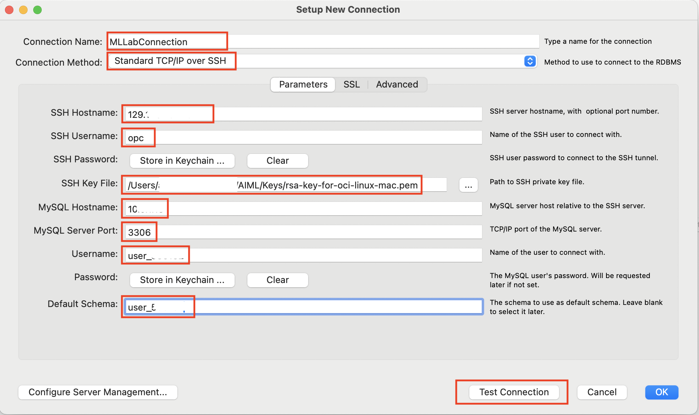
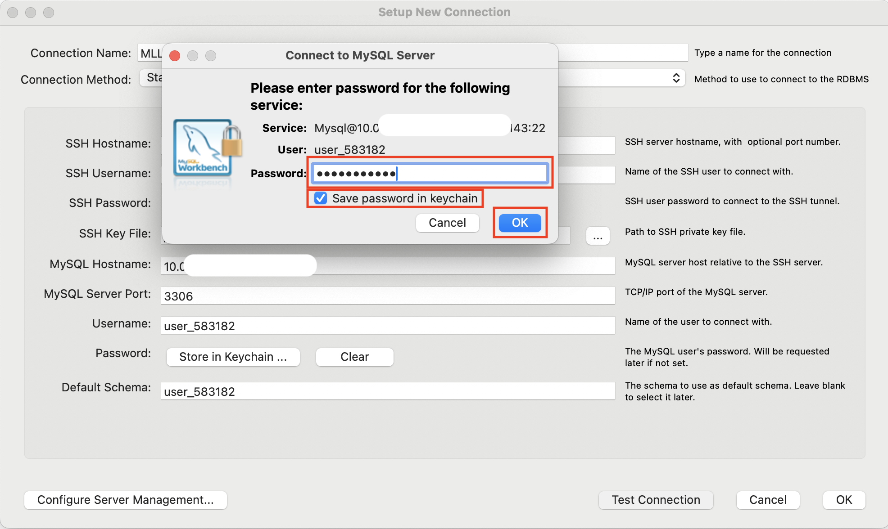
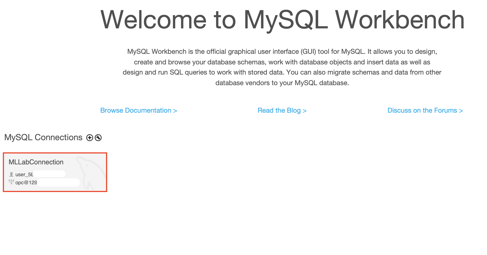
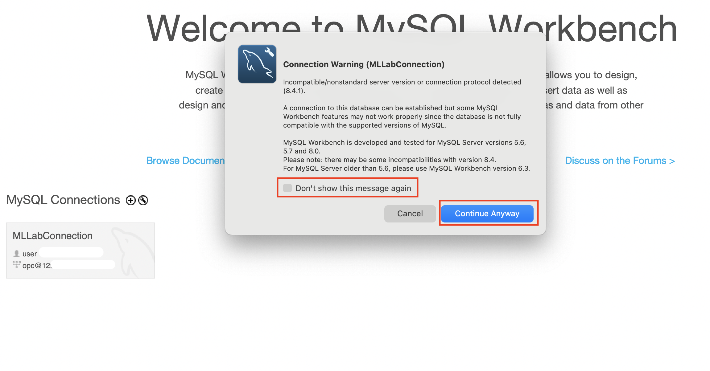
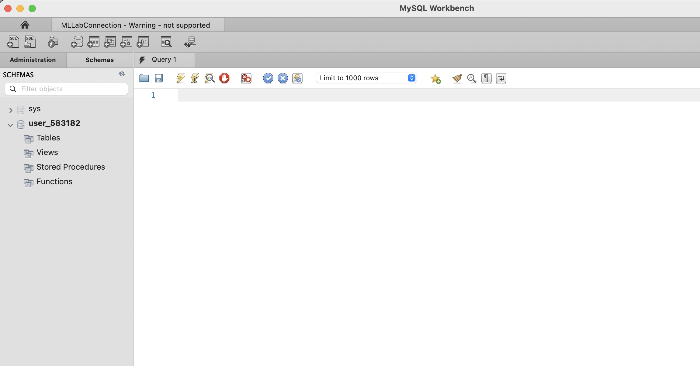

# Connect to MySQL HeatWave Database

## Introduction

When working in the cloud, there are often times when your servers and services are not exposed to the public internet. The Oracle Cloud Infrastructure (OCI) MySQL cloud service is an example of a service that is only accessible through private networks. Since the service is fully managed, we keep it siloed away from the internet to help protect your data from potential attacks and vulnerabilities. It’s a good practice to limit resource exposure as much as possible, but at some point, you’ll likely want to connect to those resources. That’s where Compute Instance, also known as a Bastion host, enters the picture. This Compute Instance Bastion Host is a resource that sits between the private resource and the endpoint which requires access to the private network and can act as a “jump box” to allow you to log in to the private resource through protocols like SSH.  This bastion host requires a Virtual Cloud Network and Compute Instance to connect with the MySQL DB Systems.

Today, you will use the environment details accessed in the lab 1 to connect to the MySQL HeatWave Database.

_Estimated Lab Time:_ 10 minutes

### Objectives

In this lab, you will be guided through the following tasks:

- Install MySQL Workbench
- Create New MySQL Connection in MySQL Workbench
- Connect to MySQL DB System

### Prerequisites

- Some Experience with MySQL Workbench
- Must Complete Lab 1

## Task 1: Install MySQL Workbench and launch MySQL Workbench

1. Find the MySQL Workbench appropriate to your operating system and install 

    [Download MySQL Workbench] (https://dev.mysql.com/downloads/workbench/)

    

    **Note: While installing on Windows, if the error 'Microsoft Visual C++ 2019 Redistributable Package (x64) is not installed' is encountered then please try the MySQL Installer below, which installs the required prerequisites**
    
    [Download MySQL Installer] (https://dev.mysql.com/downloads/windows/installer/8.0.html)
    
    Click on **Windows (x86, 32-bit), MSI Installer	8.0.39	303.6M**

2. Launch installed MySQL Workbench and **steps mentioned below is applicable only for Mac and Linux Users** 

   Set parameters related to timeout 

   

   In Mac or Linux -> Go to MySQLWorkbench -> Settings -> SQL Editor 

   

   Set MySQL Session parameters to 1000 seconds, uncheck Safe Updates and click **OK**

   

## Task 2: Login to the portal used in lab 1 to access environment details

1. Launch the portal [AI/ML Hackathon] (https://g24b1428ec2b5a6-apexaimlhackathon.adb.us-phoenix-1.oraclecloudapps.com/ords/r/aimlworkshop/aimlhackatahon/login)

2. Enter Email Id and Password used during registration to login to the portal 

   
    
3. Access the environment details in the portal and download the private key required to make DB connection over SSH 
   
   For SSH Private Key file click on **Download SSH Key file**

   

   **Note for Mac and Linux Users: Ensure File Permissions of key file set to 400 as shown below**
   

## Task 3: Create a new MySQL connection in MySQL Workbench 

1. Click on **+** to add new mysql connection in MySQL Workbench

   

2. Enter details of the connection 
   * Connection name as **MLLabConnection** 
   * Select connection method as **Standard TCP/IP over SSH**
   * Enter SSH Hostname from environment details retrieved in task 2
   * Enter SSH Username from environment details retrieved in task 2
   * Enter SSH Key File - a path to the downloaded key from task 2 
   * Enter MySQL Hostname from environment details retrieved in task 2
   * Enter MySQL Server Port from environment details retrieved in task 2
   * Enter Username from environment details retrieved in task 2
   * Enter Default Schema from environment details retrieved in task 2
   * Click on **Test Connection**

   

   * Enter Password from environment details retrieved in task 2
   * Check **Save password in keychain** and click **OK**

    

   * Click on **Continue Anyway**
    

   * Click **OK**
    

   * Click **OK**
    

## Task 4: Connect to HeatWave MySQL Database system

1. Now a new connection shows up in MySQL Workbench created in task 3 and double click on it.
    

2. Check **Don't show this message again** and click **Continue Anyway** 
    

3. Now connection is made to HeatWave MySQL Database system 
    

You may now proceed to the next lab.

## Learn More

- [MySQL Workbench](https://www.mysql.com/products/workbench/)

## Acknowledgements

- **Author** - Anand Prabhu, Principal Member of Technical Staff, MySQL
- **Last Updated By/Date** - Anand Prabhu, Principal Member of Technical Staff, MySQL, August 2024
