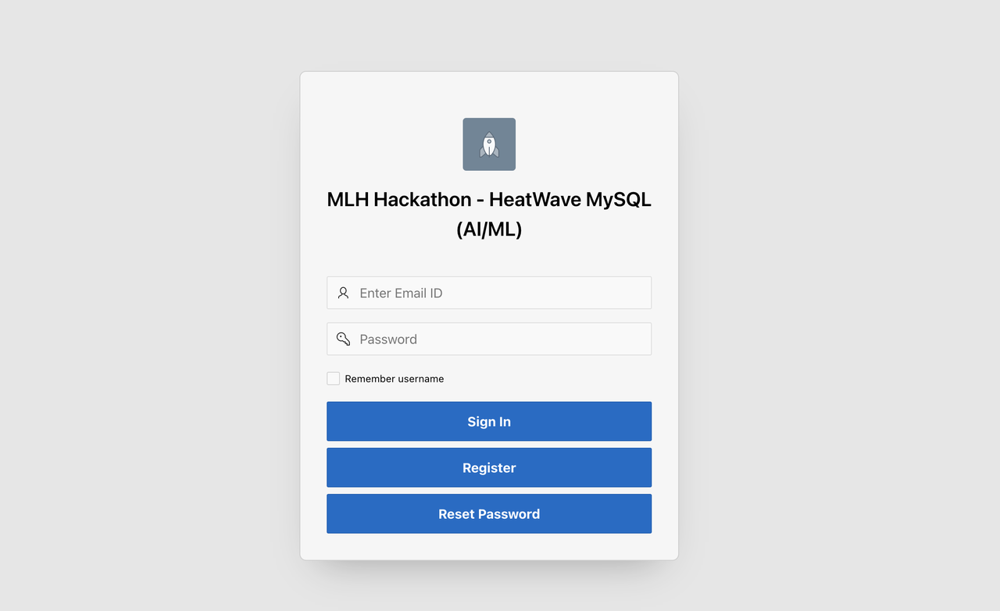
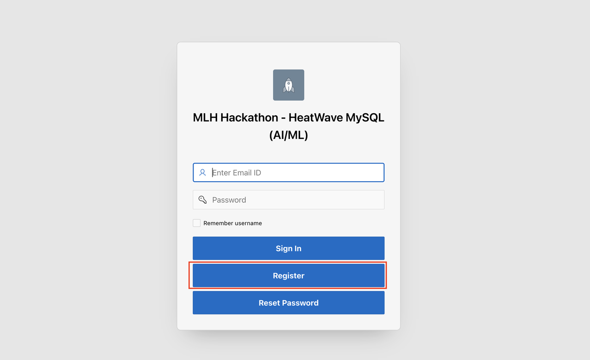
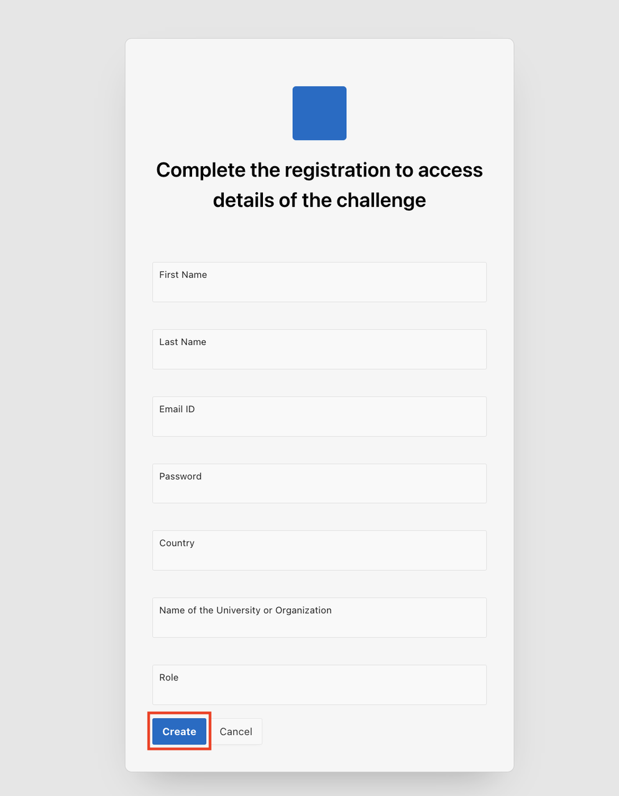
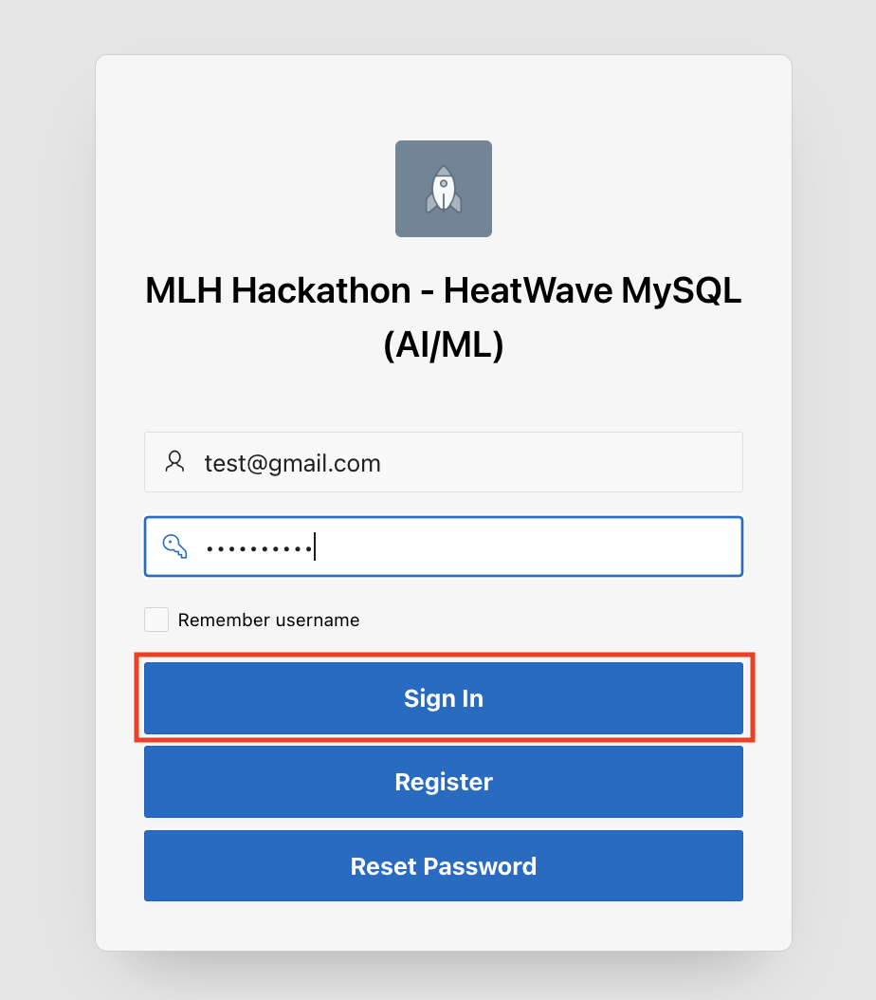
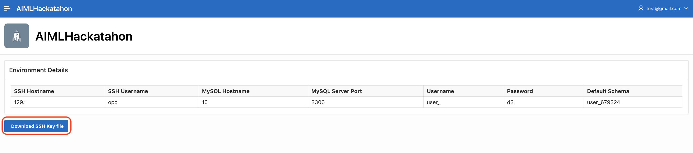

# Register and get HeatWave MySQL environment details
## Introduction

In this lab, you will register to access the MySQL HeatWave Database System details. Once the registration is complete, use the environment details provided in the portal to execute next labs in the workshop. 

_Estimated Time:_ 5 minutes

### Objectives

In this lab, you will be guided through the following tasks:

- Register to get a dedicated schema in a pre-provisioned HeatWave MySQL Database with HeatWave cluster

## Task 1: Register in the portal below

1. Click the registration link [AI/ML Hackathon] (https://g24b1428ec2b5a6-apexaimlhackathon.adb.us-phoenix-1.oraclecloudapps.com/ords/r/aimlworkshop/aimlhackatahon/login)

    

2. Click **Register**
    

3. Enter all the information in the form and click **Create**

    

4. Enter Email Id and Password used during registration to login to the portal 

   
    
5. Access the environment details in the portal and download the private key required to connect to HeatWave MySQL over SSH
   
   Click **Download SSH Key file** to download the private key.
   
   

You may now proceed to the next lab.

## Acknowledgements

- **Author** - Anand Prabhu, Principal Member of Technical Staff, MySQL
- **Last Updated By/Date** - Anand Prabhu, Principal Member of Technical Staff, MySQL, August 2024
