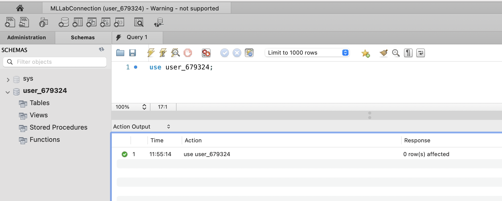
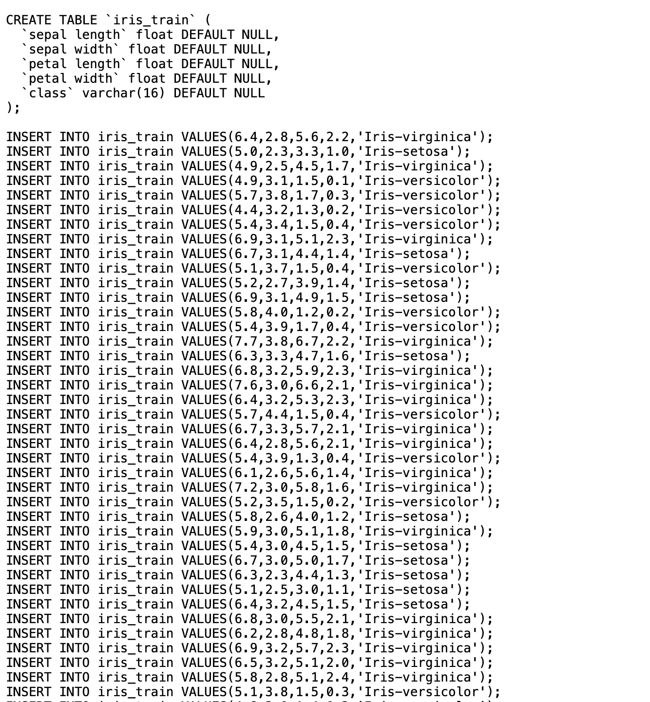
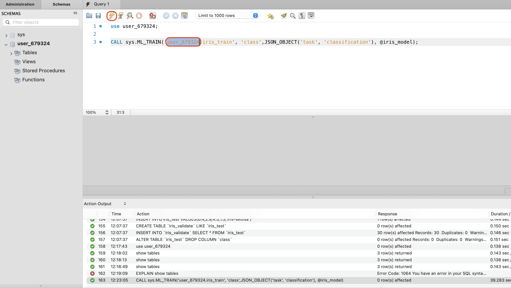
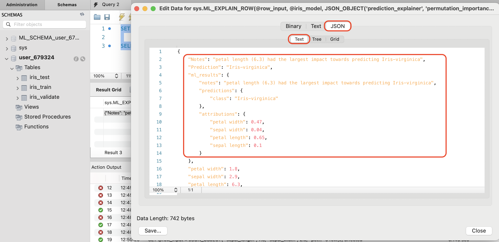
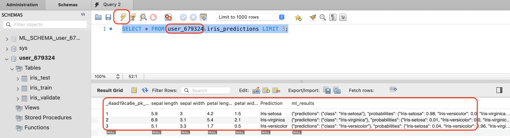
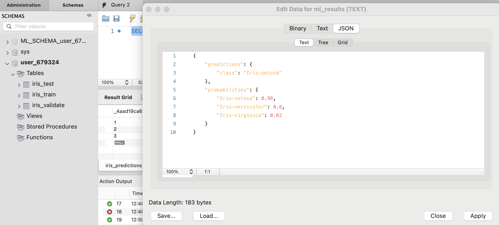
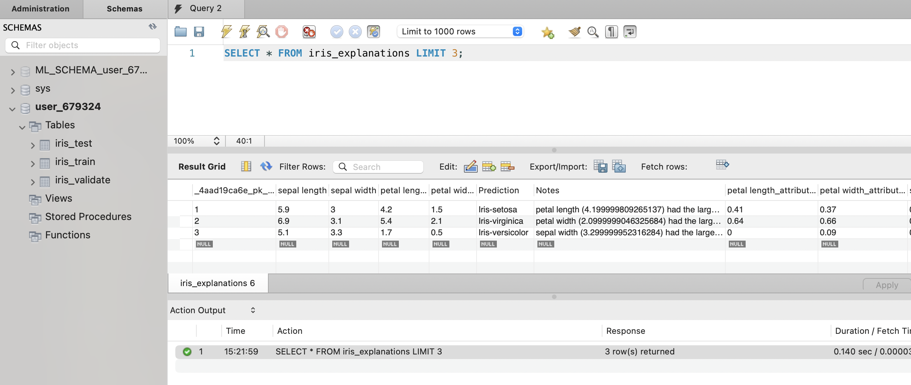
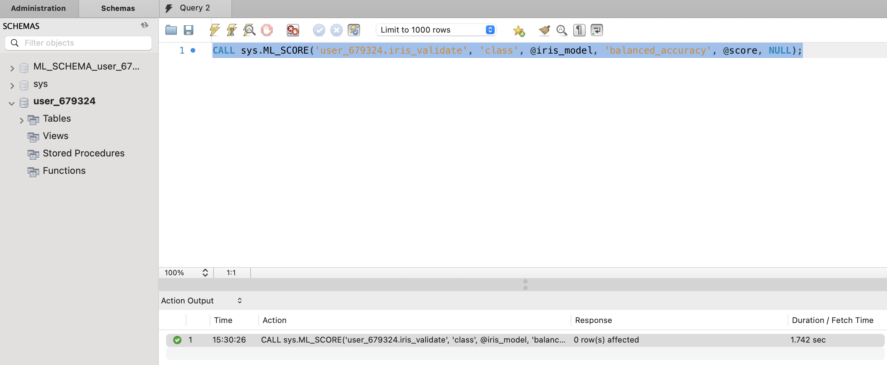
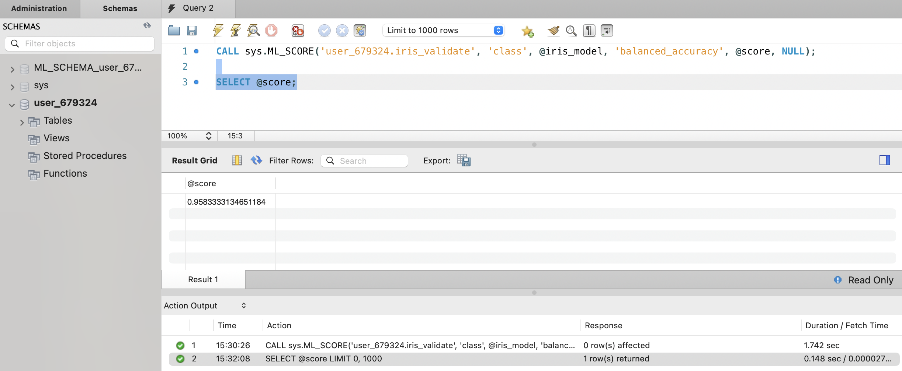

# Build HeatWave ML with SQL

## Introduction

To load the Iris data components, perform the following steps to create and load the required schema and tables.

After this step the data is stored in the MySQL HeatWave database in the following schema and tables:

**user schema:** The user schema containing training and test dataset tables.

**iris_train table:** The training dataset (labeled). Includes feature columns (sepal length, sepal width, petal length, petal width) and a populated class target column with ground truth values.

**iris_test table:** The test dataset (unlabeled). Includes feature columns (sepal length, sepal width, petal length, petal width) but no target column.

**iris_validate table:** The validation dataset (labeled). Includes feature columns (sepal length, sepal width, petal length, petal width) and a populated class target column with ground truth values.

_Estimated Time:_ 10 minutes

### Objectives

In this lab, you will be guided through the following tasks:

- Load Iris Data into HeatWave
- Train the machine learning model
- Test the machine learning model 
- Score the machine learning model 

### Prerequisites

- Some Experience with MySQL Workbench
- To execute any commands or queries in MySQL Workbench click on the icon highlighted within red block as shown below
    

- Completed Lab 2

## Task 1: Load training and test data

1. Connect to the schema created

    - Get the schema name from environment details from the portal used in lab 1
    

    - Execute the below command to connect to the schema by replacing **&lt;schemaname&gt;** with one from environment details and run it in MySQL Workbench as shown below.
   
      ```bash
      <copy>use <schemaname>; </copy>
      ```

      

2. To create and load tables into the MySQL HeatWave DB System perform the following steps:

    a. Click on this link to **Download file [iris-ml-data.txt](files/iris-ml-data.txt)**  to your local machine

    b. Open iris-ml-data.txt from your local machine with notepad

    

    c. Copy all of the content in the iris-ml-data.txt file from your local machine and paste it into MySQL Workbench, select all the content in MySQL Workbench and hit execute button.

    

3. View the content of  your machine learning schema 

    a. Connect to the schema using below command and replace **&lt;schemaname&gt;** with schema from environment details.

      ```bash
      <copy>use <schemaname>; </copy>
      ```

    b. Verify three tables created from task 2 : iris\_train, iris\_test and iris\_validate tables. 

      ```bash
      <copy>show tables; </copy>
      ```

    

## Task 2: Train the machine learning model

1. Train the model using ML_TRAIN. Since this is a classification dataset, the classification task is specified to create a classification model.

    - Modify the below command to replace **&lt;schemaname&gt;** with schema from environment details.
    - It will take 30 to 50 seconds to train the model
        
        ```bash
        <copy>CALL sys.ML_TRAIN('<schemaname>.iris_train', 'class',JSON_OBJECT('task', 'classification'), @iris_model);</copy>
        ```
        
        

2. When the training operation finishes, the model handle is assigned to the @iris_model session variable, and the model is stored in your model catalog. You can view the entry in your model catalog using the following query and replace **&lt;schema username&gt;**  with schema username from enviroment details in the portal used in lab 1

    


    ```bash
    <copy>SELECT model_id, model_handle, train_table_name FROM ML_SCHEMA_<schema username>.MODEL_CATALOG;</copy>
    ```

    


3. Load the model into HeatWave ML using ML\_MODEL\_LOAD routine:

    ```bash
    <copy>CALL sys.ML_MODEL_LOAD(@iris_model, NULL);</copy>
    ```

    A model must be loaded before you can use it. The model remains loaded until you unload it or the HeatWave Cluster is restarted.

    

## Task 3: Predict and Explain for Single Row

1. Make a prediction for a single row of data using the ML\_PREDICT\_ROW routine.
In this example, data is assigned to a @row\_input session variable, and the variable is called by the routine. The model handle is called using the @iris\_model session variable:

    ```bash
    <copy>SET @row_input = JSON_OBJECT( "sepal length", 7.3, "sepal width", 2.9, "petal length", 6.3, "petal width", 1.8); </copy>
    ```

    ```bash
    <copy>SELECT sys.ML_PREDICT_ROW(@row_input, @iris_model, NULL);</copy>
    ````

    

    Right click on the result and click on **Open Value in Viewer** to view the result in JSON format
    
    


    Based on the feature inputs that were provided, the model predicts that the Iris plant is of the **class Iris-virginica**. The feature values used to make the prediction are also shown.


2. Generate an explanation for the same row of data using the ML\_EXPLAIN\_ROW routine to understand how the prediction was made:

    ```bash
    <copy>SELECT sys.ML_EXPLAIN_ROW(@row_input, @iris_model, JSON_OBJECT('prediction_explainer', 'permutation_importance'));</copy>
    ```

    

    **The attribution values show which features contributed most to the prediction, with petal length and petal width being the most important features. The other features have lower values indicating that they did not contribute much to the prediction.**

    Right click on the result and click on **Open Value in Viewer** to view the result in JSON format
    
    

## Task 4: Make predictions and run explanations for a table of data  using a trained model

1. Make predictions for a table of data using the ML\_PREDICT\_TABLE routine. The routine takes data from the iris\_test table as input and writes the predictions to an iris_predictions output table.
    
    Copy the command below and replace **&lt;schemaname&gt;** with actual schema name from environment details.

    ```bash
    <copy>CALL sys.ML_PREDICT_TABLE('<schemaname>.iris_test', @iris_model,'<schemaname>.iris_predictions', NULL);</copy>
    ```

    

2. Query the table ML\_PREDICT\_TABLE to view the results  

    Copy the query below and replace **&lt;schemaname&gt;** with actual schema name from environment details.

    ```bash
    <copy>SELECT * FROM <schemaname>.iris_predictions LIMIT 3;</copy>
    ```

    The table shows the predictions and the feature column values used to make each prediction.
    

    Right click on the result and click on **Open Value in Viewer** to view the result in JSON format
    


3. Generate explanations for the same table of data using the ML\_EXPLAIN\_TABLE routine.

    Copy the command below and replace **&lt;schemaname&gt;** with actual schema name from environment details.
    ```bash
    <copy>CALL sys.ML_EXPLAIN_TABLE('<schemaname>.iris_test', @iris_model, '<schemaname>.iris_explanations',JSON_OBJECT('prediction_explainer', 'permutation_importance'));</copy>
    ```

    

4. Query the table ML\_EXPLAIN\_TABLE  to view the results

    ```bash
    <copy> SELECT * FROM iris_explanations LIMIT 3;</copy>
    ```

    

## Task 5: Score your machine learning model to assess its reliability and unload the model

1. Score the model using ML\_SCORE to assess the model's reliability. This example uses the balanced_accuracy metric, which is one of the many scoring metrics supported by HeatWave ML.

    Copy the command below and replace **&lt;schemaname&gt;** with actual schema name from environment details.
    
    ```bash
    <copy>CALL sys.ML_SCORE('<schemaname>.iris_validate', 'class', @iris_model, 'balanced_accuracy', @score, NULL);</copy>
    ```

    

2. To retrieve the computed score, query the @score session variable

    ```bash
    <copy>SELECT @score;</copy>
    ```

   

3. Unload the model using ML\_MODEL\_UNLOAD:

    ```bash
    <copy>CALL sys.ML_MODEL_UNLOAD(@iris_model);</copy>
    ```

    To avoid consuming too much space, it is good practice to unload a model when you are finished using it.

   

## Learn More

* [Oracle Cloud Infrastructure MySQL Database Service Documentation](https://www.oracle.com/mysql/)
* [HeatWave MySQL Database Documentation](https://www.mysql.com/products/heatwave/)

## Acknowledgements

- **Author** - Anand Prabhu, Principal Member of Technical Staff, MySQL
- **Last Updated By/Date** - Anand Prabhu, Principal Member of Technical Staff, MySQL, August 2024
