# Logging Analytics

## Introduction

In this lab, you will learn how to use the Oracle Cloud Logging Analytics service to collect and analyze log data directly from the MySQL log files such as the General Query log and Error log to gain deeper insights into database activity.

Estimated Lab Time: 20 minutes

### Objectives

* Learn OCI Logging Analytics fundamentals in the context of log collection from an Application architecture hosted on top of MySQL Database
* Learn to analyse, monitor, troubleshoot, and derive knowledge from the collected log data using Logging Analytics' Machine Learning features such as Cluster and Link
* Real-Time Monitoring and Alerting for Database Events
* Learn to create and use monitoring dashboards

## Task 1: Getting Familiar with Log Explorer

1. To access Logging Analytics, click on the Oracle Cloud Console **Navigation menu** (aka hamburger menu) located in the upper left corner. Under **Observability & Management**, navigate to **Logging Analytics**.

     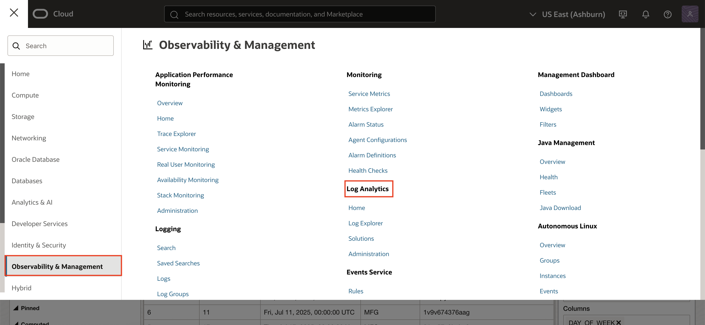

2. Click on **Administration** from the tab on the top beside Home.

     

3. From the Resources Menu, click on **Sources** to navigate to the Source that we have already created for visualization purposes.

      

4. If you don't find MySQL Error Logs - LiveLabs in the list, you can **search** for it using the search lab location in the top left corner. Once you find MySource, click on it for a detailed view.

      

5. Click on **View In Log Explorer** from the source.

      

6. Here are the main parts of the user interface that will be used throughout this lab.

      

      * **Scope Filter** - for setting Entity and Log Group Compartment scope for exploration.

      * **Time range** picker, and **Actions** menu - where you can find actions such as, *Open*, *Save*, and *Save as*.

      * **Query bar**, with **Clear**, **Search Help** and **Run** buttons at the right end of the bar.

      * **Fields panel** - where you can select sources and fields to filter your data.

      * **Visualization panel** - where you can select the way to present search data in a form that helps you.

      * **Main panel** - where the visualization outputs appear above the results of the query.

   *Note: You are working with live logs so it may take a few minutes for logs to show up in your Log Explorer view. Click the **Run** button to re-run the query.*

## Task 2: Visualize Data Using Charts and Controls

1. In the Visualizations panel, click the **Visualizations** options.

     

2. Select any simple visualization like **Heat Map** (table with histogram icon). The data is represented in the form of a Heat Map.

      

      

3. Select any other visualization like **Line** (table with histogram icon). The data is represented in the form of a Line.

      

      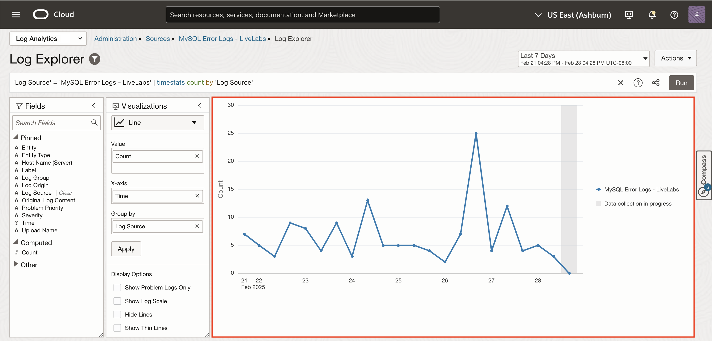

## Task 3: Explore Logs Using Cluster Visualization

1. Click on the **Cluster** Visualization to invoke Machine Learning Algorithm.

     

     

2. You can drill down into different Clusters, Potential Issues, Outliers and Trends. Logging Analytics uses unsupervised ML to find related clusters in data. This reduces the approximately 500,000 log records to 500 cluster patterns, in real time.

      *Note: The numbers you see might be slightly different than the ones shown in the workshop. You can use the START time **March 4, 2025 06:17 PM UTC(-07:00)** and END time **March 18, 2025 06:17 PM UTC(-07:00)** in the time picker to replicate these in your lab environment.*

3. Click on the **Potential Issues** tab.

   In this screenshot, we see that out of the 40 clusters, 25 were automatically identified as Potential Issues.

   *Note: The actual numbers on your screen may be different because you are using live log data.*

   **Potential Issues** are a subset of total clusters that have potential issues based on log records containing words such as error, fatal, exception, and so on.

      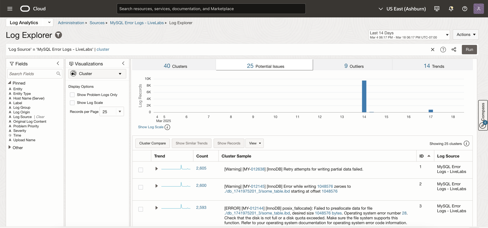

4. Click on the **Outliers** tab.

   These issues occurred only once, and indicate an anomaly in the system.

   **Outliers:** Number of clusters that have occurred only once during a given time period

      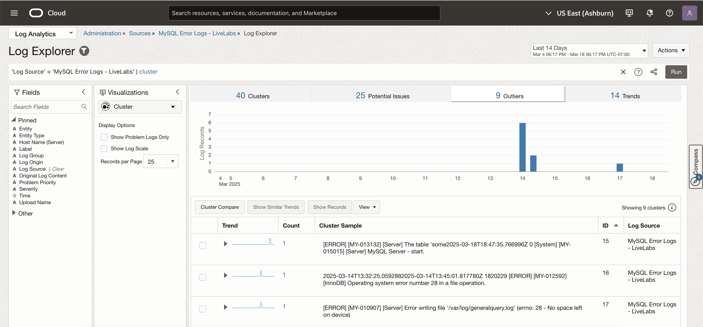

5. Correlate logs based on **Trends** tab.

   **Trend**: Number of unique trends during the time period. Many clusters may have the same trend. These are log cluster patterns that are correlated in time.

   Click on the **Trends** tab in the Cluster Visualization.

      

   Next, click on "5 similar trends" to see a set of related logs from the Concurrent Manager and Linux OS.

   *Note that the exact number of displayed trends may vary based on the selected time window.*

   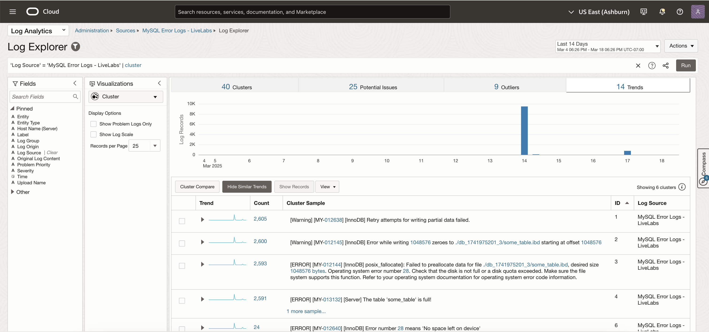

   These are the clusters that had the same shape (i.e. occuring at the same time) to as the selected cluster pattern in time. In this case these are the messages issued by Concurrent Manager for a failing job.

## Task 4: Explore Logs using Issues Visualization

1. Click on the **Issues** Visualization from the Visualizations panel.

      

2. This dashboard shows the **Cluster Compare by Time Shift**. To generate useful analytics by reducing the number of clusters to only the clusters that are unique in the current time period, then use the **Time Shift** option.

      

3. This is the default option available with the cluster compare utility. Click on **Options** where you can modify the baseline time range upto maximum of 7 days.

      

4. Using this data, you can identify the unique potential issue in the current week, and find a root-cause. Narrow down your selection of log records to those are the cause for the potential issue.

      *Note: The time shift value is subtracted from the start and end of the current time. If the time shift is less than the duration of the current time, there will be an overlap. This will show all the common (duplicate) clusters from that overlap period. A message will be shown when this is detected. In such a case, the baseline query is the same as the current query.*

## Task 5: Real-Time Monitoring and Alerting for Database Events

1. Logging analytics can seamlessly integrate with **log files** from External MySQL DB systems, enabling the capture and analysis of logs such as **error** and **general logs**.

2. The **error logs** are used to track critical events such as primary key violations and server errors, while the **general logs** capture all SQL queries like INSERT, UPDATE, and DELETE executed on the server. These log files are forwarded to OCI Logging Analytics, enabling monitoring and analysis of logs for any issues or suspicious activities, with the ability to create alarms based on specific patterns.

3. We've gone through all the steps for working with the **error logs**. Now, you can follow the same steps for the **general logs** to analyze query patterns, spot any issues, and setup alerts for anything unusual that might affect performance.

4. For example, this External MySQL DB system is configured to capture both **error logs** and **general logs**, which are stored in log files.

5. Using the same process as above, Click on Sources to navigate to the Source that we have already created for visualization purposes. If you don't find MySQL Error Logs - GeneralLogs in the list, you can **search** for it using the search lab location in the top left corner. Once you find MySource, click on it for a detailed view.

      

6. Click on **View In Log Explorer** from the source.

      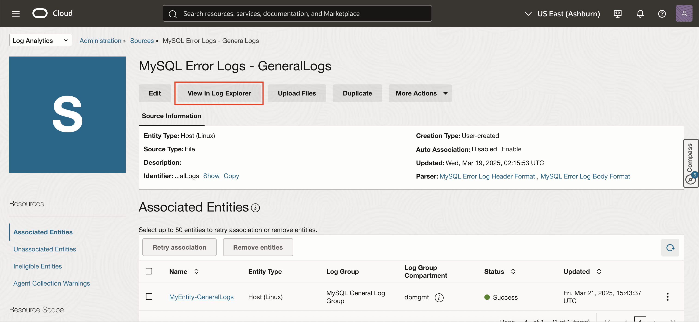

7. Click on the **Records with Histogram** Visualization from the Visualizations panel.

      

      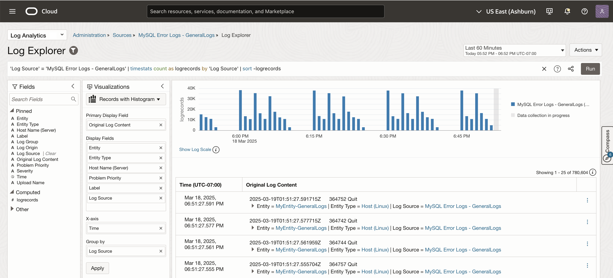

      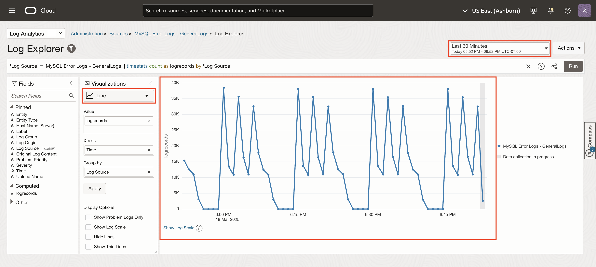

      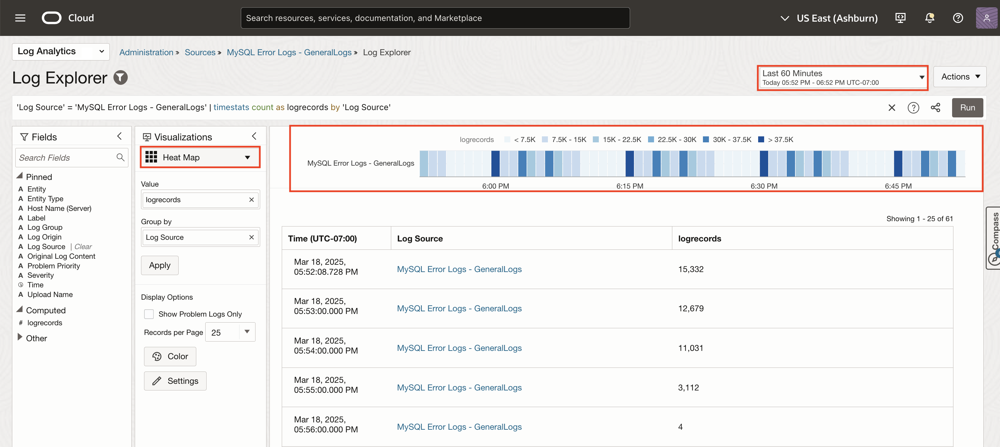

8. OCI Logging Analytics allows setting up **alarms** for critical database events, enabling real-time monitoring and alerting for potential security risks.

      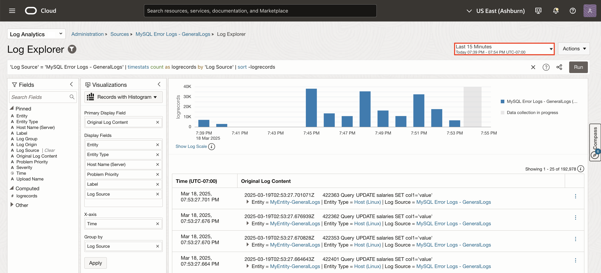

9. In this example, alarm has been already setup to detect **DROP DATABASE** events, ensuring proactive monitoring of the database changes.

      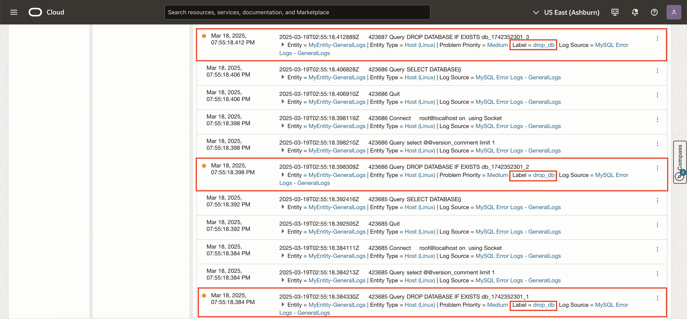

10. When a DROP DATABASE event occurs, OCI sends alarms via configured channels like Email or Slack, allowing users to take immediate actions.

11. Here is an example of an alarm sent to email when a database DROP occurs.

      

12. These alarms can also be expanded to monitor other SQL queries, such as DROP TABLE, DELETE FROM, or ALTER DATABASE, for enhanced security.

## Acknowledgements

* **Author** - Sindhuja Banka, HeatWave MySQL Product Manager
* **Contributors** - Sindhuja Banka, Anand Prabhu, Sriram Vrinda
* **Last Updated By/Date** - Sindhuja Banka, March 2025
