# Application Performance Management

## Introduction

In this lab, you will use the APM Trace Explorer to analyze traces and spans collected from the monitor run. You will explore the Query view to see how the parameters are carried over from the monitor page, use the Topology and Waterfall views to analyze traces and spans, and examine span dimensions to identify the root cause of the performance issues. You will also work with predefined and saved queries to analyze trends and behaviors of spans that may be impacting performance.

APM Trace Explorer allows you to run queries and visualize APM data, including:

* Traces (full transactions)
* Spans (individual units of work that make up a trace)

### Objectives

* Examine pre-configured queries in Trace Explorer
* Drill down into trace Details
* Inspect the SQL spans by executions
* Understand the importance of APM in diagnosing performance issues

## Task 1: Examine the pre-configured query in Trace Explorer

1. From the OCI menu, click **Observability & Management**. Under **Application Performance Monitoring**, click **Trace Explorer**.

     

2. On the top right of the Trace Explorer page, select the compartment **dbmgmt** and **Otel-Domain** for the APM Domain. Optionally, you can change the default time period (Last 60 minutes) to view all the traces with spans that started within the selected time range.

     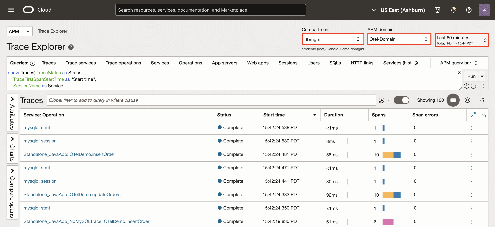

3. For example, here is the out-of-the-box query in the Traces quick pick, which uses clauses and out-of-the-box dimensions to display information pertaining to traces. Click on the 3 dots and then select **Open** using window navigation.

     

4. Select the **Otel-NoMySQLTraceEnabled** query for which the traces are not enabled in the MySQL DB.

     

5. Click on **Run** to execute the query.

     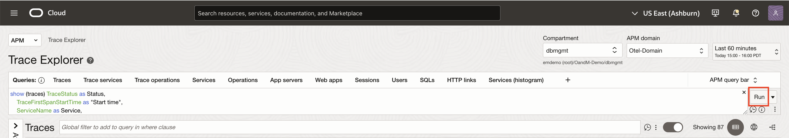

6. Provides an overview of the Trace Explorer, displaying detailed insights into traces and span related to your query.

     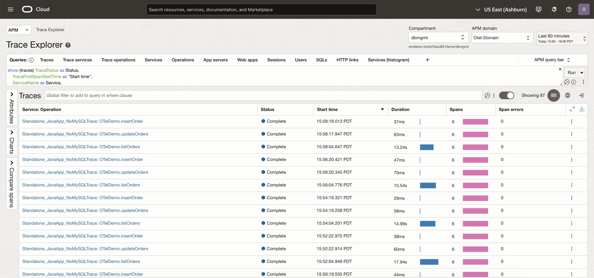

## Task 2: Limited Visibility and Analysis without MySQL Database traces enabled

1. By default, traces are displayed in the order by the start time. Right mouse click on the **Duration column**, select Sort **Descending** to show the traces by duration in descending order. This will bring the slowest trace to the top of the list.

     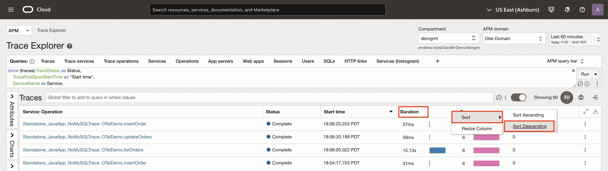

2. Look at the transactions (traces) executed by the monitor, and locate the slow trace that is taking more than 20 seconds. Click on the trace **Standalone_JavaApp: OTelDemo.listorders** under Service:Operation name column.

     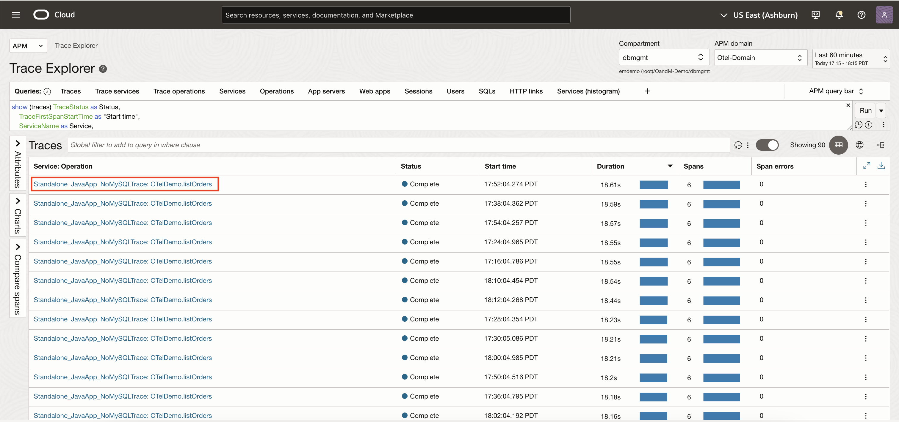

3. The Trace detail page opens and displays flow of action for the specific transaction in Topology and Waterfall views.

     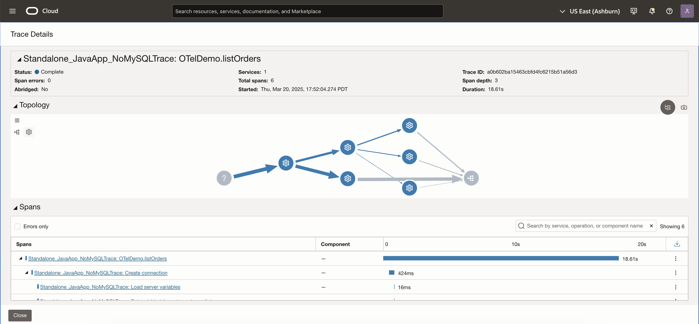

     *Note: The operations in the topology are the spans that are seen in the waterfall view.*

4. Examine the diagram by hovering over arrows which shows the connection details between the services. Notice that the thicker the arrow, the longer the connection time. So the diagram helps you to identify where in the services the slowness has occurred. Hover the mouse over the arrow between the last operation and the database. A floating window shows information about the slow SQL executed. But here since traces are not enabled it does not show the information. It shows as unknown.

     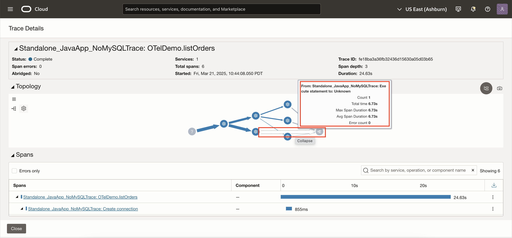

5. Click the triangle icon next to the Topology label, to **minimize** the topology region.

     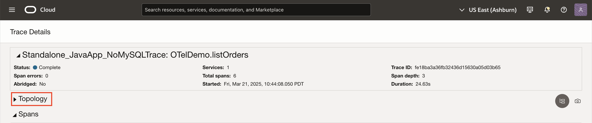

6. The waterfall view shows the spans invoked in the transaction. If the trace is spread across multiple services, review each of the following.

     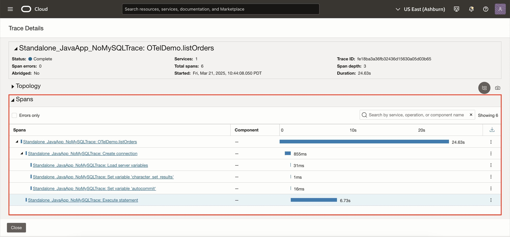

     * The view visualizes the workflow of the trace and the relation between the spans.

     * Each bar represents a span, and the time length goes from left to right.

     * The longer the bar, the more time was consumed to complete the operation.

     * The bar at the top is a root span, and child spans are nested below.

     * Spans may wait for the next span to complete, or may not if it is an async call.

7. Try to identify the slow span. For example, here, **Standalone\_JavaApp\_NoMySQLTrace: Execute statement** is the bottleneck. Click the link or the bar of the span.

     

8. Span details page opens. On this page, span details are provided in the list of dimensions. Here, you cannot see the full query and other dimensions because traces are not enabled.

     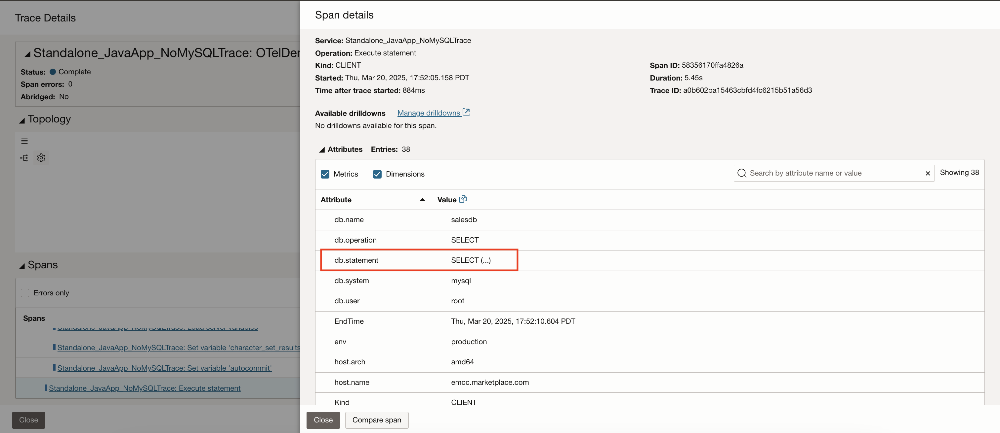

9. The key challenges here is that there is no clear view of how queries are executed across services and becomes difficult to correlate application and database performance issues.

10. Click on Close to exit the **Span Details** window.

     

11. Click on Close to exit the **Trace Details** window.

     

## Task 3: Examine traces in APM Trace Explorer

1. Until now, we've explored the scenario without traces enabled. Now, to fully understand the advantage of enabling traces with all the additonal details, let's look at the out-of-the-box query in the Traces quick pick, which uses clauses and out-of-the-box dimensions to display information pertaining to traces. Click on the 3 dots and open the query using the window navigation.

     

2. Select the **Otel-WithMySQLTraceEnabled** query where traces are enabled for particular query.

     

3. Click on **Run** to execute the query.

     

4. Provides an overview of the Trace Explorer, displaying detailed insights into traces and span related to your query.

     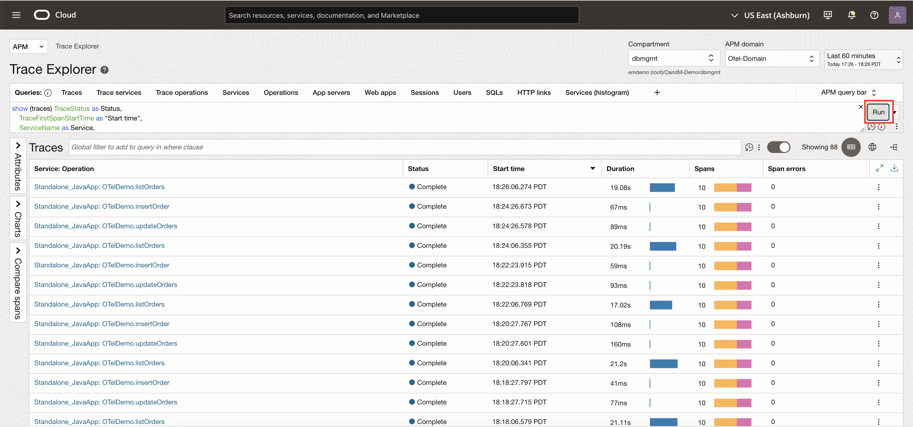

5. By default, traces are displayed in the order by the start time. Right mouse click on the **Duration column**, select Sort **Descending** to show the traces by duration in descending order. This will bring the slowest trace to the top of the list.

     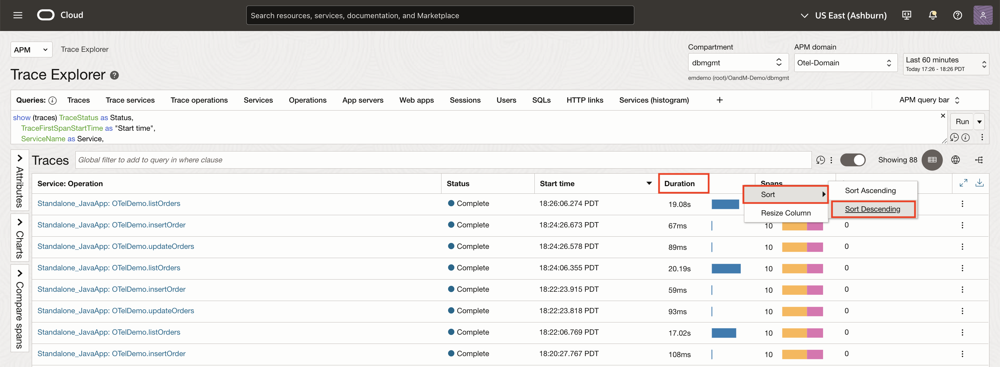

6. Look at the transactions (traces) executed by the monitor, and locate the slow trace that is taking more than 20 seconds. Click on the trace **Standalone_JavaApp: OTelDemo.listOrders** under Service:Operation name column.

     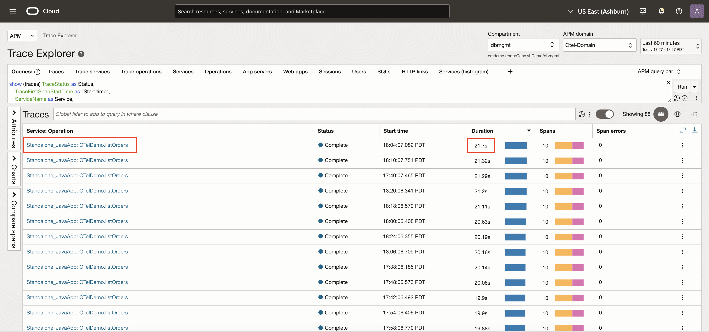

7. The Trace detail page opens and displays the flow of action for the specific transaction in Topology and Waterfall views.

     

     *Note: The operations in the topology are the spans that are seen in the waterfall view.*

8. Examine the diagram by hovering the mouse over arrows which shows the connection details between the services. Notice that the thicker the arrow, the longer the connection time. So the diagram helps you to identify where in the services the slowness has occurred. Hover the mouse over the arrow between the last operation and the database. A floating window shows information about the slow SQL executed.

     

9. Click the triangle icon next to the Topology label, to **minimize** the topology region.

     

10. The waterfall view shows the spans invoked in the transaction. If the trace is spread across multiple services, spans in each service appear in a different color. Review the following.

     

     * The view visualizes the workflow of the trace and the relation between the spans.

     * Each bar represents a span, and the time length goes from left to right.

     * The longer the bar, the more time was consumed to complete the operation.

     * The bar at the top is a root span, and child spans are nested below.

     * Spans may wait for the next span to complete, or may not if it is an async call.

11. Try to identify the slow span. For example, here, **Standalone\_JavaApp\_NoStandalone\_JavaApp: Execute statement > mysqld: stmt** is the bottleneck. Click the link or the bar of the span.

     

12. Span details page opens. On this page, span details are provided in the list of dimensions. Scroll down the list, and review the information of the span. These dimensions are provided out-of-the-box and can help you investigate a problem.

     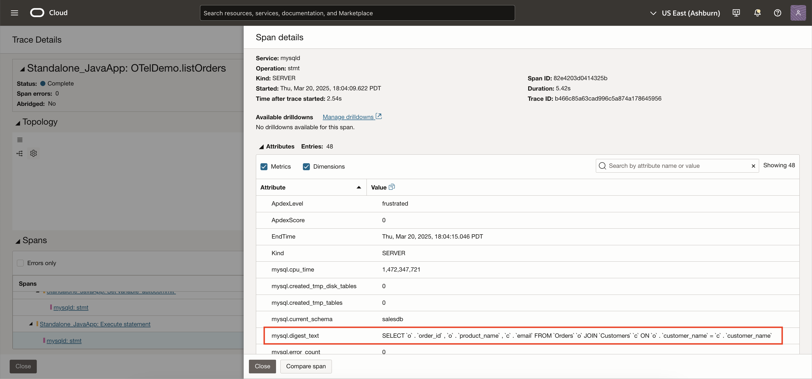

13. As scrolling down, locate the dimensions related to the database. In this case, you identified that the problem is a slow SQL. The dimensions provide the actual SQL, the time it took to execute and other additonal database metrics.

     

14. The root cause here is that query executed a **JOIN** without using an **index**, leading to inefficient processing. Since **mysql.no\_index\_used = 1** and **mysql.no\_good\_index\_used =0**, it indicates that MySQL performed a full table scan instead of levering an index for optimization. Additionally mysql.select\_full\_join = 1 and mysql.select\_scan=1 confirm that a **full join** scan occured, meaning every row in the **Orders** and **Customers** tables had to be checked. This results in high rows examined 2,000,000 compared to rows sent 1,000,000, increasing CPU usage and execution time. The absence of an index significantly slowed down the query, making it inefficient.

     

15. You can analyze trends, detect recurring performance issues, and ensure efficient query execution over time.

16. You can also add a drill down feature in APM to quickly navigate to Logging Analytics or Database Management.

     

     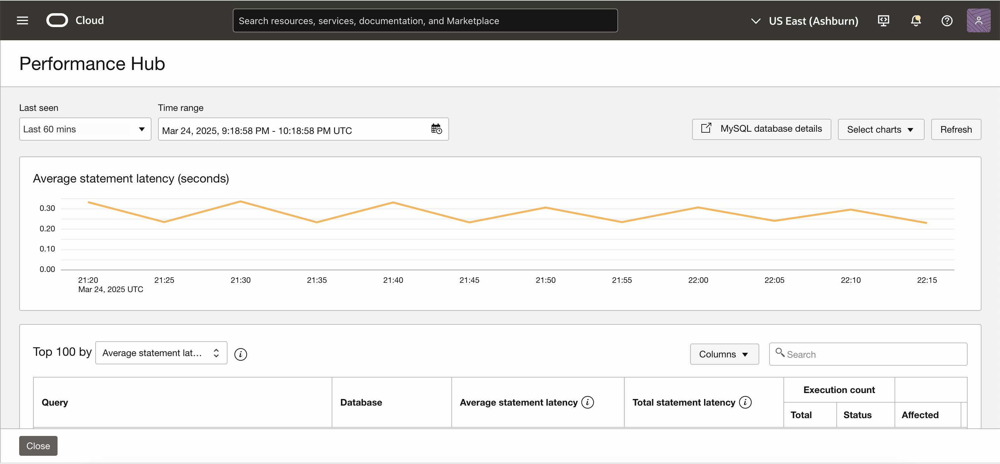

     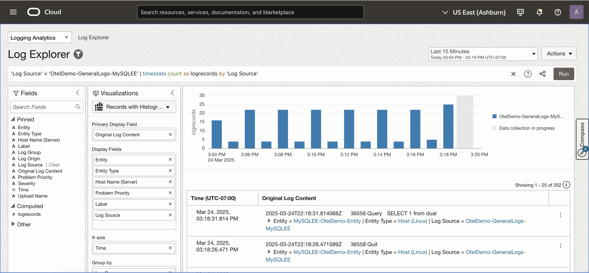

17. Click on Close to exit the **Span Details** window.

     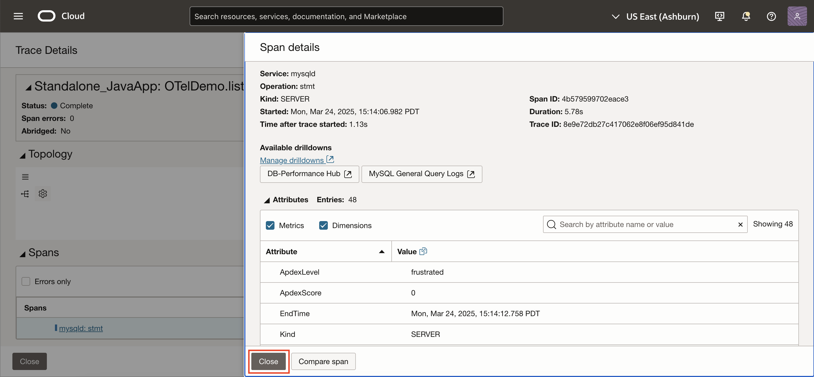

18. Click on Close to exit the **Trace Details** window.

     

## Acknowledgements

* **Author** - Sindhuja Banka, HeatWave MySQL Product Manager
* **Contributors** - Sindhuja Banka, Anand Prabhu, Sriram Vrinda
* **Last Updated By/Date** - Sindhuja Banka, March 2025
