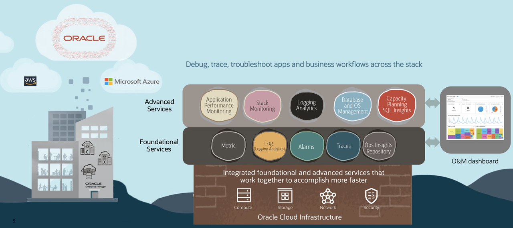

# Introduction

## About this Workshop

This workshop guides you through the process of provisioning a MySQL HeatWave database on OCI, enhancing a Spring Boot application with Oracle AI code assistant, incorporating OpenTelemetry instrumentation, and deploying the application on an Oracle Kubernetes cluster. You will learn how to monitor the application using the Oracle Application Performance Management Service, leveraging OpenTelemetry traces and metrics for comprehensive end-to-end monitoring and diagnostics. Additionally, the workshop covers the utilization of Oracle Cloud Infrastructure (OCI) Database Management to monitor the MySQL HeatWave database and Logging Analytics for Kubernetes and application logs.

Estimated Time: 120 minutes

### About Oracle AI Code Assistant 

Oracle AI code assist utilizes machine learning models to provide real-time suggestions and autocompletions while writing code. Oracle AI code assist analyzes the context and structure of the code being written, offering relevant snippets and completing code patterns. Available as IntelliJ IDEA plugin to enhance the productivity by reducing manual typing and helping developers discover and apply appropriate code constructs.

### MySQL Heatwave Database 

MySQL Heatwave is a fully-managed database service, powered by the integrated HeatWave in-memory query accelerator. It is the only cloud-native database service that combines transactions, analytics, and machine learning services into MySQL Heatwave, delivering real-time, secure analytics without the complexity, latency, and cost of ETL duplication.

### Observability and Management Services 

Monitor, analyze, and manage multicloud applications and infrastructure environments with full-stack visibility, prebuilt analytics, and automation using Oracle Cloud Observability and Management Platform.

### Database Management 

Database management provides unified console for on-premises and cloud databases with lifecycle database management capabilities for monitoring, performance management, tuning, and administration. With Performance Hub, developers can improve SQL code during active development as well as continuously monitor and tune queries running on production systems. For more information on MySQL HeatWave Database Management > **[Use Database Management for MySQL HeatWave](https://blogs.oracle.com/mysql/post/database-management-for-mysql-heatwave)**

### Application Performance Management 

Among other capabilities, OCI APM includes an implementation of a Distributed Tracing system. It collects and processes transaction trace data (spans) from the monitored application and makes it available for viewing, dashboarding, exploration, alerts, etc. For more information on APM and Trace Explorer please refer to Application Performance Monitoring > **[Use Trace Explorer](https://docs.oracle.com/en-us/iaas/application-performance-monitoring/doc/use-trace-explorer.html)** section in the OCI Documentation.

### Logging Analytics 

Cloud Infrastructure (OCI) Logging Analytics lets you index, enrich, aggregate, explore, search, analyze, correlate, visualize and monitor all log data from your applications and system infrastructure on cloud or on-premises. Oracle Logging Analytics provides a one-click end-to-end Kubernetes monitoring solution for the underlying infrastructure, Kubernetes platform and cloud native applications.For more information on APM and Trace Explorer please refer to Application Performance Monitoring > **[Use Logging Analytics to monitor Kubernetes](https://docs.oracle.com/en/solutions/kubernetes-oke-logging-analytics/index.html)**.

### Objectives

In this workshop, you will:
* Create an APM domain, obtain Data Upload Endpoint and Data Keys
* Create Oracle Kubernetes cluster 
* Create MySQL HeatWave Database 
* Use Oracle AI Code Assist to build microservice application 
*	Instrument APM Browser agent and Open telemetry auto instrumentation of server code
*	Use APM Trace Explorer to view traces, spans, and span dimensions
* Use Database Management to review query performances
* Use Logging analytics to analyze Kubernetes logs 

### Prerequisites

* An Oracle Free Tier with a 30-day free trial or Paid Cloud Account - Please view this workshop's LiveLabs landing page to see which environments are supported.

>**Note:** If you have a **Free Trial** account when your Free Trial expires, your account will be converted to an **Always Free** account. You will not be able to conduct Free Tier workshops unless the Always Free environment is available.
**[Click here for the Free Tier FAQ page.](https://www.oracle.com/cloud/free/faq.html)**

If you are running the workshop in a Paid Cloud Account, ensure you have the permissions below:
*	Oracle Cloud Account Administrator role or manage apm-domains permission in the target compartment. See **[Perform Oracle Cloud Infrastructure Prerequisites (APM)](https://docs.oracle.com/en-us/iaas/application-performance-monitoring/doc/perform-oracle-cloud-infrastructure-prerequisite-tasks.html)** in the Oracle Cloud documentation.

### Acknowledgements

* **Author** - Anand Prabhu, Principal Member of Technical Staff, Enterprise and Cloud Manageability
- **Contributors** -
Yutaka Takatsu, Senior Principal Product Manager,  
Avi Huber, Vice President, Product Management
* **Last Updated By/Date** - Anand Prabhu, January 2024