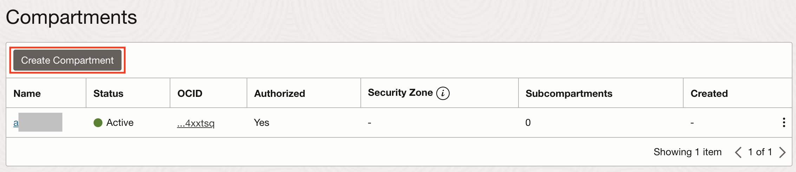
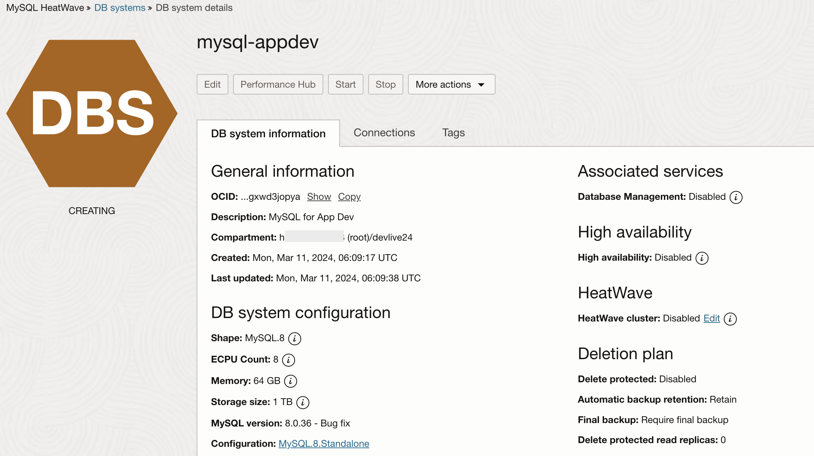

# Provision the infrastructure

## Introduction

This workshop uses Spring Boot-based Java microservices connecting to a MySQL HeatWave database as a target application to illustrate the capabilities for end-to-end monitoring using OCI Observability and Management Services. In this lab, you will utilize Terraform to provision your resources via Infrastructure as Code. This includes a Virtual Cloud Netwokr (VCN), an Oracle Container Engine for Kubernetes (OKE) cluster, and more. You will then provision a MySQL HeatWave DB System through the OCI Console.

Estimated time: 45 minutes

### Objectives

* Create a compartment
* Provision resources with Terraform
* Provision MySQL HeatWave DB System

### Prerequisites

* This lab requires an [Oracle Cloud account](https://www.oracle.com/cloud/free/). You may use your cloud account, or a Free tier account, a cloud account that you obtained through a trial.


## Task 1: Create an OCI compartment

1. Open the navigation menu from the top-left corner (aka. hamburger menu) of the Oracle Cloud console and select **Identity & Security** > **Compartments**.
	
2. Click **Create Compartment**
	
3. Enter the following parameters:
*	Compartment name: **devlive24**
*	Description: **Compartment for 2024 DevLive Hands-on lab**
*	Accept the default values for the other fields, and click, **Create Compartment**
	
*	Verify that your **devlive24** compartment is created in the table
	

## Task 2: Provision Infrastructure

1. Launch the OCI Cloud Shell.
   
2. Retrieve the sample code and supporting scripts that will be used in this section:

      ```bash
      <copy>
      git clone https://github.com/oracle-devrel/oci-devlive-2024.git
      </copy>
      ```
3. Change to the scripts folder and install dependancies. Then return to the root of the project folder.

      ```bash
      <copy>
      cd oci-devlive-2024/scripts && npm install && cd ..
      </copy>
      ```
4. Set up the environment. It will create a `.env.json` file with all the information required. Do not alter or delete this file. Additionally, `.env.json` files are in the `.gitignore` file to ensure the contents never find their way to a public SCM site.

   As part of the script you will be prompted with a comparmtment name. Answer the **Compartment name** prompt with the name used in **Task 1** (**`devlive24`**). The **`root`** compartment will be used if you do not enter a value.

      ```bash
      <copy>
      npx zx scripts/setenv.mjs
      </copy>
      ```

5. Next, run the script `tfvars.mjs` to create the `terraform.tfvars` file from the information generated by the previous step. It will use a template engine called Mustache to replace the values from `terraform.tfvars.mustache`.

      ```bash
      <copy>
      npx zx scripts/tfvars.mjs
      </copy>
      ```

6. The output of the `tfvars.mjs` script will tell you to run the following commands.

      ```bash
      <copy>
      cd deployment/terraform/
      terraform init
      terraform apply -auto-approve
      </copy>
      ```

> NOTE: terraform deployment will take ~20-25 minutes (mainly because the creation of the Kubernetes Cluster plus node pool).

7. After a while, Terraform will finish and you can return to the root folder of the project.

      ```bash
      <copy>
      cd ../..
      </copy>
      ```

## Task 3: Dedploy the MySQL Database System

1.	From the OCI menu, select **Databases**, then **MySQL HeatWave > DB Systems**.
	

2. Select the **devlive24** compartment from the pulldown menu and Click **Create DB System**
	

3.	Choose **Production** and select the **devlive24** compartment and provide name **mysql-appdev**  for the MySQL HeatWave Database
  

4. Provide MySQL database administrator credentials, choose **Standalone**, and leave the **Enable HeatWave** box unchecked.
  

5. Choose the VCN **devlive-##-vcn** and private subnet for the MySQL DB System **`mysql_subnet_devlive_##`** to allow access to MySQL HeatWave database from Kubernetes nodes and keep hardware settings default.  
  
  

6. Uncheck **Enable automatic backups**, then click _`Show advanced options`_. Uncheck **Delete protected** under **Deletion Plan** Tab and check **Database Management** under  **Management** Tab 
  
  

7. This will start to create a MySQL HeatWave Database, and takes 10-15 minutes to complete. While waiting for the creation of the MySQL HeatWave Database, the workshop facilitators will discuss some of the benefits of MySQL HeatWave. In Lab 2, we will resume the steps to deploy the application connecting to the MySQL HeatWave Database.

  

You may now **proceed to the next lab**.

## Acknowledgements

* **Author** - Anand Prabhu, Principal Member of Technical Staff, Enterprise and Cloud Manageability
- **Contributors** -
Yutaka Takatsu, Senior Principal Product Manager,  
Avi Huber, Vice President, Product Management
* **Last Updated By/Date** - Anand Prabhu, January 2024