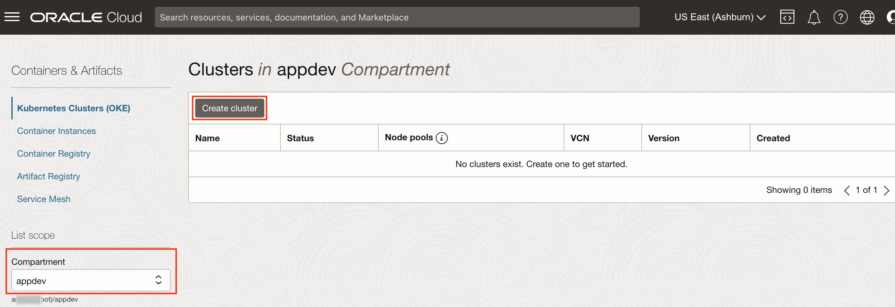
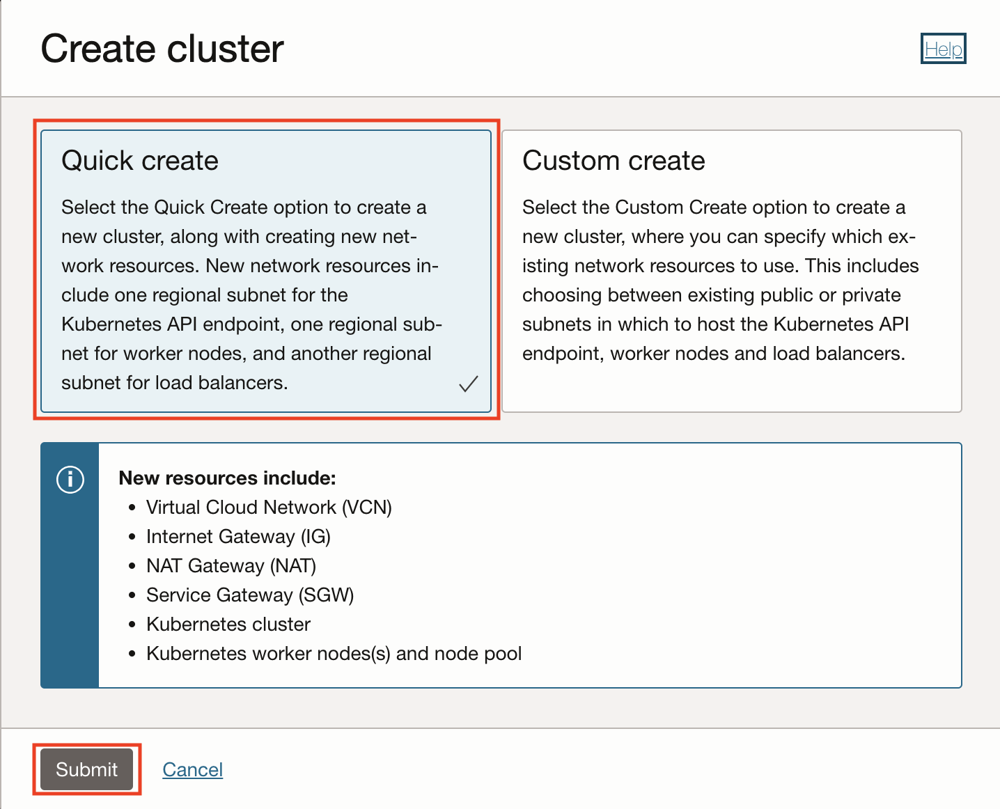
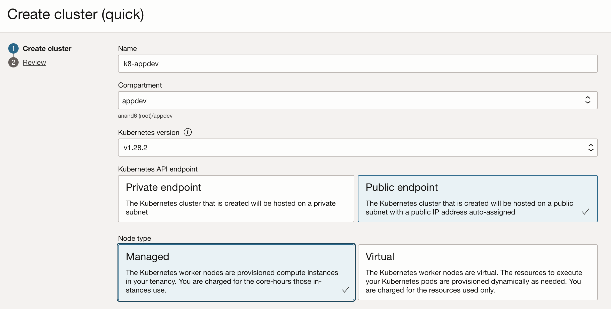
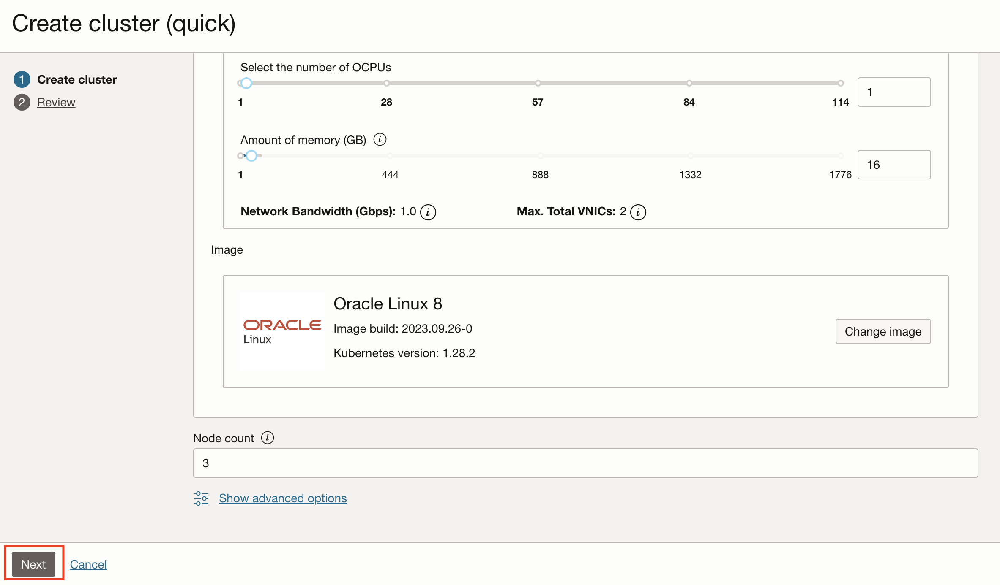
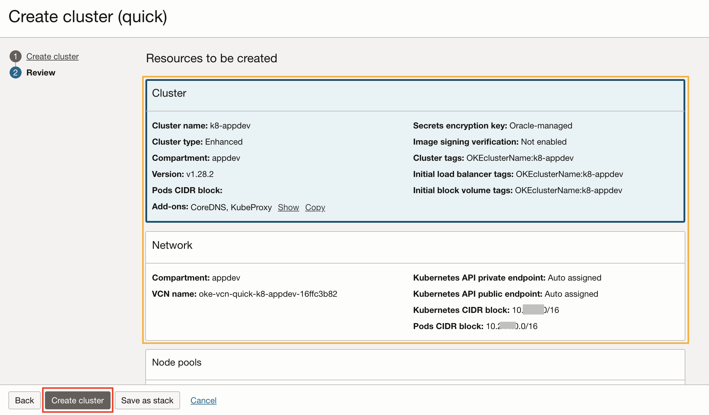

# Create a Kubernetes cluster

## Introduction

This workshop uses Spring Boot-based Java microservices as a target application connecting to MySQL HeatWave Database and monitor the application end to end using OCI Observability and Management Services. In this lab, first, you will use the Oracle Cloud console to set up an OCI compartment, second, create an Oracle container engine for Kubernetes (OKE) cluster in your tenancy and a MySQL HeatWave Database enabling Database management during creation. 

Estimated time: 45 minutes

### Objectives

* Create a compartment
* Create a Kubernetes cluster
*	Create a MySQL HeatWave Database

### Prerequisites

* This lab requires an [Oracle Cloud account](https://www.oracle.com/cloud/free/). You may use your cloud account, or a Free tier account, a cloud account that you obtained through a trial.

## Task 1: Create an OCI compartment

1. Open the navigation menu from the top-left corner (aka. hamburger menu) of the Oracle Cloud console and select **Identity & Security** > **Compartments**.
	
2. Click **Create Compartment**
	
3. Enter the following parameters:
*	Compartment name: **appdev**
*	Description: **App Dev compartment**
*	Accept the default values for the other fields, and click, **Create Compartment**
	
*	Verify that your appdev compartment is created in the table
	

## Task 2: Create an OKE

1. Open the navigation menu from the top left corner (aka. hamburger menu) in the Oracle Cloud console, and select **Developer Services** > **Kubernetes Clusters (OKE)**.

   

2. Make sure the **appdev** is selected in the Compartment field, then click **Create cluster**

   

3. Quick Create pane is pre-selected. Keep the default selection and click **Submit**.

   

4. Name the cluster as **k8-appdev**. Select Kubernetes API endpoint as **Public endpoint** and Node type as **Managed** and keep other fields as default and click **Next**.

   
   
   

5. Review the configuration, and click **Create cluster**.

   

6. Make sure all verification steps are cleared. Click **Close**.

   

7.  This will start to create a cluster, and takes 7 to 10 minutes to complete. While waiting for the creation of the cluster, you can proceed to the next lab to create an APM domain. In Lab 5, we will resume the steps to build the application.

   

## Task 3: Create a MySQL HeatWave Database 

1.	From the OCI menu, select **Databases**, then **MySQL HeatWave > DB Systems**.
	

2. Select the **appdev** compartment from the pulldown menu and Click **Create DB System**
	

3.	Choose **Production** and select the **appdev** compartment and provide name **mysql-appdev**  for the MySQL HeatWave Database
  

4. Choose **Standalone**, enable **MySQL HeatWave** and provide MySQL HeatWave Database administration credentials.
  

5. Choose the VCN and private subnet of Oracle Kubernetes Cluster **k8-appdev** to allow access to MySQL HeatWave database from Kubernetes nodes and keep hardware settings default.  
  
  

6. Uncheck **Enable automatic backups** and in advanced settings under **Deletion Plan** Tab uncheck **Delete protected** and under  **Management** Tab check **Database Management**
  
  

7. This will start to create a MySQL HeatWave Database, and takes 10 to 12 minutes to complete. While waiting for the creation of the MySQL HeatWave Database, you can proceed to the next lab to create an virtual machine. In Lab 6, we will resume the steps to deploy the application connecting to the MySQL HeatWave Database.

  

You may now **proceed to the next lab**.

## Acknowledgements

* **Author** - Anand Prabhu, Principal Member of Technical Staff, Enterprise and Cloud Manageability
- **Contributors** -
Yutaka Takatsu, Senior Principal Product Manager,  
Avi Huber, Vice President, Product Management
* **Last Updated By/Date** - Anand Prabhu, January 2024