# Provision the infrastructure

## Introduction

This workshop uses Spring Boot-based Java microservices connecting to a MySQL HeatWave database as a target application to illustrate the capabilities for end-to-end monitoring using OCI Observability and Management Services. In this lab, you will utilize Terraform to provision your resources via Infrastructure as Code. This includes container registry, OCI user and more. You will then provision an Oracle Container Engine for Kubernetes (OKE) cluster and a MySQL HeatWave DB System through the OCI Console.

Estimated time: 35 minutes

### Objectives

* Create a compartment
* Provision resources with Terraform
* Provision Oracle Container Engine for Kubernetes (OKE) cluster & MySQL HeatWave DB System

### Prerequisites

* This lab requires an [Oracle Cloud account](https://www.oracle.com/cloud/free/). You may use your cloud account, or a Free tier account, a cloud account that you obtained through a trial.


## Task 1: Create an OCI compartment

1. Open the navigation menu from the top-left corner (aka. hamburger menu) of the Oracle Cloud console and select **Identity & Security** > **Compartments**.
	
2. Click **Create Compartment**
	
3. Enter the following parameters:
*	Compartment name: **devlive24**
*	Description: **Compartment for 2024 DevLive Hands-on lab**
*	Accept the default values for the other fields, and click, **Create Compartment**
	
*	Verify that your **devlive24** compartment is created in the table
	

## Task 2: Create a policy for the volume management 

1. Open the navigation menu from the top-left corner (aka. hamburger menu) of the Oracle Cloud console and select **Identity & Security** > **Policies**.
      

2. Select **root** tenancy from the compartment drop down and then click on **Create Policy**
      

3. Enter the following parameters:
    - Policy name: **OCIVolumeMgmt**
    - Description: **OCI Volume Mgmt**
    - Compartment: select root compartment 
    - Click on **Show manual editor** in Policy Builder
    - Copy the below policies and paste in the editor
     
      ```bash
      <copy>
      ALLOW any-user to manage volumes in TENANCY where request.principal.type = 'cluster'
      ALLOW any-user to manage volume-attachments in TENANCY where request.principal.type = 'cluster'
      </copy>
      ```
    - click, **Create**
    
    

## Task 3: Setup up cloud shell, code editor and create a container registry

1. Click on the below link to open OCI Code Editor and clone the repository 

    [Open Code Editor and Clone the repository](https://cloud.oracle.com/?region=home&cs_repo_url=https://github.com/oracle-devrel/oci-devlive-2024.git&cs_branch=main&cs_readme_path=README.md&cs_open_ce=true)

2. Retrieve the sample code and supporting scripts that will be used in this section
    - Click on the **I have reviewed and accepted the Oracle Terms of Use.** checkbox 
    - Click on **Clone**

    

    Repository is successfully cloned and its shown in the code editor 
    

3. Change orientation of the Cloud Shell and Code Editor 
    - Click on the **Actions** and then **Tabs** 
    

    - Now Cloud Shell and Code Editors are shown as tabs 
    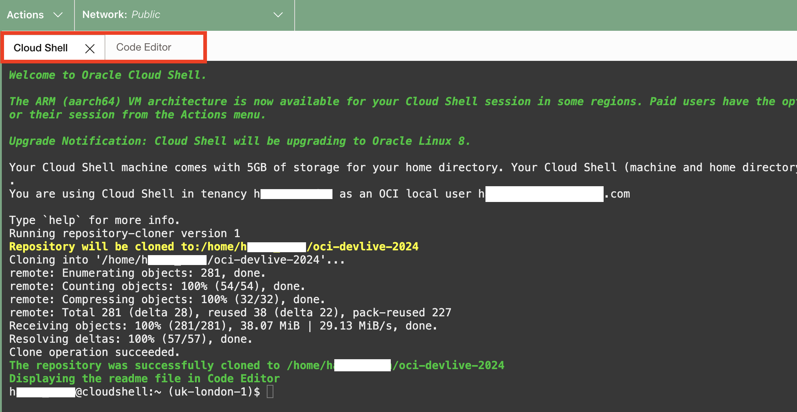

4. Set preferred architecture of Cloud Shell to **X86\_64** 
   (Setting architecture of cloud shell helps us to build the application and deploy on the **X86\_64** architecture)

    - Click on **Actions** and then **Architecture** 
    
    - **Set preferred architecture of cloud shell**
       - If preferred architecture is already set to **X86\_64** then proceed to **next step 5**
       - If preferred architecture is not set to **X86\_64** then 
            - select **X86\_64** as preferred architecture and click **Confirm and Restart** 
            
            - Click **Restart** in the pop window
            
            - Now the cloud shell terminal is restarted with **X86_64** and tries to clone the GIT
            repository again. Enter **3** to abort the cloning when prompted for **Please select an option:**
            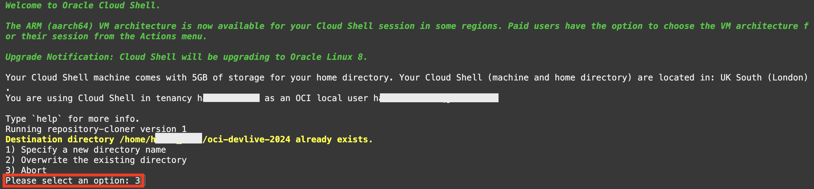
            - Now the cloud shell and code editor are set. Proceed to **next step 5**

5. From the cloud shell, change to the scripts folder and install dependancies. Then return to the root of the project folder.

      ```bash
      <copy>
      cd oci-devlive-2024/scripts && npm install && cd ..
      </copy>
      ```

      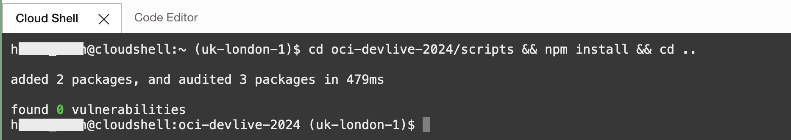

6. Set up the environment. It will create a `.env.json` file with all the information required. Do not alter or delete this file. Additionally, `.env.json` files are in the `.gitignore` file to ensure the contents never find their way to a public SCM site.

   As part of the script you will be prompted with a comparmtment name. Answer the **Compartment name** prompt with the name used in **Task 1** (**`devlive24`**). The **`root`** compartment will be used if you do not enter a value.

      ```bash
      <copy>
      npx zx scripts/setenv.mjs
      </copy>
      ```

      

7. Next, run the script `tfvars.mjs` to create the `terraform.tfvars` file from the information generated by the previous step. It will use a template engine called Mustache to replace the values from `terraform.tfvars.mustache`.

      ```bash
      <copy>
      npx zx scripts/tfvars.mjs
      </copy>
      ```

      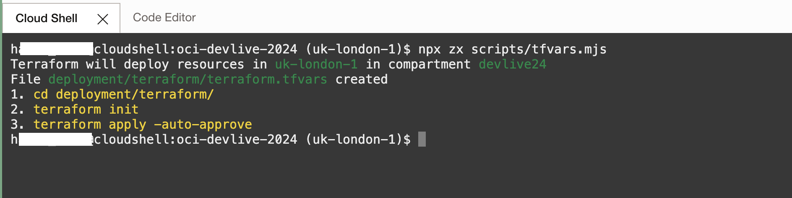

8. The output of the `tfvars.mjs` script will tell you to run the following commands.

      ```bash
      <copy>
      cd deployment/terraform/
      terraform init
      terraform apply -auto-approve
      </copy>
      ```
      
      Running terraform init
      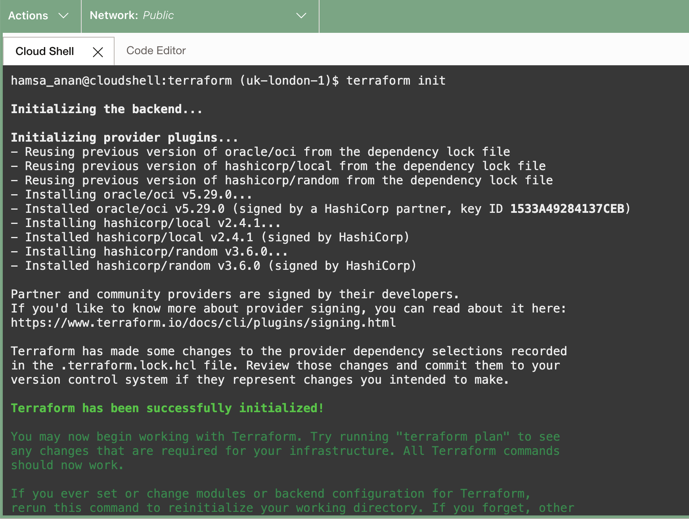

      Running terraform apply 
      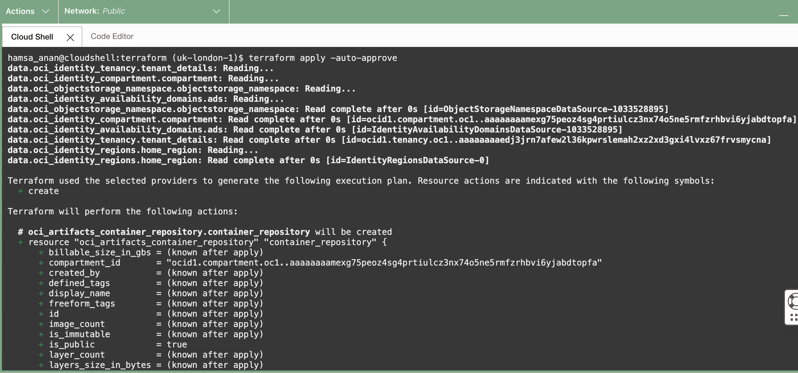
      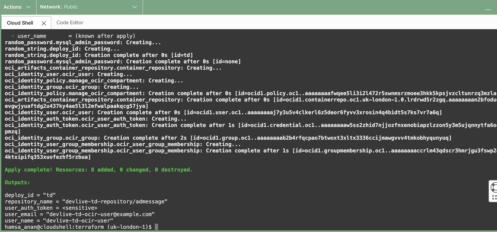

9. Once the terraform apply job completes, container registry and required user configuration setup completes and you can return to the root folder of the project.

      ```bash
      <copy>
      cd ../..
      </copy>
      ```

## Task 4: Create a Kubernetes Cluster 

1. From the OCI menu, select **Developer Services**, then **Containers & Artifacts > Kubernetes Clusters (OKE)**.
	

2. Select the compartment **devlive24** and then click on **Create cluster**
	

3. Quick Create pane is pre-selected. Keep the default selection and click **Submit**.
	 

4. Enter the following parameters:
    * Name the cluster: **devlive24-oke**
    * Kubernetes API endpoint : Select **Public endpoint**
    * Node type : Select **Managed**
    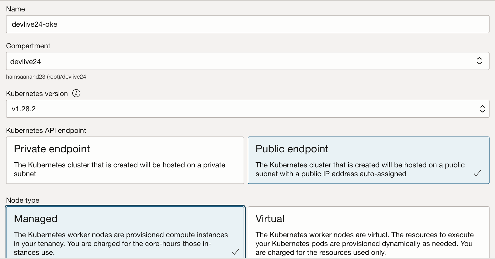 
    * Kubernetes worker nodes : Select **Private workers**
    * Shape and image: **Keep default**
    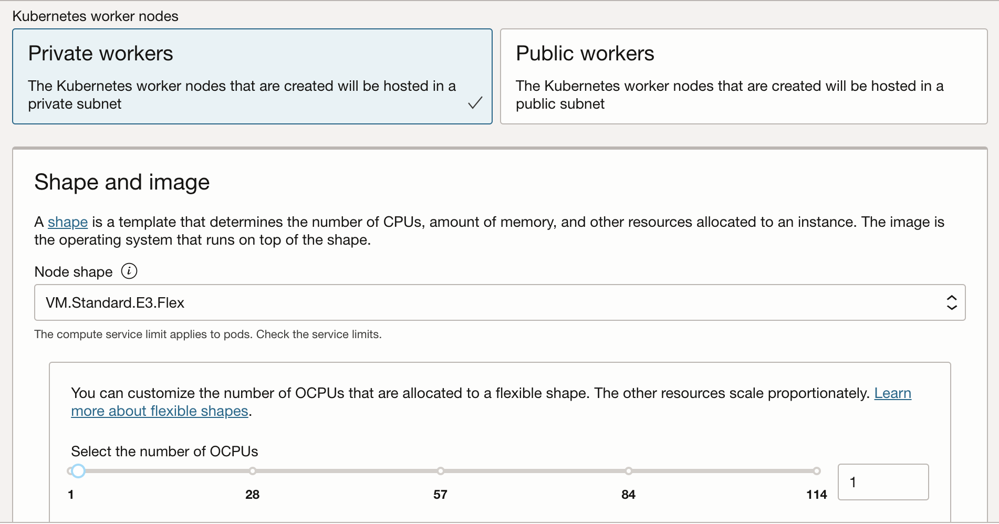 
    * Node count: **1**
    * Click **Next**
     
    * Review the configuration, and click **Create cluster**.
    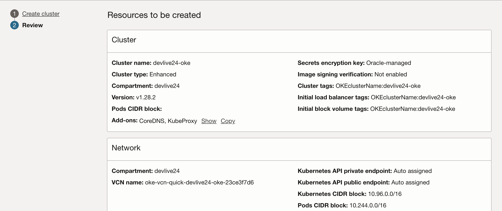 
    * Make sure all verification steps are cleared. Click **Close**
    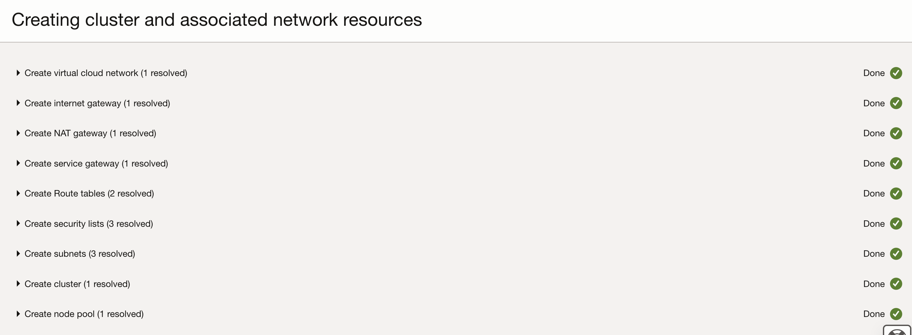 

> **Note:** This will start to create a cluster, and takes 7 to 10 minutes to complete. While waiting for the creation of the cluster, you can proceed to the next task to provision the **MySQL HeatWave Database**


## Task 5: Deploy the MySQL Database System

1.	From the OCI menu, select **Databases**, then **MySQL HeatWave > DB Systems**.
	

2. Select the **devlive24** compartment from the pulldown menu and Click **Create DB System**
	

3.	Choose **Production** and select the **devlive24** compartment and provide name **mysql-appdev**  for the MySQL HeatWave Database
  

4. Provide MySQL database administrator credentials (store these credentials for the later use) & choose **Standalone**
  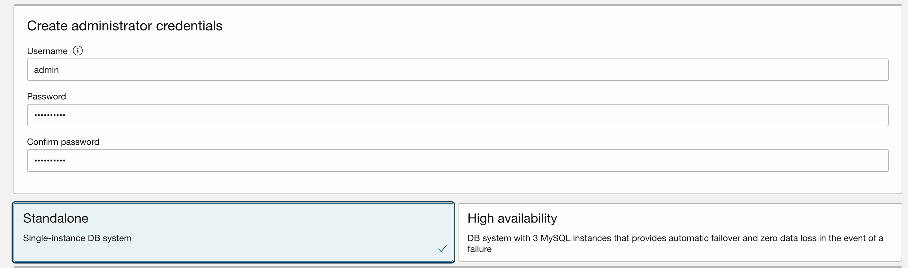

5. Choose the VCN **`oke-vcn-quick-devlive24-oke-#########`** and private subnet for the MySQL DB System **`oke-nodesubnet-quick-devlive24-oke-#########-regional`** to allow access to MySQL HeatWave database from Kubernetes nodes and keep placement settings default.  
  
  

6. Uncheck **Enable HeatWave** checkbox and keep hardware settings default.
  

7. Uncheck **Enable automatic backups**, then click _`Show advanced options`_. Uncheck **Delete protected** under **Deletion Plan** Tab and verify if **Database Management** under  **Management** Tab is checked and then click on **Create**
  
  

8. This will start to create a MySQL HeatWave Database, and takes 10-15 minutes to complete. While waiting for the creation of the MySQL HeatWave Database, learn more about MySQL HeatWave Database Management through the recorded demos mentioned below. In Lab 2, we will resume the steps to deploy the application connecting to the MySQL HeatWave Database.

  

   Watch a video demonstration of creating MySQL HeatWave Database with Database Management enabled
   [](youtube:LS89O0ACDYs?si=wMP6eM0sdziBVnvz)

   Watch a video demonstration of monitoring and managing MySQL HeatWave Database 
   [](youtube:4VlRypYXJ48?si=k68OnLN9XI4KXo9B)

   Watch a video demonstration of tuning MySQL HeatWave DB System queries using  Performance Hub
   [](youtube:vXqA8nkcF4c?si=B314cImffyHCfk1b)

9. Once the MySQL HeatWave Database created successfully,then go to **Connections** tab to copy and save the **Private IP Address** of MySQL HeatWave Database and also database credentails to a text file to use in lab 2 and 3. 

  


[You may now **proceed to the next lab**.](#next)


## Acknowledgements

* **Author** - Anand Prabhu, Principal Member of Technical Staff, Enterprise and Cloud Manageability
- **Contributors** -
Yutaka Takatsu, Senior Principal Product Manager,  
Avi Huber, Vice President, Product Management
* **Last Updated By/Date** - Anand Prabhu, January 2024