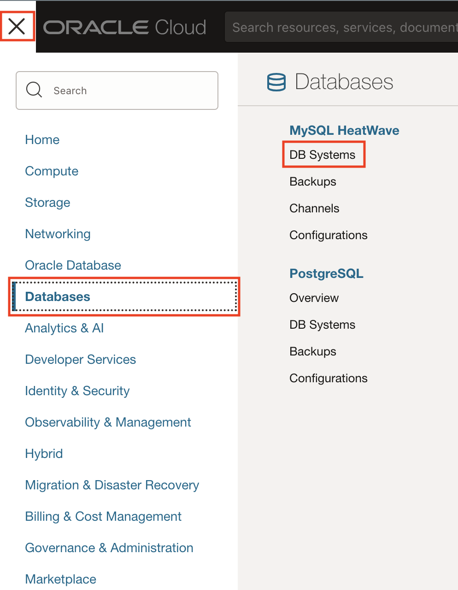
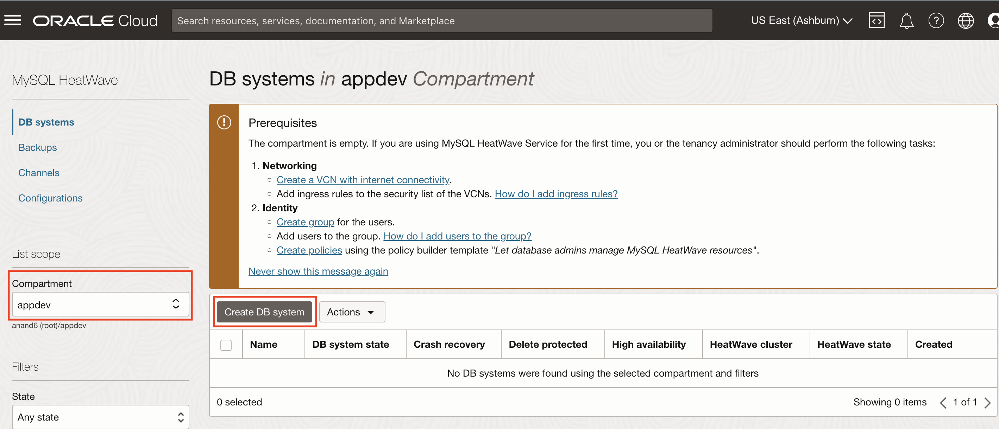
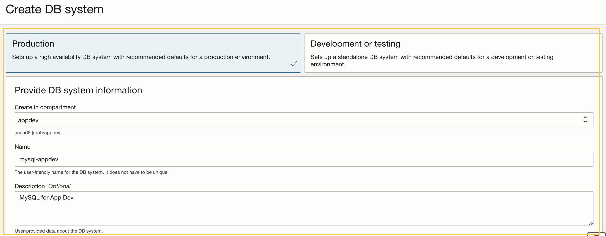
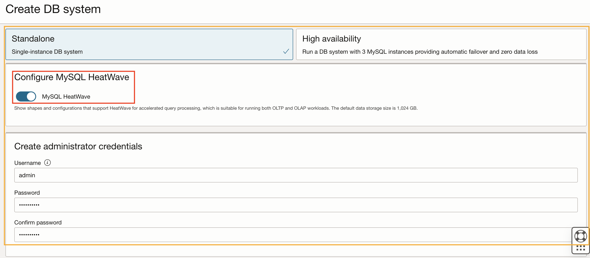
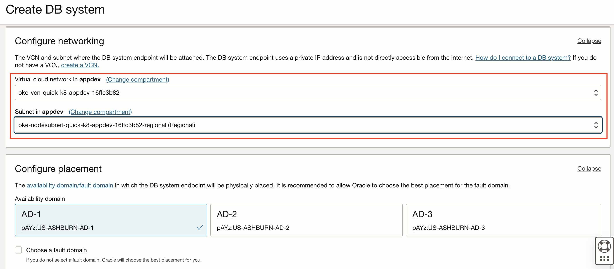
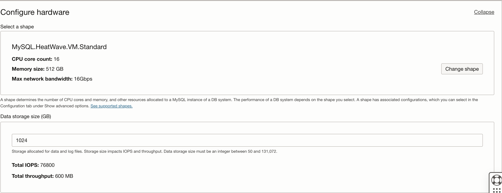
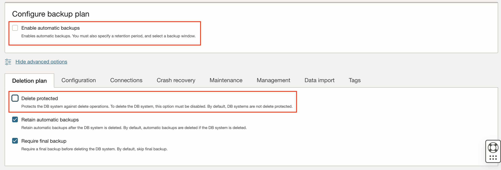
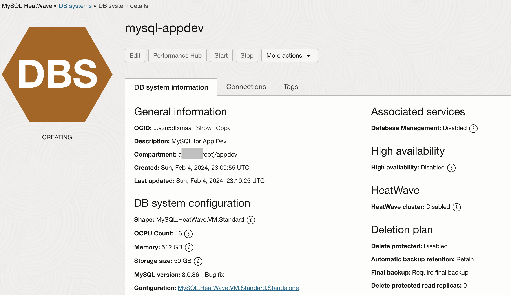

# Create MySQL HeatWave Database 

## Introduction

In this lab, you will create a MySQL HeatWave Database enabling Database management during creation. 

Estimated time: 10 minutes

### Objectives

*	Create a MySQL HeatWave Database

### Prerequisites

* This lab requires an [Oracle Cloud account](https://www.oracle.com/cloud/free/). You may use your cloud account, or a Free tier account, a cloud account that you obtained through a trial.

## Task 1: Create a MySQL HeatWave Database 

1.	From the OCI menu, select **Databases**, then **MySQL HeatWave > DB Systems**.
	

2. Select the **appdev** compartment from the pulldown menu and Click **Create DB System**
	

3.	Choose **Production** and select the **appdev** compartment and provide name **mysql-appdev**  for the MySQL HeatWave Database
  

4. Choose **Standalone**, enable **MySQL HeatWave** and provide MySQL HeatWave Database administration credentials.
  

5. Choose the VCN and private subnet of Oracle Kubernetes Cluster **k8-appdev** to allow access to MySQL HeatWave database from Kubernetes nodes and keep hardware settings default.  
  
  

6. Uncheck **Enable automatic backups** and in advanced settings under **Deletion Plan** Tab uncheck **Delete protected** and under  **Management** Tab check **Database Management**
  
  

7. This will start to create a MySQL HeatWave Database, and takes 10 to 12 minutes to complete. While waiting for the creation of the MySQL HeatWave Database, you can proceed to the next lab to create an virtual machine. In Lab 6, we will resume the steps to deploy the application connecting to the MySQL HeatWave Database.

  

## Acknowledgements

* **Author** - Anand Prabhu, Principal Member of Technical Staff, Enterprise and Cloud Manageability
- **Contributors** -
Yutaka Takatsu, Senior Principal Product Manager,  
Avi Huber, Vice President, Product Management
* **Last Updated By/Date** - Anand Prabhu, January 2024
