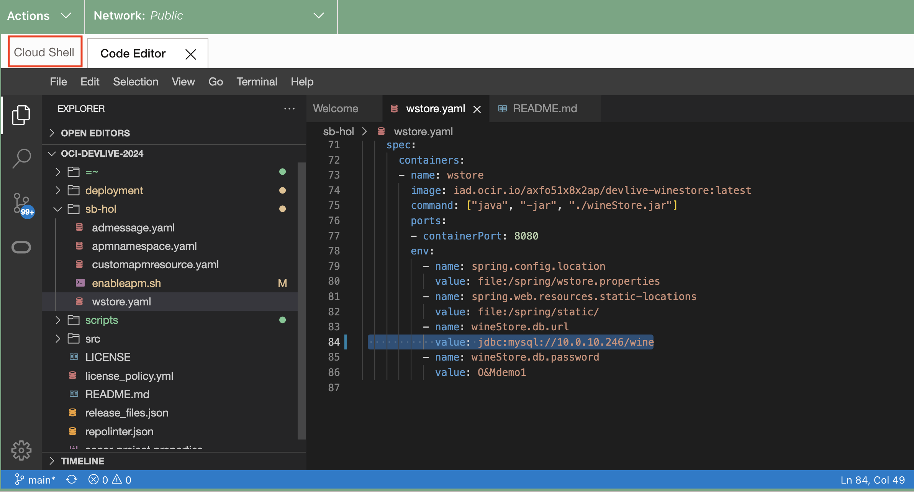
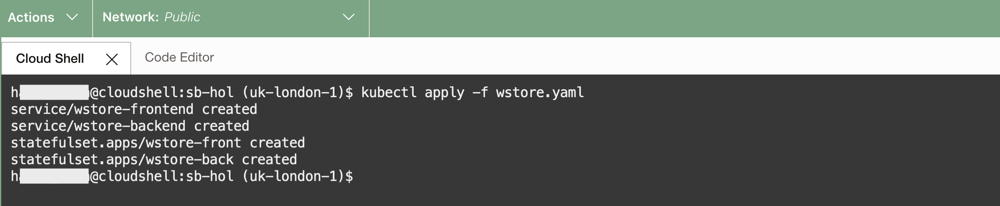
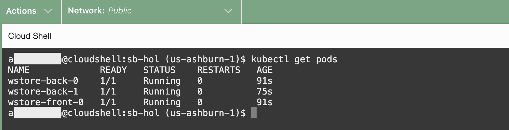

# Deploy the Application

## Introduction

Now that the infrastructure is up and running, it's time to deploy the app and see it all come together. We demonstrated how easy it is to deploy a Java app with MySQL HeatWave Database as backend and deploy on Oracle Cloud Infrastructure Container Engine for Kubernetes (OKE). In this lab, you will prepare MySQL HeatWave Database with application schema and then deploy the Java Application to Kubernetes cluster created in Lab 1.

Estimated time: 15 minutes

### Objectives

* Connect to the OKE Cluster
* Prepare the MySQL HeatWave Database
* Deploy the application

### Prerequisites

* Completion of the preceding labs in this workshop.

## Task 1: Connect to Kubernetes

1. Access the OKE Cluster 
    * From the OCI menu, select **Developer Services**, then **Containers & Artifacts > Kubernetes Clusters (OKE)**.

    

    * Select compartment **devlive24** from the drop down and click on the OKE cluster **devlive24-oke**
    

    * Click on **Access Cluster**
    

    * Copy the command to connect to OKE and then click on the Launch Cloud Shell 
    

    * Right click and paste the command copied to the cloud shell to set the kubeconfig 
    

2. Export the `kubeconfig` variable to enable communication to your new OKE cluster.

      ```bash
      <copy>
      cd ~/oci-devlive-2024
      export KUBECONFIG=$HOME/.kube/config
      </copy>
      ```

      > If the console closes, remember to rerun this command.
   
2. Check that Kubernetes is up and running and you can talk to the Control Plane API endpoint by listing the nodes.

      ```bash
      <copy>
      kubectl get nodes
      </copy>
      ```

      ```bash
      $ kubectl get nodes
      NAME          STATUS   ROLES   AGE   VERSION
      10.0.156.59   Ready    node    3d    v1.28.2
      ```

## Task 2: Prepare Database for the application

1. Deploy an OKE Pod containing the MySQL client that will be used to connect to the DB System.

      ```bash
      <copy>
      kubectl run mysql-client --image=iad.ocir.io/axfo51x8x2ap/load-mysql-data:latest -it --rm --restart=Never -- /bin/bash
      </copy>
      ```

      

2. Execute the command below to connect to the MySQL HeatWave Database using the Private IP address of the MySQL HeatWave database and the credentials which was saved in a text file when the MySQL HeatWave DB System was created.(Refer Lab 1 > Task 5 > Step 9)

      ```bash
      <copy>
      mysql -h <mds-private-ip-address> -u <mds-admin-user> -p
      </copy>
      ```

      

3. Execute the command below to create a **`WINE`** application database with required tables.

      ```bash
      <copy>
      source insert_100_mysql.sql
      </copy>
      ```

      

4. Type **exit** to leave the MySQL client, then **exit** once more to leave and terminate the MySQL Client pod.

      


## Task 3: Deploy the application

1. Click on the code editor and open the file **OCI-DEVLIVE-2024 > sb-hol > wstore.yaml** in the code editor.
   
   

2. Go to **line 84** to update field **`<mds-private-ip-address>`** with MySQL HeatWave Database Private IP which was saved in a text file when the MySQL HeatWave DB System was created.(Refer Lab 1 > Task 5 > Step 9)

    

3. Click on **File > Save All**

    

4. Click on Cloud Shell and then execute the command below to deploy the application to the cluster.

    

      ```bash
      <copy>
      cd ~/oci-devlive-2024/sb-hol
      kubectl apply -f wstore.yaml
      </copy>
      ```

## Task 4: Launch the application

1. Verify the 2 services and 2 statefule sets are created successfully

      

2. Run the `kubectl` command below to display the status of the pod creation. Wait until all pods are in the 'Running' state. This might take a minute or two.

      ```bash
      <copy>
      kubectl get pods
      </copy>
      ```

      

3. Retrieve the EXTERNAL-IP address for the wstore-frontend (application service endpoint). Copy it into a text file for future use.

      ```bash
      <copy>
      kubectl get svc
      </copy>
      ```

      

4. Refer to the example below and construct a URL, then paste it into the address bar of a new browser tab. Replace Public IP of the wstore-frontend service with the EXTERNAL-IP retrieved in the previous **step 3**.

      ```bash
      <copy>
      http://<Public IP of the wstore-frontend service>/winestore/
      </copy>
      ```
If you see the WineCellar content as illustrated in the screenshot below, deployment was successful.

      

      >**Note:** It may take a few minutes to complete the deployment and start loading the page content on the screen for the first time.

[You may now **proceed to the next lab**.](#next)

## Acknowledgements

* **Author** - Anand Prabhu, Principal Member of Technical Staff, Enterprise and Cloud Manageability
- **Contributors** -
Yutaka Takatsu, Senior Principal Product Manager,  
Avi Huber, Vice President, Product Management
* **Last Updated By/Date** - Anand Prabhu, January 2024