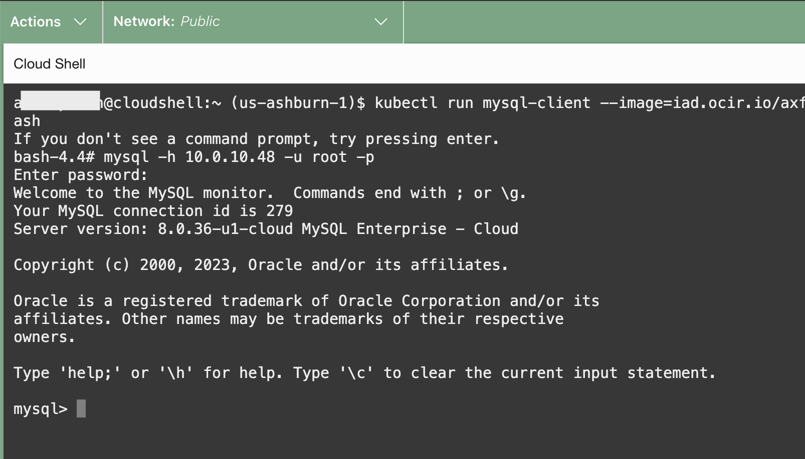
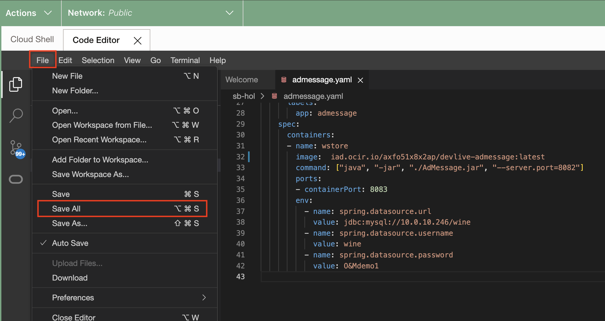
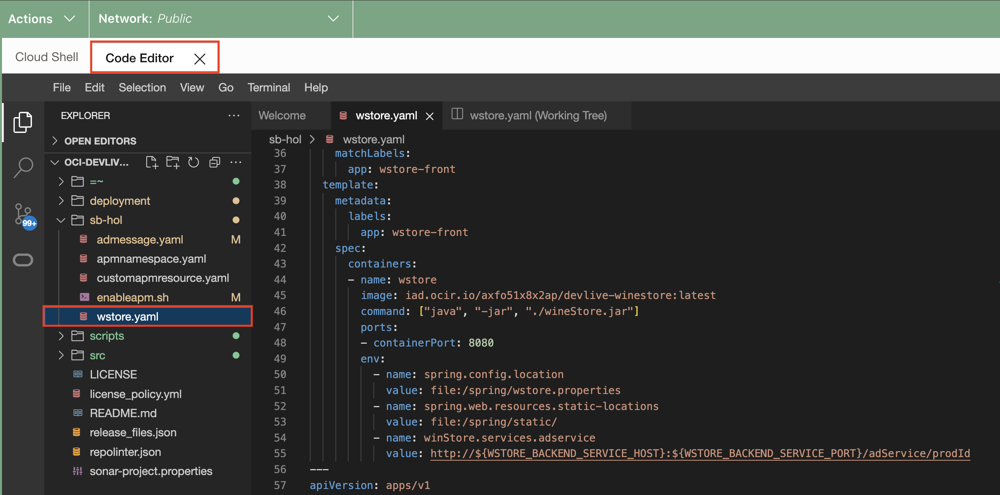
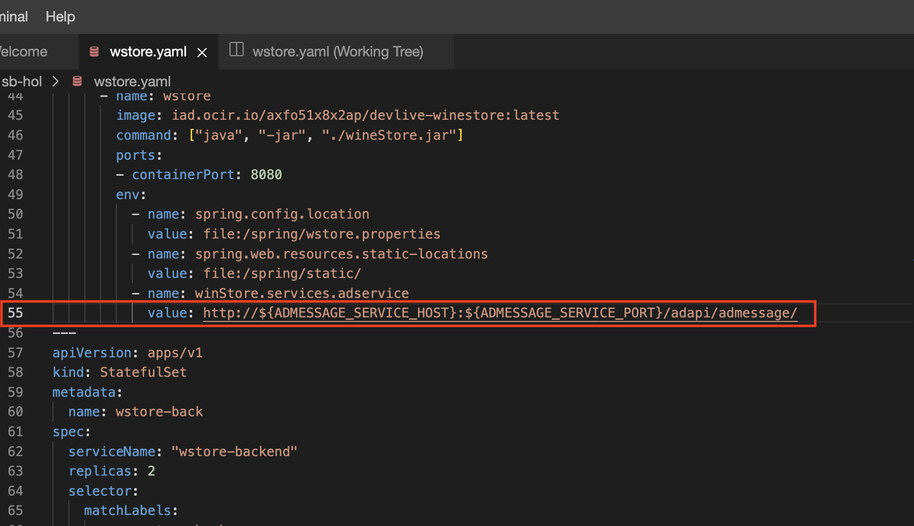

# Build a new microservice application to extend WineCellar App 

## Introduction

In this workshop you'll enhance the existing microservice application with a brand new component. Currently, we have a static ad message **2023 Thanks Giving Promotion: Buy 1 get 1!!!!** shown in the storefront. Build a new Spring Boot-based Java app to make ad messages dynamic to fetch from database and integrate it with WineCellar App. New microservice container image has been provided as part of the workshop resources so now it's time to deploy it and integrate it with the main WineCellar App.

Estimated time: Up to 10 minutes

### Objectives

* Update the MySQL HeatWave Database with a new table
* Deploy and integrate new micro service to the WineCellar App


## Task 1: Create table **admessage** in the MySQL HeatWave Database

1. Deploy an OKE Pod containing the MySQL client that will be used to connect to the DB System.

      ```bash
      <copy>
      kubectl run mysql-client --image=iad.ocir.io/axfo51x8x2ap/load-mysql-data:latest -it --rm --restart=Never -- /bin/bash
      </copy>
      ```

      

2. Execute the command below to connect to the MySQL HeatWave Database using the Private IP address of the database and the credentials provided when the DB System was created.

      ```bash
      <copy>
      mysql -h <mds-private-ip-address> -u <mds-admin-user> -p
      </copy>
      ```

      

3. Execute the command below to connect to the **wine** database

    ```bash
    <copy>
    use wine;
    </copy>
    ```

    

4. Execute below sql statement to create the table **admessage**, then insert a new record

    ```bash
    <copy>
    CREATE TABLE admessage (ID INT AUTO_INCREMENT PRIMARY KEY, message VARCHAR(255));
    INSERT INTO admessage (ID, MESSAGE) VALUES (1,'Welcome to MySQL DevLive Event');
    COMMIT;
    SELECT * FROM admessage;
    </copy>
    ```

    

5. Type **exit** to leave the MySQL client, then **exit** once more to leave and terminate the MySQL Client pod.

    

## Task 2 - Deploy a new microservice application

1. Click on the code editor and open the file **OCI-DEVLIVE-2024 > sb-hol > admessage.yaml** in the code editor.
   
   

    - Update the field for the MySQL HeatWave Databae Private IP (line 38) which was saved in a text file when the MySQL HeatWave DB System was created.(Refer Lab 1 > Task 5 > Step 9)

     
    - Click on **File > Save All**
     


2. Go to cloud shell and execute and execute the command below to deploy the **AdMessage** application to the cluster.

    ``` bash
    <copy>
    cd ~/oci-devlive-2024/sb-hol
    kubectl apply -f admessage.yaml
    </copy>
    ```

    Verify the 2 services and 2 stateful sets are created

    

3. Run the kubectl command below to display the status of the pod creation. Wait until the statuses become 'Running'. This may take a few minutes.

    ``` bash
    <copy>
    kubectl get pods
    </copy>
    ```
    

4. Run the kubectl command below to display the deployed services.

    ``` bash
    <copy>
    kubectl get svc
    </copy>
    ```
    

[You may now **proceed to the Task 3**.]

## Task 3: Integrate the AdMessage API with the main Wine App

1. Click on the code editor and open the file **OCI-DEVLIVE-2024 > sb-hol > wstore.yaml** in the code editor.
   

    - Update value of parameter  **winStore.services.adservice** with **AdMessage Endpoint** mentioned below. New endpoint is `adapi/admessage` (line 55)

    ``` bash
    <copy>
    http://${ADMESSAGE_SERVICE_HOST}:${ADMESSAGE_SERVICE_PORT}/adapi/admessage/
    </copy>
    ```
    
    

    - Click on **File > Save All**
     


2. Go to cloud shell and execute the command below to deploy the application to the cluster.

    ``` bash
    <copy>
    cd ~/oci-devlive-2024/sb-hol
    kubectl apply -f wstore.yaml
    </copy>
    ```
    

3. Run the kubectl command below to display the status of the pod creation. Wait until the statuses become 'Running'. This may take a few minutes.

    ``` bash
    <copy>
    kubectl get pods
    </copy>
    ```
    

4. Run the kubectl command below to display the deployed services.

    ``` bash
    <copy>
    kubectl get svc
    </copy>
    ```
    

5. Refer to the example below and construct a URL, then paste it into the address bar of a new browser tab. Replace Public IP of the wstore-frontend service with the EXTERNAL-IP retrieved in the previous **step 4**.

    ``` bash
    <copy>
    http://<Public IP of the wstore-frontend service>/winestore/
    </copy>
    ```

    

6. **Additional task:** Update table **admessage** to see how the admessage changes on update of table and refreshing the winestore url in the browser. 

    ``` bash
    <copy>
    UPDATE admessage SET message="Successfully Deployed and Integrated AdMessage API" WHERE ID=1;
    COMMIT;
    SELECT * FROM admessage;

    </copy>
    ```

[You may now **proceed to the next lab**.](#next)

## Acknowledgements

* **Author** - Wojciech Pluta, Principal Staff Developer
- **Contributors** -
Anand Prabhu, Principal Member of Technical Staff, Enterprise and Cloud Manageability
Victor Martin, Product Strategy Directory 
Eli Schilling, Developer Advocate
* **Last Updated By/Date** - Anand, March 2024
