# Build a new microservice application to extend WineCellar App 

## Introduction

In this workshop you'll enhance the existing microservice application with a brand new component. Currently, we have a static ad message **2023 Thanks Giving Promotion: Buy 1 get 1!!!!** shown in the storefront. Build a new Spring Boot-based Java app to make ad messages dynamic to fetch from database and integrate it with WineCellar App. That code has been provided as part of the workshop resources so now it's time to package and deploy it.

For this portion of the workshop, you have three different options to pick from when you reach **Task 2** - choose only one option:
1. [ ~20 minutes ] Build, package, and deploy the code entirely on your own.
2. [ ~10 minutes ] Run the pre-built script provided to automatically build and package the new app component. Then deploy to kubernetes.
3. [ ~5 minutes ] Deploy the new app component with the container image provided

Estimated time: Up to 20 minutes

### Objectives

* Update the MySQL HeatWave Database with a new table
* Choose how you want to deploy the new component


## Task 1: Create table **admessage** in the MySQL HeatWave Database

1. Deploy an OKE Pod containing the MySQL client that will be used to connect to the DB System.

      ```bash
      <copy>
      kubectl run mysql-client --image=iad.ocir.io/axfo51x8x2ap/load-mysql-data:latest -it --rm --restart=Never -- /bin/bash
      </copy>
      ```

      

2. Execute the command below to connect to the MySQL HeatWave Database using the Private IP address of the database and the credentials provided when the DB System was created.

      ```bash
      <copy>
      mysql -h <mds-private-ip-address> -u <mds-admin-user> -p
      </copy>
      ```

      

3. Execute the command below to connect to the **wine** database

    ```bash
    <copy>
    use wine;
    </copy>
    ```

    

4. Execute below sql statement to create the table **admessage**, then insert a new record

    ```bash
    <copy>
    CREATE TABLE admessage (ID INT AUTO_INCREMENT PRIMARY KEY, message VARCHAR(255));
    INSERT INTO admessage (ID, MESSAGE) VALUES (1,'Welcome to MySQL DevLive Event');
    COMMIT;
    SELECT * FROM admessage;
    </copy>
    ```

    

5. Type **exit** to leave the MySQL client, then **exit** once more to leave and terminate the MySQL Client pod.

    

## Task 2 - Deployment Option 1: Full DIY Approach

>The full do it yourself (DIY) approach involves building the app with the new code, using the output to create a new container image, pushing that image to the OCI Container Registry (OCIR), and deploying the app to Kubernetes. If you choose this path, you can then skip the remaining deployment options. This will take about 20 minutes.

1. Build an artifact from the source code.

    ```bash
    <copy>
    cd ~/oci-devlive-2024/src/admessage
    mvn clean install
    </copy>
    ```

    

2. Prepare the container image

    ```bash
    <copy>
    docker build -f Dockerfile -t admessage:latest .
    </copy>
    ```
    
    Example:

    ```bash
    $ docker build -f Dockerfile -t admessage:latest .
    Sending build context to Docker daemon  85.02MB
    Step 1/5 : FROM openjdk:17-oracle
    ---> 5e28ba2b4cdb
    Step 2/5 : WORKDIR /spring
    ---> Using cache
    ---> 15a38db6ecb3
    Step 3/5 : COPY target/AdMessage-1.0.0.jar ./AdMessage.jar
    ---> 38102ba43ae6
    Step 4/5 : COPY src/main/resources/application.properties application.properties
    ---> 893058f7d71b
    Step 5/5 : ENTRYPOINT ["java","-jar","./AdMessage.jar","--spring.config.location=file:/spring/application.properties"]
    ---> Running in 2cc7d9c84d19
    Removing intermediate container 2cc7d9c84d19
    ---> 5640fc1e1362
    Successfully built 5640fc1e1362
    Successfully tagged admessage:latest
    ```

3. Retrieve the user credentials for connecting to the OCI Container Registry

    ```bash
    <copy>
    cd ~/oci-devlive-2024/deployment/terraform/
    terraform output -json | jq 
    </copy>
    ```
    Example:
    ```bash
    {
        "deploy_id": {
            "sensitive": false,
            "type": "string",
            "value": "nj"
        },
        "repository_name": {
            "sensitive": false,
            "type": "string",
            "value": "devlive-nj-repository/admessage"
        },
        "user_auth_token": {
            "sensitive": true,
            "type": "string",
            "value": "z---redacted---t"
        },
        "user_email": {
            "sensitive": false,
            "type": "string",
            "value": "devlive-nj-ocir-user@example.com"
        },
        "user_name": {
            "sensitive": false,
            "type": "string",
            "value": "devlive-nj-ocir-user"
        }
    }
    ```

4. Copy the **value** for **repository\_name, user\_auth\_token, and user\_name** from JSON output in previous step and store it for later use.

5. Retrieve the Object Storage Namespace for the tenancy and store it for later use.

    ```bash
    <copy>
    oci os ns get
    </copy>
    ```

    Example:
    ```bash
    {
    "data": "a---redacted---2"
    }
    ```

6. Get the key used for the OCI region: Execute the below oci command with the city name in lowercase as shown in the oci console
    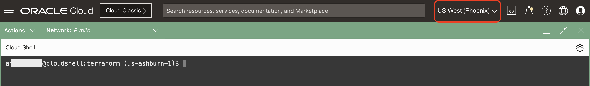
    ```bash
    <copy>
    oci iam region list --query "data[?contains("name", 'city_name_here')]"
    </copy>
    ```
    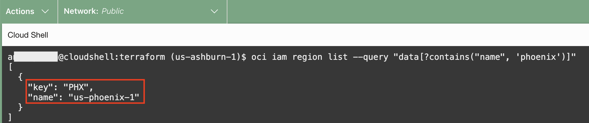

7. Authenticate to OCIR. This will require the `user_name` and `user_auth_token` values copied earlier in step 4, object storage namespace from step 5 and replace key used for the OCI region from step 6. 

    ```bash
    <copy>
    echo "<replace with auth token value>" | docker login -u <os namespace>/user_name --password-stdin <region key>.ocir.io
    </copy>
    ```

    Example:
    ```bash
    $ echo "---redacted---" | docker login -u a---redacted---2/devlive-nj-ocir-user --password-stdin phx.ocir.io

    Login Succeeded
    ```
    
8. Tag the container image by replacing the object storage namespace, region key values and repository name from step 5,6 and 3 respectively in the below command. 

    ```bash
    <copy>
    docker tag admessage <region key>.ocir.io/{object storage namespace}/devlive-##-repository/admessage:1.0.0
    </copy>
    ```
    Example:
    ```bash
    $ docker tag admessage phx.ocir.io/a---redacted---2/devlive-nj-repository/admessage:v1.0.0
    ```

9. Push the container image to OCIR

    ```bash
    <copy>
    docker push <region key>.ocir.io/{object storage namespace}/devlive-##-repository/admessage:v1.0.0
    </copy>
    ```

    Example:
    ```bash
    $ docker push phx.ocir.io/a---redacted---2/devlive-nj-repository/admessage:v1.0.0
    ```

    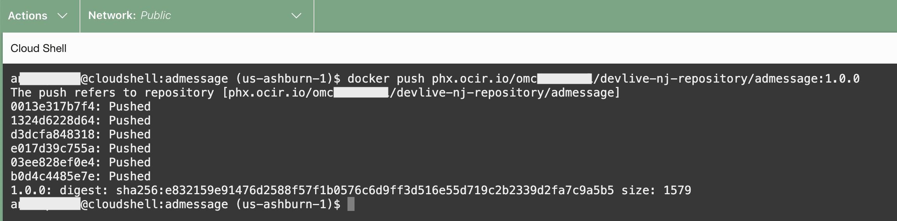


10. Click on the code editor and open the file **OCI-DEVLIVE-2024 > sb-hol > admessage.yaml** in the code editor.
   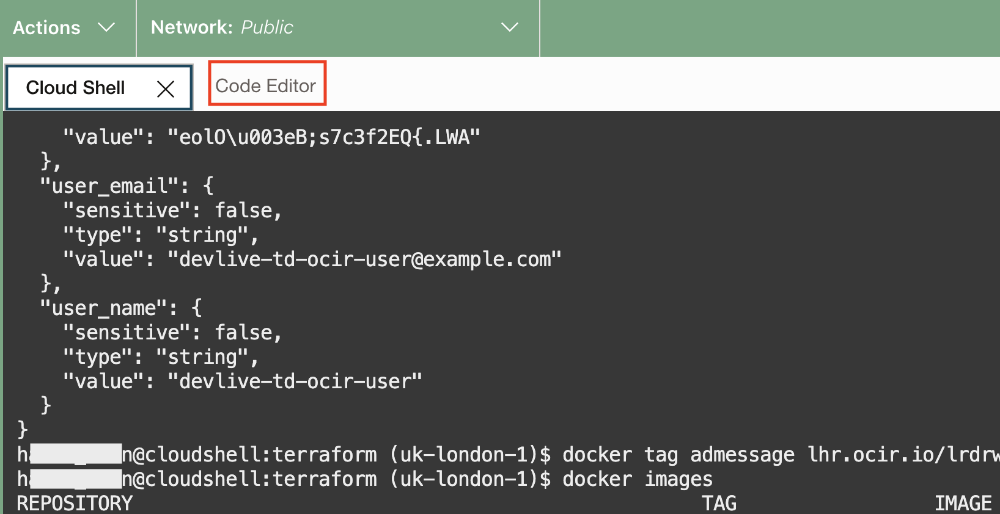
   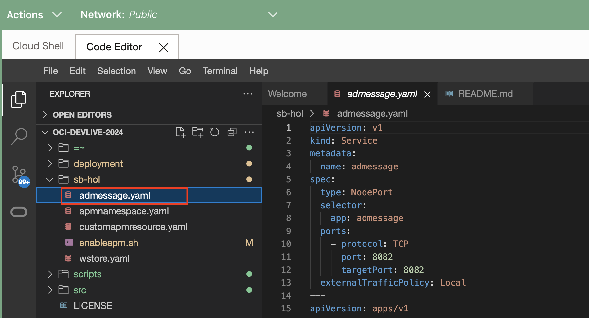

    - Update the field for **image** (line 32). Use the full path from the previous `docker push` command.
    - Update the field for the MySQL HeatWave Databae Private IP (line 38) which was saved in a text file when the MySQL HeatWave DB System was created.(Refer Lab 1 > Task 5 > Step 9)

     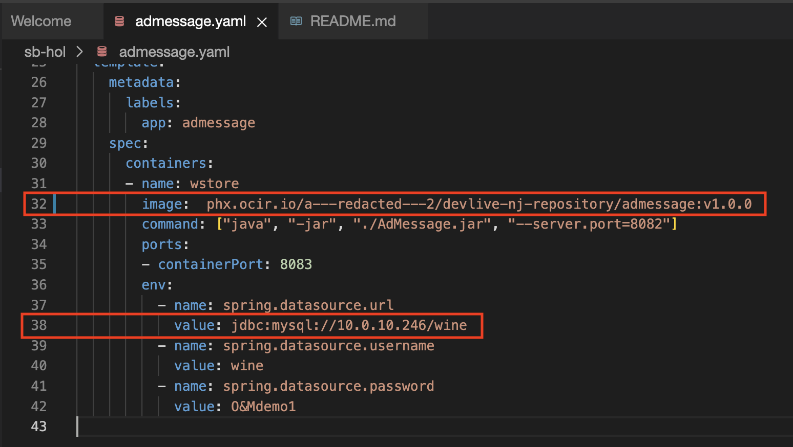
    - Click on **File > Save All**
     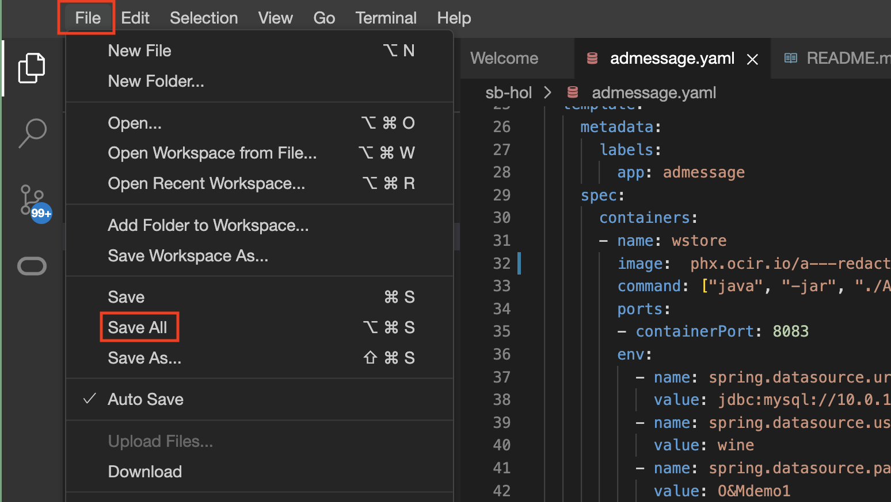

11. Go to cloud shell and execute the command below to deploy the **AdMessage** application to the cluster.

    ```bash
    <copy>
    cd ~/oci-devlive-2024/sb-hol
    kubectl apply -f admessage.yaml

    </copy>
    ```

    Verify the service and stateful set are both created:

    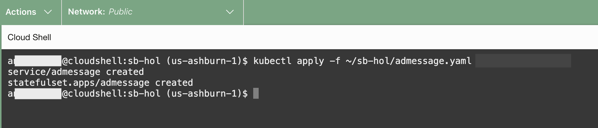

12. Verify that the new **admessage** pod is running successfully

    ```bash
    <copy>
    kubectl get pods
    </copy>
    ```


    **Result**:

    ```bash
    $ kubectl get pods
    NAME             READY   STATUS    RESTARTS   AGE
    admessage-0      1/1     Running   0          31s
    wstore-back-0    1/1     Running   0          48m
    wstore-back-1    1/1     Running   0          48m
    wstore-front-0   1/1     Running   0          48m
    ```

[You may now **proceed to the Task 3**.]

## Task 2 - Deployment Option 2: Take the automated path

1. There is a Node.js script available to automate most of the build process. If you have chosen this path, begin with the command below.

    ```bash
    <copy>
    cd ~/oci-devlive-2024
    npx zx scripts/artifacts.mjs
    </copy>
    ```

    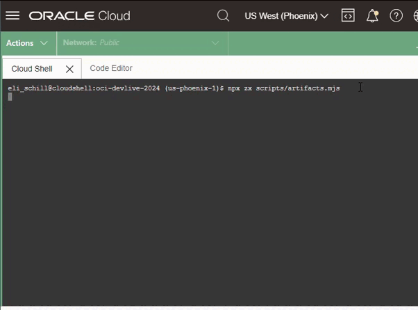

2. Copy the **Released:** value when the script finishes running. This is the path to your OCIR container image.

    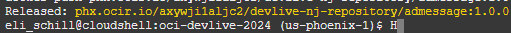

3. Click on the code editor and open the file **OCI-DEVLIVE-2024 > sb-hol > admessage.yaml** in the code editor.
   
   

    - Update the field for **image** (line 32).Use the full path from the previous **Released:** output at the end of the script.
    - Update the field for the MySQL HeatWave Databae Private IP (line 38) which was saved in a text file when the MySQL HeatWave DB System was created.(Refer Lab 1 > Task 5 > Step 9)

     
    - Click on **File > Save All**
     

4. Go to cloud shell and execute the command below to deploy the **AdMessage** application to the cluster.

    ```bash
    <copy>
    cd ~/oci-devlive-2024/sb-hol
    kubectl apply -f admessage.yaml
    </copy>
    ```

    Verify the service and stateful set are both created:

    

5. Verify that the new **admessage** pod is running successfully

    ```bash
    <copy>
    kubectl get pods
    </copy>
    ```

    **Result**:

    ```bash
    $ kubectl get pods
    NAME             READY   STATUS    RESTARTS   AGE
    admessage-0      1/1     Running   0          31s
    wstore-back-0    1/1     Running   0          48m
    wstore-back-1    1/1     Running   0          48m
    wstore-front-0   1/1     Running   0          48m
    ```

[You may now **proceed to the Task 3**.]

## Task 2 - Deployment Option 3: Just Deploy

1. Click on the code editor and open the file **OCI-DEVLIVE-2024 > sb-hol > admessage.yaml** in the code editor.
   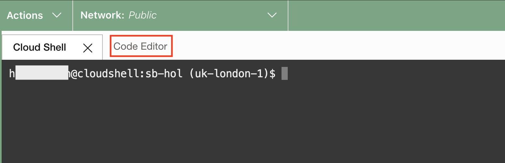
   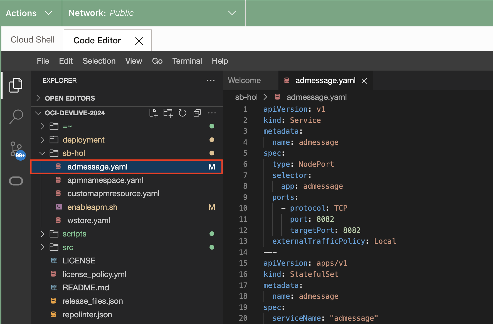

    - Update the field for the MySQL HeatWave Databae Private IP (line 38) which was saved in a text file when the MySQL HeatWave DB System was created.(Refer Lab 1 > Task 5 > Step 9)

     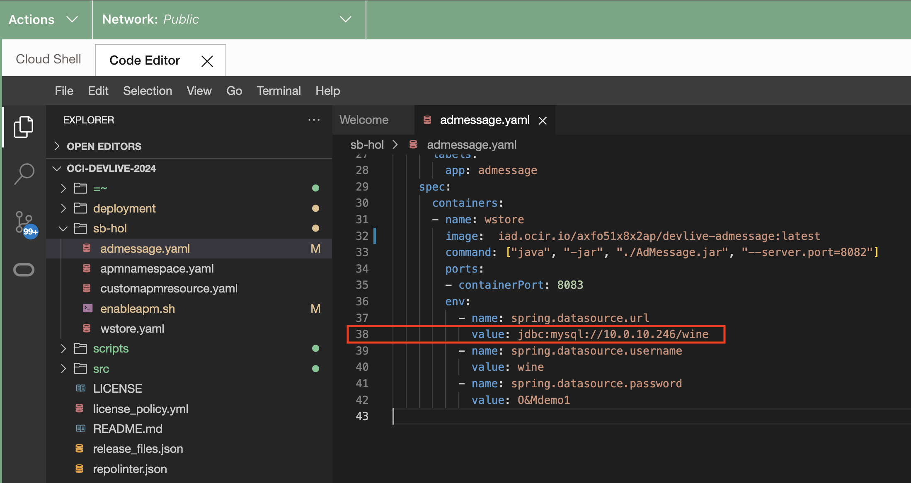
    - Click on **File > Save All**
     


2. Go to cloud shell and execute and execute the command below to deploy the **AdMessage** application to the cluster.

    ``` bash
    <copy>
    cd ~/oci-devlive-2024/sb-hol
    kubectl apply -f admessage.yaml
    </copy>
    ```

    Verify the 2 services and 2 stateful sets are created

    

3. Run the kubectl command below to display the status of the pod creation. Wait until the statuses become 'Running'. This may take a few minutes.

    ``` bash
    <copy>
    kubectl get pods
    </copy>
    ```
    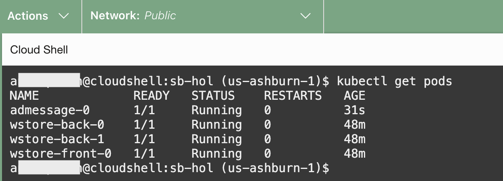

4. Run the kubectl command below to display the deployed services.

    ``` bash
    <copy>
    kubectl get svc
    </copy>
    ```
    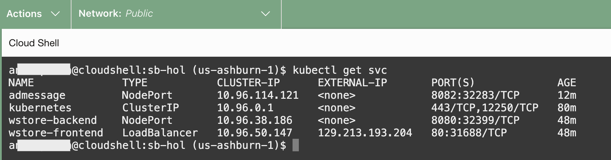

[You may now **proceed to the Task 3**.]

## Task 3: Integrate the AdMessage API with the main Wine App

1. Click on the code editor and open the file **OCI-DEVLIVE-2024 > sb-hol > wstore.yaml** in the code editor.
   

    - Update value of parameter  **winStore.services.adservice** with **AdMessage Endpoint** mentioned below. New endpoint is `adapi/admessage` (line 55)

    ``` bash
    <copy>
    http://${ADMESSAGE_SERVICE_HOST}:${ADMESSAGE_SERVICE_PORT}/adapi/admessage/
    </copy>
    ```
    
    

    - Click on **File > Save All**
     


2. Go to cloud shell and execute the command below to deploy the application to the cluster.

    ``` bash
    <copy>
    cd ~/oci-devlive-2024/sb-hol
    kubectl apply -f wstore.yaml
    </copy>
    ```
    

3. Run the kubectl command below to display the status of the pod creation. Wait until the statuses become 'Running'. This may take a few minutes.

    ``` bash
    <copy>
    kubectl get pods
    </copy>
    ```
    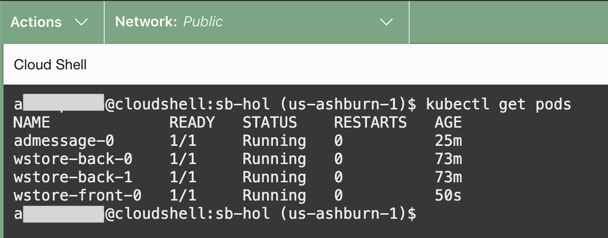

4. Run the kubectl command below to display the deployed services.

    ``` bash
    <copy>
    kubectl get svc
    </copy>
    ```
    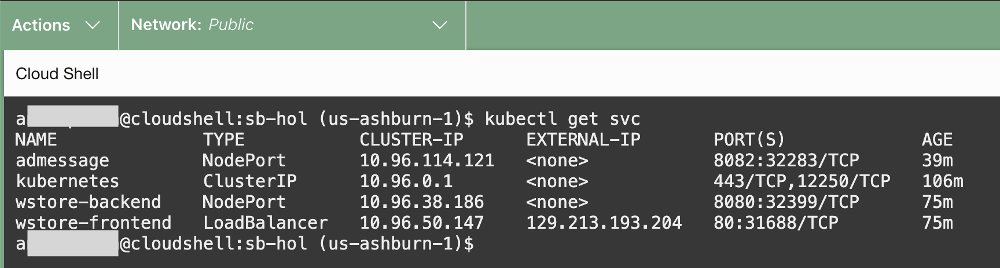

5. Refer to the example below and construct a URL, then paste it into the address bar of a new browser tab. Replace Public IP of the wstore-frontend service with the EXTERNAL-IP retrieved in the previous **step 4**.

    ``` bash
    <copy>
    http://<Public IP of the wstore-frontend service>/winestore/
    </copy>
    ```

    

6. **Additional task:** Update table **admessage** to see how the admessage changes on update of table and refreshing the winestore url in the browser. 

    ``` bash
    <copy>
    UPDATE admessage SET message="Successfully Deployed and Integrated AdMessage API" WHERE ID=1;
    COMMIT;
    SELECT * FROM admessage;

    </copy>
    ```

[You may now **proceed to the next lab**.](#next)

## Acknowledgements

* **Author** - Wojciech Pluta, Principal Staff Developer
- **Contributors** -
Anand Prabhu, Principal Member of Technical Staff, Enterprise and Cloud Manageability
Victor Martin, Product Strategy Directory 
Eli Schilling, Developer Advocate
* **Last Updated By/Date** - Anand, March 2024
