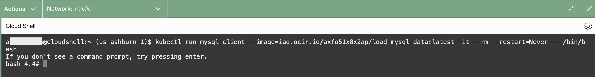

# Build a microservices application using Oracle AI Code Assist 

## Introduction

This workshop helps to build a Spring Boot-based Java microservice using Oracle AI Code assist to enhance the ad messages on the Wine application.Currently we have static ad message **2023 Thanks Giving Promotion: Buy 1 get 1!!!!** shown in the application.In this lab, you will develop and deploy the new API to make ad messages dynamic by extending the wine application.

Estimated time: 30 minutes


## Alternatively : Deploy application built through Oracle AI Code Assist using published image 

## Task 1: Create table **admessage** in the MySQL HeatWave Database

1. Install MySQL client to connect to the MySQL HeatWave Database from cloud shell 
    ```
    <copy>
    kubectl run mysql-client --image=iad.ocir.io/axfo51x8x2ap/load-mysql-data:latest -it --rm --restart=Never -- /bin/bash
    </copy>
    ```
    

2. Execute below command to connect to MySQL HeatWave Database using Private IP of the database and admin credentials provided during database creation. 
    ```
    <copy>
    mysql -h <mds-private-ip-address> -u <mds-admin-user> -p
    </copy>
    ```
    

3. Execute below command to connect to **wine** application database
    ```
    <copy>
    use wine;
    </copy>
    ```
    

4. Execute below sql statements to create a **admessage** table and insert a record into it

    ``` bash
    <copy>
    CREATE TABLE admessage (ID INT AUTO_INCREMENT PRIMARY KEY, message VARCHAR(255));
    INSERT INTO admessage (ID, MESSAGE) VALUES (1,'Welcome to MySQL DevLive Event');
    COMMIT;
    SELECT * FROM admessage;

    </copy>
    ```

    

## Task 2: Deploy Admessage application 

1. Go back to the cloud shell and inside **~/sb-hol** directory, find **admessage.yaml**

   

   Admessage.yaml contains reference to the containerized image with packaged Admessage application built through Oracle AI Code assist.

2. Modify the file **admessage.yaml** to update the MySQL HeatWave Database Private IP 

    ``` bash
    <copy>
    vi admessage.yaml
    </copy>
    ```
    - Update field **<mds-private-ip-address>** with MySQL HeatWave Database Private IP (line 38) 

    

    - Press the Esc key to ensure you are in command mode.
    - Type :wq (colon followed by wq) in the vi editor.
    - Press Enter to execute the command to save the file 

    

3. Execute the command below to deploy the **AdMessage** application to the cluster.

    ``` bash
    <copy>
    kubectl apply -f ~/sb-hol/admessage.yaml --validate=false
    </copy>
    ```

    Verify the 2 services and 2 stateful sets are created

    

3. Run the kubectl command below to display the status of the pod creation. Wait until the statuses become 'Running'. This may take a few minutes.

    ``` bash
    <copy>
    kubectl get pods
    </copy>
    ```
    

4. Run the kubectl command below to display the deployed services.

    ``` bash
    <copy>
    kubectl get svc
    </copy>
    ```
    

## Task 3: Integrate the Admessage API with the main wine application 

1. Modify the file **wstore.yaml** to update the endpoint of the **Admessage**

    ``` bash
    <copy>
    vi wstore.yaml
    </copy>
    ```
    - Update value of parameter  **winStore.services.adservice** with **AdMessage Endpoint** mentioned below (line 59)

    ``` bash
    <copy>
    http://${ADMESSAGE_SERVICE_HOST}:${ADMESSAGE_SERVICE_PORT}/adapi/admessage/
    </copy>
    ```

    

    - Press the Esc key to ensure you are in command mode.
    - Type :wq (colon followed by wq) in the vi editor.
    - Press Enter to execute the command to save the file 

    
  
2. Execute the command below to deploy the application to the cluster.

    ``` bash
    <copy>
    kubectl apply -f ~/sb-hol/wstore.yaml --validate=false
    </copy>
    ```
    

3. Run the kubectl command below to display the status of the pod creation. Wait until the statuses become 'Running'. This may take a few minutes.

    ``` bash
    <copy>
    kubectl get pods
    </copy>
    ```
    

4. Run the kubectl command below to display the deployed services.

    ``` bash
    <copy>
    kubectl get svc
    </copy>
    ```
    

4. Launch the application to see new **ad message** 

    ``` bash
    <copy>
    http://<IP of the wstore-frontend service>/winestore/
    </copy>
    ```

    

5. Additional task: Update table **admessage** to see how the admessage changes on update of table and refreshing the winestore url in the browser. 

    ``` bash
    <copy>
    UPDATE admessage SET message="Oracle AI Code Assistant HOL" WHERE ID=1;
    COMMIT;
    SELECT * FROM admessage;

    </copy>
    ```