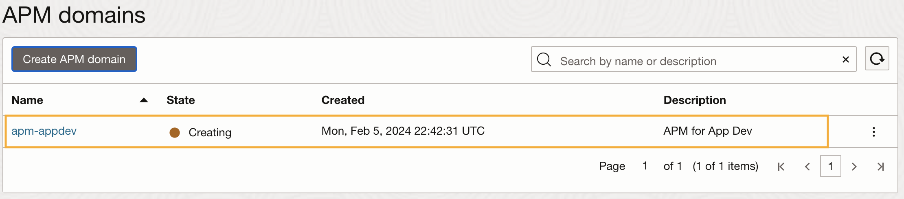
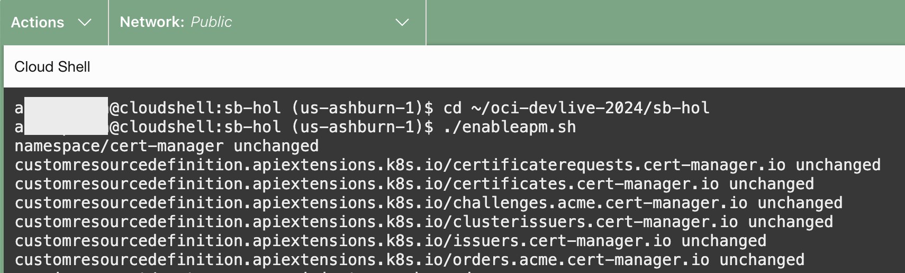
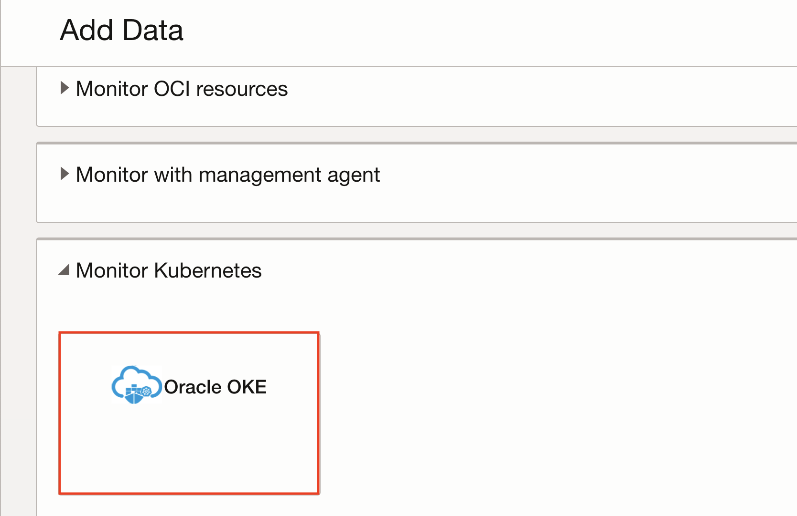
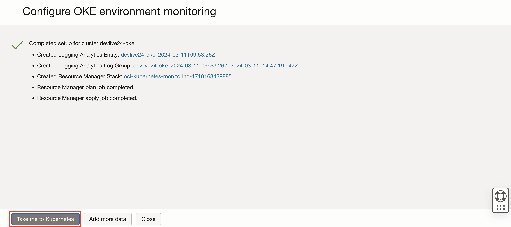
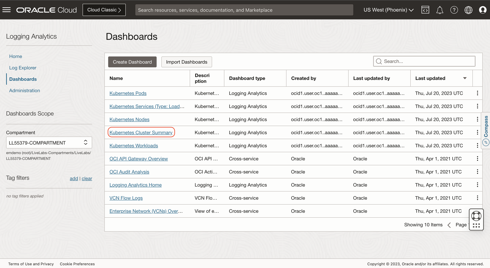
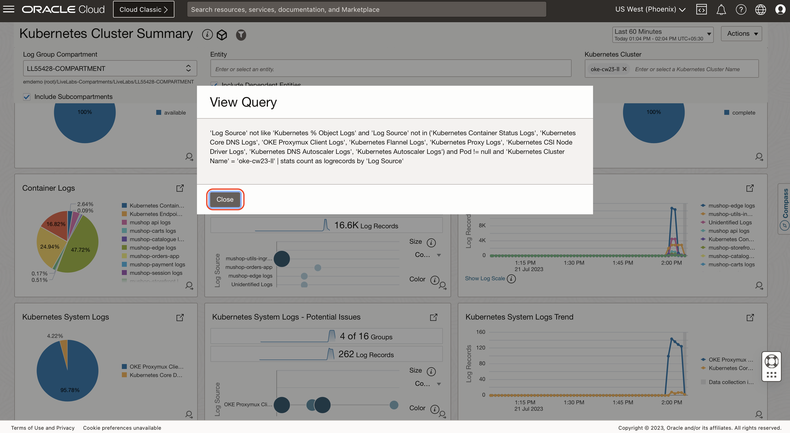

# Enable application monitoring using Observability and Management Services

## Introduction

In this lab, you'll enable OCI Logging Analytics Service to monitor Oracle Kubernetes Engine and APM for application monitoring to get end to end visibility of the application. 

Estimated Time: 20 minutes

### Objectives

In this lab, you will see step-by-step instructions to:
  - Enable APM & Logging Analytics Service
  - Complete visibility into the application using O&M Services 

## Task 1: Create an APM domain

1.	From the OCI menu, select **Observability & Management**, then **Administration**.
	

2. Select the **appdev** compartment from the dropdown and click Create APM domain 
	

4.	Name your APM domain as **apm-appdev** and select **appdev** compartment from the dropdown. click **Create**.
  

5. Press the refresh button periodically to check the status. This may take a few minutes.
  

6.	Once the job is completed, the status turns to Active with a green icon.
  


## Task 2: Obtain Data Upload Endpoint and Private and Public Data Keys

To upload tracing data to an APM domain, Data Upload Endpoint and both Private and Public Data Keys must be configured in the application’s configuration files. 

1.	Click the link to the APM domain.
  


2. In the **APM Domain Information** tab, find **Data Upload Endpoint**
  - Under **Resources**, click **Data Keys**.
    - find **auto\_generated\_private_data\_key**. 
    - find **auto\_generated\_public_data\_key**. 

   Copy data upload endpoint and data keys (private and public) to a file to be used in later tasks in the workshop. 

  


## Task 3: Enable APM for the **Wine Cellar** application

1. Enable APM browser agent by updating APM upload endpoint and public data key in the **wstore.yaml**

    ``` bash
    <copy>
    vi wstore.yaml
    </copy>
    ```
    - Update fields **<apm-endpoint>** (line 55) and **<apm-public-data-key>** (line 57) with APM upload end point and data keys obtained from task 2. 

    

    - Press the Esc key to ensure you are in command mode.
    - Type :wq (colon followed by wq) in the vi editor.
    - Press Enter to execute the command to save the file 

2. Enable APM using K8 Open telemetry operator at the namespace

    - Update fields **<apm-endpoint>** (line 11) and **<apm-private-data-key>** (line 13) with APM upload end point and data keys obtained from task 2. 

    ``` bash
    <copy>
    cd ~/sb-hol;vi customapmresource.yaml
    </copy>
    ```
    

    - Press the Esc key to ensure you are in command mode.
    - Type :wq (colon followed by wq) in the vi editor.
    - Press Enter to execute the command to save the file 

3. Apply **wstore.yaml**, **customapmresource.yaml**, **apmnamespace.yaml** to the Kubernetes cluster to enable APM for the application in the order mentioned below. 

   - To enable K8 Open Telemetry operator 
    ``` bash
    <copy>
    kubectl apply -f https://github.com/cert-manager/cert-manager/releases/download/v1.14.3/cert-manager.yaml 
    </copy>
    ```

    ``` bash
    <copy>
    kubectl apply -f https://github.com/open-telemetry/opentelemetry-operator/releases/latest/download/opentelemetry-operator.yaml
    </copy>
    ```

   - Map K8 Open Telemetry operator to inject APM java agent 
    ``` bash
    <copy>
    kubectl apply -f ~/sb-hol/customapmresource.yaml --validate=false
    </copy>
    ```

   - Inject APM java agent at the K8 namespace level 
    ``` bash
    <copy>
    kubectl apply -f ~/sb-hol/apmnamespace.yaml --validate=false
    </copy>
    ```

   - Enable browser agent
    ``` bash
    <copy>
    kubectl apply -f ~/sb-hol/wstore.yaml --validate=false
    </copy>
    ```

    
    
    


    Now the APM is enabled for the application proceed to the next task. 

## Task 4: Generate workload by navigating to the app

1.  Click **Login**.

    


2.  Enter your name (or john) as username, leave the password blank, and click **Login**.

    


3. Then click around the buttons in the pages, as in the example flow shown below.

    >**Note:** Do not worry if you see the "Failed" messages, or if it takes a long time for the pages to respond. Those are expected because the app is designed to fail every once and often for demo purposes.

    Click **Add** on a couple of products then hit **Shopping Cart**. Then Click **Checkout**.
    
    Click **Confirm Order**, then **Logout**.
    


## Task 5: Examine traces in APM Trace Explorer

1. From the OCI menu, select **Observability & Management** > **Trace Explorer**

   

2. On the Trace Explorer page, select **apmworkshop** for the **Compartment** and the **APM Domain**.

   

3.	By default, traces are displayed in the order by the start time. Right mouse click on the **Duration** column, select **Sort Descending** to show the traces by duration in descending order. This will bring the slowest trace to the top of the list.

   

4. Hover the mouse over the bar in the **Spans** column at the top row. Verify three services are included in the trace, and each color represents a service, wstore-back, wstore-front, and wstore-web, which you defined in the previous labs.

  

5.	Click the trace link at the **Service:Operationame** column.

   

   >**Note:** If you do not see a slow trace with a duration of 10 seconds or more, you can navigate the WineStore demo app a few times until you see the programmed slowness in the checkout service.

6. **Trace Details** page opens. Review the trace information on the upper screen. E.g., Status, Trace ID, Whether it has an error or not, how many spans and services are involved, or the duration of the trace.
   

7. In the **Topology** view, you can see how the operations are connected within the trace. Different colors indicate different services. Hover the mouse on the icons and the arrows that connect the icons. Review the information in the callouts.
  

  In this example, it seems that the checkout service is where the most time was spent in the trace.

  >**Note:** The operations may look differently in the trace you selected.

8. Scroll down the page to show the **Spans** view. Spans in the trace are displayed in a Gantt chart. A span at the top of the list is the root span, and the child spans are nested below the root span.

  

  In this example, one of the operations is taking 9 seconds alone, out of the total duration of 10 seconds. This seems to be the bottleneck of the slowness.


## Task 6: Enable Logging Analytics Service 

1. Navigate to Observability & Management and click Logging Analytics.

  - From Navigation Menu  > **Observability & Management** > **Logging Analytics**.

  - Click **Start Using Logging Analytics**.
  

  - Review the policies that are automatically created and click **Next**.
  

  - Enable OCI audit log analysis and Click **Next**.
  

  - Logging Analytics Service is enabled in the tenancy. Click **Close**.
  

2. Navigate to Kubernetes Monitoring and Management application

  To navigate to Kubernetes Monitoring and Management application, follow the given steps:

  - From Navigation Menu  > **Marketplace** > **All Applications**.

  - In the search bar, enter the text **Kubernetes Monitoring and Management**.
  - Click on the **Kubernetes Monitoring and Management** application to land on the application page. 
  


3. Launch Kubernetes Monitoring and Management application

  - Select the **v3.0.1 (12/3/2023) - default** version from the version dropdown.

  - Select the compartment **appdev** from the dropdown.

  - Check the **Terms and Restrictions** checkbox.

  - Click on **Launch Stack** button to launch the application.
    

4. Configure Stack

  - On **Create Stack** page, you will see the **Stack information**.

  - Click on **Next** button to proceed to the Configure variables section.
    
  

  - In **Configure variables** section, you have to set the following variables for the stack:

    - **OKE cluster Compartment:** Select the **appdev** compartment from the dropdown.

    - **OKE Cluster:** Select the **k8-appdev** OKE cluster from the dropdown.
    

    - In OCI Observability and Management Services Configuration 
    - Select the compartment **appdev** from the dropdown. 
    - Check box to create a new log group and enter **appdevgrp** as the OCI Logging Analytics log group name
    - Click on **Next** button to proceed to the Review section.
     

5. In **Review** section, you can see the stack configurations you selected in the previous steps.

  - Click on the **Create** button to create the stack. This step will create an ORM (Oracle Resource Manager) job that uses [Terraform](https://github.com/oracle-quickstart/oci-kubernetes-monitoring/tree/main/terraform) to deploy the solution.
  


  - It will take around 90 seconds for the stack to get created.
  

## Task 7: Navigate to installed dashboards from Application Information tab

1. After the stack creation is successful, it will take few seconds for the **Application information** tab to appear.


2. Click on the **Application information** tab to view the application information.

3. Click on the **View Dashboard** button to view the dashboards.
  


## Task 8: Exploring Kubernetes Dashboards

1. After clicking on the **View Dashboards** button, a new tab will open displaying all the dasboards.

2. Click on the **Kubernetes Cluster Summary** dashboard. It will take few seconds for the dashboard widgets to load.


3. Click on the **Scope Filter** panel.


4. Select your user Compartment from the dropdown in the **Log Group Compartment** field. For your user the Compartment name will be in the format **LL{reservationid}-COMPARTMENT**, e.g. LL55379-COMPARTMENT. Select **oke-cw23-II** cluster in the **Kubernetes Cluster** field.


5. You should be able to see the all the widgets displaying the data specific to your OKE Cluster.


6. Scroll down to the **Container Logs** widget in the dashboard.


7. Click on the View Query Icon to view the query used to populate the data in widget.

  
  

  After viewing the query, click on **Close** button.

8. Click on the Punch Out Icon on the Container Logs widget.
 

9. This will take you to the **Pie Chart view** of Log Explorer in context of Kubernetes Cluster Name.


10. To navigate back to the Kubernetes Cluster Summary page, click on the **Kubernetes Cluster Summary** as highlighted in the image below.


11. Similarly you can explore other widgets in the Kubernetes Cluster Summary and other dashboards.


## Acknowledgements

* **Author** - Anand Prabhu, Principal Member of Technical Staff, Enterprise and Cloud Manageability
- **Contributors** -
Yutaka Takatsu, Senior Principal Product Manager,  
Avi Huber, Vice President, Product Management
* **Last Updated By/Date** - Anand Prabhu, January 2024
