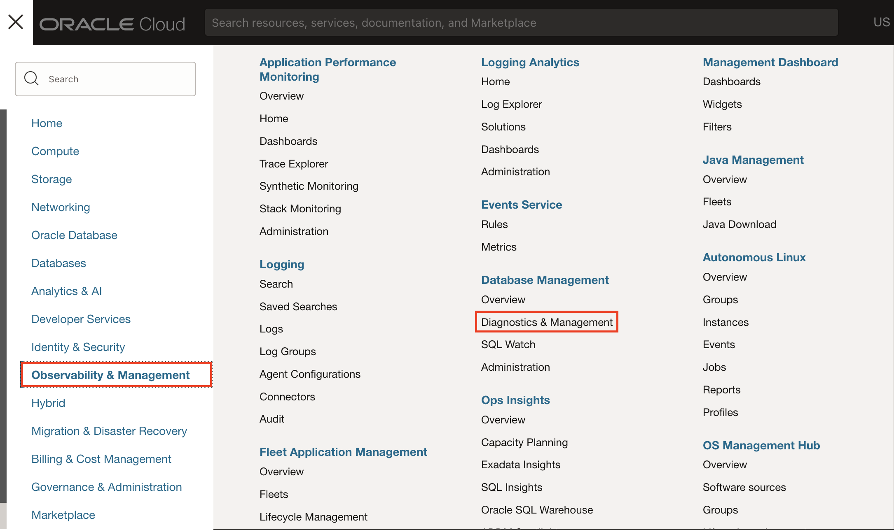
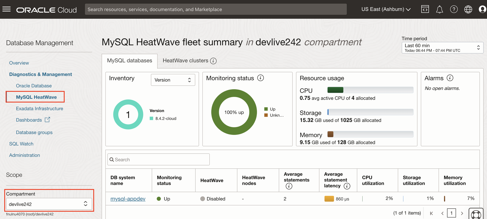
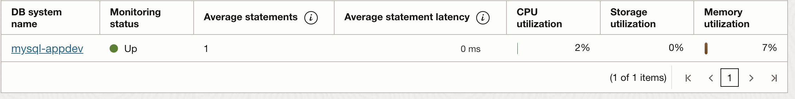
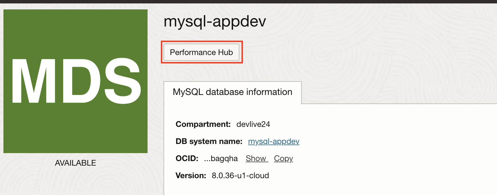
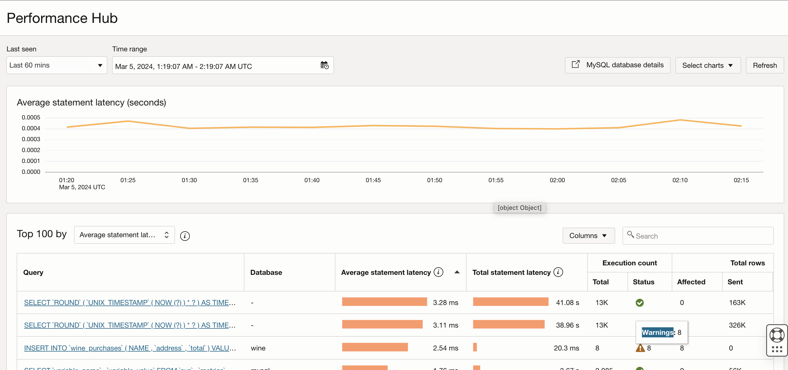
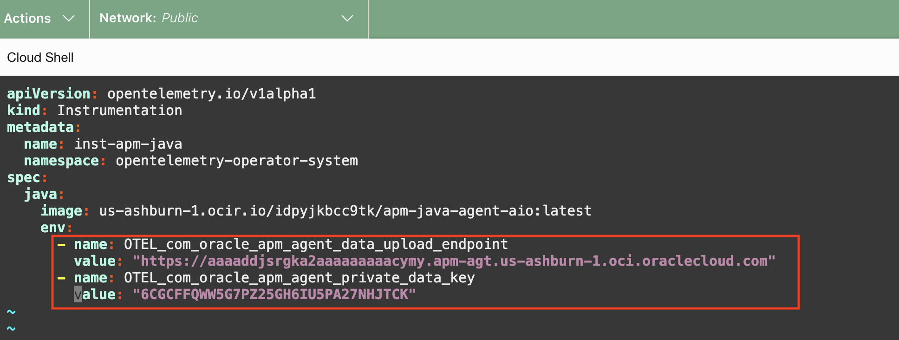
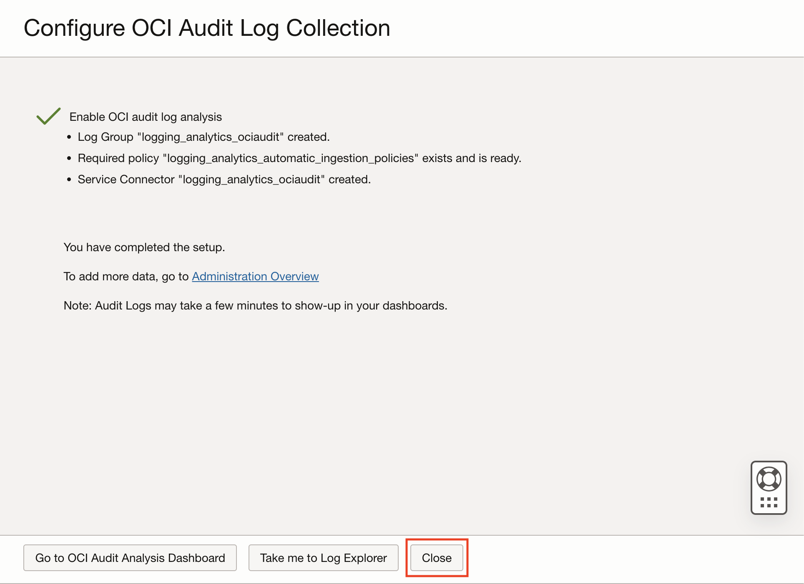
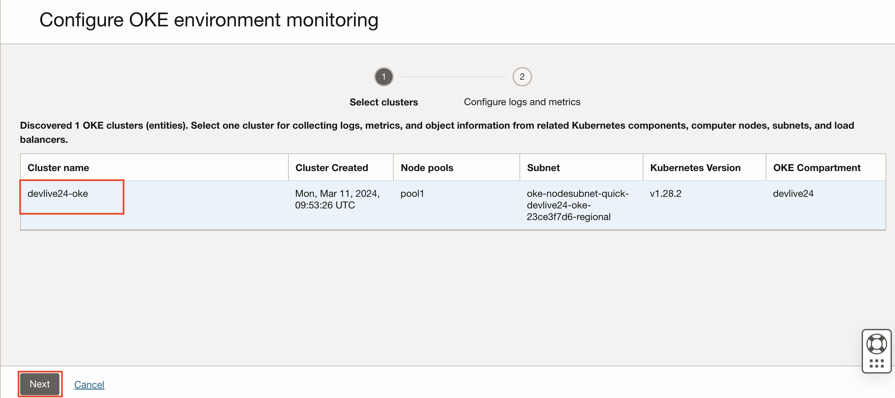
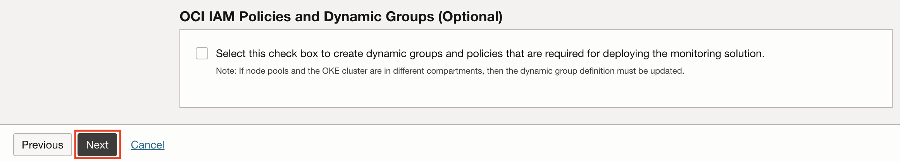
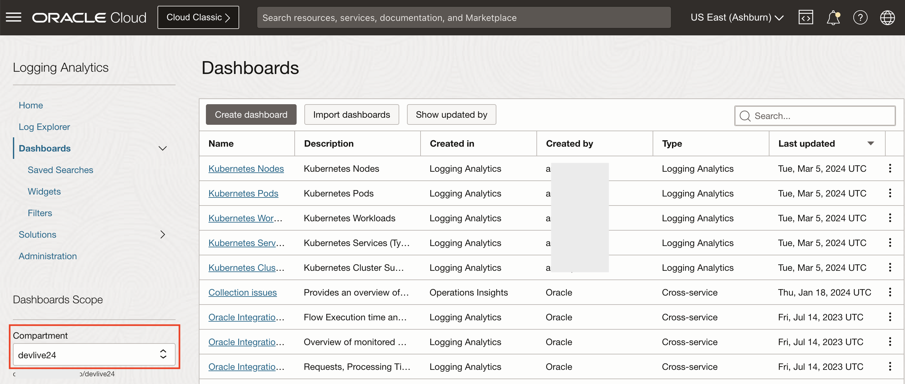

# Enable application monitoring using Observability and Management Services

## Introduction

In this lab, you'll enable OCI Logging Analytics Service to monitor Oracle Kubernetes Engine and OCI Application Performance Management (APM) for application monitoring and also OCI Database Management for monitoring MySQL HeatWave Database to get end to end visibility of the application and its stack. 

Estimated Time: 20 minutes

### Objectives

In this lab, you will see step-by-step instructions to:
  - Enable APM & Logging Analytics Service
  - Complete visibility into the application using O&M Services 

## Task 1: Monitor MySQL HeatWave Database 

1. From the OCI menu, select **Observability & Management** -> **Database Management** then **MySQL HeatWave**.

    

2. select compartment **devliv24** to see the fleet Summary - showing MySQL HeatWave Database systems inventory, monitoring status, resource usage & alarams.

    

3. Click on **mysql-appdev** MySQL HeatWave DB system from the list of monitored deployments

    

4. Monitor MySQL HeatWave Database 

    - Alarms section allows drill down to specific errors to quickly resolve any issues
    - Monitoring status timeline:  Shows if Database Management can collect monitoring metrics for the resource
    - Monitor database performance attributes in the Summary section

    

5. Performing MySQL HeatWave DB System Performance Diagnostics

  - Click on **Performance Hub** tab 
    
  
  - Performance Hub provides holistic performance management capabilities providing a single view of the database performance using a varied set of features, such as Active statement latency, statement count charts, top 100 queries sorted by metrics, and the ability to drill down into specific SQL details.

    

  - Click on one of the top query **UPDATE 'A1P_USERS'** to see the performance of the query 

    

    Total of 8 executions and all 8 executions got failed. This allows us to quickly identify the database query performance issues using OCI Database Management Service. 

## Task 2: Create an APM domain

1.	From the OCI menu, select **Observability & Management** -> **Application Performance Monitoring** then **Administration**.
	

2. Select the **devlive24** compartment from the dropdown and click Create APM domain 
	

4.	Name your APM domain as **apm-appdev** and select **devlive24** compartment from the dropdown. click **Create**.
  

5. Press the refresh button periodically to check the status. This may take a few minutes.
  

6.	Once the job is completed, the status turns to Active with a green icon.
  


## Task 3: Obtain Data Upload Endpoint and Private and Public Data Keys

To upload tracing data to an APM domain, Data Upload Endpoint and both Private and Public Data Keys must be configured in the application’s configuration files. 

1.	Click the link to the APM domain.
  


2. In the **APM Domain Information** tab, find **Data Upload Endpoint**
  - Under **Resources**, click **Data Keys**.
    - find **auto\_generated\_private_data\_key**. 
    - find **auto\_generated\_public_data\_key**. 

   Copy data upload endpoint and data keys (private and public) to a file to be used in later tasks in the workshop. 

  


## Task 4: Enable APM for the **Wine Cellar** application

1. Enable APM using K8 Open telemetry operator at the namespace

    - Update field **<apm-endpoint>** (line 11) with APM upload end point obtained from task 2. 
    - Update field **<apm-private-data-key>** (line 13) with private data key obtained from task 2. 


    ``` bash
    <copy>
    cd ~/oci-devlive-2024/sb-hol
    vi customapmresource.yaml
    </copy>
    ```

    

    - Press the Esc key to ensure you are in command mode.
    - Type :wq (colon followed by wq) in the vi editor.
    - Press Enter to execute the command to save the file 

3. Running **enableapm.sh** enables APM for the Kubernetes cluster

    enableapm.sh 
    - Installs required libraries to enable K8 Open Telemetry operator 
    - Maps K8 Open Telemetry operator to inject APM java agent 
    - Injects APM java agent at the K8 namespace level through the K8 operator 

    ``` bash
    <copy>
    cd ~/oci-devlive-2024/sb-hol
    ./enableapm.sh
    </copy>
    ```

    


4. Verify if the APM is enabled by executing the below command and check for OTEL parameters in the pod parameters. 

    ``` bash
    <copy>
    kubectl get pod wstore-front-0 -o yaml
    </copy>
    ```

    
    Now the APM is enabled for the application proceed to the next task. 

## Task 5: Generate workload by navigating to the app

1.  Click **Login**.

    


2.  Enter your name (or john) as username, leave the password blank, and click **Login**.

    


3. Then click around the buttons in the pages, as in the example flow shown below.

    >**Note:** Do not worry if you see the "Failed" messages, or if it takes a long time for the pages to respond. Those are expected because the app is designed to fail every once and often for demo purposes.

    Click **Add** on a couple of products then hit **Shopping Cart**. Then Click **Checkout**.
    
    

    Click **Confirm Order**.
    

    Click **Logout**.
    


## Task 6: Examine traces in APM Trace Explorer

1. From the OCI menu, select **Observability & Management** > **Trace Explorer**

   

2. On the Trace Explorer page, select **devlive24** for the **Compartment** and **apm-appdev** for the **APM Domain**.

   

3.	By default, traces are displayed in the order by the start time. Right mouse click on the **Duration** column, select **Sort Descending** to show the traces by duration in descending order. This will bring the slowest trace to the top of the list.

   

4. Hover the mouse over the bar in the **Spans** column at the top row. Verify three services are included in the trace, and each color represents a service: wstore-back, wstore-front, and wstore-web

   

5.	Click the trace link at the **Service:Operationame** column.

   

   >**Note:** If you do not see a slow trace with a duration of 10 seconds or more, you can navigate the WineStore demo app a few times until you see the programmed slowness in the checkout service.

6. **Trace Details** page opens. Review the trace information on the upper screen. E.g., Status, Trace ID, Whether it has an error or not, how many spans and services are involved, or the duration of the trace.
   

7. In the **Topology** view, you can see how the operations are connected within the trace. Different colors indicate different services. Hover the mouse on the icons and the arrows that connect the icons. Review the information in the callouts.
  

  >**Note:** The operations may look differently in the trace you selected.

8. Scroll down the page to show the **Spans** view. Spans in the trace are displayed in a Gantt chart. A span at the top of the list is the root span, and the child spans are nested below the root span.

  

9. **Trace Details** shows one span error and find the span that has errored, now lets click on that span to understand the reason for the error. 

  

Span error message shows that the table **A1P_USERS** is missing in the wine database which resulted in the error in this particular trace.

 >**Note:** With APM its easy to query the trace and span data using the trace query language and explore other tabs (Users, SQLs, Web Apps, Sessions, etc..) in trace explorer to get quick insights into application performance.


## Task 7: Enable Logging Analytics Service 

1. Navigate to Observability & Management and click Logging Analytics.

    - From Navigation Menu  > **Observability & Management** > **Logging Analytics**.

    - Click **Start Using Logging Analytics**.
    

    - Review the policies that are automatically created and click **Next**.
    

    - Enable OCI audit log analysis and Click **Next**.
    

    - Logging Analytics Service is enabled in the tenancy. Click **Close**.
    

2. Navigate to Kubernetes Monitoring and Management application

    To navigate to Kubernetes Monitoring and Management application, follow the given steps:

    - From Navigation Menu  > **Marketplace** > **All Applications**.

    - In the search bar, enter the text **Kubernetes Monitoring and Management**.
    - Click on the **Kubernetes Monitoring and Management** application to land on the application page. 
    


3. Launch Kubernetes Monitoring and Management application

    - Select the **v3.0.1 (12/3/2023) - default** version from the version dropdown.

    - Select the compartment **devlive24** from the dropdown.

    - Check the **Terms and Restrictions** checkbox.

    - Click on **Launch Stack** button to launch the application.
    

4. Configure Stack

    - On **Create Stack** page, you will see the **Stack information**.

    - Click on **Next** button to proceed to the Configure variables section.
    
  

    - In **Configure variables** section, you have to set the following variables for the stack:

    - **OKE cluster Compartment:** Select the **devlive24** compartment from the dropdown.

    - **OKE Cluster:** Select the **devlive-##-oke** OKE cluster from the dropdown.
    

    - In OCI Observability and Management Services Configuration 
    - Select the compartment **devlive24** from the dropdown. 
    - Check box to create a new log group and enter **devlivegrp** as the OCI Logging Analytics log group name
    
    - Click on **Next** button to proceed to the Review section.
    
  

5. In **Review** section, you can see the stack configurations you selected in the previous steps.

  - Click on the **Create** button to create the stack. This step will create an ORM (Oracle Resource Manager) job that uses [Terraform](https://github.com/oracle-quickstart/oci-kubernetes-monitoring/tree/main/terraform) to deploy the solution.
  


  - It will take around 90 seconds for the stack to get created.
  

## Task 8: Navigate to installed dashboards in Logging Analytics

1. After the stack creation is successful, From Navigation Menu > **Observability & Management** > **Logging Analytics** > **Dashboards**

  

2. Select the compartment **devlive24** and now see the newly created logging analytics dashboards for monitoring Oracle Kubernetes Cluster.  

  


## Task 9: Exploring Kubernetes Dashboards

1. Click on the **Kubernetes Cluster Summary** dashboard. It will take few seconds for the dashboard widgets to load.


3. Click on the **Scope Filter** panel.


4. Select **devlive24** Compartment from the dropdown in the **Log Group Compartment** field and select **devlive-##-oke** cluster in the **Kubernetes Cluster** field.


5. You should be able to see the all the widgets displaying the data specific to your OKE Cluster.


6. Scroll down to the **Container Logs** widget in the dashboard.


7. Click on the View Query Icon to view the query used to populate the data in widget.

  
  

  After viewing the query, click on **Close** button.

8. Click on the Punch Out Icon on the Container Logs widget.
 

9. This will take you to the **Pie Chart view** of Log Explorer in context of Kubernetes Cluster Name.


10. To navigate back to the Kubernetes Cluster Summary page, click on the **Kubernetes Cluster Summary** as highlighted in the image below.


11. Similarly you can explore other widgets in the Kubernetes Cluster Summary and other dashboards.


## Acknowledgements

* **Author** - Anand Prabhu, Principal Member of Technical Staff, Enterprise and Cloud Manageability
- **Contributors** -
Yutaka Takatsu, Senior Principal Product Manager,  
Avi Huber, Vice President, Product Management
* **Last Updated By/Date** - Anand Prabhu, January 2024
