# Enable application monitoring using Observability and Management Services

## Introduction

In this lab, you'll enable OCI Logging Analytics Service to monitor Oracle Kubernetes Engine and OCI Application Performance Management (APM) for application monitoring and also OCI Database Management for monitoring MySQL HeatWave Database to get end to end visibility of the application and its stack. 

Estimated Time: 40 minutes

### Objectives

In this lab, you will see step-by-step instructions to:
  - Enable APM & Logging Analytics Service
  - Complete visibility into the application using O&M Services 

## Task 1: Monitor MySQL HeatWave Database 

1. From the OCI menu, select **Observability & Management** -> **Database Management** then **Diagnostics & Management**.

    

2. Select compartment **devliv24** and click on "MySQL HeatWave" to see the fleet Summary - showing MySQL HeatWave Database systems inventory, monitoring status, resource usage & alarms.

    

3. Click on **mysql-appdev** MySQL HeatWave DB system from the list of monitored deployments

    

4. Monitor MySQL HeatWave Database 

    - Alarms section allows drill down to specific errors to quickly resolve any issues
    - Monitoring status timeline:  Shows if Database Management can collect monitoring metrics for the resource
    - Monitor database performance attributes in the Summary section

    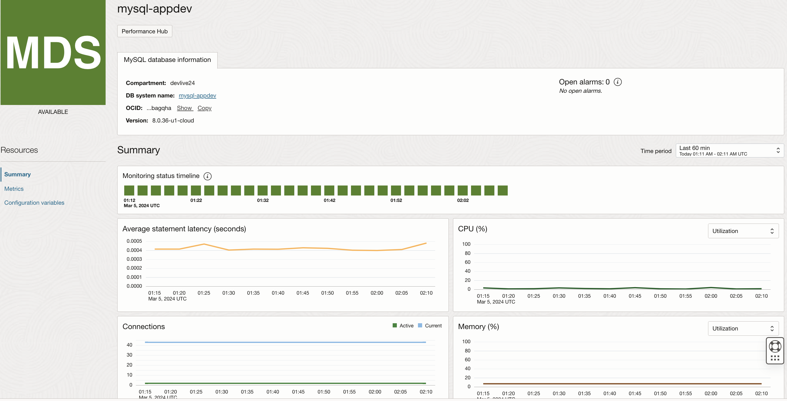

5. Performing MySQL HeatWave DB System Performance Diagnostics

  - Click on **Performance Hub** tab 
    
  
  - Performance Hub provides holistic performance management capabilities providing a single view of the database performance using a varied set of features, such as Active statement latency, statement count charts, top 100 queries sorted by metrics, and the ability to drill down into specific SQL details.

    

  - Click on any one of the top query. To see the performance of the query. For example clicking on **UPDATE 'A1P_USERS'** shows the following - your environment may be different.

    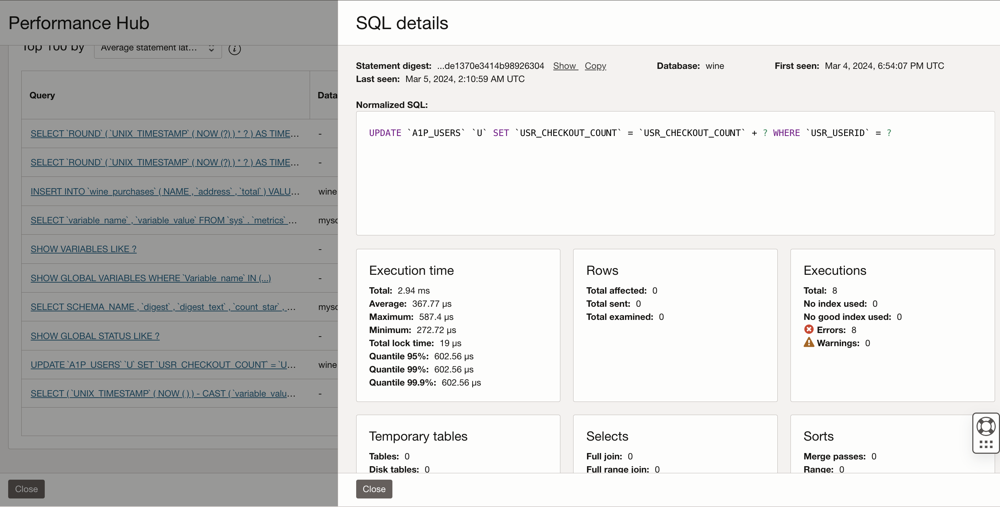

    Total of 8 executions and all 8 executions got failed. This allows us to quickly identify the database query performance issues using OCI Database Management Service. 

## Task 2: Create an APM domain

1.	From the OCI menu, select **Observability & Management** -> **Application Performance Monitoring** then **Administration**.
	

2. Select the **devlive24** compartment from the dropdown and click Create APM domain 
	

3.	Name your APM domain as **apm-appdev** and select **devlive24** compartment from the dropdown. click **Create**.
  

4. Press the refresh button periodically to check the status. This may take a few minutes.
  

5.	Once the job is completed, the status turns to Active with a green icon.
  


## Task 3: Obtain Data Upload Endpoint and Private and Public Data Keys

To upload tracing data to an APM domain, Data Upload Endpoint and both Private and Public Data Keys must be configured in the application’s configuration files. 

1.	Click the link to the APM domain.
  


2. In the **APM Domain Information** tab, find **Data Upload Endpoint**
  - Under **Resources**, click **Data Keys**.
    - find **auto\_generated\_private_data\_key**. 
    - find **auto\_generated\_public_data\_key**. 

   Copy data upload endpoint and data keys (private and public) to a file to be used in later tasks in the workshop. 

  


## Task 4: Enable APM for the **Wine Cellar** application

1. Open Code Editor and then open file **OCI-DEVLIVE-2024 > sb-hol >customapmresource.yaml**

    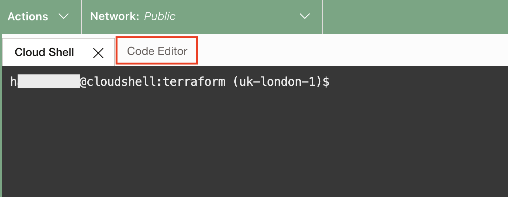
    

2. Update and save the file **customapmresource.yaml** with apm endpoint and private data key 
    - Update field **<apm-endpoint>** (line 11) with APM upload end point obtained from task 3. 
    - Update field **<apm-private-data-key>** (line 13) with private data key obtained from task 3. 
    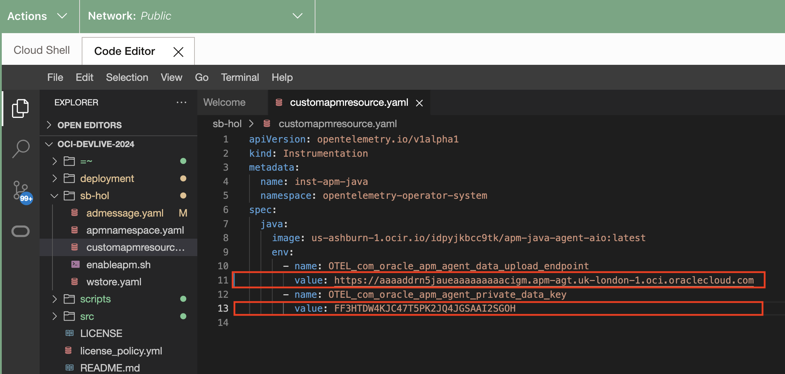
    - save the file 
    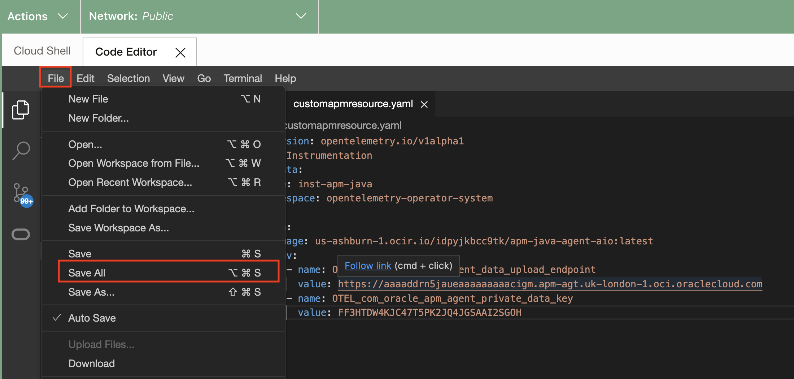

3. Open cloud shell and run **enableapm.sh** to enable APM for the Kubernetes cluster

    enableapm.sh 
    - Installs required libraries to enable K8 Open Telemetry operator 
    - Maps K8 Open Telemetry operator to inject APM java agent 
    - Injects APM java agent at the K8 namespace level through the K8 operator 

    ``` bash
    <copy>
    cd ~/oci-devlive-2024/sb-hol
    chmod 755 enableapm.sh
    ./enableapm.sh
    </copy>
    ```

    


4. Verify if the APM is enabled by executing the below command and check for OTEL parameters in the pod parameters. 

    ``` bash
    <copy>
    kubectl get pod wstore-front-0 -o yaml
    </copy>
    ```

    
    Now the APM is enabled for the application proceed to the next task. 

## Task 5: Generate workload by navigating to the app

1.  Click **Login**.

    


2.  Enter your name (or john) as username, leave the password blank, and click **Login**.

    


3. Then click around the buttons in the pages, as in the example flow shown below.

    >**Note:** Do not worry if you see the "Failed" messages, or if it takes a long time for the pages to respond. Those are expected because the app is designed to fail every once and often for demo purposes.

    Click **Add** on a couple of products then hit **Shopping Cart**. Then Click **Checkout**.
    
    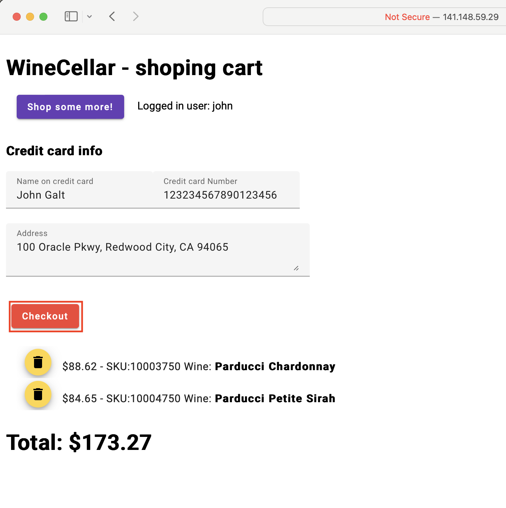

    Click **Confirm Order**.
    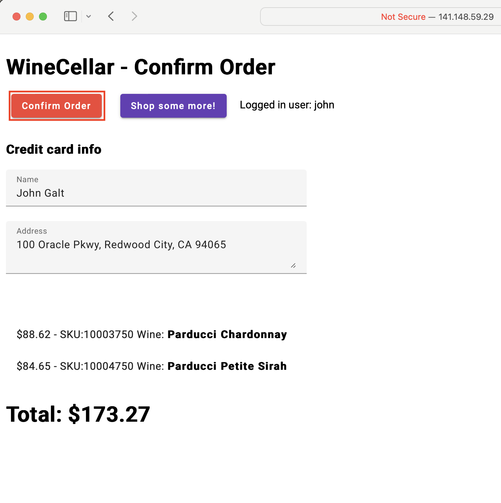

    Click **Logout**.
    


## Task 6: Examine traces in APM Trace Explorer

1. From the OCI menu, select **Observability & Management** > **Trace Explorer**

   

2. On the Trace Explorer page, select **devlive24** for the **Compartment** and **apm-appdev** for the **APM Domain**.

   

3.	By default, traces are displayed in the order by the start time. Right mouse click on the **Duration** column, select **Sort Descending** to show the traces by duration in descending order. This will bring the slowest trace to the top of the list.

   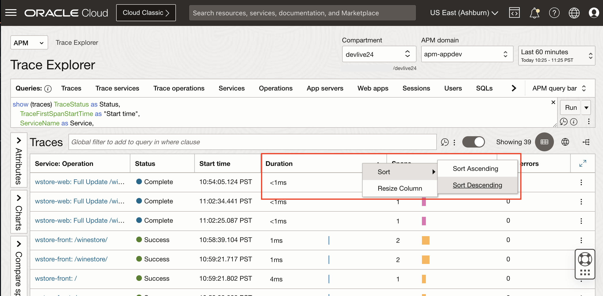

4. Hover the mouse over the bar in the **Spans** column at the top row. Verify three services are included in the trace, and each color represents a service: wstore-back, wstore-front, and wstore-web

   

5.	Click on the trace **wstore-web: Full Update /winestore/confirm** under Service:Operation name column.

   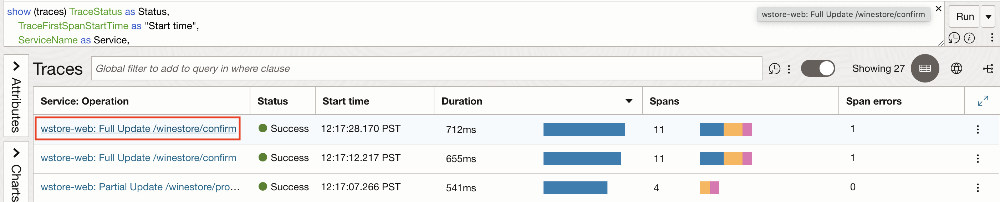

   >**Note:** If you do not see a **wstore-web: Full Update /winestore/confirm** trace, you can navigate the WineStore demo app to perform the checkout operation.

6. **Trace Details** page opens. Review the trace information on the upper screen. E.g., Status, Trace ID, Whether it has an error or not, how many spans and services are involved, or the duration of the trace.
   

7. In the **Topology** view, you can see how the operations are connected within the trace. Different colors indicate different services. Hover the mouse on the icons and the arrows that connect the icons. Review the information in the callouts.
  

  >**Note:** The operations may look differently in the trace you selected.

8. Scroll down the page to show the **Spans** view. Spans in the trace are displayed in a Gantt chart. A span at the top of the list is the root span, and the child spans are nested below the root span.

  

9. **Trace Details** shows one span error and find the span that has errored, now lets click on that span to understand the reason for the error. 

  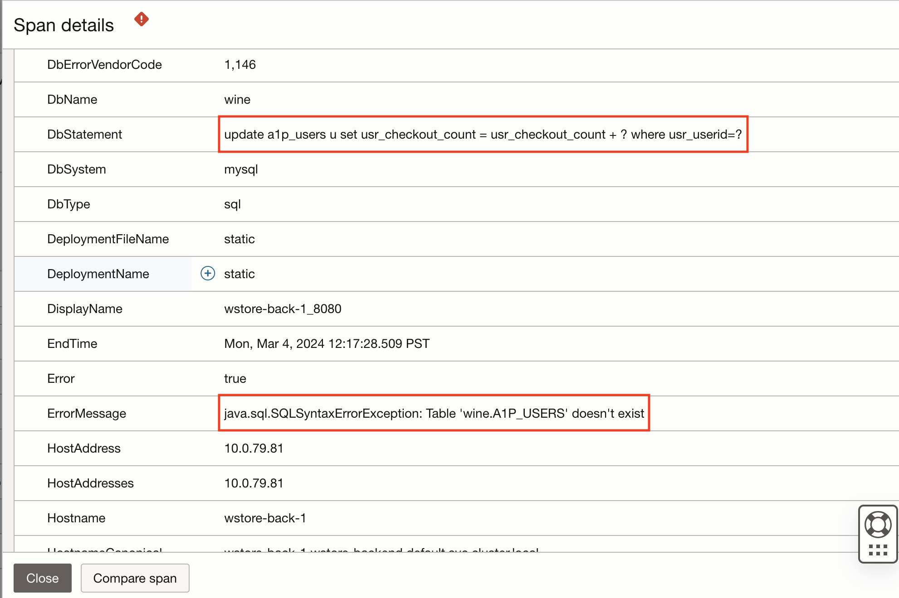

Span error message shows that the table **A1P_USERS** is missing in the wine database which resulted in the error in this particular trace.

 >**Note:** With APM its easy to query the trace and span data using the trace query language. Explore other tabs (Users, SQLs, Web Apps, Sessions, etc..) in trace explorer to get quick insights into application performance.


## Task 7: Enable Logging Analytics Service 

1. Navigate to Observability & Management and click Logging Analytics.

    - From Navigation Menu  > **Observability & Management** > **Logging Analytics**.

    - Click **Start Using Logging Analytics**.
    

    - Review the policies that are automatically created and click **Next**.
    

    - Enable OCI audit log analysis and Click **Next**.
    

    - Logging Analytics Service is enabled in the tenancy. Click **Close**.
    

2. Enable Logging Analytics OKE Solutions 

    - From Navigation Menu  > **Observability & Management** > **Logging Analytics** > **Solutions**.

    - Click on **Kubernetes**
    

    - Click on **Connect clusters**
    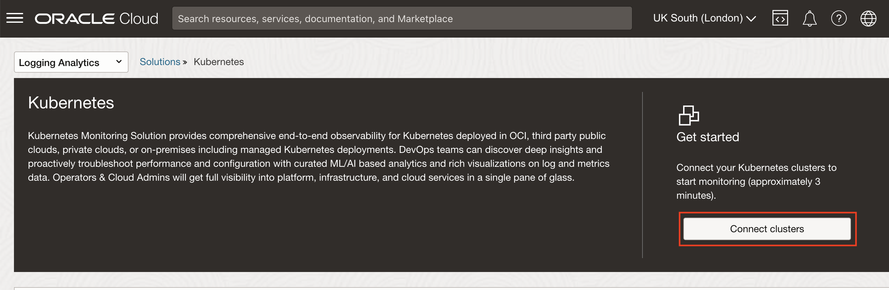

    - Click on **Oracle OKE**
    

    - Select the **devlive24-oke** created in lab 1 and click **Next**
    

    - Accept defaults and click on **Configure log collection** 
    

    - Configured OKE **devlive24-oke** for monitoring. Click on **Take me to Kubernetes**
    

    - Collection of metrics and log data is still in progress - wait for 4 to 5 mins for collection to complete 
    

    - Once the collection is complete it shows CPU, memory and latest telemetry data for the cluster 
    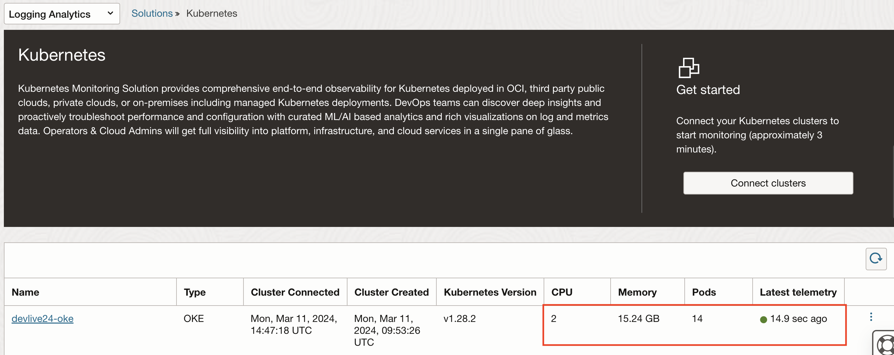

## Task 8: Explore the Logging Analytics solutions for OKE Clusters

1. Click on the cluster **devlive24-oke** 
    

2. Overview of the cluster **devlive24-oke** is shown 
    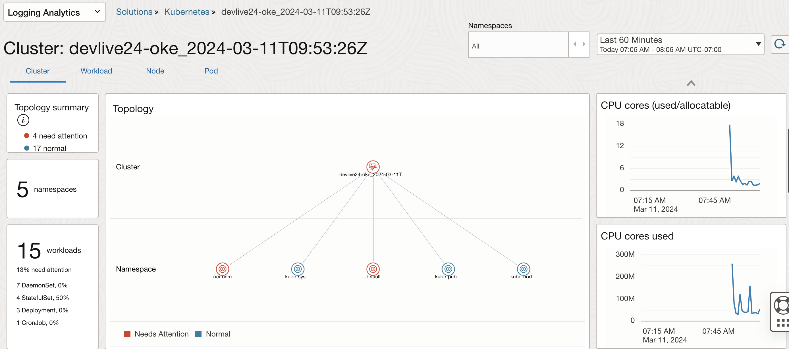

3. Filter by namespaces in the cluster 
    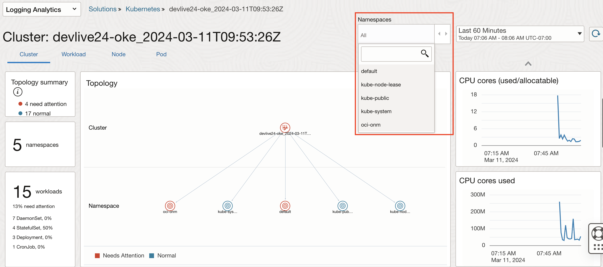

4. Wine Cellar application is deployed on default namespace on filtering by namespace it shows the topology, usuage metrics which makes it easy to quickly identify the issues 
    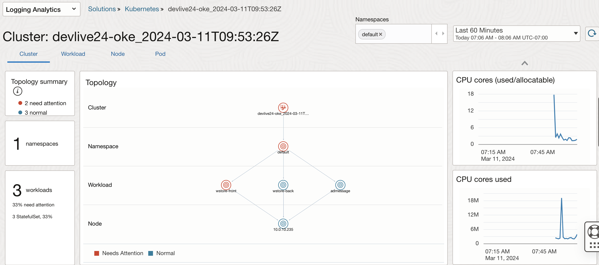

5. Dedicated events tab shows all the events occured on the specific namespace
    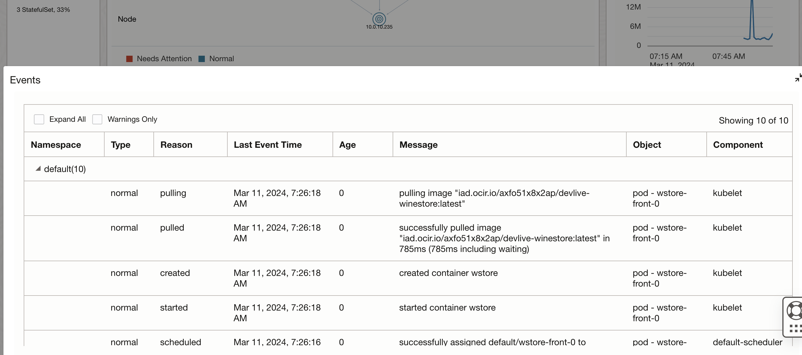

6. Analyze further based on cluster, workload, node and pod 
    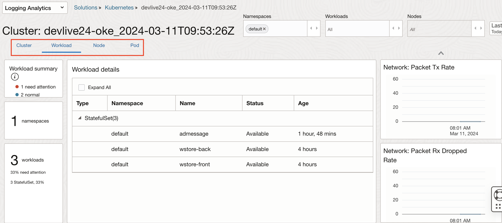

7. On the right we can see metric widgets as shown below which help us further understand how OKE is performing.
    
    

8. Analyze different metrics together to understand the workload patterns, resource utilization and also for effective troubleshooting. 
    * Click on the expand button which shows when you hover the mouse on a particular metric. Lets select metric **CPU cores(used/allocatable)** 
     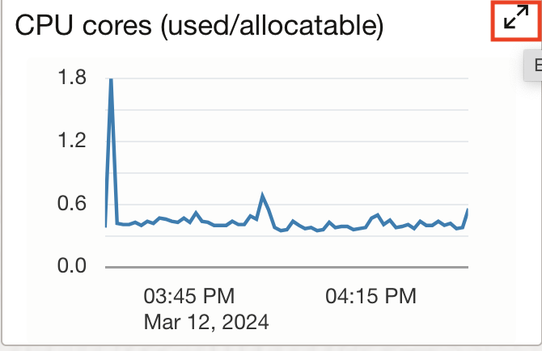
    * Click on **Metrics to analyze**
     
    * Click on metrics of interest to analyze together (Maximum of 3 metrics are allowed to analyze together). Lets select the metric **Memory Used** 
     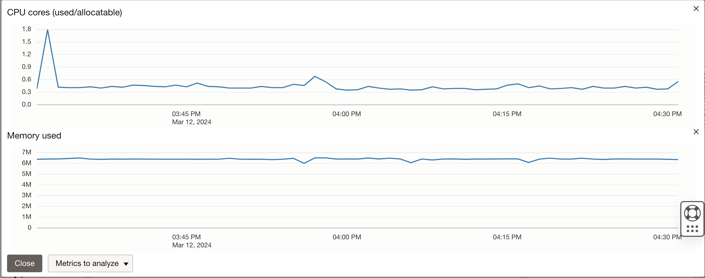
    * Click again on **Metrics to analyze** and select the metric **Total API server requests**. Now all the three metrics can be analyzed together to understand workload patterns or for the effective troubleshooting. 
     

>Note: OCI Logging Analytics provides one-click end-to-end Kubernetes monitoring solution for the underlying infrastructure, Kubernetes platform and cloud native applications.

[You may now **proceed to the next lab**.](#next)

## Acknowledgements

* **Author** - Anand Prabhu, Principal Member of Technical Staff, Enterprise and Cloud Manageability
- **Contributors** -
Yutaka Takatsu, Senior Principal Product Manager,  
Avi Huber, Vice President, Product Management
* **Last Updated By/Date** - Anand Prabhu, January 2024
