# Enable Logging Analytics Service to monitor Oracle OKE 

## Introduction

In this lab, you'll enable OCI Logging Analytics Service and deploy Kubernetes Monitoring Solution from OCI Marketplace to enable monitoring of an OKE Cluster created in lab 1.

Estimated Time: 5 minutes

### Objectives

In this lab, you will see step-by-step instructions to:
  - Enable OCI Logging Analytics Service
  - Use OCI Marketplace to configure and deploy the Kubernetes Monitoring solution.
  - Verify successful deployment. 

## Task 1: Enable Logging Analytics Service 

Navigate to Observability & Management and click Logging Analytics.

  - From Navigation Menu 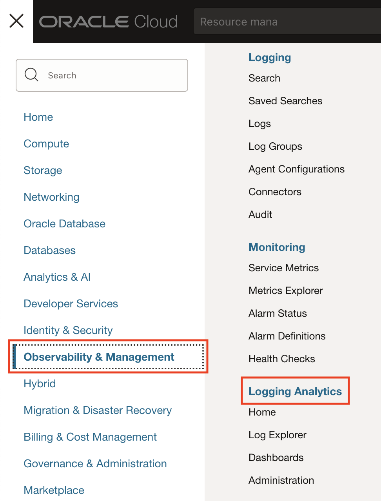 > **Observability & Management** > **Logging Analytics**.

  - Click **Start Using Logging Analytics**.
  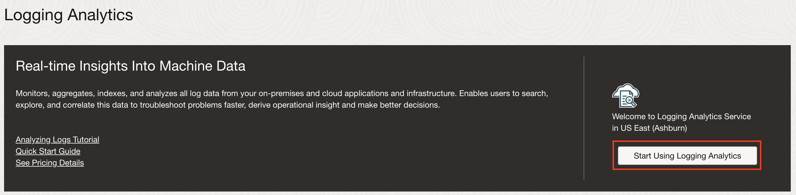

  - Review the policies that are automatically created and click **Next**.
  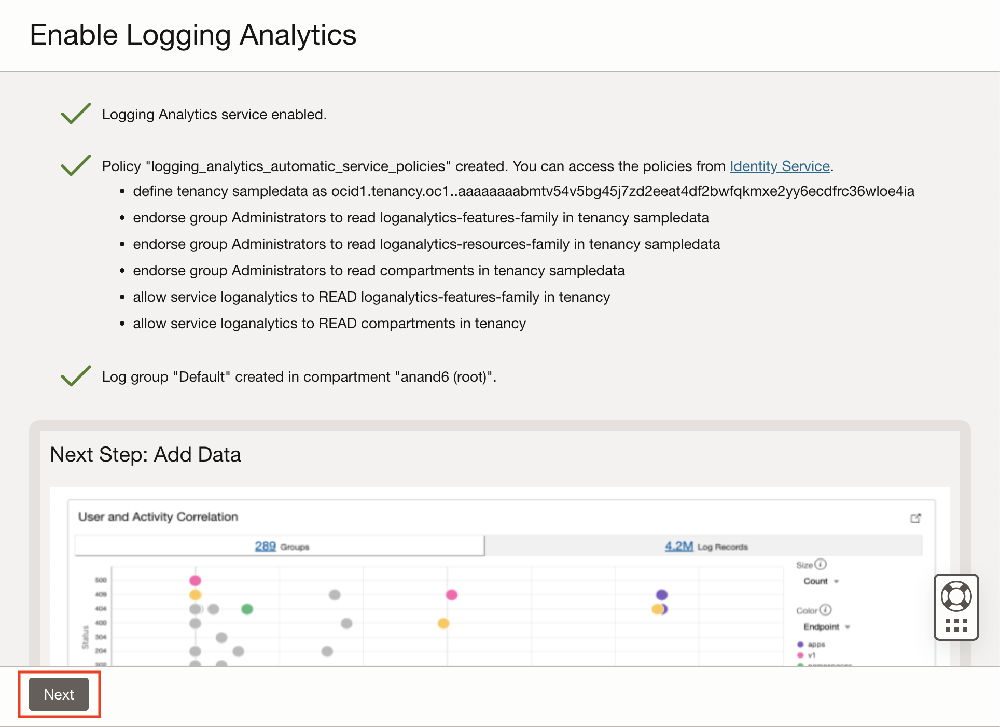

  - Enable OCI audit log analysis and Click **Next**.
  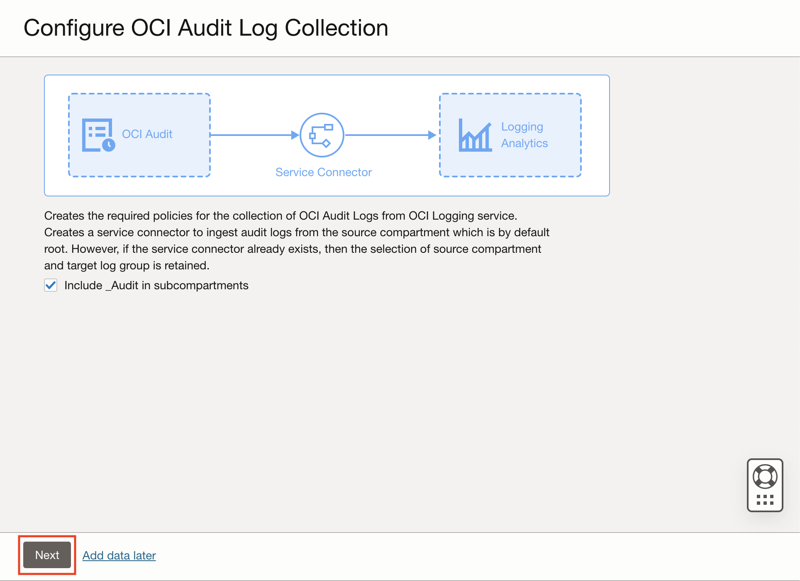

  - Logging Analytics Service is enabled in the tenancy. Click **Close**.
  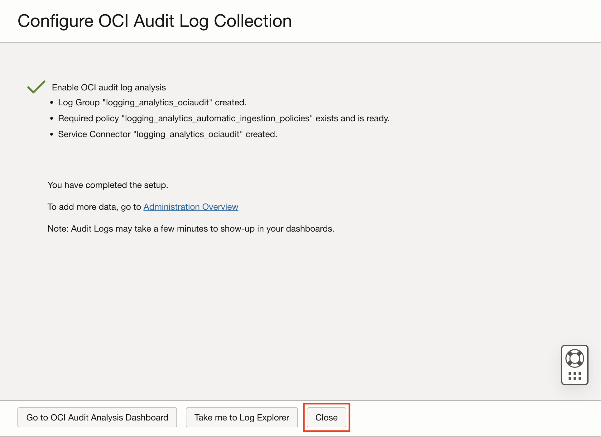

## Task 2: Navigate to Kubernetes Monitoring and Management application

To navigate to Kubernetes Monitoring and Management application, follow the given steps:

  - From Navigation Menu 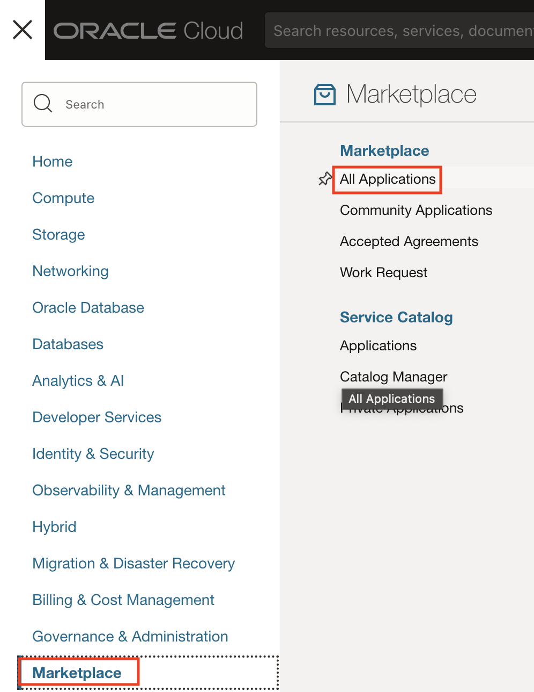 > **Marketplace** > **All Applications**.

  - In the search bar, enter the text **Kubernetes Monitoring and Management**.
  - Click on the **Kubernetes Monitoring and Management** application to land on the application page. 
  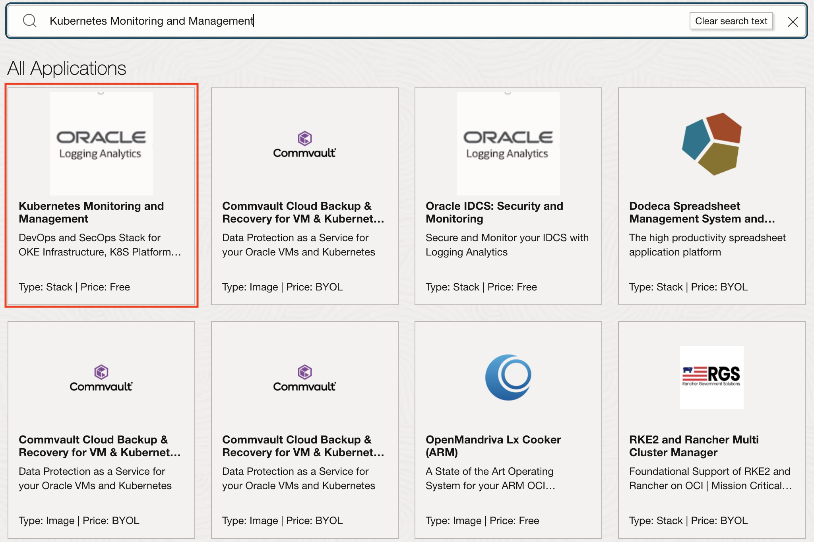

## Task 2: Launch Kubernetes Monitoring and Management application

1. Select the **v3.0.1 (12/3/2023) - default** version from the version dropdown.

2. Select the compartment **appdev** from the dropdown.

3. Check the **Terms and Restrictions** checkbox.

4. Click on **Launch Stack** button to launch the application.
  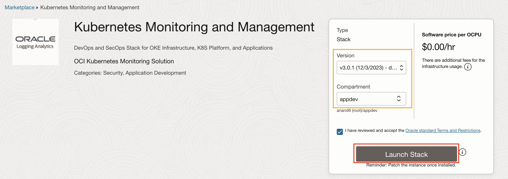

## Task 3: Configure Stack

1. On **Create Stack** page, you will see the **Stack information**.

  Click on **Next** button to proceed to the Configure variables section.
  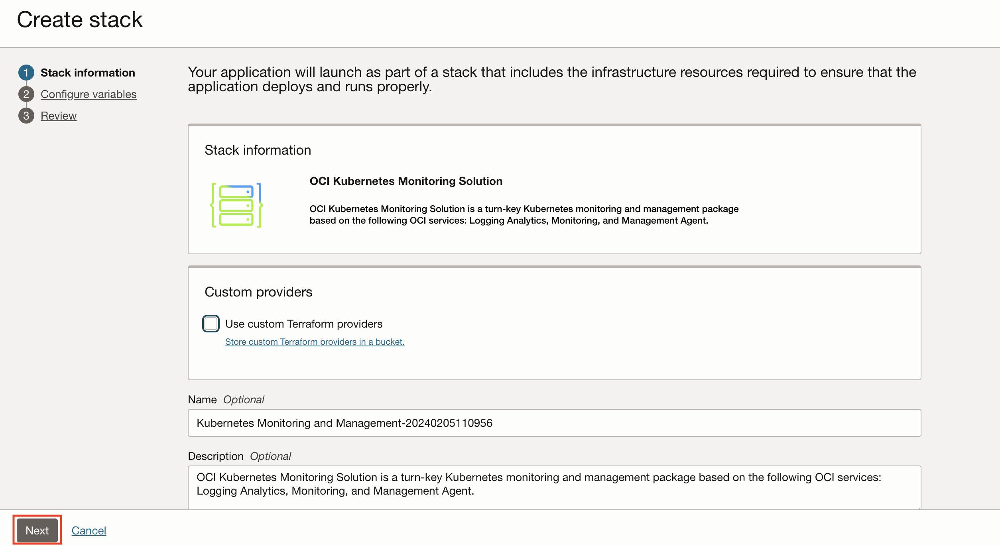
  

2. In **Configure variables** section, you have to set the following variables for the stack:

    - **OKE cluster Compartment:** Select the **appdev** compartment from the dropdown.

    - **OKE Cluster:** Select the **k8-appdev** OKE cluster from the dropdown.
  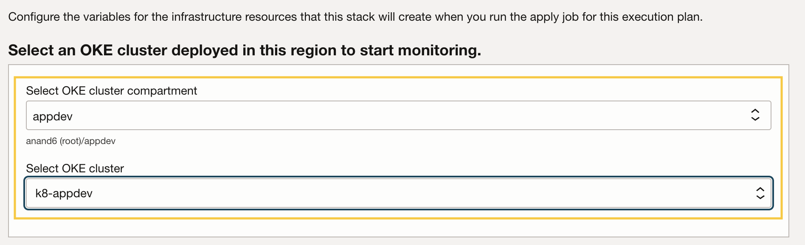

    - In OCI Observability and Management Services Configuration 
    - Select the compartment **appdev** from the dropdown. 
    - Check box to create a new log group and enter **appdevgrp** as the OCI Logging Analytics log group name
    - Click on **Next** button to proceed to the Review section.
  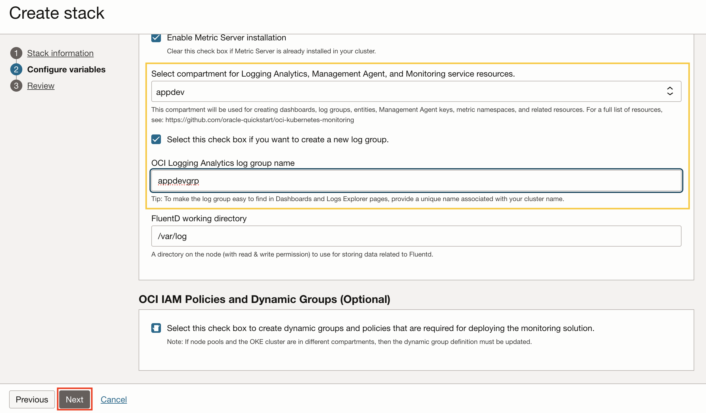

3. In **Review** section, you can see the stack configurations you selected in the previous steps.

  - Click on the **Create** button to create the stack. This step will create an ORM (Oracle Resource Manager) job that uses [Terraform](https://github.com/oracle-quickstart/oci-kubernetes-monitoring/tree/main/terraform) to deploy the solution.
  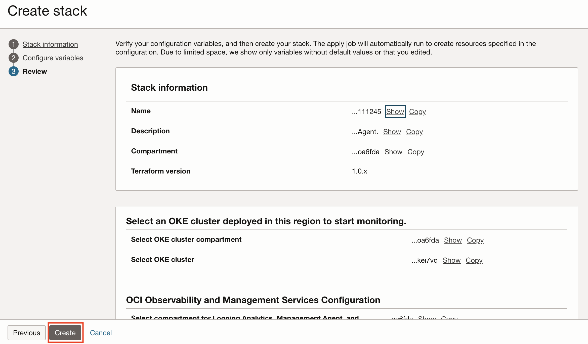

  - It will take around 90 seconds for the stack to get created.
  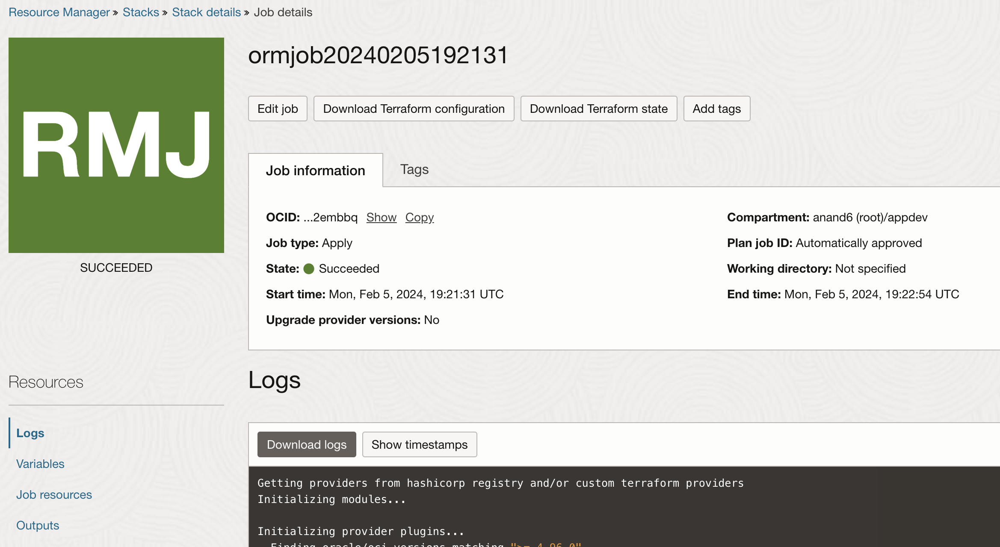
  

 In this lab, you have successfully completed the following tasks:
- Enabled OCI Logging Analytics Service
- Used OCI Marketplace to configure and deploy the Kubernetes Monitoring solution.
- Verified successful deployment.

  You may now proceed to the [next lab](#next).

## Acknowledgements

* **Author** - Anand Prabhu, Principal Member of Technical Staff, Enterprise and Cloud Manageability
- **Contributors** -
Yutaka Takatsu, Senior Principal Product Manager,  
Avi Huber, Vice President, Product Management
* **Last Updated By/Date** - Anand Prabhu, January 2024
